# Business Context & Capability (BCC): Technical Demo of Agent-Managed FCC Soft Sensors

> **Companion documents:** [Problem statement](fcc_soft_sensor_problem_statement.md) · [Solution design](fcc_ai_driven_soft_sensor_solutions.md) · [Features](features.md) · [Behaviour spec](BDD.md) · [Spec-driven design](SDD.md) · [Build guide](build.md) · [Checklist](checklist.md)
>
> **Status:** Technical demo definition. **This is a technical demonstration, not an investment case.** It contains **no financial figures, ROI, NPV, payback, pricing or commercial terms**. Success is judged only on technical and efficiency metrics, measured on the simulated data from `sim_octave/`.

---

## 1. Bottom Line

**Recommendation: build the Demo MVP (the MVP features listed in [features.md §4.1](features.md)) on simulated FCC-fractionator data, and judge it only against the technical acceptance targets in §4.**

- **What the demo proves:** three independent model families (**Hybrid delta, GPR, PINN**) estimate LCO and heavy-naphtha T98 every minute. Each gives a **probability distribution**, and they are compared against simulator truth and synthesised lab results.
- **How it earns trust:** when the combined 90% spread is wider than the limit, or the models disagree, the system **issues no recommendation** and says *"Distribution spread too wide"*. A 7-signal trust score and a Kalman lab-bias update keep the estimates honest.
- **How people use it:** a clean cockpit with four dashboards, a floating Gemini panel and a dark/light theme toggle:
  - **Decision:** what to do now, and whether it can be trusted.
  - **Technical:** a full **Time-Series Explorer** over every simulated minute.
  - **Modelling:** a deep dive into each model's numbers, parameters and confidence.
  - **Knowledge:** the document library, the full document at the cited section and related records per run.
  - A live **Gemini Copilot** in a floating panel on every screen explains everything, using tools over the data, by text or by voice (**Gemini Live API**). It also searches a simulated corpus of SOPs, operating windows, work orders, shift logs and incidents; every answer cites the exact section (`[DOC-ID rN §x.y]`), and a citation chip opens a compact source preview in the panel.
- **How it is judged:** accuracy vs. reproducibility, interval calibration, gate precision, latency, availability, and Copilot correctness (§4). No financial metrics.

**Decision requested:** approve the demo scope (§5) and the acceptance targets (§4).

---

## 2. The Technical Problem

Refiners run FCC-family units and the downstream hydrotreaters **4–12 hours "blind"** between lab results (problem statement §4). The technical consequences:

| Consequence | Mechanism | Technical measure |
|---|---|---|
| **Conservative cut points** | Without timely T95/T98, operators hold cut points far from spec | Margin between product T98 and its spec limit (°F) |
| **Over-severe hydrotreating** | Unknown feed sulfur/nitrogen is covered by extra severity | H₂ consumption per bbl; WABT above requirement (°C) |
| **Off-spec risk** | Undetected feed swings reach finished product | Count of off-spec lab results |
| **Inferentials that decay** | Models drift and are switched off without expert care | % of time a validated estimate is available; drift-detection time |
| **Unexplained numbers** | Operators cannot see why an estimate moved or how sure it is | Share of estimates shown with a distribution, trust level and reason |

**Why now:** tighter 10 ppm sulfur specs, more crude-slate variability and fewer APC engineers make self-maintaining, explainable inferentials technically important.

---

## 3. Technical Outcomes the Demo Must Show

These replace financial value levers. Every feature in [features.md](features.md) traces to at least one outcome.

| # | Outcome | Decision supported | How it is shown | Demo? |
|---|---|---|---|---|
| T1 | **Accurate real-time estimates** of LCO and HN T98 | D2 | RMSE vs. simulator truth and vs. labs, per regime | Yes |
| T2 | **Honest uncertainty**: calibrated distributions from every model and the mixture | D3 | 90% coverage, PIT, CRPS on held-out runs | Yes |
| T3 | **Withhold when unsure**: Distribution Spread Gate | D2, D3 | Gate precision/recall against large errors; zero recommendations while WITHHELD | Yes |
| T4 | **Model agreement made visible** (Hybrid delta vs. GPR vs. PINN) | D3 | Overlaid distributions, bimodality test, Model Comparison dashboard | Yes |
| T5 | **Self-maintaining models**: bias update, drift detection, lab screening | D3 | Bias reduces error; drift detected < 48 h; lab-screening rates | Yes (T5 lab/drift in Demo+) |
| T6 | **Explainability**: Gemini Copilot answers from tools and cites the knowledge corpus, by text or voice (Gemini Live) | D3 | Golden-question pass rate; verbatim gate message; 100% of citations resolve | Yes |
| T7 | **Safety by design**: advisory only, no write path to control | All | Zero writes to DCS/MPC; permission tests | Yes |
| T8 | **Process efficiency** (site phases) | D1, D2 | Reduced T98 margin to spec (°F); H₂ per bbl; fewer extra lab samples | Site only |

---

## 4. Technical KPIs and Acceptance Targets (Demo)

All measured on **held-out simulated runs** (`full_v1` s140–s153) unless stated otherwise.

| KPI | Target | How measured | Where shown |
|---|---|---|---|
| Estimate accuracy (mixture, after bias) | RMSE <= 1.5R (time-blocked) and <= 2.0R (leave-one-regime-out) on simulated data; 1-1.5x R on site | vs. simulator truth, every held-out minute | Decision Overview tile; Modelling → Model Comparison |
| Accuracy per model family | Each admitted model: RMSE ≤ 1.05 × Bayesian-ridge RMSE | Admission rule (SDD) | Model Comparison table |
| 90% interval coverage | 85–95% (mixture and each admitted model) | vs. simulator truth | Decision tile; Modelling → Calibration |
| Sharpness | Median W90 ≤ 0.8 × `w90_max` in PASS minutes | Mixture quantiles | Confidence page; Time-Series Explorer W90 strip |
| Gate precision | ≥ 90% of PASS minutes have \|error\| ≤ R | Gate log vs. truth | Modelling → Calibration |
| Gate recall on large errors | ≥ 80% of minutes with \|error\| > 2R are WITHHELD or RED | Gate log vs. truth | Modelling → Calibration |
| Trust calibration | ≥ 95% of GREEN within R | Trust log vs. truth | Modelling → Calibration |
| Bias update benefit | Held-out RMSE lower with bias than without | A/B on replay | Model Health |
| Recommendation safety | 0 recommendations issued while WITHHELD or RED | Recommendation log | Decisions history |
| Recommendation quality | P(on-spec after move) ≥ 95% on every issued move, confirmed by simulator truth ≥ 95% of the time | Replay + truth | Decisions history |
| Estimator latency | ≤ 1 s per simulated minute (4 models + mixture + gate) | Replay timer | Technical → Data Quality footer |
| Cockpit responsiveness | First paint ≤ 2 s; live update ≤ 1 s; time-series pan/zoom ≤ 150 ms | Playwright + Lighthouse | — |
| Copilot correctness | ≥ 90% of golden questions correct; 100% verbatim gate message; 0 set points proposed while WITHHELD | Golden set on `random_s140` | — |
| Citation correctness | 100% of citations resolve to the cited document section; "No cited source" when nothing reaches the 0.35 threshold | Citation resolver over the golden set | Copilot (source preview in the Gemini panel) |
| Voice Copilot (Gemini Live) | First audio ≤ 1.5 s (p50); same verbatim gate message and no set point while WITHHELD | Voice subset of the golden set | Floating Gemini panel |
| Provenance | 100% of displayed numbers traceable to a simulated run | Provenance check | Provenance chip |

---

## 5. Demo Scope and Data

| In scope (Demo MVP) | Out of scope |
|---|---|
| LCO and HN T98 cut-point estimates (decisions D2, D3) | Sulfur/nitrogen (D1): the simulator has no S/N; needs site or literature data |
| Hybrid delta, GPR, PINN (plus Bayesian-ridge reference), mixture, spread gate, 7-signal trust | Sequence models (too few labels) |
| Decision, Technical, Modelling and Knowledge dashboards; floating Gemini panel with cited sources; dark/light theme; live Gemini Copilot by text and voice (Gemini Live, `us-central1`) | Any write to DCS/MPC (prohibited) |
| Simulated data only: `sim_octave/data/full_v1` (54 randomised runs × 1,600 min, ~162 labels per property (~120 in training); s100–s139 train, s140–s153 held out) | Mock or hand-made data (prohibited, SDD-RAW-05) |
| Advisory recommendations with human Accept/Decline (recorded only) | Financial analysis of any kind |
| A SIMULATED knowledge corpus (46 documents generated by Gemini, [delegation.md](delegation.md)) for search and citations | Real plant procedures or records |

---

## 6. Demo Storyline (10 minutes, simulated run `random_s140`)

1. **Decision dashboard:** KPIs (accuracy, coverage, trust mix), one recommendation waiting, fan chart over the last 12 hours.
2. **Accept a recommendation:** the card shows P(on-spec) and margin to spec before → after (°F). The decision is recorded only.
3. **Heavy-crude change:** the Time-Series Explorer (Technical) shows feed API stepping down, tray temperatures shifting, the three model traces diverging and W90 rising above the limit.
4. **Gate withholds:** "Distribution spread too wide — …" appears on the Decision dashboard, the Confidence page and in the Copilot.
5. **Modelling deep dive:** the Model Comparison dashboard shows why: GPR σ rose (novelty), PINN members disagree, the hybrid physics term holds. Parameters, residuals and calibration are all visible.
6. **Lab arrives:** the bias update narrows the distribution, and the gate clears after 10 minutes below 0.9 × limit.
7. **Copilot:** "Why did you withhold at 06:42?" is answered with tool-sourced numbers and a chart.
8. **Knowledge and voice:** a citation chip opens a source preview of the SOP section in the Gemini panel; the withheld card shows a similar past incident; the same question asked by voice (Gemini Live) gets the same verbatim gate message.

---

## 7. Why This Approach (Technical Comparison)

| Option | Uncertainty | Handles new crudes | Lifecycle | Verdict |
|---|---|---|---|---|
| Lab-only operation | None between samples | — | — | Baseline |
| Single linear inferential | Point estimate only | Poor | Manual | Status quo |
| Single black-box ML | Usually none | Poor outside data | Manual | Reject |
| **This solution:** multi-model distributions + spread gate + agents | **Calibrated, per model and combined** | GPR σ and novelty flag it; hybrid physics anchors it | **Agent-managed** | **Recommended** |

**Positioning:** it complements the incumbent MPC and feeds validated estimates into the existing inferential slot, in site phases only.

---

## 8. Stage Gates (Technical)

```mermaid
flowchart LR
    D["Demo<br/>Simulated data<br/>MVP + Demo+"] -->|"Gate D: all section 4 targets met"| P0["Phase 0<br/>Site data audit<br/>technical baseline"]
    P0 -->|"Gate 1: data quality OK<br/>lab timestamps recoverable"| P1["Phase 1<br/>Advisory on site"]
    P1 -->|"Gate 2: RMSE within 1-1.5x ASTM<br/>coverage 85-95% on live data"| P2["Phase 2<br/>Agent lifecycle + MPC CV"]
    P2 -->|"Gate 3: 90% closed-loop uptime<br/>drift detected in under 48 h"| P3["Phase 3<br/>Hydrotreater feed-forward"]
    P3 -->|"Gate 4: measured reduction in<br/>quality variance and H2 per bbl"| P4["Phase 4<br/>Scale-out"]
```

| Gate | Pass criterion | If it fails |
|---|---|---|
| D | Every KPI in §4 met on held-out simulated runs; checklist.md fully ticked | Iterate on models/calibration; do not take to site |
| 1 | Key tags available; lab timestamps recoverable; technical baseline (lab-vs-spec variance) agreed | Narrow scope to cut points only (D2) |
| 2 | Accuracy within 1–1.5× ASTM reproducibility and calibrated intervals on live data | Stay advisory; retune |
| 3 | ≥ 90% closed-loop uptime; drift detected in < 48 h | Extend Phase 2 |
| 4 | Measured technical improvement vs. baseline (quality variance, margin to spec, H₂ per bbl) | Re-baseline |

---

## 9. Readiness of Current Assets

**The repo is enough to build the full D2 cut-point demo on simulated data. The models, spread gate, agents and cockpit are fully specified ([SDD.md](SDD.md)) and sequenced ([build.md](build.md), [checklist.md](checklist.md)), but not yet coded.**

| Asset | Status | Demo use |
|---|---|---|
| FCC-Fractionator simulator (Octave port, incl. `random` / `random_test` scenarios with `lab_sample`, `event_code`, `crude_id`, `cutpoint_auto`) | ✅ Working | The single source of demo data |
| BigQuery loader (`sim_octave/load_to_bq.py`) | ✅ Working | GCP data path for the cockpit API and Copilot |
| PCA novelty / sensor-health method | 🟡 Specified; validated against the public ML-PSE FCCU dataset (github.com/ML-PSE/FCCU-Dataset, MIT); not stored locally — re-clone if needed | Trained on simulated `full_v1` s100–s139 normal-operation minutes (build.md Step 12) |
| Models: Bayesian ridge, **Hybrid delta**, **GPR**, **PINN** ensemble, mixture | 🟡 Specified | build.md Steps 8–11 |
| Distribution Spread Gate and trust score | 🟡 Specified | build.md Step 12 |
| Cockpit (Decision / Technical / Modelling) + floating Gemini Copilot (text and Gemini Live voice) | 🟡 Specified; API contract in `cockpit/API_CONTRACT.md`; mockups in `docs/ui/v2/` | build.md Steps 5–16 |
| Knowledge corpus (46 SIMULATED documents) | 🟡 Specified; Gemini prompts in `delegation.md`, validator in `knowledge/tools/` | build.md Step 14a |
| Sulfur / nitrogen labels | ❌ Not in simulator | Site phases only |

---

## 10. Technical Risks

| Risk | Effect | Likelihood | Mitigation |
|---|---|---|---|
| Too few labels for GPR/PINN | Models not admitted (shadow) | Medium | `full_v1` gives ~120 training labels per property (s100–s139); PINN uses the ~64,000 unlabelled training minutes; models failing admission stay in shadow |
| Poor interval calibration | Gate too strict or too loose | Medium | Calibrate `w90_max` on held-out runs (SDD-CAL); report coverage per model |
| Simulator too smooth vs. a real plant | Over-optimistic accuracy | High | Inject lab noise and sensor faults; state the limitation in the demo |
| Copilot hallucination | Wrong numbers shown | Low–Medium | Tools-only answers; golden-set tests; verbatim gate message |
| Cockpit performance on 1,600-minute runs | Laggy time series | Medium | WebGL traces, server-side downsampling (LTTB) for wide windows |

---

## 11. Decisions & Next Steps

**Ask:** approve the demo scope and targets.

1. Confirm the reproducibility value R (default 7 °F) and the T98 spec limits used in the demo.
2. Confirm the dataset: `full_v1` only (54 runs × 1,600 min, user-generated), grouped split s100–s139 train / s140–s153 held out.
3. Verify `full_v1` (build.md Step 3) and scaffold the cockpit (Step 5) in parallel.
4. Schedule the Gate D review once checklist.md is complete.
