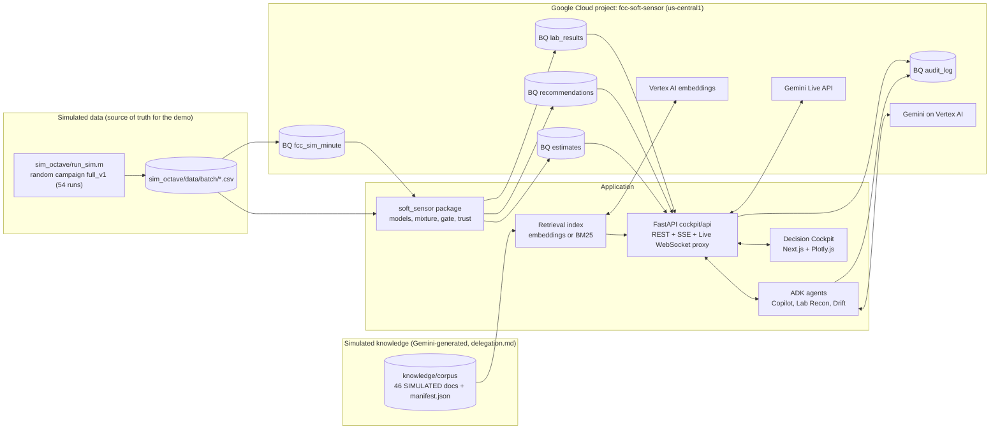
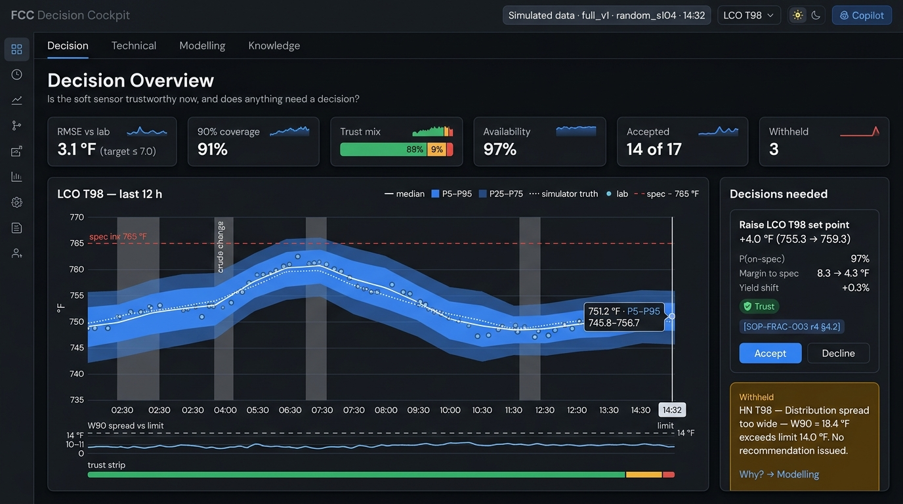
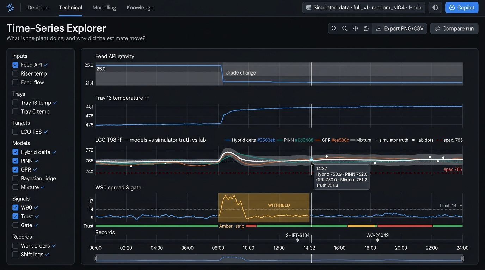
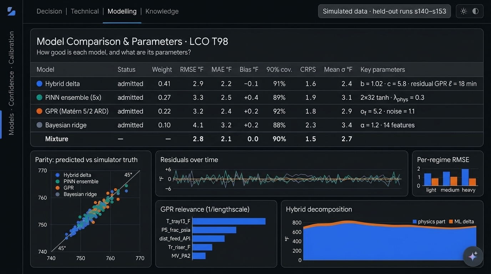
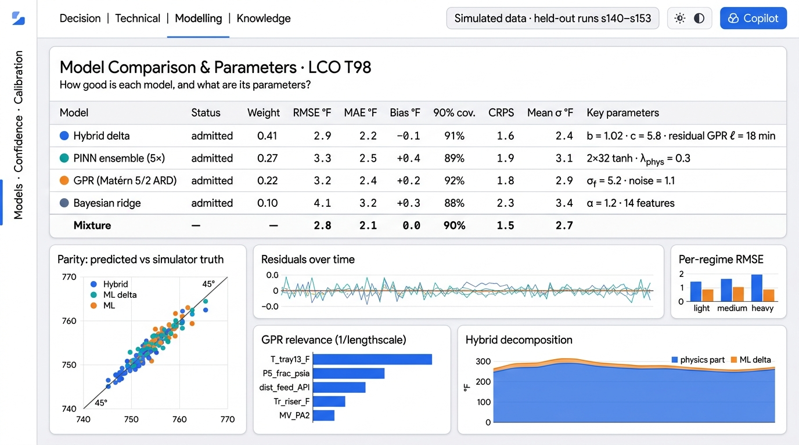
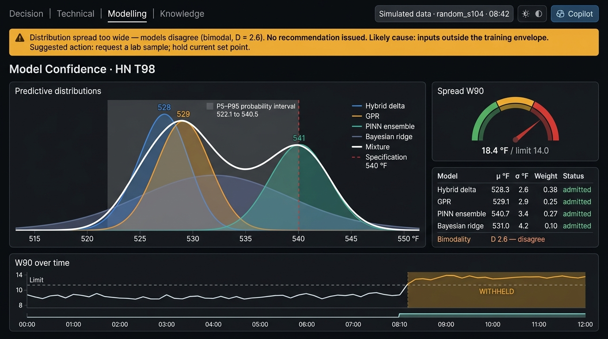

# Specification-Driven Design (SDD): Agent-Managed FCC Soft Sensors & Decision Cockpit

> **Companion documents:** [Demo case](BCC.md) · [Features](features.md) · [Behaviour spec](BDD.md) · [Build guide](build.md) · [Checklist](checklist.md) · [Solution design](fcc_ai_driven_soft_sensor_solutions.md)
>
> **How the documents fit together:**
> - `features.md` says **what** is built.
> - `BDD.md` says **how it must behave** (acceptance tests).
> - **This SDD says exactly how each part is specified**: data contracts, algorithms, parameters, interfaces and "shall" statements.
> - `build.md` gives the **build order**, and `checklist.md` is the **tick-box tracker**.

---

## 1. Summary

**This SDD specifies the Demo MVP (features.md §4.1) to implementation level, and it treats the Decision Cockpit front end as part of the core system.** Every component is built and tested on the **simulated data** from `sim_octave/`.

- **Four model families run side by side, each producing a probability distribution:** Bayesian ridge (reference), **Hybrid delta**, **PINN deep ensemble** and **GPR**. They combine into one **mixture distribution** (§5.7).
- **Distribution Spread Gate (§5.10):** if the mixture's 90% width (W90) exceeds the limit, or the models disagree (bimodal), **no recommendation is issued**. Every surface then shows *"Distribution spread too wide — no recommendation issued"*, with the cause and the next action.
- **Cockpit (§7):** four dashboards, **Decision**, **Technical** (Time-Series Explorer over every simulated minute), **Modelling** (per-model metrics, parameters and calibration) and **Knowledge** (document library, full document at cited section and related records per run), plus a floating Gemini panel on every screen with a compact preview and an Open in Knowledge link (§7.9). Next.js (App Router, TypeScript) + React + **Plotly.js** front end in `cockpit/web` and a FastAPI back end in `cockpit/api`, with a **live Gemini Copilot** (ADK agent, streamed over SSE) and a **voice Copilot through the Gemini Live API** (§7.10). Dark theme by default with a persisted dark/light toggle. Clean and decision-first. The binding API contract is [cockpit/API_CONTRACT.md](cockpit/API_CONTRACT.md).
- **Google Cloud:** project `fcc-soft-sensor`, region `us-central1` for Vertex AI (Gemini, Gemini Live, embeddings) and Cloud Run.
- **Technical demo only:** success is measured with technical metrics (BCC §4). No financial figures are computed or displayed (SDD-NFR-11).
- **Demo targets:** `LCO_T98_F` and `HN_T98_F`. Labels come from the simulator's `lab_sample` flags (§4.3). Train on lab rows only; **evaluate on every simulated minute** against simulator truth.
- **Data issues to fix first** (§4.5): two CSV schemas (108 vs. 112 columns), truncated sample runs, and about 10–12 labels per run.

### Conventions
- **SHALL / SHOULD / MAY** follow RFC 2119.
- Requirement IDs: `SDD-<area>-<nn>`. Feature IDs (A1…H6) are defined in features.md. `BDD-n` means Feature n in BDD.md.
- °F, UTC, one process row = one simulated minute.

---

## 2. System Context



**Demo boundary:** there is no DCS/MPC connectivity. The cockpit's **Accept** button records a decision in `audit_log` and nothing else (SDD-SAF-01).

---

## 3. Repository Layout (Target)

```
FCC_RCC_Optimisation/
├── sim_octave/                  # existing: simulator, scenarios, BQ loader, data/<batch>/
├── docs/ui/                     # cockpit mockups (layout reference)
├── soft_sensor/                 # Python package (models + logic)
│   ├── config.py  registry.py
│   ├── io/{sim_csv.py, bq.py}
│   ├── data/{quality, labs, steady_state, lags, regimes, features}.py
│   ├── models/{base, bayes_ridge, gbm_quantile, gpr, hybrid_delta, pinn_ensemble, committee, kalman}.py
│   ├── dist/{mixture.py, calibration.py}         # SDD-DIST-*, SDD-CAL-*
│   ├── trust/{novelty, score, gate, fallback}.py # SDD-TRU-*, SDD-GATE-*, SDD-FB-*
│   ├── decide/recommend.py                       # SDD-REC-*
│   ├── eval/validation.py
│   ├── tools/provenance_check.py                 # SDD-RAW-05 checks used by checklist.md
│   └── serve/replay.py                           # per-minute estimator loop on simulated runs
├── knowledge/                   # simulated knowledge corpus (delegation.md, SDD §7.9)
│   ├── corpus/{sop, iow, lab, work_orders, shift_logs, incidents, moc, references}/
│   │   └── manifest.json        # written by check_corpus.py on PASS
│   ├── inputs/                  # WP5 event tables (extract_events.py)
│   └── tools/{check_corpus.py, extract_events.py, split_files.py}
├── agents/
│   ├── copilot/agent.py         # live Gemini Copilot (SDD §7.6), shared by text and voice
│   ├── lab_reconciliation/agent.py
│   └── drift_sentinel/agent.py
├── cockpit/
│   ├── API_CONTRACT.md          # binding web ↔ api contract
│   ├── api/                     # FastAPI: REST + SSE + Live WebSocket proxy (SDD §7.5, §7.10)
│   │   ├── main.py  routes/*.py  sse.py  live.py
│   │   └── knowledge/{index, search, records}.py   # SDD-KNW-*
│   └── web/                     # Next.js (App Router) + TS + React + Plotly.js; CSS tokens + CSS Modules
│       ├── app/{decision, technical, modelling, knowledge}/   # routes (SDD §7.3)
│       ├── components/  charts/  lib/  styles/tokens.css
│       └── e2e/                 # Playwright
├── tests/{unit, features, steps, fixtures}/   # fixtures are cut from simulated CSVs only
├── config.yaml
└── pyproject.toml
```

---

## 4. Data Specifications

### 4.1 Raw Simulator Row (Source Contract)

Produced by `sim_octave/run_sim.m`, one row per simulated minute. The **current schema has 112 columns** (authoritative order: `csv_header()` in `run_sim.m`):

| Group | Columns | Count | Role |
|---|---|---|---|
| Time | `time_min` | 1 | Index |
| Disturbances | `dist_T_ambient_F`, `dist_feed_API`, `dist_T_feed_in_F`, `dist_condenser_eff` | 4 | `dist_condenser_eff` is **hidden truth**, never a feature; the other three are features |
| FCC inputs / SPs | `feed_flow_lb_s`, `SP_T_preheat_F`, `SP_P_frac_psia`, `SP_P_reg_psia`, `SP_T_reg_F`, `SP_W_reactor_inv_lb`, `SP_T_riser_ROT_F` | 7 | Features |
| FCC measurements | `P4_reactor_psia` … `F_V11` | 52 | Features, after dropping `*_dup` and `eff_*` |
| Fractionator trays | `T_tray01_F` … `T_tray20_F` | 20 | Core features. **HN draw = tray 6, LCO draw = tray 13** (per the mass balances in `run_sim.m`) |
| Products / KPIs | `prod_LPG` … `prod_coke`, `conversion_pct`, `mass_balance_err_pct` | 8 | Features; KPIs; yield sensitivity for SDD-REC-04 |
| **Targets** | `HN_T98_F`, `LCO_T98_F` | 2 | Ground truth. **Never features** |
| Control | `SP_acc_level`, `SP_T_overhead`, `SP_HN_T98`, `SP_LCO_T98`, `MV_*` (6), `valve_V8..V11` (4) | 14 | Features |
| Labels / metadata | `cutpoint_auto`, `lab_sample`, `crude_id`, `event_code` | 4 | Lab schedule, mode, regime and event annotation. Not features |

- **SDD-RAW-01** The reader SHALL validate the header against `csv_header()` and reject mismatches.
- **SDD-RAW-02** The only dataset is `data/full_v1/random_s100…s153.csv` (112 columns, 54 runs × 1,600 min). The legacy **108-column** files (`data/frontend_sample_1h`) SHALL NOT be loaded into the full data table or used for training, evaluation or the demo; if loaded at all they go to `fcc_sim_minute_sample`. They MAY feed the cockpit shell as a temporary wiring fallback (read-only, no labels) until `full_v1` has rows.
- **SDD-RAW-03** Excluded columns live in `config.yaml → features.exclude`. A unit test SHALL fail if any reaches a feature matrix.
- **SDD-RAW-04** NaN/Inf become NULL (already done by `load_to_bq.py`).
- **SDD-RAW-05** **Simulated-data-only rule (demo):** every number shown in the cockpit or used in a test SHALL be traceable to a simulated run (`batch_id`, `run_id`, `time_min`). Hand-made mock data is prohibited. Test fixtures SHALL be slices of simulated CSVs.

### 4.2 BigQuery Tables

Dataset `fcc_soft_sensor`, project `fcc-soft-sensor`.

| Table | Grain | Key | Written by |
|---|---|---|---|
| `fcc_sim_minute` | run × minute | `run_id, ts` | `load_to_bq.py` |
| `lab_results` | lab sample | `sample_id` | `data/labs.py`; status by E2 |
| `estimates` | run × minute × property | `run_id, ts, property` | `serve/replay.py` |
| `recommendations` | recommendation | `rec_id` | `decide/recommend.py` |
| `model_runs` | model version | `model_id` | `registry.py` |
| `audit_log` | event | `event_id` (partitioned by date) | all components |

**`lab_results`:** `sample_id, run_id, property, draw_ts, lims_ts, recorded_draw_ts, value, true_value*, injected_error*, status (pending|accept|hold|reject), status_reason`. Fields marked * are evaluation-only and never used in training.

**`estimates`** (one row per property per minute):

| Column | Type | Description |
|---|---|---|
| `run_id, ts, property` | key | |
| `members` | JSON | `{model_id: {mu, sigma, weight, admitted, shadow}}` |
| `mix_mean`, `mix_sd` | FLOAT64 | Mixture moments (bias included) |
| `q05, q10, q50, q90, q95` | FLOAT64 | Mixture quantiles |
| `w90` | FLOAT64 | `q95 − q05` |
| `bimodality_d` | FLOAT64 | Ashman's D for the top-2 components |
| `p_on_spec` | FLOAT64 | `F_mix(spec_max)` |
| `bias`, `bias_var` | FLOAT64 | Kalman state |
| `gate_status` | STRING | `PASS`, `WITHHELD` |
| `gate_message` | STRING | Exact text per SDD-GATE-04 when withheld |
| `trust_level` | STRING | `GREEN`, `AMBER`, `RED` |
| `trust_signals` | JSON | 7 signals `{value, limit, pass, severe}` |
| `trust_reason` | STRING | One line |
| `source` | STRING | Fallback source (SDD-FB-01) |
| `true_value` | FLOAT64 | Simulator truth (evaluation and "simulator truth" overlay only) |

**`recommendations`:** `rec_id, run_id, ts, property, action (RAISE|LOWER|HOLD|WITHHELD), delta_sp, p_on_spec_after, margin_before_F, margin_after_F, yield_shift_pct, trust_level, gate_status, gate_message, rationale, valid_until, decision (pending|accepted|declined|expired), decided_by, decided_ts`.

### 4.3 Synthetic Lab Results (from Simulated Data)

- **SDD-LAB-01** One lab result per target for every simulated row with `lab_sample = 1`.
- **SDD-LAB-02** `value = true_value + ε`, `ε ~ N(0, σ_lab)`, `σ_lab = R / 2.77` (default R = 7 °F).
- **SDD-LAB-03** `lims_ts = draw_ts + U(45 min, 75 min)` (60 min ± 15).
- **SDD-LAB-04** Injected errors: gross 3% (±4σ_lab); timestamp 5% (`recorded_draw_ts = lims_ts`).
- **SDD-LAB-05** Deterministic per `(run_id, seed)`, using a stable hash (SHA-256).

### 4.4 Regimes

- **SDD-REG-01** Crude family from `dist_feed_API`: heavy < 22, medium 22–26, light > 26.
- **SDD-REG-02** `crude_id` is kept for traceability only; it is not comparable across runs.
- **SDD-REG-03** Mode from `cutpoint_auto`: `cut_auto` or `cut_manual`.

### 4.5 Known Data Issues (Resolve Before Training)

| # | Issue | Evidence | Resolution |
|---|---|---|---|
| DI-1 | Two schemas (108 vs. 112 columns) | `frontend_sample_1h` = 108 (legacy); `full_v1` and the current `run_sim.m` = 112 | SDD-RAW-02 |
| DI-2 | Legacy sample truncated | `frontend_sample_1h`: 60 rows per file (below the 180 scripted minutes) | Temporary wiring fallback only, until `full_v1` has rows |
| DI-3 | Few labels | `full_v1`: labs at 06:00 / 14:00 / 22:00 simulated time, 3 per 1,600-min run; ~162 labels per property (~120 in training) across s100–s139 | 54 runs; PINN physics penalties on unlabelled minutes; shadow admission (build.md Step 3) |
| DI-4 | Simulation speed | ~29 s per simulated minute | `full_v1` is generated by the user in parallel; the build only verifies it (build.md Step 3) |
| DI-5 | `data/test_random/rt_s*.csv` are short compressed runs | 90-min compressed runs | Optional smoke test only; never used for training, evaluation or the demo |

---

## 5. Component Specifications

### 5.1 Data Quality → A3 · BDD-2
- **SDD-DQ-01** Frozen: |Δ| < 1e-6 × range for ≥ 30 min.
- **SDD-DQ-02** Range: outside `[p0.1 − 10% span, p99.9 + 10% span]` of the training data.
- **SDD-DQ-03** Spike: one-step |Δ| > 5 × MAD-based σ of Δ.
- **SDD-DQ-04** Output: per-tag masks plus a daily report.
- **SDD-DQ-05** A flagged **key tag** excludes the row from training and fails trust signal S5.

### 5.2 Steady State → A5 · BDD-2
- **SDD-SS-01** Steady if, in the 30 min before the draw, each key tag's rolling std ≤ 2 × its NOC std **and** `event_code == 0`.
- **SDD-SS-02** Non-steady labs are excluded from training but kept for evaluation.

### 5.3 Lags → A6
- **SDD-LAG-01** τ ∈ [0, 60] min maximising |xcorr| after AR(p) prewhitening, computed on per-minute simulator truth.
- **SDD-LAG-02** Stored in `artifacts/lags.json`; re-estimated only on request.
- **SDD-LAG-03** Truth-based lags are simulator-only, behind a `LagSource` interface (site: step tests).

### 5.4 Features → A6, A7
- **SDD-FEAT-01** Lagged value plus a causal EWMA (τ = 10 min). No centered filters.
- **SDD-FEAT-02** Apply the exclusions (§4.1).
- **SDD-FEAT-03** Collinearity handled by VIF pruning or PLS; the choice is recorded in the model card.
- **SDD-FEAT-04** Output `X, feature_names, regime, row_ts`.

### 5.5 Models → B1–B6 · BDD-3, BDD-9

Every model implements `predict_dist(X) → (mu, sigma)` (§6.1). σ is the **total predictive standard deviation**, before the Kalman bias variance is added.

| ID | Model | Specification | σ source |
|---|---|---|---|
| **SDD-MOD-01** | Hierarchical **Bayesian ridge** (reference) | sklearn `BayesianRidge` on standardised lagged features plus a regime one-hot (partial pooling via stronger priors on the regime terms). PLS variant allowed for collinearity | Posterior predictive `return_std=True` |
| SDD-MOD-02 | Quantile GBM (shadow by default) | `HistGradientBoostingRegressor(loss="quantile")` at α = 0.05 / 0.5 / 0.95; monotonic constraint + on the draw-tray temperature | σ ≈ (q95 − q05) / 3.29 |
| **SDD-MOD-03** | **GPR** | `ConstantKernel × Matern(ν = 2.5, ARD) + WhiteKernel`, `normalize_y=True`, 5 restarts, on the top 10–15 features or PLS scores. Exact GP while labels ≤ 2,000 | GP posterior std, **including** the white-noise term |
| **SDD-MOD-04** | **Hybrid delta** | `ŷ = y_phys(x) + Δ(x)`. **Demo physics for T98:** `y_phys = a + b · T_draw,corr`, with `T_draw,corr = T_draw + c · ln(P_ref / P5_frac_psia)` (pressure-corrected draw temperature; draw tray 13 for LCO, 6 for HN; a, b, c fitted by least squares on lab rows; P_ref = 24.9 psia). Δ = GPR (as MOD-03) on the residual `y_lab − y_phys` | Residual-GPR std |
| **SDD-MOD-05** | **PINN deep ensemble** | 5 MLPs (2 × 32, tanh), each with a Gaussian head (μ, log σ²). Loss per member = Gaussian NLL on labels + λ_b·mean(ReLU(ŷ_HN − ŷ_LCO + 50)) + λ_m·mean(ReLU(−∂ŷ_LCO/∂T_tray13)) + λ_m·mean(ReLU(−∂ŷ_HN/∂T_tray06)). Penalties are evaluated on **all unlabelled simulated minutes**. λ ∈ {0.1, 1, 10} by validation | Ensemble: σ² = mean(σ_k²) + var(μ_k) |

- **SDD-MOD-06** Train on steady labs with `status = accept` only (before E2 exists: `injected_error == "none"`).
- **SDD-MOD-07** All of MOD-01, 03, 04 and 05 SHALL be trained and displayed. **Admission to the mixture** (weight > 0) requires, on the SDD-VAL-01 and VAL-02 validations: (a) RMSE ≤ the MOD-01 RMSE × 1.05, **and** (b) 90% interval coverage within 85–95% (SDD-CAL-01). MOD-01 is always admitted. A model failing (a) or (b) is **shadow**: shown greyed in the cockpit, weight 0, excluded from the mixture and the gate.

### 5.6 Committee Weights → B9 · BDD-3
- **SDD-COM-01** `w_j ∝ 1 / MSE_j` over admitted members, using the last 10 accepted labs (validation MSE until 10 exist), with an MSE floor of `(0.25 σ_lab)²`.
- **SDD-COM-02** Committee spread `s = std_j(μ_j)` over admitted members.

### 5.7 Mixture Predictive Distribution → B10 · BDD-3, BDD-15

With the Kalman bias `b` and bias variance `P`:

```
p(y) = Σ_j w_j · N(y ; μ_j + b , σ_j² + P)
mix_mean = Σ w_j μ_j + b
mix_var  = Σ w_j (σ_j² + P) + Σ w_j (μ_j − Σ w_k μ_k)²
```

- **SDD-DIST-01** Quantiles q05, q10, q50, q90 and q95 SHALL be found by bisection on the mixture CDF (tolerance 0.01 °F).
- **SDD-DIST-02** `W90 = q95 − q05`.
- **SDD-DIST-03** Bimodality: take the two admitted components with the highest weight. `D = √2 · |μ1 − μ2| / √(σ1² + σ2²)`. **Bimodal** if D > 2 and both weights ≥ 0.2.
- **SDD-DIST-04** `p_on_spec = F_mix(spec_max)` (and/or `1 − F_mix(spec_min)`), with specs from config.
- **SDD-DIST-05** For the cockpit, the API SHALL return each member PDF and the mixture PDF on a 200-point grid spanning `[q01 − 3 °F, q99 + 3 °F]`.

### 5.8 Kalman Bias → B2 · BDD-6

```
Each minute:     P ← P + Q_min
Accepted lab:    innov = y_lab − (mix_mean_without_bias(recorded_draw_ts) + b)
                 K = P / (P + R_lab);  b_target = b + K · innov;  P ← (1 − K) · P
Apply:           b ramps linearly to b_target over 30 minutes
```

- **SDD-KAL-01** `R_lab = σ_lab²`; `Q_min = (1 °F)² / 1440`; `P0 = σ_lab²`.
- **SDD-KAL-02** Updates use the estimate at `recorded_draw_ts`.
- **SDD-KAL-03** Only `accept` labs update `b`.
- **SDD-KAL-04** |b| > 3σ_lab raises a Drift Sentinel alert.

### 5.9 Trust Score → C1, C2, C6 · BDD-4

**SDD-TRU-01** Seven signals:

| # | Signal | Metric | Default limit | Severe if |
|---|---|---|---|---|
| S1 | Committee spread | `s / R` | ≤ 0.5 | > 1.0 |
| S2 | Input novelty | PCA T² and SPE (99% limits) **and** GPR σ ≤ 2 × median training σ | Within | T² or SPE > 2 × limit |
| S3 | Physics consistency | `q50_HN < q50_LCO − 50 °F` | Holds | Violated by > 100 °F |
| S4 | Track record | RMSE of the last 5 accepted labs / R | ≤ 1.5 | > 3.0 |
| S5 | Sensor health | Key tag flagged (SDD-DQ) | None | Any key tag frozen |
| S6 | Regime familiarity | Accepted training labs in the current regime | ≥ 5 | 0 |
| **S7** | **Distribution spread** | `W90 / w90_max`, and bimodality | ≤ 1.0 and not bimodal | > 1.5, or bimodal |

- **SDD-TRU-02** Novelty models are fitted on the committee's training rows: normal-operation minutes (steady, `event_code == 0`) of the simulated training runs (`full_v1` s100–s139). The PCA T²/SPE method is validated against the public ML-PSE FCCU dataset (github.com/ML-PSE/FCCU-Dataset, MIT); not stored locally — re-clone if needed.
- **SDD-TRU-03** GREEN = all pass. AMBER = exactly one fails and none is severe. RED = ≥ 2 fail, or any severe.
- **SDD-TRU-04** Calibrate the limits on held-out simulated runs: P(|err| ≤ R | GREEN) ≥ 0.95; P(RED or WITHHELD | |err| > 2R) ≥ 0.8.
- **SDD-TRU-05** `trust_reason` names the failing signals in plain words.

### 5.10 Distribution Spread Gate → C7 · BDD-15

- **SDD-GATE-01** The gate is **WITHHELD** if `W90 > gate.w90_max` (default `2R` = 14 °F; calibrated per SDD-CAL-02) **or** the mixture is bimodal (SDD-DIST-03).
- **SDD-GATE-02** When WITHHELD: no recommendation SHALL be created or shown as actionable. The estimate and distribution are still displayed, marked "advisory only".
- **SDD-GATE-03** Hysteresis: return to PASS only after `W90 < 0.9 × w90_max` and not bimodal for 10 consecutive minutes.
- **SDD-GATE-04** The message text SHALL be exactly:
  `Distribution spread too wide — W90 = {w90:.1f} °F exceeds limit {limit:.1f} °F. No recommendation issued. Likely cause: {cause}. Suggested action: {action}.`
  For bimodality with W90 within the limit, use: `Distribution spread too wide — models disagree (bimodal, D = {d:.1f}). No recommendation issued. Likely cause: {cause}. Suggested action: {action}.`
  While held by hysteresis (W90 ≤ limit, not bimodal, but not yet cleared per SDD-GATE-03), use: `Distribution spread too wide — W90 = {w90:.1f} °F has not yet stayed below {clear:.1f} °F for {n} minutes. No recommendation issued. Likely cause: {cause}. Suggested action: {action}.`
- **SDD-GATE-05** Cause priority: bimodal → "models disagree"; S2 fail → "inputs outside the training envelope"; `P > 2σ_lab²` → "bias uncertain, no recent accepted lab"; otherwise "high predictive uncertainty". Action: "request a lab sample" (default); "check sensor {tag}" if S5 failed; "hold current set point" always appended.
- **SDD-GATE-06** Every PASS↔WITHHELD transition SHALL write an `audit_log` event and raise a cockpit alert.
- **SDD-GATE-07** The Copilot SHALL relay the gate message verbatim when asked for advice, and SHALL NOT propose a set point while the gate is WITHHELD (SDD-COP-05).

### 5.11 Recommendation Engine (Cut Points) → D5 · BDD-15, BDD-16

- **SDD-REC-01** Evaluated every 5 minutes per property.
- **SDD-REC-02** Preconditions: GREEN: full move (cap 5 °F); AMBER: half move; RED or WITHHELD: none; requires P(on-spec after move) >= 95%, otherwise HOLD.
- **SDD-REC-03** Search Δ ∈ [−5, +5] °F in 0.5 °F steps. Apply the shifted mixture `y' = y + g·Δ`, where the response gain `g` is estimated from simulated `event_code == 5` (LCO SP move) windows (default 1.0). Choose the **largest** Δ with `P(y' ≤ spec_max − margin) ≥ 0.95`. Δ ≥ +0.5 → RAISE; Δ ≤ −0.5 → LOWER; otherwise HOLD.
- **SDD-REC-04** Each card SHALL report technical effect only: `margin_before_F = spec_max − q95` and `margin_after_F` (same, after the move), and `yield_shift_pct = Δ · yield_sens / feed`, where `yield_sens` (LCO flow per °F of T98) SHALL be estimated from the simulated data (`prod_LCO` vs. `LCO_T98_F` in the event-5 windows). **No monetary value is computed or displayed anywhere in the product.**
- **SDD-REC-05** Validity is 30 minutes; after that the card expires. Accept/Decline is recorded in `recommendations` and `audit_log` only.
- **SDD-REC-06** When the gate is WITHHELD, a `WITHHELD` record SHALL be written with `gate_message`, so withheld decisions are counted and visible (F1, F2).

### 5.12 Distribution Calibration → C6 · BDD-15

- **SDD-CAL-01** Per member and for the mixture, on held-out simulated minutes (truth): 90% interval coverage (target 85–95%), PIT histogram (roughly uniform), and CRPS.
- **SDD-CAL-02** `gate.w90_max` SHALL be set as the largest W90 at which the realised |error| stays within R for ≥ 90% of held-out minutes, capped at 2R.
- **SDD-CAL-03** Calibration results are stored in the model card and shown on the Model Health page (F9).

### 5.13 Fallback → C4 · BDD-5
- **SDD-FB-01** consensus → best single admitted model (its own S2 and S5 pass) → symbolic (phase 2) → hold last GREEN (≤ 120 min) → BAD.
- **SDD-FB-02** Recovery requires 10 GREEN minutes.
- **SDD-FB-03** Every switch is audited.

### 5.14 Validation → BDD-8, BDD-9
- **SDD-VAL-01** Time-blocked: grouped K-fold by `run_id` (K = 4) plus a 70/30 time split within runs.
- **SDD-VAL-02** Leave-one-regime-out: heavy, medium and light held out in turn.
- **SDD-VAL-03** Metrics: RMSE vs. lab; **RMSE vs. truth on every held-out simulated minute**; per-regime RMSE; coverage, PIT and CRPS; trust calibration.
- **SDD-VAL-04** Demo acceptance: RMSE <= 1.5R (time-blocked) and <= 2.0R (leave-one-regime-out) on simulated data; 1-1.5x R on site; mixture 90% coverage 85–95%; ≥ 80% of unfamiliar-regime minutes are RED or WITHHELD.

### 5.15 Registry
- **SDD-REGY-01** `artifacts/models/<model_id>/` holds `model.pkl`/`.pt`, `model_card.json` (features, lags, hyperparameters, training run_ids, metrics, calibration, admission status) and `status`.
- **SDD-REGY-02** Promotion needs a human approval record (SDD-SAF-03).

---

## 6. Core Interfaces

### 6.1 `Estimator` Protocol

```python
class Estimator(Protocol):
    model_id: str; family: str            # "bayes_ridge" | "gpr" | "hybrid_delta" | "pinn_ens" | "gbm_q"
    target: str                           # "LCO_T98_F" | "HN_T98_F"
    def fit(self, X, y, groups=None, X_unlabelled=None) -> "Estimator": ...   # X_unlabelled used by PINN
    def predict_dist(self, X) -> tuple[np.ndarray, np.ndarray]: ...           # (mu, sigma), sigma > 0
    def card(self) -> dict: ...
```

### 6.2 Estimate Message (SSE `estimate` event and `/api/estimates` rows)

```json
{
  "schema_version": "2.0",
  "provenance": {"source": "simulated", "batch_id": "full_v1", "run_id": "random_s140", "time_min": 412},
  "ts": "2026-09-01T06:52:00Z",
  "property": "LCO_T98_F",
  "members": {
    "hybrid_delta_v1": {"mu": 757.1, "sigma": 2.4, "weight": 0.41, "admitted": true,  "shadow": false},
    "pinn_ens_v1":     {"mu": 759.0, "sigma": 3.1, "weight": 0.27, "admitted": true,  "shadow": false},
    "gpr_v1":          {"mu": 756.2, "sigma": 2.9, "weight": 0.22, "admitted": true,  "shadow": false},
    "bayes_ridge_v1":  {"mu": 755.8, "sigma": 3.4, "weight": 0.10, "admitted": true,  "shadow": false}
  },
  "mixture": {"mean": 757.4, "sd": 3.3, "q05": 752.0, "q10": 753.2, "q50": 757.3, "q90": 761.6, "q95": 762.9,
              "w90": 10.9, "bimodality_d": 0.8, "p_on_spec": 0.991},
  "bias": {"b": 0.6, "var": 1.1},
  "gate": {"status": "PASS", "message": null},
  "trust": {"level": "GREEN", "reason": "all signals within limits", "signals": {"S1": {"value": 0.18, "limit": 0.5, "pass": true, "severe": false}}},
  "source": "consensus",
  "truth": 757.9
}
```

- **SDD-API-01** Messages without `trust.level` **and** `gate.status` SHALL be rejected by every consumer.
- **SDD-API-02** `truth` SHALL be present only when `provenance.source == "simulated"`. The UI labels it "simulator truth".

### 6.3 Replay Loop (`serve/replay.py`)

For each simulated minute: row → DQ → features → member `predict_dist` → weights → Kalman predict → mixture → trust (S1–S7) → gate → fallback → (every 5 min) recommendation → write `estimates` / `recommendations` → publish to SSE. Accepted labs arrive at `lims_ts` and trigger the Kalman update.

- **SDD-SRV-01** Speeds 1×, 10× and 60×, plus "as fast as possible" (batch).
- **SDD-SRV-02** ≤ 1 s per minute-step for 2 properties × 4 models on one core. The PINN ensemble runs vectorised (CPU).

### 6.4 Batch Agents (Phase 2 on site; Demo+ on simulated data)

| Agent | Tools | Rules |
|---|---|---|
| **Lab Reconciliation** (SDD-AGT-02) | `get_lab`, `get_estimate_at`, `rule_decision`, `set_lab_status` (IT write) | Reject if `recorded_draw_ts ≥ lims_ts − 1 min`. Accept if |lab − (mix_mean)| ≤ R. Hold if > 2R while trust was GREEN at the draw. Rules decide; Gemini writes the rationale |
| **Drift Sentinel** (SDD-AGT-01) | `query_residuals`, `cusum`, `get_bias_history`, `launch_training` (IT write) | Alert if the mean residual over the last 5 labs > 0.5R, or a CUSUM break (h = 5σ, k = 0.5σ), or SDD-KAL-04 |

---

## 7. Cockpit (Front End): Integral Specification

The cockpit has **four dashboards** in one app: **Decision** (what to do now), **Technical** (time series and plant behaviour), **Modelling** (model numbers, parameters and confidence) and **Knowledge** (document library, full document at cited section and related records per run). The Knowledge dashboard (F24) shows the document library, the full document at the cited section and related records per run; the Gemini panel shows a compact preview with an Open in Knowledge link (§7.9). It shows **technical metrics only**; no financial figures appear anywhere. The binding API contract between `cockpit/web` and `cockpit/api` is [cockpit/API_CONTRACT.md](cockpit/API_CONTRACT.md).











*High-fidelity mockups (v2). Earlier v1 sketches are archived in `docs/ui/archive_v1/` and are superseded; do not build from them. Layout references only. Text and numbers in the mockups are illustrative; the built cockpit shows only simulated-data values (SDD-RAW-05).*

### 7.1 Technology Decision

| Option | Look & feel | Plotly | Live Gemini streaming | Polish | Verdict |
|---|---|---|---|---|---|
| **Next.js (App Router) + TypeScript + React + Plotly.js, CSS design tokens + CSS Modules, with FastAPI** | Best: custom design system | ✅ `react-plotly.js` (same engine as Dash) | ✅ SSE with typed events; Live audio over a WebSocket to FastAPI | ✅ | **Chosen:** route-based app (one route per page, §7.3, with shared layouts per dashboard); `/api/*` rewrites to FastAPI (same origin, no CORS). SSR is not needed; the server-side proxy for Live audio lives in FastAPI, not in Next.js |
| React + Vite SPA (previous choice) | Best | ✅ | ✅ | ✅ | No longer chosen: needs a separate router and dev proxy; Next.js gives file-based routes, layouts and rewrites out of the box |
| Plotly Dash (Python) | Good | ✅ native | Awkward (callbacks, no native streaming) | Medium | Rejected: weaker streaming chat and UX control |
| Streamlit | Basic | ✅ | Reruns the whole script per event | Low | Rejected: not polished enough for four dashboards |

- **SDD-UI-01** Stack: **Next.js (App Router)** in `cockpit/web`, React, TypeScript (strict), **Plotly.js** via `react-plotly.js` (`plotly.js-dist-min`, loaded client-side with `next/dynamic` and `ssr: false`), styling with **CSS custom-property design tokens** (`styles/tokens.css`) and **CSS Modules** (no Tailwind, no shadcn/ui), TanStack Query (server state), Zustand (replay state), `react-markdown` + `remark-gfm` (Copilot), Vitest + Testing Library, Playwright. `next.config` rewrites `/api/:path*` to `http://localhost:8010/api/:path*`. The Live WebSocket connects directly to `NEXT_PUBLIC_API_WS` (default `ws://localhost:8010`), because Next.js rewrites do not proxy WebSockets. The back end is FastAPI in `cockpit/api`.

### 7.2 Design System (Clean, Decision-First)

- **SDD-UI-02** Tokens (CSS custom properties on `:root[data-theme="dark"]` and `:root[data-theme="light"]`). **Every screen is dark by default; a single toggle switches the whole app to light** (no per-page themes):

  | Token | Light | Dark |
  |---|---|---|
  | Background | `#ffffff` | `#09090b` |
  | Card | `#ffffff`, border `#e4e4e7` | `#0c0c0f`, border `#1e1e24` |
  | Text / muted | `#09090b` / `#71717a` | `#fafafa` / `#a1a1aa` |
  | Accent | `#2563eb` | `#3b82f6` |
  | Status | GREEN `#16a34a`, AMBER `#d97706`, RED `#dc2626` (always with an icon and text) | same |
  | Model colours | Hybrid `#2563eb`, PINN `#0d9488`, GPR `#ea580c`, Bayesian ridge `#64748b`, Mixture: text colour, 3 px | same |

- **SDD-UI-03** Typography: DM Sans (UI) and JetBrains Mono (numbers, tables). Tabular numerals for every metric.
- **SDD-UI-04** Layout: a top bar with the **dashboard switch (Decision · Technical · Modelling · Knowledge, F22)**, the **provenance chip** (F20), time/run selector and the **theme toggle (F19)**; a left navigation rail listing the pages of the active dashboard; a 12-column card grid. The Copilot is **not** a docked side panel or a dedicated column: an **"Ask Gemini" floating launcher button** is fixed bottom-right on every page and opens a **floating overlay panel** (F13) holding the text chat and the microphone for Gemini Live voice (F23) in the same panel. The panel overlays the content without reflowing the page; the conversation persists across page and dashboard navigation; a **visible minimise button in the panel header on every screen** (and `Esc`) collapses it back to the launcher; a keyboard shortcut (`Ctrl/⌘ + K`, configurable) opens it and moves focus to the input. At most one level of card nesting. No gradients, no decorative icons.
  **Theme (F19, Must):** every screen is dark by default, and one top-bar toggle switches the whole app (all dashboards, the floating Gemini panel and every chart) to light. The choice SHALL be persisted in `localStorage` and applied by an inline script in the root layout before first paint, so there is no flash of the wrong theme. Switching sets `data-theme` on `<html>`; every mounted Plotly chart SHALL re-theme live (layout colours are read from the tokens and re-applied with `Plotly.relayout`) without refetching data, within 300 ms.
- **SDD-UI-05** Every page answers one decision question, stated in its subtitle (e.g., Decisions: "What should we change in the next 30 minutes, and how sure are we?").

### 7.3 Dashboards and Pages (Routes)

- **SDD-UI-14** The app SHALL have four dashboards (Decision, Technical, Modelling, Knowledge), switchable from the top bar (F22). The time cursor, selected run, property and Copilot session are shared across them. Default landing: Manager/Operator → Decision; Process/APC engineer → Technical; Data scientist → Modelling (F17).

**Decision dashboard** (clean, minimum text, one question per page)

| Route | Feature | Decision question | Core components |
|---|---|---|---|
| `/decision/overview` | F1 | Is the soft sensor accurate and trustworthy right now, and does anything need a decision? | KPI tiles (RMSE vs. lab vs. target, 90% coverage, trust mix, validated-estimate availability, accepted, withheld), Decisions-needed list, **12-hour fan-chart time series**, W90-over-time sparkline, Gemini period summary |
| `/decision/decisions` | F2, F5 | What should we change now? | Recommendation cards (action, Δ, P(on-spec) after, margin to spec before → after in °F, yield shift %, trust, rationale, Accept/Decline, countdown), withheld cards with the gate message and a "Why? → Modelling" deep link, history table |
| `/decision/quality` | F3, F6 | Where is quality now vs. spec, and where is it heading? | Per-property fan chart over time (P5–P95, P25–P75, median, spec line, lab dots, simulator-truth toggle, event bands) and a status card |

**Technical dashboard** (process and APC engineers)

| Route | Feature | Question | Core components |
|---|---|---|---|
| `/technical/timeseries` | **F12** | What is the plant doing over time, and why did the estimate move? | **Time-Series Explorer** (§7.4a): tag picker, 1–6 synchronised panels, per-model traces and bands, truth, labs, W90/gate/trust strips, events, range slider, compare runs, export |
| `/technical/replay` | F8 | What happened, and how did the system respond? | Batch/run picker, play/pause/speed, timeline with `event_code`, lab draws and crude changes, synchronised charts |
| `/technical/data-quality` | F11 | Are the inputs healthy? | Tag-health heatmap, T²/SPE time series with limits |
| `/technical/labs` | F10 | Can we trust the lab data? | Lab table with status, agent rationale, injected-error truth (simulator), lab-vs-estimate time series |
| `/technical/whatif` | F7 | What happens if we change X? | Sliders → `/api/whatif` → distributions per model, P(on-spec), margin to spec; nearest simulated scenario overlay |

**Modelling dashboard** (data scientists and model owners)

| Route | Feature | Question | Core components |
|---|---|---|---|
| `/modelling/models` | **F21** | How good is each model, and what are its parameters? | Model Comparison table and parameter panels (§7.4b), parity plot, residuals over time, error by regime, GPR relevance, hybrid decomposition, PINN member spread |
| `/modelling/confidence` | F4, F5 | How sure are we, and do the models agree at this minute? | Overlaid member PDFs + mixture, spread gauge (W90 vs. limit), bimodality D, member table (μ, σ, weight, admitted/shadow), W90 over time |
| `/modelling/calibration` | F9 | Are the distributions honest, and are the models still good? | Coverage over time, PIT histogram, reliability diagram, CRPS per model, gate precision/recall, trust calibration, CUSUM, bias history, champion vs. challenger |

**Knowledge dashboard** (F24, operators, engineers and managers)

| Route | Feature | Question | Core components |
|---|---|---|---|
| `/knowledge` | **F24** | What procedures, limits and past records apply? | Document library browser, full document viewer scrolled to the cited section with section list and metadata, related records per run (WOs, shift logs, incidents, MOCs) |

**Shared:** `/audit` (F16), `/settings` (F18). Global: alert centre (F15), Demo Report export (F14), role switcher (F17), theme toggle (F19), wall mode (F25), voice Copilot (F23).

### 7.4 Chart Specifications (Plotly.js)

| Chart | Plotly traces | Rules |
|---|---|---|
| Fan chart | `scatter` q05/q95 with `fill: 'tonexty'` (15% accent), q25/q75 (30%), q50 line, lab `markers`, truth `dot` line, spec `shape` line (red dashed), event `vrect`s | x = timestamp; hover shows all quantiles and trust |
| Distribution overlay | One `scatter` line per member PDF (model colours; shadow = grey dashed), mixture 3 px, P5–P95 shaded `vrect`, spec `vline` | Legend shows weights; clicking a member toggles it |
| Spread gauge | `indicator` gauge, threshold = `w90_max`, bands green < 0.9×, amber 0.9–1.0×, red > 1.0× | Number in JetBrains Mono |
| Trust mix | Stacked horizontal `bar` | % of minutes |
| Heatmap | `heatmap` | Tags × time; colour-blind-safe scale |
| Coverage / PIT | `bar` histogram + reference line | Per model |
| Synchronised time series | `scattergl` per series in stacked subplots with `shared_xaxes`, `rangeslider` on the bottom axis, `hovermode: 'x unified'`, `spikemode: 'across'` | See §7.4a |
| Parity plot | `scattergl` predicted vs. simulator truth per model + 45° `shape` line, ±R band | Colour by model; filter by regime |
| Residuals over time | `scattergl` lines per model + lab `markers` + 0 line and ±R band | Shared x with the Time-Series Explorer cursor |
| Reliability diagram | `scatter` nominal vs. observed coverage (10%…90%) + diagonal | Per model and mixture |
| GPR relevance | Horizontal `bar` of 1/length-scale per feature | Sorted; top 15 |
| Hybrid decomposition | Stacked `scatter` areas: physics term and Δ_ML over time | Shows how much the ML correction contributes |
| PINN member spread | Thin lines for the 5 members + ensemble mean and ±2σ band | Epistemic vs. aleatoric σ split shown as a small stacked bar |
| Job-record track (H6) | `scatter` markers on a thin strip above the panels, one symbol per type (WO, SHIFT, INC, MOC) | Hover shows title and citation; click opens the source preview in the Gemini panel (H4); records without a minute are listed by date beside the track (SDD-KNW-07) |

#### 7.4a Time-Series Explorer (F12)

- **SDD-TS-01** Data: any column of the simulated minute table (`fcc_sim_minute` or the run CSV), plus estimate rows (§6.2): each member's μ and P5–P95, mixture quantiles, W90, gate status, trust level, bias, and lab draws (`draw_ts`) and arrivals (`lims_ts`). Source label always "Simulated data".
- **SDD-TS-02** Layout: tag picker grouped Inputs / MVs / Tray temperatures / Targets / Model outputs / Signals; 1–6 stacked panels with a shared x-axis; the bottom strips show gate status (PASS/WITHHELD band) and trust level (colour + text on hover).
- **SDD-TS-03** Interaction: zoom, pan, range slider, unified hover across panels, a crosshair shared with the other dashboards (clicking a point sets the global time cursor), `event_code` and crude-change markers, "compare run" overlay (second run dashed), CSV and PNG export of the visible window.
- **SDD-TS-04** Performance: WebGL traces; the API downsamples with LTTB to ≤ 2,000 points per series for wide windows and returns full 1-minute data when zoomed below 2,000 minutes. Pan/zoom ≤ 150 ms on a 1,600-minute run with 12 series.
- **SDD-TS-05** Live mode: during replay the visible window follows the SSE stream (sliding window, SDD-UI-07) unless the user has zoomed, in which case a "Jump to live" button appears.

#### 7.4b Model Comparison & Parameters (F21)

- **SDD-MDL-01** Metrics table per property and time window (default: held-out runs s140–s153): family, version, status (admitted / shadow), weight, RMSE, MAE, bias, 90% coverage, CRPS, mean σ, RMSE per regime (heavy / medium / light), RMSE ratio to Bayesian ridge. Sortable; shadow rows greyed with the admission reason.
- **SDD-MDL-02** Parameter panels read from `model_card.json` (SDD-REGY-01): Bayesian ridge α, λ and top coefficients; GPR kernel (amplitude, noise, ARD length-scales, log-marginal likelihood); Hybrid delta physics coefficients (a, b, c), draw tray, share of variance explained by physics vs. Δ; PINN architecture, λ values, bound/monotonicity violation counts, aleatoric vs. epistemic σ; training run_ids and label counts.
- **SDD-MDL-03** Charts per §7.4: parity, residuals over time, error by regime (box plot), reliability diagram, GPR relevance, hybrid decomposition, PINN member spread.
- **SDD-MDL-04** Filters: run, regime, time window, and "gate PASS only / all minutes". Every number recomputes from stored estimates; nothing is precomputed by hand.
- **SDD-MDL-05** Every metric links to its definition (tooltip) and to the Time-Series Explorer at the worst-error minute.

- **SDD-UI-06** One shared Plotly layout template with dark and light variants generated from the tokens (SDD-UI-04): transparent background, DM Sans, zinc gridlines at 8% opacity, `displaylogo: false`, `responsive: true`, the mode-bar showing only download and zoom-reset.
- **SDD-UI-07** Charts SHALL update incrementally from SSE (`Plotly.extendTraces`/`react` with a sliding window of ≤ 720 points) at ≥ 30 fps on a mid-range laptop.

### 7.5 API (FastAPI)

**Binding contract:** [cockpit/API_CONTRACT.md](cockpit/API_CONTRACT.md) defines the exact paths, parameters and payloads. Where this table and the contract differ, the contract wins.

| Method & path | Purpose |
|---|---|
| `GET /api/health` | Data status, Gemini (project, location, text and Live models, ok) and knowledge index status (docs, chunks, mode) |
| `GET /api/runs` | Simulated batches and runs available (from CSV or BQ) |
| `GET /api/runs/{run_id}/timeseries?cols=&from=&to=&max_points=` | Raw simulated tags, LTTB-downsampled when the window is wide (SDD-TS-04) |
| `GET /api/estimates/timeseries?run_id=&property=&fields=&from=&to=&max_points=` | Per-model μ/quantiles, mixture, W90, gate, trust, bias as aligned series (F12) |
| `GET /api/models?property=&window=&regime=` | Model Comparison metrics and parameters from model cards (F21) |
| `GET /api/estimates?run_id=&property=&from=&to=` | Stored estimate rows (§6.2) |
| `GET /api/distribution?run_id=&property=&ts=` | Member and mixture PDFs on a grid (SDD-DIST-05), quantiles, gate |
| `GET /api/stream?run_id=&speed=` | **SSE** replay: events `estimate`, `lab`, `recommendation`, `gate`, `alert`, `heartbeat` |
| `GET /api/recommendations?status=` | Recommendation cards, including WITHHELD |
| `POST /api/recommendations/{rec_id}/decision` | `{decision: accepted|declined, user}` → audit only |
| `POST /api/whatif` | `{run_id, ts, overrides: {tag: value}}` → member distributions, mixture, gate, P(on-spec), margin to spec |
| `GET /api/labs?run_id=` · `GET /api/health/models` · `GET /api/dq?run_id=` · `GET /api/calibration?property=&window=` · `GET /api/audit?q=` · `GET /api/config/thresholds` | Page data |
| `POST /api/copilot/chat` | **SSE** Copilot stream (§7.6), including `citation` events |
| `GET /api/knowledge/search?q=&type=&k=` | Ranked chunks with `doc_id`, `revision`, `section`, snippet and score (SDD-KNW-05) |
| `GET /api/knowledge/docs` · `GET /api/knowledge/docs/{doc_id}` | Corpus manifest; one document with markdown and section list (SDD-KNW-02) |
| `GET /api/knowledge/records?run_id=` | Job-record markers for the time axis (SDD-KNW-07) |
| `WS /api/live?run_id=&property=&time_min=&page=` | Gemini Live voice proxy (§7.10) |
| `POST /api/report` | Demo Report PDF (F14): Decision Overview, Decisions, Confidence, Model Comparison and technical KPIs, rendered with Plotly static export via `kaleido`, plus a Gemini narrative |

- **SDD-API-03** Every response SHALL include `provenance` (source, batch_id, run_id(s)).
- **SDD-API-04** p95 latency ≤ 300 ms for GET endpoints on the dev batch; SSE heartbeat every 15 s.

### 7.6 Live Gemini Copilot (E5, F13)

- **SDD-COP-01** Implementation: ADK `Agent` named `cockpit_copilot`, model `gemini-2.5-flash` (chat) via Vertex AI (`GOOGLE_GENAI_USE_VERTEXAI=TRUE`, project `fcc-soft-sensor`, location `us-central1`). Demo Report narratives use `gemini-2.5-pro`. Voice uses the Gemini Live API (§7.10). Model names and location are config values (`gemini.text_model`, `gemini.report_model`, `gemini.live_model`, `gemini.location`).
- **SDD-COP-02** Tools (16, all read-only; shared by the text and voice Copilot):

  | Tool | Returns |
  |---|---|
  | `get_current_state(property)` | Latest estimate message (§6.2) |
  | `get_distribution(property, ts)` | Member and mixture summary |
  | `explain_estimate(property, ts)` | Top feature contributions (Bayesian-ridge coefficients × deviations; hybrid physics term vs. residual) |
  | `get_gate_status(property)` | Gate status and exact message |
  | `list_recommendations(status)` | Cards |
  | `run_whatif(overrides)` | As `/api/whatif` |
  | `get_lab_history(property, n)` | Labs with status |
  | `query_sim_data(sql)` | Parameterised **SELECT-only** query on dataset `fcc_soft_sensor`, `maximum_bytes_billed` = 1 GB, ≤ 1,000 rows, labels `app=fcc-soft-sensor, component=copilot` |
  | `make_chart(spec)` | Validated Plotly JSON rendered inline in chat |
  | `get_model_metrics(property, window)` | Model Comparison metrics and parameters (as `/api/models`) |
  | `get_timeseries(run_id, cols, from, to)` | Downsampled series for explanations and charts |
  | `draft_handover(period)` / `draft_demo_report(period)` | Markdown drafts |
  | `search_documents(query, doc_type, k)` | Top-k knowledge chunks at or above the relevance threshold, with `doc_id`, `revision`, `section`, `title`, snippet and score (SDD-KNW-05) |
  | `get_document(doc_id, section)` | Section text and front-matter metadata (SDD-KNW-02) |
  | `find_similar_events(run_id, property, time_min)` | Up to 3 closest past WO, INC and SHIFT records for the current state, with citations (SDD-KNW-08) |

- **SDD-COP-03** Streaming: `POST /api/copilot/chat` SHALL stream SSE events `thought`, `tool_call`, `final` (markdown chunks), `citation` (`doc_id`, `revision`, `section`, `title`), `chart` (Plotly JSON), `suggestion` (follow-up chips), `error` and `done`. The UI shows the thoughts as a single live status line, separate from the answer.
- **SDD-COP-04** Multi-turn sessions (ADK `InMemorySessionService` in the demo; `VertexAiSessionService` later). The page context (route, run, property, ts) is sent with every turn.
- **SDD-COP-05** Guardrails, enforced in tools **and** instruction:
  - No write tools (Accept/Decline is a human UI action only).
  - When the gate is WITHHELD, quote SDD-GATE-04 verbatim and do not suggest a set point.
  - Every number must come from a tool result in the same turn.
  - Always label simulator truth.
  - Refuse control-system instructions.
  - Statements taken from documents cite `[DOC-ID rN §x.y]` from a chunk returned in the same turn (SDD-KNW-06); if no chunk reaches the relevance threshold, the answer is labelled "No cited source".
- **SDD-COP-06** Latency: first token ≤ 3 s at p50. Tool errors are surfaced as `error` events with a friendly retry.
- **SDD-COP-07** Evaluation: a golden set of ≥ 30 questions on the dev batch (explanations, withholds, what-ifs, SQL, document questions with and without a source). Pass criteria: 100% of withhold cases relayed correctly, 0 fabricated numbers, 100% of citations resolving (SDD-NFR-12), "No cited source" on every no-source case, ≥ 90% judged helpful. A 10-question voice subset runs through `/api/live` with the same criteria.

### 7.7 Front-End Quality Requirements

- **SDD-UI-08** Accessibility: WCAG 2.1 AA; status is never conveyed by colour alone; full keyboard navigation; `prefers-reduced-motion` respected.
- **SDD-UI-09** Performance: first meaningful paint ≤ 2 s; Lighthouse Performance and Accessibility ≥ 90 on `/decision/overview`.
- **SDD-UI-10** States: every data component has loading (skeleton), empty ("No simulated run selected"), error (retry) and stale (> 2 min without an update) states. Buttons show loading and disabled states.
- **SDD-UI-11** Responsive: 1280–3840 px (wall mode ≥ 2560 px enlarges fonts); tablet read-only ≥ 768 px.
- **SDD-UI-12** Testing: Vitest component tests (≥ 70% of components); Playwright e2e over a fixed simulated run, with screenshot baselines per page in light and dark themes; BDD-16, BDD-17 and BDD-18 scenarios automated.
- **SDD-UI-13** Security: Google IAP in front of Cloud Run (F17). The front end holds no Gemini keys or Google credentials; all model calls, including Gemini Live and embeddings, go through the API.

### 7.8 Deployment

- **SDD-DEP-01** Local: `uvicorn cockpit.api.main:app --port 8010` plus `npm run dev` in `cockpit/web` (Next.js rewrites `/api` to port 8010; the Live WebSocket goes to `NEXT_PUBLIC_API_WS`).
- **SDD-DEP-02** Cloud: two Cloud Run services in project `fcc-soft-sensor`, region `us-central1`: `fcc-api` (FastAPI; session affinity on and request timeout 3600 s for Live WebSockets) and `fcc-cockpit` (Next.js standalone server), both behind IAP. Service accounts per SDD-SAF-04; the API service account holds `roles/aiplatform.user`.

### 7.9 Knowledge & Records (Epic H)

The corpus is **simulated**: 46 documents generated by Gemini through the 7 work packages in [delegation.md](delegation.md). It is used for search, citations, similar past events and the job-record track. No document contains financial content.

- **SDD-KNW-01** Corpus schema: one Markdown file per document at `knowledge/corpus/<folder>/<DOC-ID>.md` (folders `sop`, `iow`, `lab`, `work_orders`, `shift_logs`, `incidents`, `moc`, `references`). Front matter SHALL have the 12 keys `doc_id`, `title`, `doc_type` (SOP, IOW, LAB, WO, SHIFT, INC, MOC, REF), `revision`, `effective_date`, `owner_role`, `unit`, `status` (= `SIMULATED`), `related_tags`, `related_events`, `related_docs` and `summary`. SHIFT documents add `sim_run` (e.g. `random_s100`) and `sim_window` (`[t0, t1]` in `time_min`). Sections are numbered (`## 4 Procedure`, `### 4.2 …`) per the delegation.md templates.
- **SDD-KNW-02** Validation and loading: `python3 knowledge/tools/check_corpus.py knowledge/corpus` SHALL pass before indexing; on PASS it writes `knowledge/corpus/manifest.json`. The API loads **only** documents listed in the manifest and serves them through `GET /api/knowledge/docs` and `GET /api/knowledge/docs/{doc_id}` (`meta`, `markdown`, `sections`).
- **SDD-KNW-03** Chunking: one chunk per `###` section (per `##` section if it has no subsections). Each chunk carries `doc_id`, `revision`, `section`, `section_title`, `title`, `doc_type`, `related_tags` and `related_events`. A section longer than about 1,500 tokens is split at paragraph boundaries and keeps its `section` ID.
- **SDD-KNW-04** Embeddings: Vertex AI `text-embedding-005` by default (`gemini-embedding-001` allowed), config `knowledge.embedding_model`, in `us-central1`, with task types `RETRIEVAL_DOCUMENT` for chunks and `RETRIEVAL_QUERY` for queries. The index is cached under `knowledge/index/`, keyed by the manifest hash, and rebuilt when the manifest changes. If embeddings are unavailable, the API SHALL fall back to BM25 and report `mode: "bm25"` in `/api/health`.
- **SDD-KNW-05** Search and relevance: cosine similarity for embeddings. BM25 scores are max-normalised to [0, 1] per query. Only results with a score ≥ `knowledge.relevance_threshold` (default **0.35**) are citable. `GET /api/knowledge/search` returns up to `k` (default 8) results with the index status.
- **SDD-KNW-06** Citation contract: the display format is `[DOC-ID rN §x.y]`, the same as inside the corpus. Every citation shown by the Copilot (text or voice), a decision card or the source preview SHALL resolve to a manifest document, revision and section, **and** to a chunk returned by a tool in the same turn. Citations that fail either check are dropped and logged. When no chunk reaches the threshold, the answer is labelled **"No cited source"**. A citation chip (in the Gemini panel or on a decision or withheld card) opens a **compact source preview inside the floating Gemini panel** (H4), filled from `GET /api/knowledge/docs/{doc_id}`: doc ID, revision, section number and title, the section text and the SIMULATED label. The Knowledge dashboard (F24) shows the document library, the full document at the cited section and related records per run; the Gemini panel shows a compact preview with an Open in Knowledge link.
- **SDD-KNW-07** Records on the time axis: `GET /api/knowledge/records?run_id=` returns `[{doc_id, doc_type, title, date, time_min|null}]`. SHIFT documents with `sim_run == run_id` are placed at `sim_window[0]`. WO, INC and MOC records have no simulator minute; they return `time_min: null` and are listed by date beside the track, never placed at an invented minute.
- **SDD-KNW-08** Similar past events: `find_similar_events` builds a query from the current state (property, gate reason, trust reason, active `event_code`s, key tags) and searches WO, INC and SHIFT documents, boosting overlap in `related_events` and `related_tags`. It returns at most 3 results at or above the threshold, or none. Withheld cards show them under "Last time the spread was this wide" (H5); they never add a set point.
- **SDD-KNW-09** Empty corpus: if the manifest is missing or lists 0 documents, `/api/health` reports `knowledge.mode = "empty"`, search returns `results: []`, the Gemini panel shows the note "Knowledge corpus not generated yet — see delegation.md" where a source preview would appear, Copilot answers carry "No cited source", and every other page works normally.
- **SDD-KNW-10** The source preview SHALL show the SIMULATED label on every document section, and the no-financial-content lint (SDD-NFR-11) also runs over the corpus.

### 7.10 Gemini Live Voice Proxy (F23)

- **SDD-LIVE-01** Model and location: `gemini-live-2.5-flash-native-audio` (config `gemini.live_model`) on Vertex AI, project `fcc-soft-sensor`, location `us-central1` (config `gemini.location`; the Live API is US-only). At startup the API SHALL probe the configured model with a short session; if it fails, it tries `gemini.live_fallback_models` in order. The model in use is reported in `/api/health` and in the `ready` message. If no model works, `/api/live` sends an `error` message and the cockpit disables the microphone button with a note.
- **SDD-LIVE-02** Transport: browser ⇄ `WS /api/live?run_id=&property=&time_min=&page=` (FastAPI, `cockpit/api/live.py`) ⇄ Gemini Live session (`google-genai`, `client.aio.live.connect`). Credentials (ADC) stay server-side; the browser never receives tokens or keys.
- **SDD-LIVE-03** Audio formats: client → server PCM16 mono **16 kHz**, base64 in `audio` messages (20–100 ms chunks, captured with an AudioWorklet); server → client PCM16 mono **24 kHz**, played through a Web Audio queue.
- **SDD-LIVE-04** Message types are exactly those of [cockpit/API_CONTRACT.md](cockpit/API_CONTRACT.md) §7. Client → server: `audio`, `text`, `end`. Server → client: `ready`, `audio`, `transcript` (`role`, `text`, `final`), `tool_call`, `citation`, `interrupted`, `turn_complete`, `error`.
- **SDD-LIVE-05** Interruption: when Live reports that the user started speaking during model audio, the server SHALL send `interrupted`, and the client SHALL stop playback and discard queued audio within 200 ms.
- **SDD-LIVE-06** Tools: Live function calls are executed **server-side** in FastAPI with the same 16 read-only tools as SDD-COP-02; results go back to Live as tool responses. The client only receives `tool_call` notices for display.
- **SDD-LIVE-07** Guardrails: the Live session uses the same system instruction and SDD-COP-05 rules as text. When the gate is WITHHELD, the SDD-GATE-04 message is spoken and shown in the transcript verbatim, and no set point is proposed. Citations are sent as `citation` messages and shown as chips in the transcript (SDD-KNW-06).
- **SDD-LIVE-08** Session: the page context from the query string is injected into the system instruction; one session per browser tab. When Live ends the session (duration limit or network), the server sends `error` with a reason and the client offers reconnect. Every session start and end is written to `audit_log` (no audio is stored).
- **SDD-LIVE-09** UI: a microphone button inside the floating Gemini panel (the same panel as the text chat, SDD-UI-04) with push-to-talk and a speaking indicator; live user and model transcripts. If microphone permission is denied, the panel shows "Microphone access denied — enable it in the browser settings or type your question", and no session is opened.

---

## 8. Safety and Security → C5 · BDD-1

- **SDD-SAF-01** No component, including the cockpit and Copilot, SHALL hold credentials or a route to a DCS/MPC. Accept/Decline writes only to `recommendations` and `audit_log`.
- **SDD-SAF-02** Agent tools are allow-listed. The only write tools are `set_lab_status`, `launch_training` and `write_audit`, and **none of them is available to the Copilot**.
- **SDD-SAF-03** Promotion and any control-target recommendation acceptance require a human approval record.
- **SDD-SAF-04** Service accounts: training (read raw, write artifacts); API (read all, write `recommendations.decision` and `audit_log`); agents (read all, write `lab_results.status` and `audit_log`).
- **SDD-SAF-05** All BigQuery jobs carry the labels `app=fcc-soft-sensor, component=<name>`.

---

## 9. Configuration (`config.yaml`)

```yaml
project: fcc-soft-sensor
dataset: fcc_soft_sensor
data:
  batch: full_v1                                  # simulated batch used everywhere
  csv_dir: sim_octave/data/full_v1
  table: fcc_sim_minute
  train_runs: random_s100-random_s139            # grouped split by run
  holdout_runs: random_s140-random_s153
  test_runs: random_s140..random_s153
  demo_run: random_s140
targets: [LCO_T98_F, HN_T98_F]
specs:                                           # demo placeholders (°F)
  LCO_T98_F: {max: 765.0, margin: 0.0}
  HN_T98_F:  {max: 540.0, margin: 0.0}
lab:
  reproducibility_F: {LCO_T98_F: 7.0, HN_T98_F: 7.0}
  lims_delay_min: [45, 75]
  gross_error_rate: 0.03
  timestamp_error_rate: 0.05
  seed: 42
regimes: {api_bins: {heavy: [0, 22], medium: [22, 26], light: [26, 99]}}
features:
  exclude: [LCO_T98_F, HN_T98_F, dist_condenser_eff, lab_sample, crude_id, event_code, cutpoint_auto, time_min]
  exclude_patterns: ["*_dup", "eff_*"]
  key_tags: [T_tray06_F, T_tray13_F, P5_frac_psia, Tr_riser_F, feed_flow_lb_s, MV_PA2, MV_PA3]
  ewma_tau_min: 10
hybrid: {draw_tray: {LCO_T98_F: T_tray13_F, HN_T98_F: T_tray06_F}, p_ref_psia: 24.9}
pinn: {members: 5, hidden: [32, 32], lambdas: [0.1, 1, 10], bound_delta_F: 50}
gpr: {max_features: 15, restarts: 5}
admission: {rmse_ratio_max: 1.05, coverage90: [0.85, 0.95]}
committee: {recent_n: 10}
bias: {drift_per_day_F: 1.0, ramp_min: 30, max_abs_sigma: 3}
mixture: {grid_points: 200, bimodal_d: 2.0, bimodal_min_weight: 0.2}
gate: {w90_max_F: 14.0, hysteresis_ratio: 0.9, hysteresis_min: 10}
trust: {s1_spread_R: 0.5, s4_rmse_R: 1.5, s6_min_labels: 5, s7_severe_ratio: 1.5, physics_delta_F: 50}
recommend: {every_min: 5, max_move_F: 5.0, step_F: 0.5, p_on_spec_min: 0.95, valid_min: 30,
            gain_default: 1.0}
fallback: {hold_min: 120, recover_green_min: 10}
validation: {time_split: 0.7, group_kfold: 4}
region: us-central1                              # Vertex AI, Gemini Live (US-only) and Cloud Run
gemini: {project: fcc-soft-sensor, location: us-central1, text_model: gemini-2.5-flash, report_model: gemini-2.5-pro,
         live_model: gemini-live-2.5-flash-native-audio, live_fallback_models: []}   # fallbacks probed in order (SDD-LIVE-01)
copilot: {chat_model: gemini-2.5-flash, report_model: gemini-2.5-pro, max_bytes_billed: 1000000000, max_rows: 1000}
knowledge: {corpus_dir: knowledge/corpus, manifest: knowledge/corpus/manifest.json, index_dir: knowledge/index,
            embedding_model: text-embedding-005, relevance_threshold: 0.35, top_k: 8, fallback: bm25}
cockpit: {sse_window_points: 720, default_speed: 10, ts_max_points: 2000, default_theme: dark, default_dashboard: {manager: decision, operator: decision, engineer: technical, data_scientist: modelling}}
```

---

## 10. Non-Functional Specifications

| ID | Requirement | Target | Verification |
|---|---|---|---|
| SDD-NFR-01 | Estimator step latency | ≤ 1 s / minute (2 properties × 4 models) | Replay a 1,600-min run in ≤ 27 min |
| SDD-NFR-02 | Reproducibility | Same config + data + seed ⇒ identical outputs | Hash test |
| SDD-NFR-03 | Leakage safety | No excluded column in `X` | Unit test |
| SDD-NFR-04 | Python coverage | ≥ 80% in `soft_sensor/` | `pytest --cov` |
| SDD-NFR-05 | Idempotent loads | No duplicate rows | `load_to_bq.py` run_id skip |
| SDD-NFR-06 | Auditability | Lab status, bias update, gate transition, recommendation, decision, source switch all logged | BDD-13 |
| SDD-NFR-07 | Cockpit performance | First paint ≤ 2 s; Lighthouse ≥ 90 | Lighthouse CI |
| SDD-NFR-08 | Copilot latency | First token ≤ 3 s at p50 | Golden-set run |
| SDD-NFR-09 | Simulated-data provenance | 100% of displayed values traceable to a run | Playwright check of the provenance chip + API `provenance` |
| SDD-NFR-10 | Time-series performance | Pan/zoom ≤ 150 ms, 1,600 min × 12 series | Playwright trace |
| SDD-NFR-11 | No financial content | No currency, ROI, NPV or payback in UI, API or reports | Lint test over UI strings and API schemas |
| SDD-NFR-12 | Citation correctness | 100% of displayed citations resolve to a manifest document, revision and section retrieved in the same turn; "No cited source" when none ≥ 0.35 | Golden set + citation resolver test over every answer |
| SDD-NFR-13 | Voice latency | First audio ≤ 1.5 s after the end of user speech (p50); interruption stops playback ≤ 200 ms | Playwright with a recorded audio fixture |
| SDD-NFR-14 | Theme | No flash of the wrong theme on load; all charts re-themed ≤ 300 ms after toggle | Playwright trace, light and dark |

---

## 11. Traceability

| SDD area | Features | BDD |
|---|---|---|
| RAW, LAB, REG, DQ, SS | A1–A5, A7 | BDD-2 |
| LAG, FEAT | A6 | BDD-3 |
| MOD-01…05, COM | B1, B3–B6, B9 | BDD-3, BDD-9 |
| DIST, CAL | B10, C6 | BDD-3, BDD-15 |
| KAL | B2 | BDD-6 |
| TRU | C1, C2 | BDD-4 |
| **GATE** | **C7** | **BDD-15** |
| **REC** | **D5** | **BDD-15, BDD-16** |
| FB | C4 | BDD-5 |
| AGT-01, AGT-02 | E1, E2 | BDD-7, BDD-8 |
| **COP** | **E5, F13, F23** | **BDD-12, BDD-16, BDD-18** |
| **UI, API, DEP, TS, MDL** | **F1–F25** | **BDD-16** |
| **KNW** | **H1–H6, F13** | **BDD-17** |
| **LIVE** | **F23, E5** | **BDD-18** |
| SAF | C3, C5, G1 | BDD-1, BDD-13 |

---

## 12. Open Decisions

| # | Decision | Default | Owner |
|---|---|---|---|
| OD-1 | Exact vs. sparse GPR | Exact (labels ≤ 2,000) | Data science |
| OD-2 | Front-end stack | **Decided: Next.js (App Router) + TS + React + Plotly.js + FastAPI** (§7.1) | Product |
| OD-3 | Lab reproducibility for T98 | 7 °F placeholder | Process SME |
| OD-4 | `random` runs | 54 (`full_v1`, s100–s153; 40 train / 14 held out) | Engineering |
| OD-5 | Sulfur surrogate for D1 demo | None; wait for site data | Product |
| OD-6 | Spread-gate limit | 2R = 14 °F, then calibrated (SDD-CAL-02) | Data science + operations |
| OD-7 | Demo spec limits | LCO T98 ≤ 765 °F, HN T98 ≤ 540 °F (placeholders) | Process SME |
| OD-8 | Embedding model | `text-embedding-005` (alternative `gemini-embedding-001`); threshold 0.35, re-tuned on the golden set | Engineering |
| OD-9 | Live fallback model | None configured; set `gemini.live_fallback_models` if the startup probe fails | Engineering |
