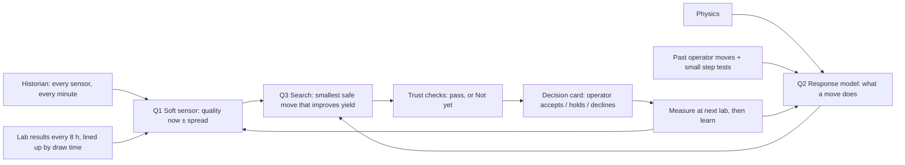
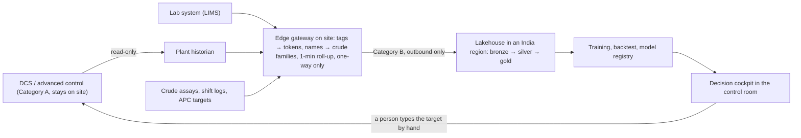

# The Story: How the FCC Decision Cockpit Knows What to Move, and Why We Can Trust It

**Read this first.** It explains, in plain words and with real examples from our build:
- the problem;
- our philosophy;
- how every model is trained and from what data;
- how we decide a setting is better;
- what happens with a crude we've never seen;
- how a move is proven;
- what our numbers honestly say;
- how each part ties back to IOCL's use cases and to the screens.

The last section is a step-by-step plan to understand the build.

Written 3 Oct 2026 (owner, 05:38: *"How do we know that some parameters will maximise the yield … where did we get the training data … how do we actually go about training? … I do not know our story and philosophy."*).

> [!IMPORTANT]
> All numbers here come from the running build on 3 Oct 2026. The data is simulated; nothing here is IOCL data. No value figures.

---

## 0. The story in 60 seconds

1. **The problem.** An FCC makes diesel (LCO), naphtha and LPG from heavy oil. Operators steer it with a handful of settings, but they work half-blind:
   - product quality comes back from the lab only every 8 h, hours late;
   - the crude changes every day or two;
   - a move in one unit shows up hours later in another.
2. **The philosophy.** *Learn from your history before day one. Prove before we advise. Keep learning after. Every move is small, measured by your lab, and inside your limits. When we're unsure, we say "Not yet".* The soft sensor and the best operating windows per crude come from your historical data, so they work from the first day of live use. History can't give clean cause and effect for every lever (the plant runs under control, and levers move rarely and together), so small step tests confirm those. See §11 for the real-plant journey.
3. **The method: three questions, three kinds of model.**
   - **Q1: What is the quality now?** A soft sensor, trained on past lab results lined up with the process readings at the minute each sample was drawn.
   - **Q2: If I move a setting, what changes?** A response model, from physics, from moves operators already made, and from small planned step tests.
   - **Q3: Which move is best?** A search that uses Q1 and Q2 to pick the smallest move that improves yield, inside every limit.
4. **New crude.** It starts from its nearest crude family, leans on physics, moves smaller (or says "Not yet"), and learns that crude within a few lab cycles.
5. **Proof.** Every move goes round **predict, decide, measure, learn**. On IOCL's plant, a pilot proves each lever before its advice goes live.
6. **On IOCL's plant (§11).** Trained on their history before day one; shadow mode; advise on proven levers first; step tests for the rest; benefit measured in plant terms from about week 6.
7. **Today's build.** The method is real and runs on simulated data. Some move sizes are scripted and labelled. A pilot on IOCL's plant replaces the simulator with their historian and lab data.

---

## 1. The problem, in plain words

### 1.1 What an FCC does

Heavy oil is heated in the **feed furnace** and meets hot catalyst in the **riser reactor**, where it cracks into lighter products in a few seconds. The catalyst picks up coke, so it is burnt clean in the **regenerator** and returned hot. The cracked vapour goes to the **main fractionator**, which separates it by boiling range: slurry at the bottom, then **LCO (diesel)**, then **heavy naphtha**, with light gases overhead. The **gas plant** (overhead condenser) and the **stabiliser** split the light end into LPG and light naphtha.

Six units in a chain: **Feed furnace → Riser reactor → Regenerator → Main fractionator → Gas plant → Stabiliser.**

### 1.2 What operators actually adjust (the levers)

| Unit | Main settings operators move | What it changes |
|---|---|---|
| Feed furnace | Feed preheat temperature | How much hot catalyst the feed needs (catalyst-to-oil), regenerator temperature |
| Riser reactor | Riser outlet temperature (ROT) | Severity: conversion, yield split, coke |
| Regenerator | Regenerator air | Excess oxygen, afterburn |
| Main fractionator | LCO and heavy-naphtha **cut points** (T98 targets) | Where the line is drawn between products, and so quality and yield |
| Gas plant | Overhead temperature target, reflux | Light-end recovery inside the condenser's cooling duty |

**Never recommended** (fixed in practice): condenser cooling-water flow (fixed duty), feed rate (set by planning), catalyst addition (not in the simulator).

### 1.3 The four problems (P1–P4)

| # | Problem | A real moment from our build |
|:-:|---|---|
| **P1** | **Quality is known every 8 h, hours late.** The unit runs blind in between. | Run s107: the heavy-naphtha sample drawn at **06:00** was reported at **07:02**. The next sample is at **14:00**. From 07:02 to 14:00 nobody measures quality. |
| **P2** | **Crude changes every 12–48 h.** Models and set points are tuned to yesterday's crude. | Run s107: a new, lighter crude starts arriving at **06:25**. The unit's behaviour shifts until **07:25**. |
| **P3** | **A move in one unit shows up hours later in another.** Optimising unit by unit misses it. | Run s107, 10:00: lower feed enthalpy → catalyst circulation rises in about 170 min → afterburn margin narrows in the regenerator. |
| **P4** | **An AI that always answers is dangerous.** It must know when it doesn't know. | Run s144, 12:00: the four models disagree by **17.3 °F** (limit 14 °F). A system that always answers would still give a set point. |

### 1.4 What this costs in plant terms (no money)

Without minute-by-minute quality, operators keep a **safety margin**: they cut lighter than needed so that, whatever the lab says later, the product is on spec. That margin is product sent to a lower-value stream every hour.

Example, run s144 at 10:00: the LCO cut is **6.7 °F inside spec**, lighter than it needs to be.

---

## 2. Our philosophy (five principles)

1. **Start from the best your plant has already done, then walk further.** Before day one, history shows the best operating windows per crude family (on spec with the least margin given away). Beyond those, we never claim "this is the best setting". We say "this small move improves the target, inside every limit, and here is how sure we are". Then we measure and take the next step. This is the old, trusted idea of *evolutionary operation*, made continuous and with the risk quantified.
2. **Physics first, history second, experiments third.** Physics works on day one, even for a crude never seen. The plant's history (years of data) sharpens it. Small planned step tests settle what history can't.
3. **Every number carries its uncertainty.** An estimate is "535.1 ± 3.8 °F", never just "535". Every move shows its chance of staying on spec.
4. **Say "Not yet" rather than guess.** When the models disagree, or the data is outside what they learned, the cockpit holds back advice and asks for a lab sample.
5. **People decide; the record remembers.** The cockpit advises. An operator accepts, holds or declines. Nothing is written to the control system. Every decision, and every time the AI held back, is recorded.

---

## 3. Three questions, three kinds of model

### Q1 — "What is the quality now?" (the soft sensor)

**What it is:** a model that reads the process every minute (tray temperatures, flows, pressures, pumparound duties) and estimates the lab result, for example LCO T98, before the lab does.

**Where the training data comes from (on a plant):**
- Every lab sample ever taken is a training example. The **input** is the process readings at the minute the sample was **drawn**. The **answer** is the lab result.
- **This is why the 4–12 h lab lag does not hurt training:** we line each result up with its draw time, not its report time. The lag only hurts *live operation*, and filling that gap is the soft sensor's whole job.
- How much data that gives: three samples a day for a few years is several thousand examples per product.

**How it is trained, step by step:**
1. **Clean:** drop broken readings (outside the valid range) and suspect lab results.
   - Real example: the s107 sample drawn 06:00 was **rejected** because its recorded draw time equalled the lab-system time, a timestamp error.
2. **Line up:** match each lab result to the process readings at its draw time. Find each sensor's delay; for example, the LCO quality responds to tray 6 about 4 min later.
3. **Exclude transients:** drop samples drawn while the unit was changing fast. They teach the wrong lesson.
4. **Split by run, not by minute:** train on some periods and test on whole periods the model never saw. In our build: **40 runs to train, 14 held out.**
5. **Train four different models:**
   - a simple statistical one (Bayesian ridge);
   - a flexible one (Gaussian process);
   - a **hybrid physics** one: physics plus a learnt correction;
   - a **physics-informed neural network (PINN)**.

   They make different kinds of mistakes, so their **disagreement is the warning light**.
6. **Weigh them per crude:** each model's weight depends on how well it did for that crude family. In run s107 at 10:00 the weights are hybrid 37 %, PINN 39 %, Gaussian process 15 %, Bayesian ridge 8 %. The physics-based models carry the most weight because the crude is new.
7. **Correct live:** every new lab result nudges the estimate back toward the truth, a small step that can't jump (a rate-limited bias update).

**Real example from the build:** run s107 at 10:00, heavy-naphtha T98 is **535.1 ± 3.8 °F** against a **540 °F** spec. The chance of staying on spec is **91 %**. The next lab is 4 h away.

**What's honest in our build:**
- The 40 simulated training runs had only **72 clean lab samples per product**; the training needs at least 100. So, as a demo fallback, our soft sensor was trained on the simulator's true value at every minute (728 points for LCO), not on lab samples. **This is exactly the scarcity a real plant does not have:** a real FCC's historian and lab system hold years of samples.
- Accuracy on held-out runs is in §7.

### Q2 — "If I move a setting, what changes?" (the response model)

**Why Q1 is not enough:** the soft sensor tells you *where you are*. To choose a move you need *cause and effect*: "if I raise the riser outlet temperature by 1 °F, conversion rises by about 0.12 %". Quality data alone can't give that, because in normal operation many things change at once.

**Where the data comes from, in order of trust:**

| Source | What it gives | Real example |
|---|---|---|
| **(a) Physics** | Direction and rough size, from day one, for any crude | A cut-point controller follows its set point: raise the LCO cut-point target 1 °F and LCO T98 rises about 1 °F. In our build this 1 : 1 gain is a **physics assumption**, not a fit. |
| **(b) Moves operators already made** | Each past set-point change is a natural experiment, if the unit was otherwise steady around it | Our build measured how product flows respond to cut-point moves from about **3,000 minutes** around past set-point changes |
| **(c) Small planned step tests** | The cleanest cause and effect: one setting moved a little, everything else held. This is how advanced-control vendors tune refineries today | Our lever runs: about 285 designed moves of preheat, regenerator, pumparounds, reflux and overhead temperature. After a fix on 3 Oct, **22–30 usable moves per lever** |

**Real results from the step tests (3 Oct):**
- **Feed preheat:** the measured response matches the model (gain about 1.0).
- **Regenerator:** the test moves actually changed the regenerator *temperature target*, not the air. The measured effect is cyclone ΔT **−0.34 ± 0.07 °F per °F**.
- **Condenser:** in the simulator, cooling water isn't tied into the overhead loop, so there's no basis for that move yet.

**What's honest in our build:** the riser-temperature, preheat, regenerator and condenser move sizes on screen are **scripted** (labelled), because the step-test data is still thin. 36 more runs are being simulated now.

### Q3 — "Which move is best?" (the set-point search)

**What it does:** it tries many candidate moves of the settings operators really adjust, and scores each one with Q1 and Q2:
- **better:** more LCO, heavy naphtha and LPG;
- **worse:** more energy and coke;
- **forbidden:** off-spec risk above 5 %, a step bigger than the operating procedure allows (e.g. 5 °F), a setting outside its window, or too little time since the last move.

It keeps the **smallest** move that reaches the goal. Small moves are safer, and easier to measure and learn from.

**Two real examples:**

| Run · time | What the search saw | Move it proposed | Result |
|---|---|---|---|
| s107 · 10:00 | Heavy-naphtha estimate 535.1 ± 3.8 °F, spec 540 °F; chance on spec **91 %** | **Lower heavy-naphtha cut point −1.0 °F** (530.3 → 529.3) | Chance on spec **95 %**: the smallest move that reaches the goal |
| s144 · 10:00 (a run the models never saw) | LCO estimate 751.5 ± 4.0 °F, spec 765 °F: **6.7 °F more margin than needed** | **Raise LCO cut point +2.5 °F** (752.8 → 755.2) | Chance on spec stays **98.5 %** (≥ 95 % required); more product stays in the LCO stream; margin left 4.2 °F |

**"Optimal" means:** the best move *inside known safe limits, right now*. Not a global optimum, and never a leap. The next move comes after the next measurement.

---

## 4. The crude we've never seen

**The question:** we may not have lab history for every crude. How can the cockpit advise?

**The answer, built in four layers:**
1. **Families, not names.** Crudes are grouped by what matters to an FCC: heaviness (API), sulphur and carbon residue, from the assay. Our build uses four families: R1 Heavy (Basrah Heavy type), R2 Medium-heavy (Urals type), R3 Medium (Arab Light type), R4 Light (Bonny Light type). A new crude starts from its nearest family.
2. **Lean on physics.** For an unfamiliar crude, the physics-based models get more weight, because physics doesn't need history. Real example: after the s107 switch, the physics-based models carry **81 %** of the weight.
3. **Less sure, smaller moves, or "Not yet".** Unfamiliar data widens the spread. If it crosses 14 °F, the cockpit holds back and asks for a lab sample.
4. **Learn the crude.** Every lab sample on the new crude is a new training example. After a few lab cycles the cockpit knows that crude.

**Real example, the s107 crude switch:**

| Time | What happens | Who does it |
|---|---|---|
| 06:25 | A lighter crude starts arriving; the lab assay says R4 (API 27.2); the unit was on R3 | Planning / tank farm |
| 06:25–07:25 | The unit's behaviour shifts: riser temperature rise, conversion, coke, regenerator temperature | The plant |
| 07:37 | The crude is named R4, 12 min after the blend settles. The name must hold 15 min first, so noise doesn't flip it | Crude-switch agent |
| then | The soft sensor re-weights for R4; physics-based models carry 81 % | Soft-sensor committee |
| then | The search uses R4's response models, so the advice changes with the crude | Set-point search |

**What's honest in our build:**
- In the demo, the crude name follows the **lab assay** (labelled "scripted").
- Our own classifier, which reads the unit's behaviour, names the right crude in **8 of 15** held-out crude switches. There are too few switches in the data to show it as the source.
- On a plant the assay is always known. The classifier's job is to confirm it, and to catch a wrong or mixed tank.

---

## 5. How a move is proven: predict, decide, measure, learn

| Step | What happens | In our build |
|---|---|---|
| **Predict** | Model gives the expected effect and how sure it is | Built for cut points; scripted gain for D3 and D5–D7 (labelled) |
| **Decide** | An operator accepts, holds or declines; recorded; nothing sent to the plant | Built |
| **Measure** | Next lab sample, or the unit's instruments within 30–60 min, show what happened. Inside the predicted band = confirmed; outside = flagged | Shown; the demo replay does not apply moves to the simulator |
| **Learn** | Each lab result corrects the soft sensor; accepted moves and their results refit the response model | Soft-sensor correction built; response refit is pilot work |

**Proof in the simulator (conversion confirmed 3 Oct 13:20 UTC; cut-point part still running):** we take the recipe the cockpit proposed for run s144 at 10:00 and replay the same run twice from the same starting point, once with the recipe and once without:
- riser outlet temperature +3.5 °F;
- LCO cut point −1.0 °F;
- heavy-naphtha cut point +1.0 °F.

Any difference is the recipe alone. The prediction is conversion **+0.4 %** (0.12 % per °F). The first 120 minutes of both runs match the original exactly, so the comparison is clean.

**Result (3 Oct 2026, both runs to the end, no solver breakdown):**
- **Conversion: confirmed.** +0.44 % after 1 hour and +0.53 % on average over hours 1–3, against +0.42 % predicted. That is inside the band (±0.32 %).
- **Cut points in manual: not what the recipe assumed.** While the cut-point controllers were in manual, the riser move itself pushed both T98s up (LCO at least +19 °F, heavy naphtha +48 °F); the −1 / +1 °F trims did nothing yet.
- **Cut points in auto: not proven either way.** Once the controllers went back to auto, both T98s returned to within 0.2 °F of the run without the recipe. The −1 / +1 °F trims are much smaller than the ±8 °F soft-sensor spread, so the test cannot see them. With the LCO cut held back, part of the extra conversion went back into LCO (conversion +0.10 % ± 0.42 over 30 noisy minutes).
- **What it teaches:** the conversion response holds. A coordinated recipe is only as good as its weakest piece: here the cut-point part needs a bigger, cleaner test, and the plan must say whether the cut-point controllers are in auto. This is exactly why the plant pilot measures each lever, one at a time, before its advice goes live; and why D3 stays labelled scripted.

**On IOCL's plant, the pilot (scope to agree with IOCL; the full step-by-step plan, live routine and benefit journey are in §11):**
1. **Data:** read-only historian tags for the FCC, lab results, crude assays. Nothing from safety or control systems.
2. **Backtest:** train on most of the history, test on months the models never saw, per crude family. Report accuracy honestly.
3. **Shadow:** run live; nobody acts; compare every estimate to the next lab.
4. **Advise with small step tests:** one lever at a time, inside the operating procedure, measured by the lab. Each lever's gain becomes the plant's own.

**The pilot is our answer to "will it maximise yield?":** we prove it on your plant, one lever at a time, before any advice goes live.

---

## 6. Where our demo data came from (and how it mirrors a plant)

| On IOCL's plant | In our demo | Size |
|---|---|---|
| Historian, years of 1-minute data | Physics-based FCC simulator (Octave), randomised crude walks, feed and temperature changes, sensor noise | `full_v1`: **54 runs, 83,240 one-minute rows**, 4 crude families |
| Lab system (LIMS): samples every 8 h, with lag and errors | Simulated lab samples at 06:00, 14:00, 22:00, with reporting lag, noise and deliberate errors (e.g. timestamp error) | About 3 samples per run per product; 72 clean per product on the 40 training runs |
| Step tests in a pilot | "Lever" runs with designed moves of six settings | `lever_v1`: 52 runs, 26,580 rows (partial) + **36 runs running now** |
| Data lake | BigQuery (bronze → silver → gold) + Cloud Storage | All runs loaded; counts match local exactly (3 Oct) |

The **method is identical**; only the source changes. That's why we say *"shown on simulated data; proven on your plant in a pilot"*.

---

## 7. What our numbers honestly say

| Part | Status | The honest detail |
|---|---|---|
| Soft-sensor method (4 models, spread, trust checks, "Not yet") | **Real** | Runs on every minute of every run |
| Soft-sensor training labels | **Demo fallback** | Simulator truth, not lab samples (72 clean labs per product < 100 needed). On a plant: lab samples |
| Soft-sensor accuracy on the 14 held-out runs | **Weak, so the trust checks matter** | Average miss: LCO **9.1 °F**, heavy naphtha **19.2 °F** (big misses in some periods). The 90 % band contains the truth only **62 %** (LCO) and **56 %** (heavy naphtha) of the time, so the bands are too narrow. The spread check and "Not yet" catch the worst periods. Real lab history and recalibration are the fix |
| Cut-point gain (1 : 1) | **Physics assumption** | Not fitted; standard controller behaviour |
| Response of product flows to cut-point moves | **Fitted** | From about 3,000 minutes around past set-point moves |
| Lever gains (preheat, regenerator, condenser, riser) | **Scripted on screen** | Step-test data thin; preheat matches, regenerator re-expressed, condenser has no basis; 36 more runs running |
| Crude name | **Scripted** (follows the assay) | Classifier 8 of 15 held-out switches |
| Set-point search | **Real** | Smallest safe move; limits shown |
| Systems knock-on rules (19) | **Real** | Rule-based, over the catalyst, heat and hydrocarbon loops |
| Person in the loop, decision record | **Real** | Nothing written to the control system |
| MeitY edge gateway | **Design** | Not built; demo lake in `us-central1` |

> [!WARNING]
> Don't quote the held-out accuracy figures in the room unless asked. If asked, say: *"On simulated data the average miss is about 9 °F on LCO, and our uncertainty bands are still too narrow. That's exactly why every estimate goes through trust checks and the cockpit says 'Not yet' when they fail. On your plant we train on your lab history and report accuracy per crude in the backtest, before any advice goes live."*

---

## 8. Tying it back to the solution

### 8.1 The six layers and the three questions

| Layer | Job | Which question it serves | In this build |
|:-:|---|---|---|
| 1 Lakehouse | One source of truth: sensors, labs, assays, events, decisions | All | BigQuery `fcc_bronze` → `fcc_silver` → `fcc_gold` |
| 2 Data processing | Clean, line up labs by draw time, drop transients, de-identify | Q1, Q2 | Valid-range cut, lab alignment, lag finder |
| 3 Models | Soft sensor (Q1), response models (Q2), crude families | Q1, Q2 | 4-model committee; response models per crude |
| 4 Agents | Watch, diagnose, propose, one per use case | Q1–Q3 | Drift-watch, crude-switch, set-point search, systems, Gemini |
| 5 Decisions + person | Advise; accept / hold / decline; "Not yet" | Q3 | Decisions D1–D9; decision record |
| 6 Whole refinery | Check knock-on effects before advising | Q3 | Systems agent, 19 rules |

### 8.2 IOCL use case → problem → question → agent → decision → status

| IOCL use case | Problem | Question | Agent | Decision on screen | Status |
|---|:-:|:-:|---|---|---|
| #1 FCC product-quality inferential | P1 | Q1 + Q3 | Soft-sensor agent + search | **D1** move the cut point or wait for the lab | Live |
| #11 Soft sensor between lab samples | P1, P4 | Q1 | Soft-sensor agent | **D2** can the estimate be trusted; **D9** extra sample | Live |
| Feedstock evaluation | P2 | Q1 (crude families) | Crude-switch agent | **D4** which crude, is the switch done | Scripted (follows assay) |
| #6 Multi-unit energy | P2, P3 | Q2 + Q3 | Search + systems | **D3** recipe for the new crude | Scripted outcome |
| #5 Fired-heater combustion; #10 coke / hydraulics | P2, P3 | Q2 | Furnace agent | **D6** feed preheat | Scripted outcome |
| #4 Regeneration tracking | P3 | Q2 | Regenerator agent | **D5** regenerator air | Scripted outcome |
| #7 Exchanger fouling; #2/#3 light ends | P3 | Q2 | Condenser / light-ends agent | **D7** overhead temperature target | Scripted outcome |
| #8 Filters; #9 rotating equipment | P3 | — | Systems agent | **D8** watch | Watch only |
| Coker, alkylation, turbines, flare, pipelines | — | — | — | — | Not claimed: same pattern, new agent |

### 8.3 One morning, end to end (run s107)

| Time | What happens | Problem | What the cockpit does | Screen |
|---|---|:-:|---|---|
| 06:00 | Heavy-naphtha sample drawn | P1 | — | — |
| 06:25 | New, lighter crude starts arriving | P2 | — | — |
| 07:02 | Lab reports the 06:00 sample; it's **rejected** (timestamp error) | P1 | Screens it out before it touches the model | Fractionator ① "Lab: rejected" |
| 07:25 | Blend settles | P2 | — | — |
| 07:37 | Crude named **R4 Light** | P2 | Models re-weight; physics-based 81 % | Fractionator ② crude block + walkthrough |
| 09:31 | Heavy naphtha drifting from expected (sustained) | P1 | Drift-watch agent raises it | Fractionator ② CUSUM |
| 10:00 | Estimate 535.1 ± 3.8 °F vs spec 540; chance on spec 91 % | P1 | **D1: lower cut point −1.0 °F → 95 %**; 7 of 8 checks pass | Fractionator ③–④ |
| 10:00 | Feed preheat for the new crude | P2, P3 | **D6: +1.5 °F** (scripted) | Furnace ③ |
| 10:00 | Afterburn margin eroding; breach in about 180 min | P3 | **D5: regenerator air −0.03 lb/s** (scripted) | Regenerator ③ |
| 10:00 | Condenser fouling; overhead limit in about 180 min | P3 | **D7: overhead target +1.5 °F** (scripted) | Gas plant ③ |
| 10:00 | Riser conversion above expected | P3 | **D8: watch**, no move | Riser ③ |
| 10:00 | Estimate spread 19.2 °F on LCO and heavy naphtha; next lab 4 h away | P4 | **D9: pull an extra sample now**; LCO cut point "Not yet" | Fractionator ③ |
| 14:00 | Next scheduled lab | P1 | Measures the result of any accepted move; corrects the soft sensor | — |

---

## 9. Glossary

| Term | Plain meaning |
|---|---|
| **T98** | Temperature at which 98 % of a product has boiled off. A quality spec: too high means too heavy |
| **Cut point** | The boundary the fractionator draws between two products, set by a T98 target |
| **Soft sensor** | A model that estimates a lab result every minute from process readings |
| **Spread (W90)** | How far apart the 4 models' estimates are; above 14 °F, the cockpit says "Not yet" |
| **Chance on spec** | Probability, from the models, that the product stays within spec |
| **Response model / gain** | How much a target changes per unit move of a setting |
| **Step test** | Moving one setting a little, holding the rest, to measure its effect |
| **Crude family (regime)** | A group of crudes that behave alike in the FCC (R1–R4) |
| **PINN** | Physics-informed neural network: a neural network made to respect physical laws |
| **Hybrid model** | Physics model plus a learnt correction |
| **Bias update** | A small, limited correction of the estimate each time a lab result arrives |
| **Held-out run** | A run the models never saw in training, used to test them |
| **Scripted outcome** | Real inputs, but the size of the move's effect is set by us, not learnt. Labelled on screen |

---

## 10. How to understand the build, step by step (about 3 hours)

| Step | What to do | Time | You should be able to say afterwards |
|:-:|---|---|---|
| 1 | **Read this document, §0–§5, then §11** (the real-plant journey) | 70 min | The problem, the philosophy, the three questions, new crude, proof, and how it runs and creates value on IOCL's plant |
| 2 | **Open the app at `/platform` (Overview).** Read the six layers, the use-case cards, the person-in-the-loop, MeitY and "How do we know" bands. Match them to §8.1–8.2 | 15 min | Which use case is live, scripted, watch-only or not claimed, and why |
| 3 | **Follow §8.3 in the app:** Scenario ▾ → `random_s107`, 10:00. Visit the Fractionator ①②③④, then Furnace, Regenerator, Gas plant, Riser | 40 min | For each decision: what was seen, what move, why that size, what it does downstream, how sure |
| 4 | **Switch to `random_s144`** at 10:00 (take back margin; recipe; proof loop), then 12:00 ("Not yet") | 20 min | Why the cockpit sometimes advises and sometimes refuses |
| 5 | **Read §6–§7** (data and honest numbers) | 15 min | Where the data came from; what's real, scripted, weak |
| 6 | **Run `DEMO_SCRIPT.md` Part 4** (function checklist), then `scripts/reset_decision_record.py` | 30 min | That every function works; how to reset |
| 7 | **Read `PROBING_QUESTIONS.md`** and answer A1, A3, B1, C1, D1 aloud without looking | 20 min | The hard questions, in your own words |
| 8 *(optional, for depth)* | **Code map:** `cockpit/api/app/train.py` (how Q1 is trained) · `engines/regime.py` (crude families) · `engines/surrogates.py` (Q2) · `engines/recipe.py` (Q3) · `engines/systems.py` (knock-on rules) · `engines/decisions.py` (the cards) · `cockpit/web/src/components/twin/l1/UnitStory.tsx` (the unit page) | 60 min | Where each idea lives in the code |

**You're 100 % clear when you can answer these five without notes:**
1. Why doesn't the lab lag stop us training?
2. Where does cause and effect come from, and why isn't quality data enough?
3. What does "optimal" mean in our cockpit?
4. What happens on a crude we've never seen?
5. What exactly is real, scripted or design-only in this build, and what would the pilot prove?
6. Why don't we need to wait to learn, when IOCL has historical data? And what can that history *not* tell us?
7. When does IOCL start benefiting, and how is it measured without money figures?

---

## 11. How it runs in a real plant: from historical data to value

> **Short answer to "why not learn on day one?"** It does. With IOCL's historical data, the models are trained, tested and calibrated **before** the first live day. What history cannot fully give is clean cause and effect for every lever. A few small step tests confirm those, and the cockpit only advises on a lever once its effect is proven.
>
> Durations below are indicative, to agree with IOCL. Value is shown as plant measures (°F of margin, off-spec hours, hours to settle after a crude switch); IOCL applies its own prices.

### 11.1 What their historical data gives, and what it can't

| From 2–3 years of history | What we get | Ready on day one? |
|---|---|---|
| Historian (1-minute tags) + every lab sample, lined up by draw time | **Soft sensor** for each product: thousands of examples per product (about 3 samples a day × 365 days × 2–3 years) | **Yes**, after the backtest (11.3, Phase 1) |
| Crude assays + the unit's response in each crude period | **Crude families** and how each behaves; a classifier that confirms the assay | **Yes** for families seen in history |
| The best periods in history, per crude family | **Best operating windows:** the settings at which product was on spec with the least margin given away. This is your exact idea: *"train on lab data and choose the values at which the product is optimal"* | **Yes**: the first, lowest-risk advice comes from here |
| Past set-point and advanced-control target changes | **Lever effects** where moves were clean and steady | **Partly** |

**Why history can't give every lever's effect (so the step tests are needed):**
1. **The plant runs under control.** The advanced controller holds temperatures and qualities steady, so in the data a cause and its effect cancel out. You can't see "move X by 1 → Y changes by g" when the controller immediately moved Z to keep Y still.
2. **Some levers are rarely moved, and only a little.** If the riser outlet temperature stayed within ±3 °F for two years, history can't say what +5 °F does.
3. **Things change together.** When the crude changes, operators move several settings at once. History can't separate which move did what.
4. **Data errors.** Wrong tags, lab timestamp errors (our s107 06:00 sample is one) and sensor drift. Cleaning finds most of these, not all.

**Therefore:** history gives the soft sensor and the best windows fully, and the lever effects partly. **Step tests close the gap, one lever at a time.**

### 11.2 The data path on site (read-only, MeitY-aligned)

- Nothing writes back to the plant automatically. The only path back to the DCS is a person.
- The cockpit reads about 300–500 FCC tags every minute, every lab result as it's reported, assays when a crude is scheduled, and the advanced controller's targets and limits.

### 11.3 The execution plan, step by step

| Phase | Weeks (indicative) | What we do | Who from IOCL | What IOCL gets (deliverable) | Gate to the next phase |
|:-:|:-:|---|---|---|---|
| **0 · Scope and access** | 0–2 | Choose one FCC. Agree the tag list, lab products, crude assays, shift logs and advanced-controller targets. Classify the data under MeitY (what stays Category A). Install the edge gateway, read-only | Process engineer, IT/OT security, data owner | Signed data scope; data flowing one way to the India-region lakehouse | Data arrives daily, complete and readable |
| **1 · Learn from history** | 2–6 | Extract 2–3 years. Clean, line up labs by draw time, drop transients. Build crude families from assays. Train the 4-model soft sensor per product. Mine the **best operating windows** per crude family. Mine past moves for lever effects. Calibrate the physics models to this unit's design data. **Backtest** on months the models never saw | Process engineer (reviews), lab (sample history) | **(1) Accuracy report** per product and crude family (average miss, band coverage, "Not yet" rate). **(2) Margin report:** how far inside spec each product ran historically, per crude family. **(3) Best-window table** per crude family. **(4) Lever table:** green (effect clear from history), amber (needs step test), red (no data) | Accuracy meets the agreed target on held-out months; IOCL signs off |
| **2 · Shadow mode** | 6–10 | Run live in the control room. **Nobody acts on it.** Every estimate is compared to each new lab result; every would-be advice is logged; operators review it weekly | Shift-in-charge, process engineer | Live quality every minute; a weekly "would we have been right?" review | Live estimates stay inside agreed accuracy for 4 weeks; operators agree the advice makes sense |
| **3 · Advise, starting safe** | 10–16 | **(a)** Advise on **green** levers first: the cut points, inside the best windows from history. **(b)** For **amber** levers, run **small step tests** planned with the advanced-control engineer inside the operating procedure (e.g. riser outlet ±2 °F, one move, hold 2–4 h, measure at the lab), a few per crude family. **(c)** After each accepted move, measure at the next lab and refit | Board operators, shift-in-charge, advanced-control engineer | Moves advised and decided; each lever's effect becomes the plant's own measured number | Advised moves land inside their predicted band most of the time; no safety or quality incident |
| **4 · Measure benefit, extend** | Months 4–6 | Compare against the Phase 1 baseline (11.6). Add the remaining levers as their step tests pass. Add multi-unit recipes for crude switches | Plant management, process engineering | **Benefit report** in plant measures; IOCL applies its own prices | IOCL decides to scale |
| **5 · Keep learning; scale** | Ongoing | Weekly refit; retrain on triggers (11.5). Roll out to other FCC / RFCC units, then other use cases on the same lakehouse (each a new agent) | Central data / AI team | A refinery-wide platform; each new use case reuses the data and the pattern | — |

### 11.4 How it works live, every day

| How often | What happens automatically | What a person does |
|---|---|---|
| **Every minute** | Read tags → estimate each product's quality ± spread → trust checks → watch for drift → update cards | Glance at the cockpit; nothing to do if nothing has changed |
| **When a decision appears** | Card shows: what we see, the move, why that size, chance on spec, knock-on effects, "if nothing is done" | **Board operator** reads it, accepts, holds or declines. If accepted, **types the new target into the DCS by hand** (or into the advanced controller's target). Recorded |
| **Every lab result** (about 3 a day per product) | Suspect results screened out → soft sensor corrected → any accepted move checked: inside its predicted band = confirmed; outside = flagged for review | Lab works as today; nothing extra |
| **Every crude switch** | Assay read → nearest crude family → models re-weighted → transition watched → recipe for the new crude when trust allows | Shift-in-charge approves a multi-setting recipe |
| **Every week** | Refit with the week's new data. The candidate model is compared with the live one on the same weeks | **Process engineer** reviews and signs off before a new model goes live |
| **Every month** | Benefit and accuracy report | Plant management review |

**Who decides what (indicative approval levels):**

| Move | Who approves |
|---|---|
| One setting, inside its normal window and procedure step (e.g. cut point ±2.5 °F) | Board operator |
| Several settings together (a crude-switch recipe), or a move near a limit | Shift-in-charge |
| A lever never advised before, a new crude family, or a new model version | Process engineer |
| Moving from "advise" to "assist" (pre-filled targets) | Plant management, with a safety case. Not in this proposal |

### 11.5 How the models keep learning safely (governance)

1. **Model registry.** Every model has a version, its training data, its backtest scores and who signed it off.
2. **Retrain triggers.** A model is retrained when any of these happens:
   - the weekly refit is due;
   - estimates drift from the lab beyond a set limit for several samples in a row;
   - a new crude family appears;
   - enough new lab samples or step tests have arrived (e.g. 50 per product);
   - equipment changes (a turnaround, catalyst change-out or new instrument).
3. **Champion and challenger.** The new model runs in shadow next to the live one. It replaces the live model only if it does better on the same weeks and the process engineer signs off.
4. **Rollback.** One click back to the previous version.
5. **Always on:** trust checks, "Not yet", screening of suspect lab results, the decision record.

### 11.6 When and how IOCL starts benefiting

| When | Benefit | How it is measured (plant terms) |
|---|---|---|
| **End of Phase 1 (about week 6)** | **Insight from their own history:** how much margin each product ran inside spec, per crude; the best operating windows; which levers matter | °F of margin given away, per product and crude family, historically |
| **Phase 2 (weeks 6–10)** | **Quality visible every minute**, not every 8 h; better timing of lab samples | Average gap between estimate and lab; minutes of "blind" operation removed |
| **Phase 3 (weeks 10–16)** | **First advised moves on the cut points:** less margin given away, still on spec. This is the lowest-risk, fastest benefit | °F of margin recovered; off-spec hours (must not rise); share of advised moves confirmed by the lab |
| **Phase 4 (months 4–6)** | **Faster, steadier crude switches** with multi-setting recipes; knock-on problems caught earlier | Hours to settle after a crude switch; number of downstream upsets |
| **Phase 5 (ongoing)** | The same platform takes the next use case with little new data work | Time to stand up the next agent |

**Real example of the measure, from our build:** run s144 at 10:00, the LCO cut is **6.7 °F inside spec**. The cockpit advises raising it by **2.5 °F**, leaving **4.2 °F** of margin while the chance on spec stays at 98.5 %. On IOCL's plant, the monthly benefit report adds up exactly this kind of recovered margin, product by product, and IOCL prices it.

### 11.7 What can go wrong, and what the system does

| Failure | What the system does |
|---|---|
| A sensor fails or drifts | Valid-range check flags it; the models that depend on it lose weight; the spread widens; "Not yet" if needed |
| A wrong lab result | Screened before it touches the model (e.g. timestamp error, out-of-pattern value); shown as "rejected" with the reason |
| A crude never seen | Nearest family; physics weight up; smaller moves or "Not yet"; a lab sample requested; learns the crude within a few lab cycles |
| A new model does worse | Stays challenger; never replaces the live model; rollback available |
| Equipment change (turnaround, new catalyst) | Retrain trigger; back to shadow for that unit until accuracy is shown again |
| An advised move doesn't land as predicted | Flagged at the next lab; that lever's effect is re-checked; its advice becomes more cautious until confirmed |
| Operators disagree with the advice | They decline it, and the reason is recorded; declined advice is reviewed weekly, and it's a learning signal too |

### 11.8 One real-plant shift, start to finish (illustrative)

| Time | What happens | Who |
|---|---|---|
| 06:00 | Shift handover; the cockpit summary shows quality estimates for all products, all inside trust | Shift-in-charge |
| 06:20 | Tank switch scheduled; the assay is read; the new crude maps to the "medium" family | Automatic |
| 07:10 | The transition settles; the crude is confirmed by the unit's behaviour; models re-weight | Automatic |
| 07:30 | Card: "Recipe for this crude: riser outlet +2 °F, LCO cut point −1 °F" (both levers proven in Phase 3) | Shift-in-charge approves; board operator types both targets into the advanced controller |
| 08:00–11:00 | Estimates follow the move inside the predicted band | Automatic |
| 11:30 | Card: "Not yet: heavy-naphtha estimate too uncertain; pull an extra sample" | Board operator requests the sample |
| 13:05 | The extra sample confirms the estimate; the soft sensor is corrected; the cut-point advice returns | Lab, automatic |
| 14:00 | Scheduled lab confirms the 07:30 recipe: inside the predicted band, logged as confirmed | Automatic |
| Weekly | The confirmed moves join the next refit; the process engineer signs off the new model version | Process engineer |
