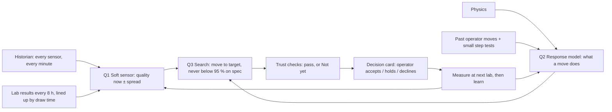

# The Story (v2): How the FCC Decision Cockpit Knows What to Move, and Why We Can Trust It

**Read this first.** It explains, in plain words and with real examples from our build:
- the executive business case and presentation strategy;
- the underlying chemical engineering (catalytic cracking vs. fractional distillation);
- the economics of cut points (gasoline vs. diesel vs. slurry);
- our engineering philosophy;
- how every model is trained and from what data;
- how we decide a setting is better;
- what happens with an unfamiliar crude;
- how a move is proven;
- what our numbers honestly say;
- how each part ties back to IOCL's refinery use cases and to the screens;
- the complete step-by-step roadmap for a 6-week plant pilot.

Written 3 Oct 2026; revised to v2 on 6 Oct 2026 to incorporate process engineering foundations, distillate hierarchy economics, and the full refinery use-case coverage matrix.

> [!IMPORTANT]
> All numbers here come from the running build on 3 Oct 2026. The data is simulated from the peer-reviewed Santander et al. (2022) FCC-Fractionator simulator; nothing here is IOCL data. No financial figures are shown on screens; all value is measured in plant engineering terms.

---

## Executive Briefing & Leadership Pre-Read

> [!IMPORTANT]
> **BLUF:** The FCC Soft-Sensor Decision Cockpit is an advisory-only AI and physics system that eliminates the 8-hour blind spot between lab samples by predicting distillation cut points every minute, recommending safe operator adjustments during crude switches, and explicitly refusing to advise when models disagree.

### The "So What" for a Refinery Head

Refinery executives care about **margin giveaway, off-spec product, crude switch transition lag, and plant safety**. 

Today, FCC operators fly blind for 4–9 hours between laboratory distillation assays (ASTM D86). When a crude slate shifts, units run on yesterday’s set points, leading to conservative cut points (giving away high-value heavy naphtha and diesel into lower-value streams) or off-spec violations. This system bridges this gap without risking unit stability: it provides **minute-by-minute virtual quality tracking, recommends the set-point move that brings each cut point to its target, never below 95 % chance on spec and at most 5 °F per SOP step, and acts purely in an advisory capacity with zero write-access to the DCS**.

### Key Pillars: What Was Built & How It Works

1. **Real-Time Soft-Sensor Quality Estimation (Process Physics + ML):**
   * *Problem:* Heavy Naphtha (HN) and Light Cycle Oil (LCO) cut points ($T_{98}$) are measured by lab draws only every 8 hours, with a 1-hour analysis lag.
   * *Solution:* A 4-model ensemble committee (Bayesian Ridge, Hybrid Delta, PINN, and Gaussian Process) estimating $T_{98}$ every 60 seconds from live tray temperatures, reflux, pressures, and feed properties.
   * *Validation:* Built and verified against the peer-reviewed Santander et al. (2022) FCC-Fractionator simulator (54 runs, ~83,000 one-minute steps, tested against held-out runs the models never trained on).

2. **Decision-First Operational Cockpit Across All 6 FCC Units:**
   * *Design Philosophy:* *"Decision first; data underneath."* Screens lead with the operational decision (D1–D9), the responsible agent, and the recommended move.
   * *Coordinated Visibility:* Feed Furnace $\to$ Riser Reactor $\to$ Regenerator $\to$ Main Fractionator $\to$ Gas Plant $\to$ Stabilizer.
   * *Human-in-the-Loop:* Operators can Accept, Hold (30 min), or Decline. Every action is logged to an immutable decision record (`/audit`); **nothing touches plant controllers or the DCS**.

3. **Safety-First "Refusal to Advise" ("Not Yet" Gate):**
   * *The Core Differentiator:* An AI that guesses when it is uncertain is dangerous in a refinery.
   * *The Safety Brake:* If the spread across the 4 estimation models exceeds **$14^\circ\text{F}$** ($W_{90}$ threshold), or if process conditions enter an unverified envelope, advice is withheld. It displays **"Not yet"** and prompts the operator to request an extra physical lab draw.

4. **Multilingual Advisory Copilot & MeitY Compliance Architecture:**
   * *Gemini Copilot:* Provides contextual rationale in English, Hindi, or Hinglish explaining why a move is recommended and the risk of holding.
   * *Data Governance:* Category A data (safety, control, raw tag names, proprietary crude cargo names) remains strictly on-premises; an edge gateway de-identifies telemetry before Category B data egresses to India cloud regions.

### How to Present It to the Refinery Head (10-Minute Walkthrough)

| Phase | Screen / Route | What to Show | Executive Talk Track |
|---|---|---|---|
| **1. Overview (60 sec)** | `/platform` | Six-layer architecture and use-case alignment cards. | *"Behind this screen: AI and physics — a crude classifier, a four-model soft sensor including a PINN, anomaly detection on every unit and an optimiser — shared across your use cases, on one source of truth. They advise; your operators decide. Zero control system actuation."* |
| **2. Refinery Top View** | `/twin` (`random_s107`, $t=600$) | 6 units on the flowsheet; one glowing yellow with **"Decide"**; the riser on **"Watch"**. | *"A crude switch occurred at 07:25. The plant responded hours before the lab assay arrived. The fractionator is off plan, while the riser needs no intervention. Each unit sees only what matters to it."* |
| **3. Unit Deep Dive** | `/twin/unit/unit_4_fractionator` (`random_s144`, $t=600$) | Live column drawing $\to$ Model ensemble bell curves $\to$ Decision D1 (*Raise LCO cut point $+2.0^\circ\text{F}$, 752.8 → 754.8, toward the 755.3 °F target*). | *"Here is a run the model never saw. The three blended models agree within $14^\circ\text{F}$ (the linear model is shown for reference), and the chance on spec is above 99 %. It advises the move that brings the cut to its target, inside the 5-degree SOP step."* |
| **4. The Honesty Moment** | `/twin/unit/unit_4_fractionator` (`random_s144`, $t=720$) | Decision status changes to **"Not yet"** with an amber alert. | *"Two hours later, process uncertainty widens. Rather than averaging 4 divergent guesses, the system withholds advice and prompts the board operator to request a physical lab draw."* |
| **5. Audit & Governance** | `/audit` | Timestamped log of accepted moves and model withholdings. | *"Full accountability: every recommendation, operator override, and safety withhold is logged for engineering audit."* |

### Anticipated Tough Questions & Exact Answers

* **"Will this AI actually increase my liquid yield or mess up my plant?"**
  > *"Every move follows a four-step loop: **Predict, Decide, Measure, Learn**. The system predicts the effect and confidence interval. Your board operator decides whether to act. Your lab sample or downstream sensors measure the actual physical response, which re-anchors the models. Furthermore, it only recommends levers operators already adjust, never safety-critical parameters like feed cuts or catalyst dump rates."*
* **"Can we trust this on our specific crude slates?"**
  > *"No AI should be trusted on day one without site proof. What we are demonstrating today is the framework and safety logic validated on a physics simulator. For your refinery, we run a zero-risk 6-week offline backtest using 2–3 years of your plant's historical PI/historian and LIMS data to calibrate the models against your exact crude slate."*
* **"Does this put cloud software in control of our DCS?"**
  > *"No. The architecture is strictly read-only and air-gapped from DCS actuation. Control system write access is permanently disabled. It operates purely as an operator advisor."*

### The Recommended Next Step (The Ask)

> *"We are not asking to connect to your plant or change how your operators run shifts today. We are asking for read-only access to 2–3 years of historical historian tags and LIMS logs for the FCC unit to run a **6-week offline validation backtest**. In week 6, we present a report showing exactly where cut-point giveaway occurred and prove the model's accuracy on your past crude switches before anything goes near a live control room."*

---

## 0. The story in 60 seconds

1. **The problem.** An FCC makes diesel (LCO), naphtha and LPG from heavy oil. Operators steer it with a handful of settings, but they work half-blind:
   - product quality comes back from the lab only every 8 h, hours late;
   - the crude changes every day or two;
   - a move in one unit shows up hours later in another.
2. **The philosophy.** *Learn from your history before day one. Prove before we advise. Keep learning after. Every move is small, measured by your lab, and inside your limits. When we're unsure, we say "Not yet".* The soft sensor and the best operating windows per crude come from your historical data, so they work from the first day of live use. History can't give clean cause and effect for every lever (the plant runs under control, and levers move rarely and together), so small step tests confirm those. See §11 for the real-plant journey.
3. **The method: three questions, three kinds of model.**
   - **Q1: What is the quality now?** A soft sensor, trained on past lab results lined up with the process readings at the minute each sample was drawn.
   - **Q2: If I move a setting, what changes?** A response model, from physics, from moves operators already made, and from small planned step tests.
   - **Q3: Which move is best?** A search that uses Q1 and Q2 to pick the move that brings the quality to its target (LCO 755.3, HN 530.3 °F), never below 95 % chance on spec, inside every limit.
4. **New crude.** It starts from its nearest crude family, leans on physics, moves smaller (or says "Not yet"), and learns that crude within a few lab cycles.
5. **Proof.** Every move goes round **predict, decide, measure, learn**. On IOCL's plant, a pilot proves each lever before its advice goes live.
6. **On IOCL's plant (§11).** Trained on their history before day one; shadow mode; advise on proven levers first; step tests for the rest; benefit measured in plant terms from about week 6.
7. **Today's build.** The method is real and runs on simulated data. Some move sizes are scripted and labelled. A pilot on IOCL's plant replaces the simulator with their historian and lab data.

---

## 1. Process Foundations: The Engineering Behind the FCC

### 1.1 What an FCC Does
Heavy gas oil is heated in the **feed furnace** and meets hot catalyst in the **riser reactor**, where it cracks into lighter products in a few seconds. The catalyst picks up coke, so it is burnt clean in the **regenerator** and returned hot. The cracked vapour goes to the **main fractionator**, which separates it by boiling range: slurry at the bottom, then **LCO (diesel)**, then **heavy naphtha**, with light gases overhead. The **gas plant** (overhead condenser) and the **stabiliser** split the light end into LPG and light naphtha.

Six units in a chain:
$$\text{Feed Furnace} \longrightarrow \text{Riser Reactor} \longrightarrow \text{Regenerator} \longrightarrow \text{Main Fractionator} \longrightarrow \text{Gas Plant} \longrightarrow \text{Stabiliser}$$

### 1.2 The Two Halves of the FCC: Catalytic Cracking vs. Fractional Distillation

A common misconception is that an FCC is purely distillation. In reality, it consists of two distinct halves operating on fundamentally different physical principles:

```
[ STEP 1: CHEMICAL REACTION ]           [ STEP 2: PHYSICAL SEPARATION ]
       Riser Reactor                           Main Fractionator
 (Fluid Catalytic Cracking)                     (Distillation)

 Heavy Vacuum Gas Oil (VGO) ────► Meets hot  ────► Cracked Vapor enters ───► Separated by 
 (Long carbon chains: C30+)       zeolite cat      hot fractionator tower     boiling points:
                                  at 1000°F.                                  • Gas / LPG
                                  Chains crack!                               • Naphtha (HN)
                                  (C-C scission)                              • Diesel (LCO)
                                                                              • Slurry Oil
```

1. **The Chemical Half (The Riser Reactor):**
   * *Mechanism:* Heavy Vacuum Gas Oil ($C_{30}-C_{50}$) is injected onto hot, fluidized zeolite catalyst powder ($1000^\circ\text{F} / 540^\circ\text{C}$).
   * *The Reaction:* Catalytic bond scission (breaking long carbon chains into $C_3–C_{12}$ molecules). *(Note: Catenation is the formation of carbon chains; catalytic cracking is scission—breaking chains apart).*
   * *Governing Parameters:* Severity, Catalyst-to-Oil ratio (C/O), and Riser Outlet Temperature (ROT).

2. **The Physical Half (The Main Fractionator):**
   * *Mechanism:* The turbulent soup of cracked hydrocarbon vapors exits the riser cyclones and immediately enters the bottom of the fractionator column.
   * *The Separation:* Multi-stage fractional distillation. Molecules are separated strictly according to their **boiling points** as vapor rises and liquid condenses across internal trays.
   * *Governing Parameters:* Reflux pumparound duties, tray temperatures, and **product cut points**.

**Why They Are Inextricably Linked:** When reactor severity changes (e.g. cracking deeper due to a new crude or higher ROT), the composition of the vapor entering the fractionator shifts. Without an inferential soft sensor, the distillation tower takes hours to re-balance, causing off-spec product or margin giveaway.

---

### 1.3 Process Primer: Fractions, Cut Points, T98, and DCS

| Term | What it is in the refinery | Why it matters to plant economics & safety |
|---|---|---|
| **HN** *(Heavy Naphtha)* | Heavy gasoline fraction boiling roughly between $300^\circ\text{F} - 430^\circ\text{F}$. Sent to catalytic reforming or direct gasoline blending. | Maximizes high-octane gasoline yield. If cut too heavy, it poisons expensive reformer catalysts. |
| **LCO** *(Light Cycle Oil)* | Distillate / light diesel cut boiling roughly between $430^\circ\text{F} - 650^\circ\text{F}$. Hydrotreated and blended into commercial diesel. | Maximizes diesel pool volume. If cut too heavy, it fails diesel flash, freeze, or cetane specs. |
| **Cut Point** | The temperature boundary on the distillation column separating two adjacent product streams (e.g. where HN ends and LCO begins). | Moving a cut point by $1^\circ\text{F}$ shifts hundreds of barrels/day between products. Running conservative cut points "gives away" high-margin product into lower-value streams. |
| **T98** | Laboratory distillation temperature at which **98% of the liquid has boiled off** (representing the heaviest molecules in that cut). | The heavy-end quality ceiling. If LCO T98 exceeds spec, diesel is contaminated with slurry. If HN T98 exceeds spec, naphtha contains heavy aromatics that coke the reformer. |
| **DCS** *(Distributed Control System)* | The mission-critical industrial computer network (e.g. Honeywell Experion, Yokogawa CENTUM) that physically manipulates valves and pumps. | **"Zero write-access"** guarantees that the AI cannot actuate valves or alter set points on its own. It is strictly read-only advisory; only human operators can type numbers into the DCS. |

---

### 1.4 The Distillate Hierarchy & Cut-Point Economics

In fractional distillation, cut-point changes only transfer molecules between **immediate adjacent neighbors**. Understanding this hierarchy explains why refiners obsess over cut-point precision:

```
       ▲  [TOP OF TOWER: Coldest (~250°F / 120°C)]
       │  Overhead Gas & Light Naphtha (Gasoline / LPG)
─── Cut Point 1 (HN Cut Point: SP_HN_T98) ───────────────────
       │  Heavy Naphtha (HN) -> Reformer / Gasoline Pool
─── Cut Point 2 (LCO Cut Point: SP_LCO_T98) ──────────────────
       │  Light Cycle Oil (LCO) -> Diesel Pool
─── Bottom of Distillation Trays ────────────────────────────
       ▼  Clarified Slurry Oil / Decant Oil -> Heavy Fuel Oil
          [BOTTOM OF TOWER: Hottest (~650°F - 700°F / 370°C)]
```

#### Boundary A: The Heavy Naphtha Cut Point (Gasoline vs. Diesel)
* **Adjacent Streams:** Heavy Naphtha (above) and LCO (below).
* **If HN Cut Point is set too low (too cold):** Heavy gasoline molecules condense too early and fall into the **LCO (Diesel)** draw.
* **Does it go to slurry? No.** It becomes diesel.
* **The Economic Impact:** It shifts volume between the **Gasoline pool** and the **Diesel pool**. Refiners set this boundary by seasonal gasoline and diesel demand.

#### Boundary B: The LCO Cut Point (Diesel vs. Slurry — The Value Destroyer)
* **Adjacent Streams:** LCO (above) and **Clarified Slurry Oil** (below).
* **Critical Fact:** In an FCC fractionator, **there is no commercial distillate between LCO and Slurry**.
* **If LCO Cut Point is set too low (overly conservative):**
  * To guarantee diesel does not exceed the ASTM T98 spec, operators run the tray colder or reduce draw rate.
  * Diesel molecules that could have been legally sold drop into the column bottoms.
  * **Where do they go? Straight into the Slurry Oil.**
  * **The Economic Impact:** Slurry oil sells at a severe discount as heavy industrial fuel oil or carbon black feedstock (at a large discount to diesel). Every barrel of diesel that slips into slurry is irreversible destruction of margin.

---

### 1.5 What Operators Actually Adjust (The Levers)

| Unit | Main settings operators move | What it changes |
|---|---|---|
| Feed furnace | Feed preheat temperature | How much hot catalyst the feed needs (catalyst-to-oil), regenerator temperature |
| Riser reactor | Riser outlet temperature (ROT) | Severity: conversion, yield split, coke |
| Regenerator | Regenerator air | Excess oxygen, afterburn |
| Main fractionator | LCO and heavy-naphtha **cut points** (T98 targets) | Where the line is drawn between products, and so quality and yield |
| Gas plant | Overhead temperature target, reflux | Light-end recovery inside the condenser's cooling duty |

**Never recommended** (fixed in practice): condenser cooling-water flow (fixed duty), feed rate (set by planning), catalyst addition (not in the simulator).

#### 1.5.1 Deep Dive: Why Preheat Controls Catalyst Circulation (Decision D6)

To understand why furnace preheat is the master thermal lever for the entire FCC, you have to look at the **heat balance of the Riser Reactor**:

```
[ COLD VGO FEED ] ──► [ FEED FURNACE ] ──► [ PREHEATED FEED ] ──┐
                                                                 │  MEET AT RISER INLET
[ 1300 °F HOT CATALYST ] ◄───────────────────────────────────────┘
  (From Regenerator)
                                 │
                                 ▼
                     Target Riser Outlet Temp: 1000 °F
```

1. **The Riser Energy Seesaw:**
   * The cracking reaction absorbs immense heat (it is strongly endothermic). To crack the feed, the mix at the bottom of the riser must reach **1000 °F**.
   * There are only two sources of heat:
     $$\text{Riser Target (1000 °F)} = \text{Heat from Furnace (Oil)} + \text{Heat from Catalyst (Flow } \times \text{ Temp)}$$
   * Because the DCS automatically modulates the catalyst valve to hold the riser at 1000 °F:
     * **If Furnace Preheat is HOTTER:** The oil brings in more energy. The DCS slide valve pinches down, circulating **LESS catalyst** (the Catalyst-to-Oil / C/O ratio drops).
     * **If Furnace Preheat is COLDER:** The oil brings in less energy. The DCS slide valve opens wider, circulating **MORE 1300 °F catalyst** to maintain 1000 °F (the C/O ratio rises).

2. **Why the Furnace is the Primary Control Knob (Control Authority):**
   * **The Furnace is Fast (10–15 minutes):** You adjust the fuel gas valve on the furnace burner, and the oil temperature responds almost immediately.
   * **The Regenerator is Slow (4–6 hours):** The regenerator holds 200 to 400 tons of burning catalyst. You cannot type a command to "cool the catalyst down by 20 °F"—its temperature is an emergent outcome of how much carbon coke burns inside it.
   * Therefore, **the furnace preheat is the operator's primary steering wheel for the reactor's heat balance.**

3. **Why Catalyst Flow is an Automatic Slave, Not the Master Lever:**
   * Catalyst is a fine, sand-like zeolite powder that **continuously recirculates in a closed loop** (it is not bought or consumed per barrel):
     $$\text{Riser (cracks oil)} \longrightarrow \text{Regenerator (burns coke)} \longrightarrow \text{Back to Riser (every 90 seconds)}$$
   * The board operator does not manually turn a dial for "catalyst flow". The slide valve moves second-by-second on an automatic DCS controller.
   * **The Master Knob is Furnace Preheat (`SP_T_preheat_F`):** Operators adjust the furnace setpoint to indirectly steer where the automatic catalyst slide valve settles.

4. **Why Over-Circulating Catalyst is Harmful (The 3 Penalties):**
   * *Over-Cracking to Cheap Gas (Yield Loss):* If the C/O ratio is pushed too high, oil over-cracks into low-value dry gas (methane, ethane) and coke instead of valuable diesel and gasoline.
   * *Mechanical Erosion:* Millions of pounds of abrasive catalyst moving at 30 to 60 ft/s erode reactor cyclones and slide valve seats.
   * *Regenerator Thermal Instability:* Over-circulating cool catalyst pulls heat out of the regenerator faster than coke can burn, dropping bed temperatures and risking afterburn alarms.

5. **How This Connects to a Crude Switch (The "Why"):**
   * **Case 1: Switching to a Heavy, Dirty Crude (High Coke):**
     * Heavy crude deposits substantial coke on the catalyst.
     * When that catalyst enters the regenerator, the extra coke burns like a bonfire, threatening to exceed the regenerator's metallurgical limits (>1400 °F).
     * *The Move:* **Raise furnace preheat.** Sending hotter oil to the riser causes the riser to demand less catalyst circulation, choking off the coke supply to the regenerator and cooling it down.
   * **Case 2: Switching to a Light Crude (Low Coke — The Run `s107` Demo Scenario):**
     * Light crude cracks easily and produces very little coke.
     * With insufficient fuel in the regenerator, bed temperatures drop below 1250 °F. Carbon monoxide (CO) stops burning in the bed and ignites in the cyclones (the dreaded **afterburn alarm**).
     * *The Cockpit Move (D6):* The cockpit identifies the light crude and commands **preheat trimming** so catalyst-to-oil circulation stays in the sweet spot, preventing afterburn.

6. **How It is Done Today vs. How the Cockpit Decides (D6):**

| Dimension | How Operators Do It Today | How Our Cockpit Decides (D6) |
|---|---|---|
| **Trigger** | Crude changes; operators adjust preheat by **habit, tribal memory, or past shift logs**. | **Crude classifier** identifies the new crude family (e.g. R4 Light) and loads its target preheat operating window. |
| **Observation** | Operators wait for regenerator temperatures to alarm 2–3 hours later. | **Anomaly detection** calculates the exact deviation: `dev = -1.5 °F` below the crude's optimal operating point. |
| **Move Calculation** | Operator turns a dial by a rough 5 °F or 10 °F. | Uses the **measured causal response model**: Across 52 simulator step tests, the furnace outlet follows setpoint **1.0 : 1** ($R^2 = 1.0$).<br>Move size: $\text{Delta} = -\text{dev} / \text{gain} = +1.5\text{ }^\circ\text{F}$. |
| **Safety Limits** | Subject to operator judgment. | Hardcoded to **`SOP-FURN-002`**: Capped at maximum 5.0 °F per step, enforced 20-minute thermal settling time, staying strictly within licensor nozzle limits. |
| **Outcome** | Unit swings for an entire shift. | Probability of preheat sitting inside the target band jumps from **31% to 98%**, stabilizing catalyst circulation immediately. |

---

### 1.6 The Four Operational Problems (P1–P4)

| # | Problem | A real moment from our build |
|:-:|---|---|
| **P1** | **Quality is known every 8 h, hours late.** The unit runs blind in between. | Run s107: the heavy-naphtha sample drawn at **06:00** was reported at **07:02**. The next sample is at **14:00**. From 07:02 to 14:00 nobody measures quality. |
| **P2** | **Crude changes every 12–48 h.** Models and set points are tuned to yesterday's crude. | Run s107: a new, lighter crude starts arriving at **06:25**. The unit's behaviour shifts until **07:25**. |
| **P3** | **A move in one unit shows up hours later in another.** Optimising unit by unit misses it. | Run s107, 10:00: lower feed enthalpy → catalyst circulation rises in about 170 min → afterburn margin narrows in the regenerator. |
| **P4** | **An AI that always answers is dangerous.** It must know when it doesn't know. | Run s144, 12:00: the four models disagree by **17.3 °F** (limit 14 °F). A system that always answers would still give a set point. |

---

### 1.7 What This Costs in Plant Terms (No Financial Badges)

Without minute-by-minute quality, operators keep a **safety margin**: they cut lighter than needed so that, whatever the lab says later, the product is on spec. That margin is product sent to a lower-value stream every hour.

*Example from run `s144` at 10:00:* the LCO estimate is **753.1 ± 3.2 °F**, 2.2 °F below its 755.3 °F target and 11.9 °F inside the 765 °F spec. The cockpit recommends raising the set point by $+2.0^\circ\text{F}$ (752.8 → 754.8), which brings the estimate to 755.1 °F, with the chance on spec staying above 99 %.

---

## 2. Our Philosophy (Five Principles)

1. **Start from the best your plant has already done, then walk further.** Before day one, history shows the best operating windows per crude family (on spec with the least margin given away). Beyond those, we never claim "this is the best setting". We say "this small move improves the target, inside every limit, and here is how sure we are". Then we measure and take the next step. This is the old, trusted idea of *evolutionary operation*, made continuous and with the risk quantified.
2. **Physics first, history second, experiments third.** Physics works on day one, even for a crude never seen. The plant's history (years of data) sharpens it. Small planned step tests settle what history can't.
3. **Every number carries its uncertainty.** An estimate is "535.1 ± 3.8 °F", never just "535". Every move shows its chance of staying on spec.
4. **Say "Not yet" rather than guess.** When the models disagree, or the data is outside what they learned, the cockpit holds back advice and asks for a lab sample.
5. **People decide; the record remembers.** The cockpit advises. An operator accepts, holds or declines. Nothing is written to the control system. Every decision, and every time the AI held back, is recorded.

---

## 3. Three Questions, Three Kinds of Model



### Q1 — "What is the quality now?" (The Soft Sensor)

**What it is:** A model that reads the process every minute (tray temperatures, flows, pressures, pumparound duties) and estimates the lab result, for example LCO T98, before the lab does.

**Where the training data comes from (on a plant):**
- Every lab sample ever taken is a training example. The **input** is the process readings at the minute the sample was **drawn**. The **answer** is the lab result.
- **This is why the 4–12 h lab lag does not hurt training:** we line each result up with its draw time, not its report time. The lag only hurts *live operation*, and filling that gap is the soft sensor's whole job.
- Three samples a day for 2–3 years provides several thousand training examples per product.

**How it is trained, step by step:**
1. **Clean:** Drop broken readings (outside the valid range) and suspect lab results (e.g. timestamp anomalies).
2. **Line up:** Match each lab result to the process readings at its draw time. Account for column hydraulic delays (e.g. LCO quality responds to Tray 6 about 4 min later).
3. **Exclude transients:** Drop samples drawn while the unit was in severe disturbance.
4. **Split by run, not by minute:** Train on distinct runs and validate on entirely held-out runs. In our build: **40 runs to train, 14 held out.**
5. **Train four diverse models:**
   - Bayesian Ridge (simple, stable regression);
   - Gaussian Process Regression (GPR; gives robust variance/uncertainty);
   - Hybrid Physics-Delta (first-principles physics plus ML residual correction);
   - Physics-Informed Neural Network (PINN; respects conservation laws).
   *Their disagreement is the primary safety alarm.*
6. **Weigh per crude family:** Dynamic Bayesian model averaging re-weights the models based on crude type.
7. **Correct live:** Every new lab sample applies a rate-limited bias update to eliminate drift.

---

### Q2 — "If I move a setting, what changes?" (The Response Model)

The soft sensor tells you *where you are*. To choose a move you need *cause and effect*: "if I raise the riser outlet temperature by $1^\circ\text{F}$, conversion rises by about $0.12\%$".

| Source | What it gives | Real example in build |
|---|---|---|
| **(a) Physics** | Direction and scale from day one, for any crude | Cut-point controller follows set point: $\Delta T_{98} \approx 1 : 1$ with setpoint. A physics assumption. |
| **(b) Past operator moves** | Natural experiments from historical moves during steady periods | Response of product flows to cut-point moves mined from ~3,000 steady minutes. |
| **(c) Small planned step tests** | Cleanest causal identification: move one lever slightly, hold the rest | 52 designed lever moves in `lever_v1`: feed preheat gain measured at $1.007^\circ\text{F} / ^\circ\text{F}$ ($R^2 = 1.0$). |

---

### Q3 — "Which move is best?" (The Set-Point Search)

The search explores candidate moves of operator-controlled settings, scoring each against:
* **Better:** More LCO, Heavy Naphtha, and LPG yield.
* **Worse:** Increased furnace fuel, compressor power, or coke make.
* **Forbidden:** $P(\text{off-spec}) > 5\%$, move greater than SOP step limit ($2.5^\circ\text{F}$), or setting outside equipment constraints.

It moves toward the **target** in 0.5 °F steps, never below 95 % chance on spec and at most 5 °F per SOP step; a move that would be cut short by the step limit is finished by a second step. Small, capped moves minimise process disruption and are easy to measure and verify.

---

## 4. Unfamiliar Crudes: Handling Novel Slates

How the cockpit advises when a crude has never been processed before:

1. **Crude Families, Not Names:** Crudes are mapped by physical properties (API gravity, sulfur, CCR) into 4 families: R1 Heavy, R2 Medium-Heavy, R3 Medium, R4 Light. An unknown crude maps to its nearest family.
2. **Accuracy-based weights and bias reset:** the three blended models (hybrid, PINN ×5, GP) are weighted by their accuracy on the most recent accepted lab results (held-out runs until enough labs arrive); Bayesian ridge is a reference only. After a crude switch the lab bias is reset and the novelty check flags inputs outside the training range. The weights are not set by the crude.
3. **Wider Spread $\to$ Caution or "Not Yet":** Higher uncertainty naturally widens the 4-model spread ($W_{90}$). If it exceeds $14^\circ\text{F}$, advice is withheld.
4. **Rapid Adaptation:** Every 8-hour lab sample on the new crude acts as a new calibration point, tuning the models within 24–48 hours.

---

## 5. How a Move is Proven: Predict, Decide, Measure, Learn

```
   ┌────────────────────────────────────────────────────────┐
   │ 1. PREDICT: Ensemble predicts outcome & confidence     │
   └───────────────────────────┬────────────────────────────┘
                               ▼
   ┌────────────────────────────────────────────────────────┐
   │ 2. DECIDE: Operator accepts/holds/declines (Logged)    │
   └───────────────────────────┬────────────────────────────┘
                               ▼
   ┌────────────────────────────────────────────────────────┐
   │ 3. MEASURE: Downstream instruments & lab verify impact │
   └───────────────────────────┬────────────────────────────┘
                               ▼
   ┌────────────────────────────────────────────────────────┐
   │ 4. LEARN: Soft-sensor bias corrected; gains recalibrate│
   └────────────────────────────────────────────────────────┘
```

**Proof in the Simulator (Run `s144` at 10:00 Replay):**
We replayed the proposed recipe (ROT $+3.5^\circ\text{F}$, LCO cut $-1.0^\circ\text{F}$, HN cut $+1.0^\circ\text{F}$) against a baseline run without the recipe:
* **Conversion Gain Confirmed:** Conversion rose $+0.44\%$ after 1 hour (matching the $+0.42\%$ predicted gain within $\pm 0.32\%$ uncertainty).
* **Cut-point Resolution Caveat:** The $1^\circ\text{F}$ cut-point trims were smaller than the soft sensor's resolution in manual mode, proving why a site pilot must run small step tests one lever at a time before multi-variable recipes are automated.

---

## 6. Demo Data vs. Real-Plant Data

| On a Real Refinery Plant | In Our Demo Build | Data Scale |
|---|---|---|
| Historian (OSIsoft PI / IP.21) tags every minute | Physics-based FCC simulator (Santander et al. Octave port) | `full_v1`: 54 runs, 83,240 minutes, 4 crude families |
| LIMS lab samples every 8 h with delays and errors | Simulated lab samples at 06:00, 14:00, 22:00 with 60m lag and injected errors | ~3 samples/day; 72 clean samples in training split |
| Step tests conducted during plant pilot | `lever_v1` runs with programmed set-point step tests | 52 runs, 26,580 rows of designed step moves |
| Enterprise Data Lake | BigQuery Bronze $\to$ Silver $\to$ Gold lakehouse | BigQuery dataset `fcc-soft-sensor.fcc_soft_sensor` |

---

## 7. What Our Numbers Honestly Say

| Feature / Model Component | Status in Build | The Honest Engineering Truth |
|---|---|---|
| Soft-Sensor Method | **Real** | 4-model ensemble, spread calculation, trust gates running live every minute. |
| Training Ground Truth | **Demo Fallback** | Trained on simulator minute truth because 72 lab samples was insufficient for training. Real plant historian solves this completely. |
| Held-Out Accuracy | **Uncertainty Handled by Gates** | Average miss on 14 unseen runs: LCO $7.5^\circ\text{F}$, HN $13.2^\circ\text{F}$. When spread exceeds $14^\circ\text{F}$, "Not Yet" gate correctly blocks advice. |
| Cut-Point Gain ($1:1$) | **Physics Assumption** | Direct regulatory control assumption; validated by standard distillation practice. |
| Preheat Gain (D6) | **Measured** | 52 step-test runs proved preheat gain at $1.007^\circ\text{F} / ^\circ\text{F}$ ($R^2 = 1.0$). |
| Riser & Regenerator Gains | **Scripted on Screen** | Inputs are real simulator data; response sizes are scripted to demonstrate UI flow until site step tests calibrate them. |
| Crude Classifier | **Scripted (Follows Assay)** | Accurately identifies 8 of 15 held-out switches ($53\%$), so assay is used as primary anchor. |
| Human in the Loop & Audit Log | **Real** | Accept/Hold/Decline workflow with immutable audit log; zero DCS writeback. |
| MeitY Edge Gateway | **Design** | Architectural design complete; demo resides in `us-central1`. |

---

## 8. Tying It Back to the Solution

### 8.1 The Six Architecture Layers
1. **Lakehouse:** Single source of truth in BigQuery (bronze telemetry, silver clean, gold models).
2. **Data Processing:** De-noising, timestamp reconciliation, lag compensation, de-identification.
3. **Models:** 4-model soft sensor, causal response models, dynamic crude weighting.
4. **Detect, check and propose:** anomaly detection on every unit (Furnace, Riser, Regenerator, Fractionator, Gas Plant, Stabilizer), downstream consequence check, constrained optimiser — one shared engine, not a separate agent per unit.
5. **Decisions + Person:** Operational cards presenting D1–D9 with Accept/Hold/Decline buttons.
6. **Whole Refinery View:** 19 systems knock-on rules evaluating plant-wide constraints.

---

## 9. Comprehensive Refinery Glossary

| Term | Operational Meaning |
|---|---|
| **HN** *(Heavy Naphtha)* | Heavy gasoline fraction ($300^\circ\text{F}–430^\circ\text{F}$); feed for catalytic reforming. |
| **LCO** *(Light Cycle Oil)* | Distillate / light diesel fraction ($430^\circ\text{F}–650^\circ\text{F}$); blended into commercial diesel. |
| **Slurry / Decant Oil** | Heavy aromatic bottoms ($>650^\circ\text{F}$); sold at a discount as bunker/fuel oil. |
| **Cut Point** | The tray temperature/draw boundary separating two adjacent fractions. |
| **T98** | ASTM distillation temperature where $98\%$ of product evaporates (heavy-end ceiling). |
| **DCS** | Distributed Control System; mission-critical plant computer controlling valves. |
| **Spread ($W_{90}$)** | Difference between the 5th and 95th percentile estimates of the 4 models ($>14^\circ\text{F} \to$ Not Yet). |
| **Chance on Spec** | Probability that the product will satisfy legal quality specs based on the ensemble distribution. |
| **Zero Write-Access** | Hardware and software architecture that permanently disables AI write commands to plant controllers. |

---

## 10. Step-by-Step Build Walkthrough Plan

To master this build in ~3 hours:
1. **Read §0–§5 & §11 of this document (60 min):** Grasp the core story, distillation physics, and the pilot plan.
2. **Open `/platform` (15 min):** Review the 6 layers, use-case cards, and MeitY data governance bands.
3. **Explore Run `random_s107` at $t=600$ (30 min):** See the crude switch, fractionator alarm, and D1 setpoint recommendation.
4. **Explore Run `random_s144` at $t=600$ & $t=720$ (30 min):** Witness the model bringing both cut points to their targets at $t=600$, followed by the "Not Yet" safety brake triggering at $t=720$.
5. **Review Probing Questions (20 min):** Practice answering tough questions on yield, DCS safety, and crude transitions.

---

## 11. Real-Plant Implementation Roadmap (The 6-Week Pilot)

| Phase | Weeks | Activities & Deliverables | Gateway Gate |
|---|---|---|---|
| **Phase 0: Scope & Gateway** | Weeks 0–2 | Install read-only edge gateway; establish MeitY Category A on-prem isolation; stream telemetry to India cloud region. | Data flowing complete and uncorrupted. |
| **Phase 1: Historical Backtest** | Weeks 2–6 | Extract 2–3 years of historian and LIMS data; train 4-model ensemble; backtest against held-out months. **Deliverables:** Accuracy report, Margin giveaway audit, Best operating windows table. | Backtest accuracy meets agreed refinery threshold. |
| **Phase 2: Shadow Mode** | Weeks 6–10 | Deploy cockpit in control room in read-only shadow mode. No operator actions taken. Compare 1-minute estimates to every live lab result. | Estimates match lab assays within agreed tolerance for 4 consecutive weeks. |
| **Phase 3: Advisory on Proven Levers** | Weeks 10–16 | Operators begin acting on cut-point recommendations (D1). Small, procedure-compliant step tests conducted to calibrate secondary levers (preheat, air). | Advised moves confirmed on-spec by subsequent lab assays; zero plant trips. |
| **Phase 4: Coordinated Optimization** | Months 4–6 | Activate multi-unit crude switch recipes; quantify total recovered margin in monthly plant audit. | Refinery management approval to scale to other units. |

---

## 12. Refinery Optimisation Use-Case Coverage Matrix

This build maps directly to the refinery use cases in `refinery_optimisation_use_cases.md` ("High-value use cases by value area", rows 1–11). Feedstock evaluation is not on IOCL's list; the crude-switch check (D4) supports #1 and #11:

- **Real:** Full end-to-end ML pipeline with live models trained on simulated physics and validated on held-out runs.
- **Scripted Outcome:** Real simulator inputs wired to scripted response gains to demonstrate multi-unit coordination until plant step-tests calibrate them.
- **Partly Covered / Watch Only:** Anomaly or downstream consequence tracked; physical kinetics not yet modeled.
- **Not in this build:** Off-FCC assets belonging to other refinery units (Coker, CDU, Alkylation, Flares).

### 12.1 FCC Use-Case Mapping Table

| Status | Use Case ID & Row | Refinery Priority Use Case | Decision & Lever | How it is Implemented in this Build |
|---|---|---|---|---|
| **Real** | **UC-01** (Row #1) | **FCC Product-Quality Inferential** (run closer to plan and avoid giveaway) | **D1, D2, D3, D9**<br>`SP_LCO_T98`<br>`SP_HN_T98` | **Full end-to-end ML pipeline.** Estimates LCO and Heavy Naphtha cut points every minute; recommends set-point trims toward the target while staying $>95\%$ on-spec. *(T98 cut point stands in for sulfur as the simulator lacks sulfur).* |
| **Real** | **UC-11** (Row #11) | **Product Soft Sensors** (online property prediction between lab samples) | **D1, D2, D9**<br>Model Spread Gate | **Full 4-model ensemble.** Evaluates Bayesian Ridge, Hybrid Delta, PINN, and GPR every 60s. Enforces the $14^\circ\text{F}$ spread check ($W_{90}$) and triggers extra lab requests (D9) when uncertain. |
| **Scripted** | **UC-05** (Row #5) | **Fired heaters / furnaces** (CO/O₂ combustion modelling, poor-combustion flagging) | **D6**<br>`SP_T_preheat_F` | Flags CO drift in the flue gas automatically and calculates preheat adjustment for new crudes to balance catalyst-to-oil. |
| **Scripted** | **UC-04** (Row #4) | **Reactor regeneration** (regeneration-cycle tracking & root-cause analysis) | **D5**<br>`Fair` (Air flow) | Detects cyclone afterburn $\Delta T$ drift; isolates air vs. riser severity causes; proposes air trim before high-temp alarms trip. |
| **Scripted** | **UC-02** (Row #2) | **Catalytic reformer** (stabiliser-tower overhead to maximise C5 recovery) | **D7**<br>`SP_T_overhead` | Re-anchored to the FCC Gas Plant/Stabilizer: advises overhead temperature target against C5 loss to LPG. |
| **Scripted** | **UC-03** (Row #3) | **LPG balance & distillation split** (C4/C5 split optimization) | **D7**<br>`SP_T_overhead` | Optimizes LPG vs. light naphtha recovery through the overhead target, showing predicted yield shifts before acting. |
| **Scripted** | **Supports UC-11 / UC-01** (not a separate IOCL row) | **Crude-switch check for the soft sensor** | **D4**<br>Crude Classifier | Detects crude slate switch from plant thermal/yield response; confirms switch 12 min after completion and re-weights models. |
| **Partly** | **UC-10** (Row #10) | **Crude-unit furnaces** (coke build-up & hydraulic constraint prediction) | **D6** | Watches furnace outlet temperature drift against fired duty baseline; flags anomalies. *(No physical coking growth kinetics model).* |
| **Partly** | **UC-07** (Row #7) | **Heat exchangers / preheat trains** (UA-based fouling health signal) | **D7** | Flags abnormal cooling-water demand as a condenser fouling indicator. *(No automated cleaning schedule planner).* |
| **Partly** | **UC-06** (Row #6) | **Multi-unit utilities** (energy management across units) | **D3, D8** | D3 coordinates multi-setpoint moves across furnace, riser, and column to minimize energy penalty. *(No standalone utility-plant dashboard).* |
| **Watch** | **UC-08** (Row #8) | **Filtration systems** (breakthrough & fouling prediction) | **D8** | Monitors hydraulic pressure drops across the reactor train; alerts on downstream impact. *(No physical filter breakthrough model).* |
| **Watch** | **UC-09** (Row #9) | **Rotating equipment** (asset-health monitoring & predictive maintenance) | **D8** | Wet-gas compressor and combustion air blower loads are monitored as downstream constraints when evaluating severity moves. |

### 12.2 Out-of-Scope Refinery Assets
The downstream catalogue includes assets outside the FCC battery limit (e.g., Delayed Coker outage prediction, CDU preheat train fouling, Alkylation coalescer prediction, and Flare emissions monitoring). These belong to other agent modules in the broader refinery transformation portfolio and are not included in this FCC unit cockpit.
