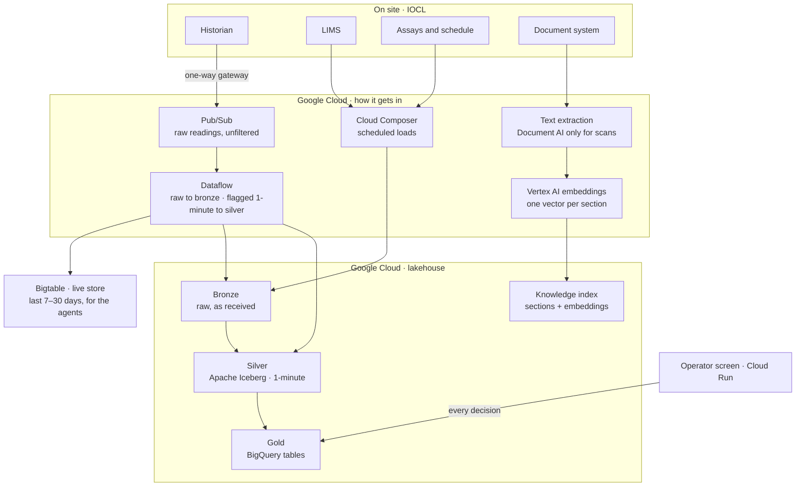
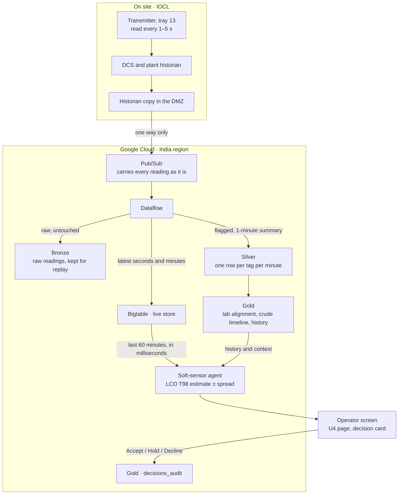
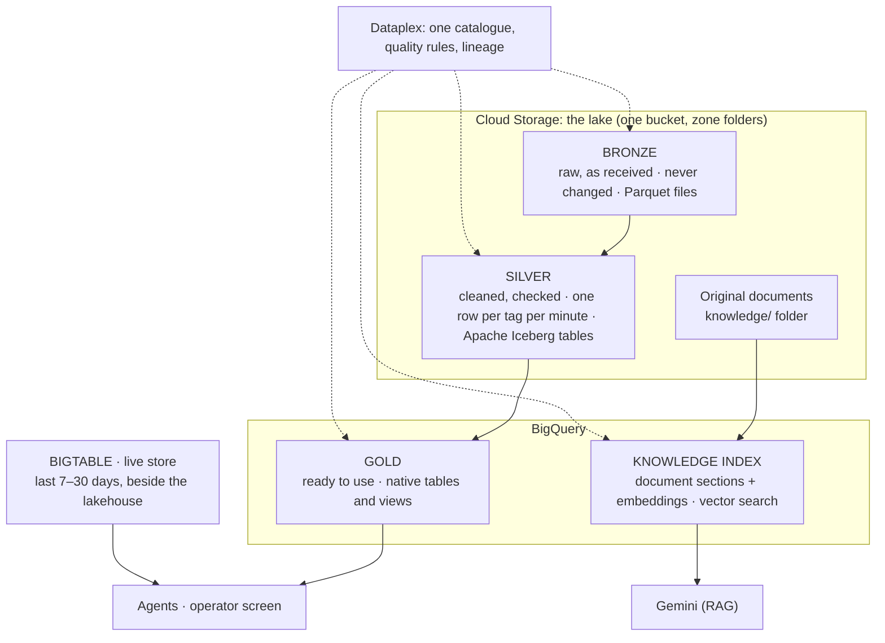
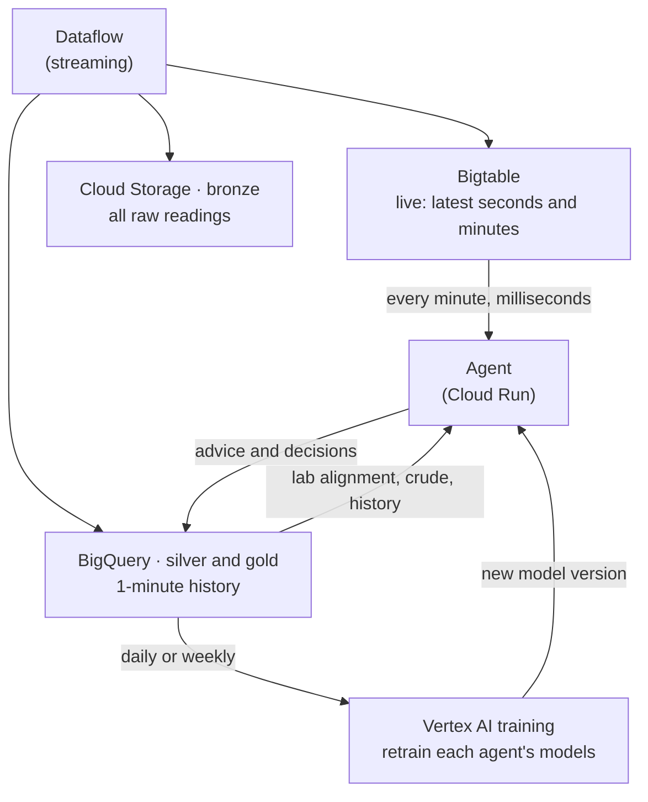
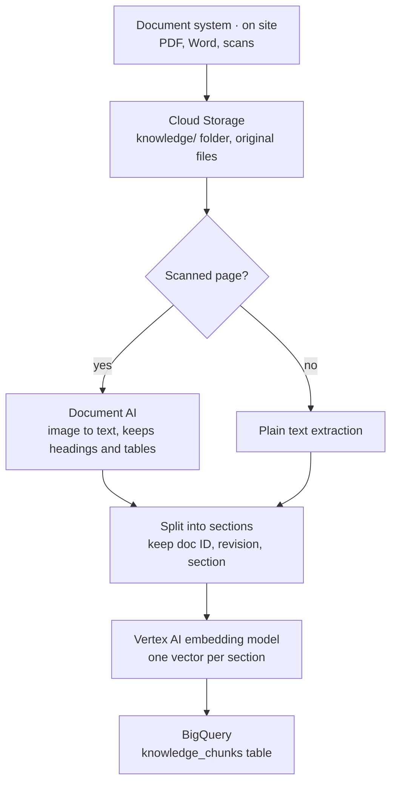

# 01 · The lakehouse: the refinery's data foundation

> **Read this first.** It is the first in a series that explains the architecture layer by layer, starting from the
> data. When you finish it you should be able to explain, without notes: what goes into the lakehouse and in what
> form, how each kind of data gets in, how the data is organised and who checks it, how Gemini finds the right
> document, what every Google Cloud service is for, what is open and what is Google-specific, and what is built today
> versus what we build at IOCL.

---

## The answer in six lines

1. **One place for all the refinery's data.** Process readings, lab results, crude assays and schedule, documents
   and operator decisions live in one governed store on Google Cloud: the **lakehouse**.
2. **Each kind of data comes in by the route that suits it.** Only historian readings stream: Pub/Sub carries the
   raw readings as they are, and Dataflow writes them to bronze untouched, to the live store for the agents, and as
   1-minute summaries to silver. Lab, assay and schedule data load on a schedule. Documents are turned into text, split into sections and indexed for
   search. Decisions are written straight in by the operator screen.
3. **Four zones, each with one job.**
   - **Bronze** keeps exactly what arrived (raw readings, about one a second) and is never changed.
   - **Silver** is cleaned and checked by automatic rules, one row per tag per minute.
   - **Gold** holds ready-to-use tables for the agents and the screen.
   - **Knowledge** holds every document section with its embedding, so Gemini can retrieve the right SOP section
     (RAG).
   Each agent can read only the units and tables it needs (§8.1).
4. **Open files at the bottom, BigQuery as the engine.** Bronze is Parquet files and silver is **Apache Iceberg**
   tables, both in Cloud Storage and readable by other engines. Gold is native BigQuery tables, rebuilt from silver
   whenever needed. The **data** is portable; the **engine** is Google-specific (§9).
5. **A live store beside the lakehouse: Bigtable for live use, BigQuery for history.** The agents read the last few
   weeks of readings from Bigtable every minute, in milliseconds. BigQuery keeps years of 1-minute history, where the
   models are trained (§4.5).
6. **Today it is built and loaded in batches from a physics simulator. On your plant, the same structure is filled
   from your systems.** Data flows one way out of the plant, and nothing is written back to the control system.

---

## 1. Why a lakehouse at all

### 1.1 The problem it solves
Today a refinery's data lives in many places that don't talk to each other:

| Data | Where it usually lives | Why it is hard to use today | What the lakehouse does about it |
|---|---|---|---|
| Process readings (temperatures, pressures, flows) | DCS and plant historian (e.g. AVEVA PI, Aspen IP.21) | Tag names differ by unit; sampling rates differ; hard to join with lab data | One row per tag per minute, with a tag dictionary that gives every tag its unit, meaning and engineering unit |
| Lab results | LIMS | Reported hours after the sample was drawn, so easy to match to the wrong process minute | Every result is lined up with the minute the sample was **drawn** |
| Crude assays and schedule | Assay library, planning spreadsheets | Not linked to what is actually in the unit at a given minute | A crude timeline: which crude was running at every minute, including changeovers |
| SOPs, incident reports, shift logs | Document system, PDFs, scans | Can only be found by someone who knows where to look; not linked to the data | Every document split into sections and indexed by meaning, so Gemini can retrieve the right section and cite it (§5) |
| Operator decisions | Logbooks, memory | Lost, so nobody can check later which advice worked | Every decision recorded with who, when, which unit and why, beside the data that led to it |

A specialist agent needs **all of these, lined up on the same clock, for the same unit**. Building that join
separately for every agent is the "ten tools" problem. The lakehouse builds it **once**, and every agent uses it.

### 1.2 Lake, warehouse, lakehouse in plain words
- **Data lake:** cheap file storage that holds anything (files, documents, raw exports). Flexible, but on its own
  it has no structure, no checks and no fast queries.
- **Data warehouse:** a database that owns its data in its own format. Fast and structured, but the data is locked
  inside it.
- **Lakehouse:** both at once. The data sits as **open files in the lake** (Cloud Storage), with an **open table
  format** on top (Apache Iceberg) so that BigQuery, and other engines such as Spark, can query it like tables. One
  **catalogue** (Dataplex) governs it all.

**Why it matters for IOCL:**
- The raw and cleaned data stay in open formats that IOCL can read with other tools (what is and isn't portable is
  in §9).
- The lakehouse holds documents as well as numbers, which Gemini needs.
- History is cheap to keep for years.

---

## 2. What goes in: five sources, and what each looks like

| # | Source | What it is | What the data looks like at the source (typical) | How often | How it gets in |
|---|---|---|---|---|---|
| 1 | **Historian (process tags)** | Every transmitter reading on the unit: tray temperatures, flows, pressures, valve outputs, analyser readings | **Numbers in a time series.** Each reading is `tag name, timestamp, value, quality code`. Read through OPC UA or the historian's own interface (e.g. PI Web API) | Instruments sample every 0.1–5 s; bronze keeps the raw readings, silver keeps **1-minute** summaries | **Streaming:** one-way gateway → Pub/Sub → Dataflow |
| 2 | **LIMS (lab results)** | Product-quality tests on samples drawn by operators, e.g. LCO T98 and heavy naphtha T98 (ASTM D86) | **Table records in the LIMS database.** Each result is `sample ID, sample point, draw time, report time, test method, property, value, unit, approval status`. Exported as CSV / JSON files or through the LIMS API | Every 8–12 h; results arrive 2–8 h after the draw | **Scheduled load** (e.g. every 15 minutes), approved results only |
| 3 | **Crude assays and schedule** | Which crude is going to the unit and when; its properties (API gravity, sulphur, CCR, metals) | **Assays:** tables of properties per crude and per cut, from the assay library (Excel / CSV), sometimes a supplier PDF. **Schedule:** rows of `tank, crude, start, end` from the planning system | Per cargo or tank change | **Scheduled load**, daily or on change |
| 4 | **Documents** | SOPs, operating limits (IOWs), lab methods, incident and MOC records, shift logs, work orders | **Unstructured text:** PDF (typed or scanned), Word, sometimes Excel. Shift logs may be text records in an e-logbook | When revised | **Scheduled sync** from the document system → text extracted (Document AI only for scans), split into sections, embedded (§5) |
| 5 | **Decisions** | Every Accept / Hold / Decline and every "Not yet", with who, when, which unit, which move and why | **Records created by the platform itself** (JSON): `who, when, unit, advice ID, action, reason` | Every decision | **Written straight in** by the operator screen. They are born in the cloud, so they need no ingest pipeline |

### Where each source goes

| Source | Bronze: as received | Silver: cleaned, checked | Gold / knowledge: ready to use | Used by |
|---|---|---|---|---|
| **Historian** | Raw readings exactly as streamed, about one per tag per second (fewer where the historian only records changes). The same readings and their 1-minute summaries also go to the **live store (Bigtable)** for the agents (§4.5) | `tag_minute` and `telemetry_minute`: 1-minute summaries with quality flags; set-point changes go to `events` | `unit_kpi_minute`; the process side of `lab_alignment`; model features | Every agent, the operator screen |
| **LIMS** | The export file as received | `lab_results`: one row per sample and property, at the minute it was **drawn** | `lab_alignment`: each lab result beside the process state at that minute | Soft-sensor agent (training and trust checks), retraining |
| **Crude assays and schedule** | The assay and schedule files as received | `crude_assay_registry`: which crude ran when, with changeover windows; crude switches go to `events` | `v_crude_switches` | Crude-switch agent; every other agent, to know the current crude |
| **Documents** | The original files in the `knowledge/` folder, listed in an object table | None: documents are not cleaned like numbers | `knowledge_chunks`: each section with its embedding | Gemini, through RAG (§5) |
| **Decisions** | None: they are created inside the platform | None | `decisions_audit`: append-only, never edited | Decision record page, Gemini, retraining |

**What does not go in:** control and safety-system configuration (trip points, interlock logic, controller tuning)
and network or asset inventories. These stay on site. The agents don't need them, and they are the most sensitive
data in the plant.

> **On this FCC:** the feed is heavy gas oil from upstream units, not crude directly. "Crude" here means the crude
> the refinery is running, which changes the gas oil the FCC receives.

---

## 3. How each kind of data gets in

### 3.1 Four routes, one lakehouse

Not everything goes through Pub/Sub and Dataflow. Streaming is only worth it for data that arrives every second.
Everything else loads on a schedule or is written directly.

| Route | For | Why this route |
|---|---|---|
| **Streaming** (Pub/Sub → Dataflow → Bigtable, bronze, silver) | Historian readings | Thousands of readings a second, needed by the agents within a minute. A stream absorbs bursts and never loses a reading |
| **Scheduled loads** (Cloud Composer) | LIMS, assays, schedule | A few records an hour or a day. A scheduled job that picks up the export is simpler, cheaper and easier to audit than a stream |
| **Document indexing** (text extraction → embeddings) | SOPs and other documents | Text has to be extracted and indexed by meaning, not cleaned like numbers |
| **Direct write** (the operator screen) | Decisions | Created inside the platform; there is nothing to ingest |

### 3.2 The journey of one reading (the streaming route)

Follow one number: the **temperature on tray 13 of the main fractionator**, which the soft sensor uses to estimate
the LCO cut point.

Step by step:

1. **At the instrument.** The thermocouple is read every 1–5 seconds. The DCS uses it for control, and the
   historian stores it.
2. **Leaving the plant, one way.** A copy of the historian in the plant's DMZ (the buffer zone between the control
   network and the business network) sends readings **outward only**. A one-way gateway means nothing can come
   back in. The plant never accepts a connection from the cloud. The only selection happens here: **only the agreed
   tag list leaves the plant.**
3. **Arriving in the cloud: Pub/Sub.** Pub/Sub is only a carrier. It passes on **every reading as it is**, with no
   filtering or averaging. It absorbs bursts and never loses a message.
4. **Dataflow does three things with each reading.**
   - **Writes it to the live store (Bigtable),** together with each tag's latest 1-minute summary, so the agents can
     read the most recent window in milliseconds (§4.5).
   - **Writes it to bronze untouched.** Bronze keeps the raw readings, about one per tag per second, so any period
     can be replayed or re-analysed later at full detail.
   - **Cleans and summarises it for silver.** It flags readings outside the instrument's valid range (e.g. a failed
     transmitter), flags frozen sensors (the same value for too long) and flags one-off spikes. Flagged readings are
     marked, not deleted. It then summarises each tag over each minute: mean, min, max, standard deviation, last
     value, number of good samples.
5. **Silver.** The 1-minute summaries land as **one row per tag per minute**, with the engineering unit, the unit it
   belongs to (furnace, riser…), and a quality flag (GOOD / SUSPECT / MISSING…). Automatic rules check it after
   every load (§4.2).
6. **Gold.** The data is combined into what the agents and the screen read: each unit's headline numbers per minute,
   lab results lined up with the process minute they belong to, and model-ready features.
7. **The agent.** Every minute, the soft-sensor agent reads the last hour of tray 13 and the other fractionator
   tags from **Bigtable**, and the lab alignment and current crude from **BigQuery**. Its models estimate LCO T98
   with its spread. It can read only fractionator data (§8.1).
8. **The screen and the decision.** The operator sees the estimate and the proposed move on the U4 page. Their
   Accept / Hold / Decline is **written into the lakehouse** (`decisions_audit`). When the next lab result arrives,
   the platform can check whether the move worked and retrain the model.

**Today in the demo,** steps 1–4 are replaced by the physics simulator. It writes 1-minute values to files that are
loaded in batches, so **bronze in the demo holds 1-minute values, not raw seconds**, and there is no Bigtable: the
app reads BigQuery once and caches the data. Steps 5–8 are real (§11).

---

## 4. The four zones

### 4.1 Bronze: keep exactly what arrived
- **Rule:** write once, never change. If something goes wrong downstream, you can always rebuild from bronze.
- **Holds:** the **raw historian readings** exactly as streamed (about one per tag per second), LIMS exports, the
  crude schedule and assays, and the tag list. Each is kept as Parquet files, plus the original file where there is
  one.
- **How long:** raw readings are kept for an agreed period (for example one year) for replay and re-analysis, then
  moved automatically to cheaper archive storage. Silver keeps the 1-minute history for years.
- **Who reads it:** only the pipelines and the platform team. Agents never read bronze (§8.1).
- **Organised by where the data came from**, in ISA-95 terms:
  `source / site / area / batch / run`. For example, `historian/source=simulator/site=demo-refinery/area=fcc-complex/…`.
  On your plant this becomes `site=panipat/area=fcc/unit=…` (illustrative), so ten refineries fit in the same
  layout.
- **A manifest** records what was loaded and a fingerprint (sha256) of every file, so you can prove a reload is
  identical.

### 4.2 Silver: cleaned, checked, one shape
- **Rule:** silver has a **data contract**: fixed columns, fixed meanings, automatic checks. Agents can rely on it.
- **In one line: silver's data sits as files in IOCL's Cloud Storage bucket, in the open Apache Iceberg format, and
  BigQuery queries those files as normal tables.** Two pieces make that work:
  - **Apache Iceberg is the format.** Next to the Parquet data files it keeps small metadata files that say which
    files make up the table, its columns and its history. Any Iceberg-capable engine (Spark, Trino, Flink) can read
    them.
  - **BigLake is the link.** It is the part of BigQuery that connects BigQuery to the bucket, keeps the Iceberg
    metadata up to date when data is written, and applies BigQuery's security (including row- and column-level rules).
  So Iceberg does not connect BigQuery to the bucket on its own; BigLake does, and Iceberg is the format it reads.
- **Is Iceberg needed?** Not strictly. Native BigQuery tables would work and are a little simpler and faster. Iceberg
  is what makes "your data is portable" true: another engine can read silver directly, with no export (§9). We
  recommend it for silver because silver is the long-term record. If IOCL does not need portability, silver can be
  native BigQuery instead.
- The main tables:

| Table | One row is… | Why it exists |
|---|---|---|
| `tag_minute` | one tag, one minute: value, engineering unit, owning unit, quality flag, sample count | The **analysis path**. Narrow and long, easy to filter by unit or tag, easy to check |
| `telemetry_minute` | one minute, all tags together | The **model path**. Models read whole minutes at once, so this is faster for them |
| `lab_results` | one lab sample, one property | Lab truth, with the minute it was **drawn** |
| `crude_assay_registry` | one crude segment: which crude, from when to when, changeover window | Lets every agent know which crude was running at any minute |
| `events` | one event (set-point step, crude switch) | Marks transient periods so models don't learn from them |
| `tag_registry` | one tag: its unit, label, engineering unit, whether it is a set point | The **dictionary**: turns a tag code into something a person understands |
| `run_registry` | one run or period loaded: rows, completeness, fingerprint | Answers "what is in the lake, and is it complete?" |

#### Who checks silver, and how
"Checked" means three things happen, in this order. Machines do the checking; named people own the rules and act on
failures.

| # | Check | Done by | What it catches |
|---|---|---|---|
| 1 | **Clean-up on the way to silver** (historian only) | Dataflow, automatically, while it builds the 1-minute summaries (bronze keeps the raw readings untouched) | Out-of-range readings, frozen sensors, one-off spikes. Each is flagged (SUSPECT), not deleted |
| 2 | **Shape enforced while building silver** | The SQL that builds silver, run by Cloud Composer | Every value gets its type, engineering unit and owning unit from the tag dictionary, and a quality flag (GOOD / MISSING / …). Unknown tags are flagged |
| 3 | **Rule check after every load** | A Dataplex data-quality scan, triggered by Cloud Composer when the load finishes | Keys never empty; exactly one row per tag per minute; quality flags and unit names from the allowed list; every GOOD value is a real number; time inside the expected window; **the plant's mass balance closes within 5 %** (a physics check on the data) |

**What happens when a rule fails:** the scan result is stored in BigQuery and shown in Dataplex. Composer stops the
gold tables from refreshing with that load, and an alert goes to the data owner. Agents keep using the last good
data and the screen shows how old it is.

**The people:**
- **Data owner for each unit** (an IOCL process engineer): owns that unit's tag dictionary and valid ranges, and
  decides what to do when a check fails.
- **Platform team** (Google and partner, then IOCL): owns the rules code and the pipelines.
- **At build time,** IOCL engineers review a sample of silver once (right tags, right units, right lab alignment)
  before any agent uses it (§12, step 4).

> **Today in the demo:** check 2 runs in the loader, but only flags GOOD, MISSING and TRUTH_ONLY. Check 3 is
> defined (`dq_tag_minute.yaml`, 9 rules) and run on demand on a 10 % sample; nothing stops gold automatically.
> Check 1 (Dataflow) is not built, because the simulator produces clean minute values.

### 4.3 Gold: ready to use
- **Rule:** shaped for one consumer each. They are rebuilt from silver, so they can always be regenerated.
- **Stored as native BigQuery tables** for speed (partitioned by day, clustered by unit).
- The main tables:

| Table | Used by | What it gives |
|---|---|---|
| `unit_kpi_minute` | Operator screen, anomaly detection | Each unit's headline number per minute, with its plan value and the difference |
| `lab_alignment` | Soft sensor, trust checks | Every lab result beside the process state **at the minute it was drawn** |
| `v_crude_switches`, `v_mass_balance`, `v_run_coverage` | Crude-switch check, quality checks, screen footer | Crude switches; does the plant's mass balance close; how much data is loaded |
| `decisions_audit`, `agent_events` | Decision record, retraining | Every decision and every agent step |
| `model_registry` | Model governance | Each model, its version, and exactly which data it was trained on |

### 4.4 Knowledge index
The original documents sit in the lake's `knowledge/` folder. Their sections and embeddings sit in one BigQuery
table, `knowledge_chunks`. How it is built and used is in §5.

### 4.5 Live store vs history: Bigtable and BigQuery

**The agents read live data from Bigtable and learn from history in BigQuery.** The two stores do different jobs,
and using one for both would be either slow or wasteful.

| Store | What it holds | How long | Who uses it | Why this store |
|---|---|---|---|---|
| **Bigtable** (live store) | The latest raw readings and the latest 1-minute summary of every tag | Recent only, e.g. 7–30 days; older rows are deleted automatically | **Agents at run time**, every minute; the screen's live numbers | Returns "the last 60 minutes of these tags" in milliseconds, however often it is asked |
| **Cloud Storage** (bronze) | All raw readings as Parquet files | About a year, then archive | Nobody day to day; replay and re-analysis | The cheapest place to keep everything |
| **BigQuery** (silver, gold, knowledge) | Years of 1-minute history, lab alignment, crude timeline, decisions, documents | Years | **Model training**, analysis, the decision record, Gemini's document search | Scans months of history in seconds, with no servers to run |

**How it works, step by step:**
1. **Live.** Dataflow writes every reading and every 1-minute summary into Bigtable as it arrives.
2. **Every minute.** Each agent reads its latest window from Bigtable, and the slower-changing context it needs from
   BigQuery (lab alignment, the current crude). Its models run on Cloud Run or Vertex AI, and it writes its advice.
3. **Training, daily or weekly.** Vertex AI reads months of 1-minute history from BigQuery, retrains the agent's
   models and registers a new version. The agent picks it up after review.
4. **Learning.** Decisions and the next lab results land in BigQuery, so the next training round can see which
   advice worked.

**Does the AI run on Bigtable?** No. Bigtable stores data; it doesn't run models. The models run on Cloud Run or
Vertex AI and **read their inputs** from Bigtable.

**Each agent sees only its units in Bigtable too.** Rows are keyed by unit, tag and time (for example
`U4#tray13_temp#time`), so "last hour of U4" is one fast read. Access is limited per agent in one of two ways, to be
chosen at build:
- one Bigtable table per unit, with each agent's identity allowed only its units' tables (simplest); or
- one table with a Bigtable **authorized view** per agent, which exposes only that agent's units and columns.

**Cost, in plain terms:**
- **Bigtable** is paid for as fixed capacity plus storage. Reading it every minute adds nothing per read, which suits
  agents that ask the same small question all day.
- **BigQuery** on-demand is paid for by the amount of data each query reads. Training and analysis read a lot, but
  rarely. Agents would read a little, but constantly, and every query would take a second or more. Bigtable avoids
  both problems. (BigQuery can also be bought as fixed capacity if IOCL prefers a flat bill.)
- **Raw seconds are never stored in BigQuery.** They sit as files in Cloud Storage, which costs least.

> **Today in the demo:** there is **no Bigtable**. The app reads the run data from BigQuery once and caches it in
> memory, which is enough for simulated runs. Bigtable is part of the build at IOCL.

---

## 5. Knowledge retrieval for Gemini (RAG)

**RAG (retrieval-augmented generation)** means Gemini does not answer from memory. It first **retrieves** the
relevant sections of IOCL's own documents, then answers **from those sections** and cites them. This is how Gemini
can say "SOP-FRAC-003 §4.2 says…", and why it doesn't invent a procedure.

### 5.1 Building the index (when a document is added or revised)

1. **Land the file.** The document is copied into the `knowledge/` folder. A BigQuery **object table** lists every
   file as a governed row, so documents are catalogued like any other data.
2. **Turn it into text.** Typed PDFs and Word files already contain text, which is extracted directly. **Only
   scanned pages and forms** go through **Document AI**, which turns the image into text and keeps the layout
   (headings, tables).
3. **Split it into sections.** Each section keeps its document ID, revision and section number, so an answer can
   cite exactly where it came from.
4. **Embed it.** Each section is sent to a **Vertex AI embedding model** (`text-embedding-005`), called from inside
   BigQuery. The model returns a list of numbers that captures the section's meaning. Sections about the same
   thing get similar numbers, even if they use different words.
5. **Store it.** Sections, their text and their embeddings go into `knowledge_chunks`.

**Why both Document AI and embeddings?** They do different jobs, one after the other. An embedding model can only
read **text**. A scanned SOP is a **picture** of text, so without Document AI it would be invisible to search.
Document AI turns the picture into text; the embedding model then turns that text into a vector. If all of IOCL's
documents are digital, Document AI is not needed. (Gemini can also read PDFs and images directly, which is an
alternative for small volumes.)

### 5.2 Answering a question

1. The operator asks: "What does the SOP say about moving the LCO cut point during a crude switch?"
2. The question is embedded with the **same** model.
3. BigQuery `VECTOR_SEARCH` finds the sections whose embeddings are closest in meaning (cosine distance, top few).
4. Gemini receives those sections, together with the agents' current answers, and replies in plain words with the
   citation, e.g. `[SOP-FRAC-003 r2 §4.2]`.
5. If nothing is close enough, Gemini says it found nothing rather than guessing.

### 5.3 Should vector search sit in the lakehouse? Yes, at this scale
- The documents sit **beside the process data, under the same catalogue, perimeter, keys and audit log.** There is
  no second store to secure.
- One query can combine a document search with data filters (this unit, this crude, this revision).
- A refinery's documents are thousands of files, which is hundreds of thousands of sections at most. BigQuery handles
  that comfortably; a vector index is added once the table grows.
- **When to move to a separate product:** if the sections reach many millions, or if search must respect access
  rights per document. Then Vertex AI Vector Search, Vertex AI Search or Vertex AI RAG Engine are the options.

> **Today in the demo:** this is real. 46 **simulated** SOPs, limits, incident, MOC, lab, shift and work-order
> records are embedded in BigQuery, and Gemini searches them live through `VECTOR_SEARCH`. They are Markdown files,
> so Document AI isn't needed yet. If BigQuery can't be reached, the app falls back to keyword search and says so.

---

## 6. The Google Cloud services, and what each one is for

| Service | Its one job in the lakehouse | Today (demo) | On your plant |
|---|---|---|---|
| **Cloud Storage** | Holds the files: raw bronze, Iceberg silver, original documents | Used | Used; one bucket per site, IOCL-held keys |
| **BigQuery** | The query engine; holds the gold tables; runs vector search over documents | Used | Used |
| **BigLake** (part of BigQuery) | Lets BigQuery manage Iceberg tables whose files stay in Cloud Storage | Used for silver | Used for silver |
| **Apache Iceberg** (open source, not a Google product) | The open table format for silver, so other engines can read the same data | Used for silver | Used for silver |
| **Pub/Sub** | Carries historian readings out of the plant as they are; filters and averages nothing | Not needed (simulated) | Used |
| **Dataflow** | Writes each raw reading to bronze and Bigtable; flags bad readings and writes 1-minute summaries to silver and Bigtable. Runs Apache Beam code | Not built | Used |
| **Cloud Composer** (managed Apache Airflow) | Runs the scheduled jobs: lab, assay and document loads, the silver and gold builds, the quality scans, in the right order | Not used; the loader is run by hand (`make lakehouse-load`) | Used |
| **Document AI** | Only for scanned pages and forms: turns the image into text that the embedding model can read | Not needed (Markdown documents) | Only if IOCL has scanned documents |
| **Vertex AI embeddings** | Turns each document section, and each question, into a vector so the right section can be found | Used (`text-embedding-005`) | Used |
| **Dataplex** | One catalogue of every table, lineage, the quality rules run on every load, and the column-level policy tags | Lake and one quality scan, run on demand | Used |
| **Bigtable** | Live store: the last 7–30 days of readings and 1-minute summaries, read by the agents every minute in milliseconds (§4.5) | None; the app caches BigQuery data in memory | Used |

Security services (Cloud IAM, Identity-Aware Proxy, Cloud KMS, VPC Service Controls, Cloud Audit Logs) are in §8.
Cloud Run, Vertex AI model serving and Gemini belong to the layers above and are covered in later documents.

---

## 7. Design choices, and why

| Choice | Why | Trade-off and how it is handled |
|---|---|---|
| **A route per kind of data**, not one pipeline for everything | Streaming costs money and effort; only the historian needs it. Lab and assay data arrive a few times a day | Two kinds of pipeline to run. Composer runs the scheduled ones; Dataflow runs the stream |
| **Bronze keeps raw readings; silver keeps 1-minute summaries** | Bronze stays a true copy of what arrived, so any period can be replayed at full detail or re-summarised differently later | Raw storage is about 60× larger than 1-minute. Handled with a retention period and automatic archiving (§4.1) |
| **1-minute grain** for analysis in silver | The fractionator responds over minutes (tray hold-up 3–8 min; settling after a move 15–30 min). Second-by-second data adds noise, not insight. One minute also matches lab and control cycles, and cuts the data the agents read 60× | Very fast events (compressor surge, vibration) are smoothed out in silver. If monitors for them are in scope, they read the raw seconds from Bigtable; the raw history is still in bronze |
| **Keep min, max, std and last, not just the mean** | Shows whether the minute was calm or unsettled | Slightly more storage |
| **Lab results lined up to the minute the sample was drawn** | The lab reports hours later. Lining up with the report time would teach the model the wrong thing | Needs the draw time from LIMS (a standard field) |
| **Drop transient periods from training** | Samples taken during a set-point step teach cause and effect backwards | Fewer training points; the `events` table marks the periods |
| **Quality flag on every value** | Agents must know when a reading is missing or bad, not guess | None |
| **A tag dictionary (`tag_registry`)** | Tag codes differ by unit and refinery. The dictionary maps them to the unit, meaning and engineering unit | Needs one-time work with IOCL instrument engineers |
| **Bronze and silver in open formats (Parquet, Iceberg); gold native in BigQuery** | The data that matters long-term stays portable; gold gets BigQuery's full speed and features | Gold is Google-specific, but it can be rebuilt from silver or exported at any time (§9) |
| **Agents read live data from Bigtable, and are trained from BigQuery** | Each store does what it is best at: Bigtable answers small, frequent reads in milliseconds; BigQuery scans years of history for training | One more store to run and secure. Bigtable keeps only recent data, so it stays small |
| **Documents searched inside BigQuery** | One store, one security model, one catalogue for data and documents | A dedicated search product may be needed later for very large document sets (§5.3) |
| **Rebuildable loads** | Each load replaces exactly the periods it covers (delete then insert), so re-running is safe. Manifests prove it | None |
| **Decisions written into the lakehouse** | Without this nobody can check which advice worked, and the models can't learn from it | Needs the operator screen to write every decision, which it does |

---

## 8. Governance and security: how you know the data can be trusted

**One catalogue (Dataplex).** The lake is registered as `raw` and `curated` zones covering the bucket and the
bronze, silver and gold datasets. Every table is searchable and described.

**Quality checks:** who runs them and what happens on failure are in §4.2.

**Lineage.** Every gold table can be traced back to the silver and bronze data and the file that produced it. The
model registry records which data each model was trained on.

**Access and security** (as on the Architecture page):
- **Each agent has its own identity** (Cloud IAM) and reads only the data it needs (§8.1). Gemini can read agent
  answers and documents but cannot change data.
- **People get access by role** through Identity-Aware Proxy.
- **One perimeter** (VPC Service Controls) around the lakehouse: data cannot be copied out.
- **Keys held by IOCL** (customer-managed encryption keys in Cloud KMS).
- **Every access is logged** (Cloud Audit Logs).
- **MeitY-compliant boundary:** your data stays in India, under keys you hold. Control and safety systems stay on
  site, and nothing is written to them.

### 8.1 Who can read what

**Yes: each agent sees a different, limited set of data, never everything.** Each agent runs as its own service
with its own identity, and the lakehouse decides what that identity may read and write. Agents read the live store,
silver and gold only; no agent reads bronze, and no agent has any path to the DCS.

| Identity | Reads | Units it can see | Writes |
|---|---|---|---|
| **Soft-sensor agent** | Live: fractionator tags in Bigtable. History and context: `tag_minute`, `telemetry_minute`, `lab_alignment`, current crude in BigQuery | U4 fractionator | Its estimates, trust results, sample requests |
| **Crude-switch agent** | Furnace and riser tags, `crude_assay_registry`, `v_crude_switches` | U1 furnace, U2 riser | Which crude is in the unit; switch complete or not |
| **Furnace agent** | Furnace tags, current crude | U1 | Its advice |
| **Regenerator agent** | Regenerator tags, current crude | U3 | Its advice |
| **Light-ends agent** | Condenser, gas plant and stabiliser tags | U5, U6 | Its advice |
| **Systems agent** | Unit headline numbers (`unit_kpi_minute`) and the flows between units, through a summary view, not every tag | All units, summaries only | Watch flags and downstream effects |
| **Gemini** | The agents' answers, `knowledge_chunks`, the decision record. No raw tag tables | Through the agents only | Nothing to the data. Its answers are logged |
| **Operator screen** | Gold tables and agent outputs, filtered by the signed-in person's role | By role: a board operator sees their own unit | `decisions_audit` only |
| **Pipelines** (Dataflow, Composer) | Bronze and silver | All | Bronze, silver and gold tables; never the decision record |

**How it is enforced, in four layers** (the same rules apply in Bigtable: one table per unit or an authorized view per agent, §4.5)**:**
1. **One identity per agent.** Each agent is its own Cloud Run service with its own service account. A password or
   key is never shared between agents.
2. **Dataset permissions.** Agent identities have no access to bronze at all. They can read silver and gold, and
   write only to their own output table.
3. **Row-level security by unit.** BigQuery row access policies on `unit_id` mean the soft-sensor agent's query on
   `tag_minute` returns only U4 rows, even if it asks for everything. This works on the Iceberg (BigLake) silver
   tables as well as native gold tables.
4. **Column-level security.** Sensitive columns, for example crude supplier or cargo names, carry Dataplex policy
   tags. Only identities granted that tag can read them; everyone else gets an error or a masked value.

Cross-unit agents (crude-switch, systems) get exactly the extra units they need, written in the table above, and
nothing more. Every read is in Cloud Audit Logs, so IOCL can check this at any time.

> **Today in the demo:** this separation is **not enforced yet**. The agents run as modules inside one service with
> one identity. The design above is what we build at IOCL, and it is the main change when each agent becomes its
> own service.

---

## 9. Lock-in: what is open, and what is Google-specific

**The honest answer: the data is portable; the engine is not.** IOCL can take its raw data, cleaned data and
documents to another platform at any time. But BigQuery is a unique, serverless engine with no drop-in equivalent.
Moving off it means choosing another engine and rewriting the queries and features that use it. "No lock-in" would
be wrong; "low data lock-in, real engine lock-in" is right.

| Part | What is open | What is Google-specific | Effort to move away |
|---|---|---|---|
| Bronze (raw files) | Parquet files in Cloud Storage | Only the storage location | **Low:** copy the files |
| Silver (cleaned data) | Apache Iceberg tables; Spark, Trino and Flink read them | The BigLake catalogue that tracks the tables | **Low–medium:** point another Iceberg catalogue at the same files |
| Gold (ready-to-use tables) | Can be exported to Parquet at any time; rebuilt from silver | Native BigQuery storage; SQL written in BigQuery's dialect | **Medium:** translate the SQL to the new engine |
| Knowledge index | Original documents are plain files; embeddings are plain numbers | `VECTOR_SEARCH` and `ML.GENERATE_EMBEDDING` are BigQuery features; the vectors only make sense with the Google embedding model | **Medium:** re-embed with another model and load into another vector store |
| Streaming | Dataflow runs **Apache Beam** code, which also runs on Flink or Spark | The Pub/Sub interface | **Low–medium:** swap Pub/Sub for Kafka (Google also offers managed Kafka) |
| Live store | Bigtable speaks the **Apache HBase** interface, an open-source standard | The managed service | **Low–medium:** move to HBase or another wide-column store; it only holds recent data |
| Scheduling | Cloud Composer runs **Apache Airflow**; the job definitions are portable | The managed service | **Low** |
| Catalogue and quality rules | Rules are short YAML / SQL files | Dataplex scans, catalogue and lineage | **Medium:** re-create in another catalogue |
| Security | The design (one identity per agent, perimeter, customer keys) | Cloud IAM, VPC Service Controls, KMS and IAP configuration | **Medium–high:** re-implement on the new platform |

**Why we still recommend BigQuery as the engine:** there is no cluster to size or run, it scales from one unit to
all refineries without redesign, and it does vector search and calls AI models inside the same governed store.
Those are the reasons the lock-in is worth accepting.

**How IOCL keeps the lock-in small (choices to agree at the start):**
1. **Silver in Iceberg is the system of record** (already the design). Everything above it can be rebuilt.
2. **Keep every transformation as SQL in IOCL's own code repository,** so it can be read and translated.
3. **Keep the original documents and the indexing scripts,** so the knowledge index can be rebuilt with another
   model.
4. **Optional: put gold in Iceberg too.** This makes gold portable as well, at some cost: in BigQuery today,
   Iceberg tables can be clustered but not partitioned, and some features need native tables.
5. **Regular export** of gold to Parquet, if IOCL wants a ready copy outside BigQuery.

---

## 10. How the agents use the lakehouse

Each agent sits **on top of its models**: the models read the data and produce numbers (an estimate, a spread, a
response); the agent checks those numbers against limits, history and prior decisions, and turns them into one
piece of advice for a person. How that works is the subject of `02_agents.md`. This table only shows what each one
reads and writes. "Reads" means the live store (Bigtable) for the latest readings, and BigQuery for history and
context.

| Agent / component | Reads | Writes back |
|---|---|---|
| Soft-sensor agent | Draw-tray temperatures, flows, pumparounds (silver/gold); `lab_alignment`; current crude | Estimate ± spread, trust result, sample request |
| Crude-switch agent | Furnace and riser response pattern; `crude_assay_registry`; `v_crude_switches` | Which crude is in the unit; switch complete or not |
| Anomaly detection (every unit) | `unit_kpi_minute`: measured vs expected for this crude | Drift flags with time and size |
| Consequence check | Flows and temperatures between units | Downstream effect of a move |
| Optimiser | Response gains per crude, limits | Proposed move |
| Gemini | Agent answers; `knowledge_chunks` (SOP sections, via RAG); decision record | Nothing to the data. Its answers are logged |
| Operator screen | Gold tables and agent outputs | **Every Accept / Hold / Decline and "Not yet"** |

---

## 11. Built today vs on your plant

| Part | **Built today (demo)** | **On your plant** |
|---|---|---|
| Source of readings | Physics simulator of the FCC complex (six units). Runs of 1,600 minutes each, 112 columns per minute (≈ 107 tags, set points and checks), written as CSV | Your historian, through a historian copy in the DMZ |
| Getting data out of the plant | Not needed (simulated) | Edge connector (e.g. Google Manufacturing Connect / Litmus, or the historian vendor's replication) behind a **one-way gateway** |
| Historian route | Batch: CSV → Parquet → Cloud Storage, loaded by hand. **Bronze holds 1-minute values**, because that is what the simulator writes | **Streaming:** Pub/Sub carries raw readings unfiltered → Dataflow writes raw to bronze and flagged 1-minute summaries to silver |
| Lab results | Simulated CSV: 3 draws per run (minutes 360, 840, 1,320), LCO T98 and heavy naphtha T98 | LIMS export or API, with draw time and report time; scheduled load by Composer |
| Crude | Simulated CSV: 4 crude regimes (heavy → light) with 60-minute changeovers | Your assay library and schedule; scheduled load by Composer |
| Documents | 46 **simulated** Markdown documents; embedded in BigQuery; Gemini searches them live (RAG) | Your documents; Document AI only for scanned ones; same index |
| Decisions | Recorded by the app (SQLite), exported as JSON lines into gold | Written straight into the lakehouse as they happen |
| Access per agent | **Not enforced:** all agents run in one service with one identity | One identity per agent; row- and column-level security by unit (§8.1) |
| Lake | One Cloud Storage bucket with bronze / silver / gold / knowledge folders | Same layout; one bucket per site; customer-managed keys |
| Tables | BigQuery: bronze (external tables over Parquet), **silver as BigLake Iceberg**, gold as native tables and views | Same |
| Scheduling | The loader script, run by hand | Cloud Composer |
| Catalogue and checks | Dataplex lake, two zones, one quality scan on silver, run on demand | Same, run after every load and gating gold, plus lineage and column-level access tags |
| Models | Stored as files with a registry table | Vertex AI Model Registry |
| Region | `us-central1` (demo project `fcc-soft-sensor`) | **India regions** (Mumbai `asia-south1` / Delhi `asia-south2`) |
| Live store for the agents | None: the app reads BigQuery once and caches the data in memory | **Bigtable:** last 7–30 days of readings and 1-minute summaries, one table (or view) per unit |

**What the demo app reads today:**
- **Run data:** from BigQuery (`fcc_silver.run_registry`, `fcc_silver.telemetry_minute`), cached locally for speed.
- **Documents:** from BigQuery vector search over `fcc_gold.knowledge_chunks`.

If BigQuery cannot be reached, the app falls back to local files and keyword search, and says so on screen.

> **Correction to older notes:** `data_and_analytics_flow.md` (2 Oct) shows a set-point download path to the DCS
> and "Gemini 1.5 Pro". Both are out of date. The platform is **advisory only**, with nothing written to the
> control system, and the demo uses **Gemini 2.5 Flash**.

---

## 12. How we would build it at IOCL

Six steps, done with your instrument, IT/OT security, lab and document-control teams:

1. **Agree the scope and the tag list.**
   - Which unit first (the FCC), which tags (typically a few hundred for one FCC).
   - Which lab properties, which documents.
   - Build the **tag dictionary** with your instrument engineers, and name a **data owner** for the unit.
2. **Open the routes.**
   - Historian: install or reuse a historian copy in the DMZ, a one-way gateway and the edge connector. Your OT
     security team approves the design. Nothing can connect into the plant.
   - LIMS, assays, schedule and documents: agree the export or API for each, and how often.
3. **Land bronze and backfill history.**
   - Load one to two years of historian, LIMS and assay history (indicative). The models need several crude switches
     and seasons.
   - Index the documents.
   - Then switch the historian to live streaming.
4. **Build silver and check it with you.**
   - Apply the contract and the quality rules.
   - Your engineers review a sample: right tags, right units, right lab alignment.
5. **Build gold and connect the first agents.**
   - The soft-sensor and crude-switch agents run **offline against your history first**. You can see how they
     would have done before anything is shown live.
6. **Go live and keep learning.**
   - Live 1-minute data, decisions written in as they happen, models refreshed as new lab results arrive.
   - The next unit reuses the same lakehouse: new tags, new dictionary entries, same zones.

**What we need from you:** historian access (tag list and history), LIMS export (with draw times), crude assays and
schedule, SOPs and operating limits, and a decision log once agents are live.

---

## 13. How big it gets

| | Demo today | One FCC on your plant | Whole refinery (illustrative) |
|---|---|---|---|
| Tags | ≈ 107 | a few hundred (say 300) | ~10,000 |
| Raw readings per day in bronze (about 1 per second) | n/a (bronze holds 1-minute values) | ~25 million | ~0.9 billion |
| Rows per day in silver (1-minute) | n/a (simulated runs) | ~0.5 million | ~14 million |
| Silver rows per year | — | ~0.2 billion | ~5 billion (≈ 100 GB compressed) |
| Readings held in Bigtable (30 days of raw) | — | ~0.75 billion | ~26 billion |
| Silver rows loaded today | ≈ 9 million (54 runs × 1,600 minutes × 107 tags) | — | — |

Raw bronze is the largest part: for a whole refinery, a few terabytes a year compressed, before archiving. It is
usually much less, because historians store a reading only when the value changes. BigQuery handles these sizes
routinely. Tables are organised by day and by unit, so a query for one unit and one day reads megabytes, not the
whole year.

---

## 14. Words used in this document

| Word | Meaning |
|---|---|
| **Historian** | The plant system that stores every instrument reading over time (e.g. AVEVA PI) |
| **DCS** | Distributed control system: runs the plant's control loops |
| **DMZ** | The buffer network between the plant control network and the business network |
| **One-way gateway** | Hardware that lets data flow out of the plant and physically cannot let anything in |
| **OPC UA** | The standard industrial protocol for reading values from plant systems |
| **Tag** | One measured or set value, e.g. tray 13 temperature |
| **LIMS** | Laboratory information management system: lab results |
| **Assay** | Lab analysis of a crude: API gravity, sulphur, metals and so on |
| **Bronze / silver / gold** | Raw-as-received / cleaned and checked / ready-to-use zones (the "medallion" pattern) |
| **Parquet** | Open file format for tables, readable by most data tools |
| **Apache Iceberg** | Open-source table format: small metadata files that turn a folder of Parquet files in the bucket into a table many engines can query and update |
| **BigLake** | The part of BigQuery that connects it to the bucket, so BigQuery can query and update Iceberg tables whose files stay in Cloud Storage |
| **Pub/Sub, Dataflow** | Google's message bus (carries messages, changes nothing) and streaming-processing service (Dataflow runs Apache Beam) |
| **Cloud Composer** | Google's managed Apache Airflow: runs scheduled jobs in order |
| **Bigtable** | Google's fast store for time-series data: returns recent readings in milliseconds; here, the agents' live store |
| **Live store vs history** | Live store: recent data the agents read every minute (Bigtable). History: years of data used for training and analysis (BigQuery) |
| **Document AI** | Google's service that turns scanned pages and forms into text; needed only for scans |
| **Dataplex** | Google's catalogue, lineage and data-quality service |
| **Embedding / vector search** | A list of numbers that captures a text's meaning / finding the texts closest in meaning |
| **RAG** | Retrieval-augmented generation: find the relevant document sections first, then answer from them and cite them |
| **Row-level / column-level security** | Rules in BigQuery that hide rows (e.g. other units) or columns (e.g. supplier names) from an identity that is not allowed to see them |
| **Service account** | The identity a program (here, each agent) uses, instead of a person's login |
| **ISA-95** | Industry standard for describing a plant as site → area → unit |
| **Data contract** | A written promise about a table's columns, meanings and checks |
| **Data owner** | The named IOCL person who owns a unit's tag dictionary and decides on quality failures |

---

## 15. Check your understanding

You should now be able to answer these. If any feels shaky, re-read the section in brackets.

1. Which data streams through Pub/Sub and Dataflow, and why doesn't the rest? (§3.1)
2. Where does a LIMS result go, zone by zone, and who uses it? (§2)
3. Does bronze hold raw seconds or 1-minute values? What does Pub/Sub filter? (§3.2, §4.1)
4. Where does an agent read its live data, where are its models trained, and why are they different stores? (§4.5)
5. Who checks silver, what three checks run, and what happens when one fails? (§4.2)
6. Why are lab results lined up to the draw time, not the report time? (§7)
7. How does Gemini find and cite the right SOP section? Why are Document AI and embeddings both there? (§5)
8. What can the soft-sensor agent read, and what stops it reading the regenerator's data? (§8.1)
9. What is Apache Iceberg, which zone uses it, and is it needed? (§4.2, §9)
10. What would IOCL keep, and what would it rebuild, if it left BigQuery? (§9)
11. What is real in today's demo, and what is replaced by the simulator? (§3.2, §11)
12. What stays on site and never enters the lakehouse? (§2)

---

## 16. Where to look in the repo

| What | Where |
|---|---|
| Loader that builds bronze, silver, gold, knowledge, models | `sim_octave/lakehouse/load_lakehouse.py` (`make lakehouse-load / lakehouse-status`) |
| Silver quality rules | `sim_octave/lakehouse/dq_tag_minute.yaml` |
| How the app reads the lakehouse | `cockpit/api/app/data/bq_source.py`; `cockpit/api/config.yaml` (`data.source`) |
| How the app searches documents | `cockpit/api/app/knowledge/bq_search.py` (`VECTOR_SEARCH`, keyword fallback) |
| Full as-built record (tables, contracts, lineage) | `data_and_analytics_flow.md` §7–§12 (note the correction in §11 above) |

*As of 6 Oct 2026. Table names and counts come from the repo's as-built record (2–3 Oct) and the loader code. A live
check of the GCP project was not possible today because the gcloud login had expired.*

**Next in this series:** `02_agents.md`: how a specialist agent is built on top of this data.
