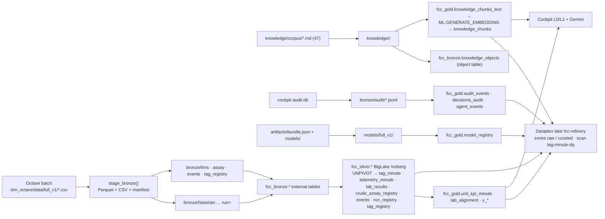

# Data & Analytics Flow: Real-World Refinery Architecture vs. Simulated Baseline

> **Document:** `data_and_analytics_flow.md`  
> **Date:** 2026-10-02  
> **System:** Refinery Crude-Adaptive Multi-Parameter Optimization & Soft Sensor Platform  
> **Companion Documents:** [`verbatim.md`](verbatim.md) · [`checklist.md`](checklist.md) · [`SDD.md`](SDD.md) · [`API_CONTRACT_v3.md`](cockpit/API_CONTRACT_v3.md)

---

## Executive Summary (BLUF)

**In a production refinery deployment, data flows from plant instruments through Google Cloud Manufacturing Connect into a Dual-Tier Lakehouse: Cloud Bigtable captures sub-second raw streaming telemetry (1 Hz) for live monitoring and high-frequency sentinels, while Cloud Dataflow aggregates this stream into 1-minute statistical snapshots in BigQuery/BigLake for thermodynamic ML inference, LIMS lab alignment, and prescriptive multi-unit optimization.**

* **The Core Rationale for 1-Minute Aggregation:** FCC/RCC units are dominated by large thermal and hydraulic inertia (fractionator tray residence times are 3–8 minutes; column thermal equilibrium is 15–30 minutes). Running thermodynamic soft sensors at 100 ms is physically meaningless—it models high-frequency sensor turbulence rather than vapor-liquid equilibrium (VLE). Aggregating sub-second data into 1-minute summaries (`mean`, `min`, `max`, `stddev`, `last`) filters measurement noise, matches process physics, cuts BigQuery query costs by 60×, and synchronizes with 8-hour LIMS labs and 30-second APC/MPC control steps.
* **Simulated vs. Actual Reality:** Our Octave simulation generates clean, synchronized 1-minute rows from an internal 10-second ODE solver ($h = 10\text{ s}$) with synthetic noise; in an actual refinery, data is asynchronous, noisy, sampled at wildly differing rates (100 ms to 12 hours), and requires edge filtering, deadband elimination, and dynamic hydraulic transport lag alignment.

---

## 1. End-to-End Enterprise Architecture Flow

The complete edge-to-cloud architecture spans five physical and logical tiers:

```mermaid
flowchart TB
    subgraph S1["1. Refinery Floor & Edge (ISA-95 Level 1–3)"]
        INST["Field Transmitters (112+ Tags)<br/>• Thermocouples & RTDs (1–5 s)<br/>• Flow & Pressure Transmitters (100 ms–1 s)<br/>• Online GC Analyzers (5–15 min)"]
        DCS["DCS / Historian Tier<br/>• Honeywell Experion / Yokogawa Centum<br/>• OSIsoft PI / Aspen InfoPlus.21"]
        LIMS_SRC["Refinery LIMS Lab & ERP<br/>• 8h Product Samples (ASTM D86/D2887)<br/>• Tanker Crude Assays (API, CCR, S, Metals)"]
        MC["GCP Manufacturing Connect Edge<br/>(Containerized on Kubernetes in Level-3 DMZ)<br/>• OPC UA / Modbus / MQTT Protocol Drivers<br/>• Edge Deadband & Instrument Range Clamping"]
        INST --> DCS --> MC
    end

    subgraph S2["2. Secure Cloud Ingestion & Streaming ETL"]
        PS["Cloud Pub/Sub<br/>(mTLS Port 443 Ingestion Bus)"]
        GCS_LAND["Cloud Storage Landing Bucket<br/>(LIMS CSV / ERP Lab Drops)"]
        DF["Cloud Dataflow (Apache Beam Streaming Pipeline)<br/>• 1-Sec Hot-Path Enrichment & Range Validation<br/>• 1-Minute Tumbling Window Aggregation<br/>(Computes: mean, min, max, stddev, last_valid)"]
        MC -->|"Encrypted Streaming"| PS
        LIMS_SRC -->|"Scheduled Ingest"| GCS_LAND
        PS --> DF
    end

    subgraph S3["3. Enterprise Dual-Tier Lakehouse"]
        BT["Cloud Bigtable (Hot Tier)<br/>• 1-Second Raw Telemetry<br/>• 72-Hour Rolling TTL Buffer<br/>• Sub-10ms Point Lookups<br/>• Fast Anomaly/Surge Sentinels"]
        BQ["BigQuery / BigLake (Analytical Tier)<br/>• 1-Minute Partitioned Time-Series<br/>• 10+ Years Historical Campaigns<br/>• Unified Process + Lab Assay Store"]
        DF -->|"Raw 1-Sec"| BT
        DF -->|"1-Min Window Aggregates"| BQ
        GCS_LAND -->|"Auto-Load Lab Events"| BQ
    end

    subgraph S4["4. Vertex AI Analytics & Prescriptive Engine"]
        CRUDE_REG["Online Crude Regime Classifier<br/>(Tank Assay Prior + Live Furnace ΔT/Fuel)"]
        MOE["Mixture-of-Experts Committee<br/>(Iranian Heavy · Arab Light · Urals · Opportunity)"]
        MODELS["4-Model Committee Inference<br/>• Bayesian Ridge · GPR (Epistemic σ)<br/>• Hybrid Physics-Delta · PINN Conservation"]
        GATE["Trust Gating & Kalman Bias Adaptation<br/>(S1–S7 Gates: Novelty, Spread, Dynamic Drift)"]
        REC["Prescriptive Recipe Optimizer<br/>(Solves joint SP_Preheat, ROT, Air, PA, Reflux)"]
        BQ & BT --> CRUDE_REG --> MOE --> MODELS --> GATE --> REC
    end

    subgraph S5["5. Control Room & Closed-Loop Supervisory Egress"]
        UI["Industrial AI Cockpit (Next.js / Cloud Run)<br/>• Plotly Multi-Trace Time-Series<br/>• Shaded P5–P95 Uncertainty Envelopes<br/>• Gaussian Target Bell Curves N(μ, σ)<br/>• Actionable Systemic Decision Cards"]
        GEM["Gemini 1.5 Pro Copilot (हिंदी / Hinglish / EN)<br/>(Context-Aware, Grounded on BQ Lakehouse)"]
        APC["Supervisory Setpoint Download (Optional Closed-Loop)<br/>Cloud Run → Pub/Sub → MC OPC UA Client → DCS APC"]
        REC --> UI <--> GEM
        UI -.->|"Operator Accept"| APC --> DCS
    end
```



---

## 2. Simulated Data vs. Actual Refinery Reality

| Dimension | Our Simulated Implementation (`sim_octave`) | Actual Production Refinery |
| :--- | :--- | :--- |
| **Data Generation Source** | Numerical ODE solver (Santander et al., 2022) integrating 46 differential-algebraic equations in Octave. | Physical chemical plant: 112+ transmitters, valves, pumps, blowers, and catalytic cracking reactions. |
| **Native Integration Step** | $h = 10\text{ seconds}$ fixed Runge-Kutta/BDF integration step (`run_sim.m`). | Continuous real-world physics; sensors digitized by ADC cards at 100 ms to 1 second. |
| **Output / Recorded Sampling** | Exact, fixed **1-minute snapshots** (1 row per 60 seconds). Zero missing intervals. | Asynchronous streams: flows/pressures @ 1s; temperatures @ 5s; labs @ 8h. |
| **Time Alignment** | Perfect temporal alignment: all 112 columns share the identical minute integer clock `time_min`. | Jittered, out-of-order arrival across different PLCs/subsystems requiring dynamic time synchronization. |
| **Noise Characteristics** | Synthetic Gaussian post-processing noise ($\sigma_T = 0.5^\circ\text{F}$, $\sigma_P = 0.05\text{ psi}$, $\sigma_F = 0.5\%$). | Non-Gaussian colored noise, electrical interference (50/60 Hz hum), turbulent flow chattering, and sensor drift. |
| **Process Disturbances** | Deterministic scripted events (step ramps in feed rate, preheat SP, crude API via `scenario.m`). | Stochastic disturbances: ambient weather swings, feed tank stratification, catalyst fines loss, heat exchanger fouling. |
| **Laboratory Feedback** | Synthetic LIMS samples injected at minutes 360, 840, 1320 (with synthetic 60 ± 15 min reporting delay). | True laboratory samples pulled manually by operators, sent to site QA lab, logged into LIMS with 2–8 hr latency. |
| **Crude Slate Variations** | 3 discrete synthetic API steps (`R1: <22`, `R2: 22–26`, `R3: >26`). | Dynamic multi-crude blending (e.g. 60% Basrah Heavy + 40% Arab Extra Light), shifting continuously during tank changeover. |

---

## 3. Exact Sampling & Data Frequency Breakdown

```
[Plant Transmitters]              [Manufacturing Connect]         [Cloud Bigtable]         [BigQuery / Lakehouse]
 100 ms – 5 sec        ======>         1 Second            =====>     1 Second       =====>       1 Minute
 (High-Frequency Analog)          (Standardized OPC UA)            (Hot Raw Stream)         (Aggregated Features)
```

### Granular Frequency Matrix

| Process Variable Domain | Physical Sensors | Actual Raw Sensor Frequency | Simulated Frequency | Bigtable Frequency | BigQuery Frequency |
| :--- | :--- | :---: | :---: | :---: | :---: |
| **Fast Hydraulics & Pressure** | Reactor/Regenerator $\Delta P$, Wet Gas Compressor Suction, Main Column Overhead $P$ | **100 ms – 1 second** | 1 minute | **1 second** | **1 minute** (mean, min, max) |
| **Fast Flow Loops** | Lift Air, Riser Feed Flow, Fuel Gas to Preheat Furnace, Reflux Flow | **500 ms – 1 second** | 1 minute | **1 second** | **1 minute** (integrated total, mean) |
| **Thermal Dynamics** | Riser ROT, Regenerator Dense Bed, Cyclone Temp, Column Trays (T01–T20) | **1 – 5 seconds** | 1 minute | **1 second** (resampled) | **1 minute** (mean, stddev) |
| **Rotating Equipment Dynamics** | Air Blower (`CAB`) Vibration, Wet Gas Compressor (`WGC`) Speed/Surge | **50 – 200 ms** (vibration) / **1s** (power) | 1 minute | **1 second** (edge RMS) | **1 minute** (power, surge margin) |
| **Flue-Gas Analyzers** | Regenerator Flue Gas $O_2$ %, $CO$ ppm, Furnace Excess Air | **5 – 30 seconds** | 1 minute | **5 seconds** | **1 minute** (mean) |
| **Online Chromatographs** | Debutizer Overhead $C_3/C_4/C_5$ split, Fuel Gas Composition | **5 – 15 minutes** | 1 minute (synthetic) | **5 – 15 minutes** (as-arrived) | **1 minute** (forward-filled + flag) |
| **Laboratory Quality (LIMS)** | Heavy Naphtha T98, LCO T98, Slurry Ash/Sulfur, Feed Distillation | **Every 8 – 12 hours** | Minutes 360, 840, 1320 | N/A (Event Store) | **On Arrival** (joined at draw timestamp) |
| **Crude Cargo Assay Tests** | Crude Origin, API Gravity, CCR wt%, Basic Nitrogen, Nickel/Vanadium ppm | **Every 12 – 48 hours** (per cargo/tank batch) | Static API labels | N/A | **Per Batch** (Crude Assay Registry) |

---

## 4. Signal Filtering, Refinements & Resampling Pipeline

### 4.1 In the Actual Refinery Deployment

Raw refinery sensor signals cannot be ingested directly into machine learning models. A 4-stage pipeline cleans and refines the data:

```
[Raw 4-20mA Sensor] 
       │
       ▼ (Edge Gateway: Manufacturing Connect)
[Stage 1: Electrical & Validity Clamping] (NAMUR NE 43 limits, Deadband filtering)
       │
       ▼ (Cloud Ingestion: Dataflow Stream)
[Stage 2: Process Noise & Outlier Rejection] (Hampel rolling median filter, Spike suppression)
       │
       ▼ (Streaming Aggregator: Dataflow Windowing)
[Stage 3: 1-Minute Resampling & Statistical Reduction] (Mean, Min, Max, Variance, Last Valid)
       │
       ▼ (Lakehouse Feature Store: Vertex AI / BigQuery)
[Stage 4: Dynamic Lag Alignment] (Prewhitened CCF transport delays: Furnace → Riser → Trays)
```

1. **Stage 1: Electrical & Range Validity Clamping (At Manufacturing Connect Edge)**
   * **NAMUR NE 43 Conformance:** Standard 4–20 mA transmitters signal faults below 3.6 mA or above 21.0 mA. Any measurement outside valid physical spans (e.g. pressure $< 0\text{ psia}$ or temperature $> 2,000^\circ\text{F}$) is flagged as `BAD_INSTRUMENT` and withheld from aggregation.
   * **Exception / Deadband Compression:** Transmitters in DCS historians utilize "boxcar" or "swinging-door" deadbands ($\epsilon \approx 0.1\%$). Telemetry is only pushed when the value changes beyond the noise band, preventing network saturation.
2. **Stage 2: Outlier & Turbulence Rejection (Cloud Dataflow)**
   * **Hampel Filter (Rolling Median Absolute Deviation):** A 5-point rolling window calculates the median and MAD. Values exceeding $3 \times 1.4826 \times \text{MAD}$ are flagged as turbulence spikes (e.g. slug flow hitting a thermowell) and replaced with linear interpolation.
   * **Instrument Freeze Detection:** If a transmitter emits the exact same floating-point value for $> 30$ consecutive seconds, it is flagged as `FROZEN_SENSOR` (frozen impulse line).
3. **Stage 3: Resampling & Statistical Reduction (1-Second to 1-Minute)**
   * Computes a multi-metric tuple for every tag every minute:
     $$\mathbf{x}_{\text{minute}} = \big[\bar{x}_{\text{mean}},\, x_{\text{min}},\, x_{\text{max}},\, \sigma_{x},\, x_{\text{last}},\, N_{\text{valid}}\big]$$
4. **Stage 4: Dynamic Transport Lag Alignment (Vertex AI Feature Store)**
   * Hydrocarbons take time to flow through physical vessels. Crude entering the preheat furnace takes **4–8 minutes** to reach the riser outlet, and vapor takes another **2–5 minutes** to travel up tray 20 of the main fractionator.
   * The feature store applies **Prewhitened Cross-Correlation (CCF) transport lags** ($\tau_{\text{preheat}} \approx 6\text{ min}$, $\tau_{\text{riser}} \approx 3\text{ min}$) so that model features predict product qualities corresponding to the exact same plug of oil.

---

### 4.2 In Our Current Simulation Platform (`cockpit/api`)

To mirror actual refinery behavior, our simulation codebase applies the following refinements:

1. **Measurement Noise Addition (`app/data/catalog.py` & `DECISIONS.md L6`):**
   * Raw ODE outputs represent pure mathematical states. We add realistic process noise:
     * Temperatures: Gaussian noise $\sigma = 0.5^\circ\text{F}$.
     * Pressures: Gaussian noise $\sigma = 0.05\text{ psi}$.
     * Flows: Multiplicative Gaussian noise $\sigma = 0.5\%$.
     * Slow Sensor Drift: Seed `s152` incorporates slow drift on `T_tray13_F` ($+0.05^\circ\text{F/hr}$) to test drift sentinel alarms.
2. **Dynamic Lag Identification (`app/data/lags.py`):**
   * Uses prewhitened cross-correlation over training seeds `s100–s139` to discover physical transport delays (stored in `artifacts/models/lags.json`) and applies them deterministically during model inference.
3. **A5 Steady-State Filtering (`app/data/features.py`):**
   * Rolling 30-minute standard deviation check combined with `event_code == 0`. Lab samples drawn during transient setpoint steps are excluded from training to prevent inverse-causality model corruption.
4. **LTTB Downsampling for Cockpit Display (`app/lttb.py`):**
   * The 1,600-minute time-series data is downsampled using the **Largest Triangle Three Buckets (LTTB)** algorithm to $\le 400\text{ points}$ per trace when rendering in Plotly, ensuring high-speed rendering ($\le 150\text{ ms}$) while preserving critical visual peaks and valleys.

---

## 5. Sub-Second Bigtable to 1-Minute BigQuery Aggregation: Deep Dive

### 5.1 Is There Data Aggregation?
**YES, unequivocally.** 

The architecture strictly decouples:
* **The High-Frequency Ingestion Tier (Cloud Bigtable):** Stores raw **1-second telemetry** streamed directly from Manufacturing Connect.
* **The Analytical Lakehouse Tier (BigQuery):** Stores **1-minute aggregated records** computed via Cloud Dataflow tumbling windows.

---

### 5.2 Why Aggregate to 1-Minute? (The Engineering & Physics Justification)

#### 1. Refinery Physics & Thermodynamic Time Constants
* **FCC Riser vs. Fractionator Inertia:** While catalyst and oil contact in the riser occurs in **2 to 4 seconds**, the fractionator column weighs hundreds of tons and contains thousands of gallons of liquid holdup.
* **Column Residence Times:** Liquid holdup on trays has a time constant of **3 to 8 minutes**. Thermal equilibrium after a heat move takes **15 to 30 minutes**.
* **Why Sub-Second Modeling Fails:** Attempting to infer product cut points (`LCO_T98`, `HN_T98`) every 100 ms is physically meaningless. At 100 ms, pressure transmitters show acoustic turbulence and flowmeters show pump impeller ripples. The vapor-liquid equilibrium (VLE) that determines product separation operates on a minute-scale integral. Evaluating soft sensors at 1-minute intervals aligns the ML model directly with the **underlying thermodynamics**.

#### 2. Synchronization with Industrial APC and Laboratory Cycles
* **Advanced Process Control (APC) Execution:** Industrial multivariable predictive controllers (e.g., Aspen DMC3, Honeywell Profit Controller) execute their control matrices every **30 to 60 seconds**. Supplying setpoints faster than 1 minute causes actuator chatter and valve stiction.
* **Laboratory Testing Frequency:** Physical lab results arrive every **8 to 12 hours**. Aligning continuous telemetry to a 1-minute grid allows mathematically robust Kalman filter bias correction without numerical instability.

#### 3. BigQuery Storage & Query Economics
* **Data Volume Explosion:**
  * 112 tags @ 1 Hz = $112 \times 86,400 = 9,676,800\text{ values/day}$.
  * In a full refinery with 10,000 tags @ 1 Hz: **864,000,000 rows/day** ($\approx 100\text{ GB/day}$, or **36.5 TB/year**).
* **Cost Impact:** Querying 36.5 TB in BigQuery costs **$228 per scan** (at standard $6.25/TB scan pricing). Running iterative ML training or exploratory queries on 1 Hz data would quickly incur tens of thousands of dollars in analysis costs.
* **The 1-Minute Reduction:** Aggregating to 1-minute compresses the dataset by **60×** (from 864M rows to **14.4M rows/day**). Full annual analytical scans cost under **$3.80**, while retaining 100% of the variance needed for process optimization.

---

### 5.3 How the Aggregation Works (Tumbling Window Contract)

In Cloud Dataflow, raw 1-second records are partitioned into non-overlapping 60-second tumbling windows:

```
[Raw 1-Second Stream in Cloud Bigtable]
| t=00s | t=01s | t=02s | ... | t=58s | t=59s |
└───────────────────┬───────────────────────┘
                    ▼ (Cloud Dataflow 60s Tumbling Window)
[Aggregated 1-Minute Record in BigQuery]
{
  "refinery_id": "REFINERY_01",
  "unit_id": "unit_4_fractionator",
  "tag_id": "T_tray13_F",
  "time_minute": "2026-10-02T02:00:00Z",
  "mean": 476.38,
  "min": 475.92,
  "max": 476.84,
  "stddev": 0.21,
  "last_value": 476.41,
  "sample_count": 60,
  "valid_sample_count": 60,
  "quality_flag": "GOOD"
}
```

---

### 5.4 Advantages and Disadvantages of Aggregation

| Architectural Dimension | Advantages of 1-Minute Aggregation | Disadvantages / Trade-offs of Aggregation | How Our Architecture Mitigates the Disadvantage |
| :--- | :--- | :--- | :--- |
| **Process Modeling & AI** | **Filters Sensor Noise:** Eliminates high-frequency turbulent flutter, providing clean thermodynamic signals for ML models. | **Loses Sub-Second Transient Visibility:** Fast phenomena (like compressor surge, acoustic shockwaves, or valve chattering) are smoothed out. | **Dual-Tier Buffer:** Raw 1-second data is preserved in **Cloud Bigtable** for 72 hours. Equipment health sentinels read Bigtable directly for vibration/surge detection. |
| **BigQuery Performance & Cost** | **60× Cost & Storage Reduction:** Reduces BigQuery scan costs by 98.3%, enabling rapid sub-second dashboard queries and interactive analytics. | **Irreversible Information Loss:** Once aggregated into 1-minute buckets in BigQuery, sub-second wave shapes cannot be reconstructed. | **Statistical Retention:** Rather than just storing the mean, Dataflow computes `min`, `max`, and `stddev`, preserving awareness of within-minute variance. |
| **Data Integrity & Synchronization** | **Harmonizes Disparate Clocks:** Unifies tags with different native sampling rates (100ms, 1s, 5s) onto a single, clean temporal matrix. | **Boundary Smearing:** A process disturbance occurring at second :58 is averaged into the preceding 58 seconds of calm data. | **Last-Good Tracking:** `last_value` captures the instantaneous state at the end of the window; change-point detectors trigger on boundary steps. |
| **Control Room Usability** | **Stable Visualization:** Operators can digest 1-minute trends without erratic pixel jitter or browser DOM lockups. | **Latency Delay:** A tumbling window introduces an inherent 60-second latency before the aggregated row lands in BigQuery. | **Direct Bigtable Streaming:** The active minute in the cockpit streams directly from the FastAPI/Bigtable WebSocket tail, landing in BigQuery subsequently. |

---

## 6. Summary Comparison: Simulated vs. Actual Flow

```
========================================================================================================================
FEATURE                   OUR CURRENT SIMULATION SUITE                     ACTUAL GCP REFINERY DEPLOYMENT
========================================================================================================================
OT Edge Ingestion         None (Octave ODE runs locally)                   GCP Manufacturing Connect (OPC UA / Modbus)
Streaming Message Bus     None (Memory / Direct CSV)                       Cloud Pub/Sub (mTLS Port 443)
Real-time Buffer          Pandas in-memory buffer (400 points)             Cloud Bigtable (1-second raw, 72h TTL)
Analytical Lakehouse      SQLite / Local Parquet & CSV                     BigQuery / BigLake (1-minute, 10-year store)
Sampling Frequencies      Exact 1-minute grid across all tags              100ms (fast) -> 1s (edge) -> 1min (lakehouse)
Aggregation Mechanism     ODE solver outputs at min dt=60s                 Dataflow tumbling 60s window (mean/min/max/sd)
Lag Compensation          Prewhitened CCF in app/data/lags.py              Vertex AI Feature Store with physical delays
Lab Integration           Synthetic lab rows injected into CSV             LIMS SFTP / Datastream automated pipeline
Operator Interface        Next.js Cockpit on localhost:3001                Next.js Cockpit on Cloud Run + IAP Security
Supervisory Control       Writes to local SQLite audit log                 Writes to OPC UA Client -> DCS APC Supervisor
========================================================================================================================
```

---

## Errata & Consistency Notes (added 2026-10-02, lakehouse build)

> [!NOTE]
> Sections 1–6 above are kept verbatim as the production narrative. The notes below correct points where that text drifted from what the repository actually does today, so the document can be read as *production architecture* **and** *as-built truth* side by side. Nothing above was removed.

| Where | Text above says | As built today (verified in code / GCP) |
| :--- | :--- | :--- |
| §2 Crude Slate Variations | 3 discrete API steps R1 < 22, R2 22–26, R3 > 26 | **4 declared regimes R1 Heavy / R2 Medium-heavy / R3 Base / R4 Light**, each switch a **60-min API ramp** (`sim_octave/stage_regimes.py`, `fcc_silver.crude_assay_registry.transition_start_min/transition_end_min/ramp_min`). |
| §2 Data Generation Source | "46 differential-algebraic equations" | The Octave model exposes **46 validated process signals + set points** (112 CSV columns incl. truth twins and meta); the DAE count is not what the pipeline keys on. |
| §1 / §5 Gemini | "Gemini 1.5 Pro Copilot" | `cockpit/api/config.yaml`: text **`gemini-2.5-flash`**, voice **`gemini-live-2.5-flash-native-audio`** (with fallbacks), API-side embeddings **`gemini-embedding-001`**; BigQuery-side embeddings **`text-embedding-005`** via the `fcc-lake` connection (`fcc_gold.text_embedding`). |
| §6 Analytical Lakehouse row | "SQLite / Local Parquet & CSV" | The cockpit still reads local CSV + SQLite `audit.db`; **in addition** the same data is now loaded into a real GCS + BigLake Iceberg + BigQuery medallion lakehouse (§7) and catalogued in Dataplex. |
| §1 Dual-Tier (Bigtable / Pub/Sub / Dataflow) | Drawn as present tense | **Production-only.** For this build nothing streams: Octave writes 1-min CSV, the loader stages it to GCS. Bigtable/Pub/Sub/Dataflow/Manufacturing Connect remain the target architecture (§8 matrix). |
| §3 Lab rows | "Minutes 360, 840, 1320" | Correct — 3 draws per 1,600-min run × 2 properties = 6 `lab_results` rows per run (verified in `fcc_gold.v_run_coverage`). |

---

## 7. As-Built Medallion Lakehouse (GCP project `fcc-soft-sensor`, `us-central1`)

### 7.1 Why this is a *lakehouse* and not a warehouse

A warehouse is a database that owns its files (the earlier `fcc_soft_sensor.fcc_sim_minute_sample` table was exactly that). A lakehouse keeps **object storage as the system of record**, puts an **open table format** on top so engines other than BigQuery can read it, and layers **one catalog + governance** over both. As built:

* **GCS is the lake** — one bucket `gs://fcc-soft-sensor-sim-data` with zone prefixes. Bronze is immutable as-received files (Parquet **and** the original CSV); the knowledge zone holds the unstructured documents; model bundles live under `models/`.
* **Silver is BigLake Iceberg** (`fcc_silver.*`, `table_format='ICEBERG'`, `storage_uri=gs://…/silver/<table>`) — BigQuery manages the table, but the Parquet + Iceberg metadata sit in the bucket and are readable by Spark / Trino / DuckDB.
* **Gold is BigQuery-native** (partitioned/clustered serving tables + views) plus two gold file products (knowledge chunks, model registry) that are also persisted in GCS.
* **One catalog**: Dataplex lake **`fcc-refinery`** with zones `raw` (asset = the bucket) and `curated` (assets = `fcc_bronze`, `fcc_silver`, `fcc_gold`), plus a data-quality scan `tag-minute-dq` that machine-checks the silver contract.

### 7.2 Zone map

```
gs://fcc-soft-sensor-sim-data/
├── bronze/                                  immutable landing — never updated in place
│   ├── historian/source=simulator/site=demo-refinery/area=fcc-complex/batch=full_v1/run=<run_id>/minute.parquet (+ <run_id>.csv)
│   ├── lims/source=…/site=…/batch=full_v1/lab_results.parquet (+ .csv)
│   ├── assay/…/regimes.parquet (+ .csv)      crude regime schedule (R1–R4, 60-min ramps)
│   ├── events/…/events.parquet               event_code transitions / crude switches
│   ├── tag_registry/source=simulator/tag_registry.parquet
│   ├── audit/{audit,decisions,agent_events}/<yyyy-mm-dd>/*.jsonl   exported from cockpit audit.db
│   └── _manifests/full_v1.json               what was loaded, sha256 per run, run_status
├── knowledge/                               unstructured context (the "where do SOPs live" answer)
│   ├── sop/ incidents/ moc/ iow/ lab/ shift_logs/ work_orders/ references/   47 markdown docs with front-matter
│   └── documentation/                        this file, BDD.md, SDD.md, DECISIONS.md, refinery_optimisation.md, demoflow.md
├── silver/<table>/                          BigLake Iceberg data + metadata, written only by BigQuery DML
├── gold/{knowledge_chunks,model_registry}/  gold file products
├── models/full_v1/                          bundle.json + pickled committee members + lags.json
└── _schemas/<table>.json  +  <zone>/_README.md   data contracts and zone READMEs
```

### 7.3 Table inventory

| Layer | Dataset.table | Kind | Grain / purpose |
| :--- | :--- | :--- | :--- |
| Bronze | `fcc_bronze.historian_minute` | External (Parquet, Hive partitions `source/site/area/batch/run`) | As-received wide minute rows, 112 columns |
| Bronze | `fcc_bronze.lab_results_raw`, `crude_regimes_raw`, `events_raw`, `tag_registry_raw` | External (Parquet) | LIMS, assay/regime schedule, events, tag registry exactly as staged |
| Bronze | `fcc_bronze.knowledge_objects` | **Object table** over `knowledge/*` | Every SOP / incident / MOC / IOW / lab method / shift log / work order as a governed row (uri, size, updated) |
| Silver | `fcc_silver.tag_minute` | **BigLake Iceberg**, cluster `run_id, unit_id, tag_id, dt` | **1 row per tag per minute**: `value`, `value_true` (simulator truth where exposed), `eng_unit`, `quality_flag GOOD/MISSING/TRUTH_ONLY`, `sample_count`. The analytics path. |
| Silver | `fcc_silver.telemetry_minute` | Iceberg | 1 row per minute with the whole wide record as JSON string — the ML feature path |
| Silver | `fcc_silver.lab_results` | Iceberg | 1 row per lab sample per property (`LCO_T98_F`, `HN_T98_F`), ASTM D86 (simulated) |
| Silver | `fcc_silver.crude_assay_registry` | Iceberg | 1 row per run per crude segment (regime, API target, ramp window) |
| Silver | `fcc_silver.events`, `tag_registry`, `run_registry` | Iceberg | Events on the run clock; tag → unit/label/unit-of-measure; **which runs are loaded and whether `complete` or `partial`** |
| Gold | `fcc_gold.unit_kpi_minute` | Native, partition `dt`, cluster `run_id, unit_id` | The headline number per L0 tile per minute with the plan set point and delta |
| Gold | `fcc_gold.lab_alignment` | Native | Every lab result beside simulator truth and plan at the draw minute |
| Gold | `fcc_gold.v_run_coverage`, `v_crude_switches`, `v_mass_balance` | Views | Provenance footer, crude switch list, plant mass closure |
| Gold | `fcc_gold.knowledge_chunks_text` → `fcc_gold.knowledge_chunks` | Native (+ `ARRAY<FLOAT64>` embedding) | Section-level chunks of all knowledge docs, embedded with `text-embedding-005` through remote model `fcc_gold.text_embedding`; queried with `VECTOR_SEARCH` (brute force — a vector index needs ≥ 5,000 rows) |
| Gold | `fcc_gold.audit_events`, `decisions_audit`, `agent_events` | Native | Operator Accept/Decline decisions and agent traces exported from `audit.db` |
| Gold | `fcc_gold.model_registry` | Native | One row per committee member per property with its model card JSON and bundle URI |

### 7.4 Loader & idempotency

`sim_octave/lakehouse/load_lakehouse.py` (Makefile: `make lakehouse-load | lakehouse-dry | lakehouse-status`). Every run is loaded as `DELETE … WHERE run_id IN UNNEST(runs)` **then** `INSERT`, so a run that is still being simulated loads today with `run_status='partial'` and is replaced byte-for-byte when the Octave batch finishes — no need to wait for all runs before building the lakehouse. The bronze manifest records a sha256 per CSV so a reload can be proven identical.

---

## 8. As-Built vs Production — Component Matrix

| Capability | As built for this pitch | Production target (unchanged from §1) | Gap to close |
| :--- | :--- | :--- | :--- |
| OT ingestion | Octave batch → CSV → `gcloud storage cp` | Manufacturing Connect (OPC UA) → Pub/Sub → Dataflow | Replace the loader's `stage_bronze()` with a Dataflow sink writing the same Hive layout |
| Hot tier | none (cockpit holds last 400 points in memory) | Bigtable, 1 s raw, 72 h TTL | Add when sub-minute sentinels are in scope |
| 1-min aggregation | simulator emits exact minutes (`sample_count = 1`) | Dataflow 60 s tumbling window (mean/min/max/sd/last) | Schema already carries `sample_count`; add `min/max/stddev/last` columns when real data arrives |
| Lake | GCS single bucket, zone prefixes, ISA-95 Hive keys | Same, one bucket per site + CMEK | Keys `site=/area=/unit=` are already in the paths |
| Open table format | BigLake Iceberg (silver) | Same | — |
| Serving | BigQuery native gold + views | Same + BI Engine / Looker | — |
| Unstructured | Object table + BQ embeddings | Same + Document AI for scanned SOPs | — |
| Catalog / DQ | Dataplex lake, 2 zones, 1 DQ scan | Dataplex + Data Lineage API + policy tags | Add lineage + column-level policy tags |
| Models | Pickled committee in `models/`, registry table | Vertex AI Model Registry + Feature Store | Register bundle → Vertex Model Registry |
| Decisions | SQLite `audit.db` → JSONL → BigQuery | Write-through from Cloud Run to BigQuery + OPC UA write-back | Replace export with streaming insert |
| Copilot | Gemini 2.5 Flash / Live native-audio, screen-context-aware | Same, grounded on gold + `VECTOR_SEARCH` | Point RAG at `fcc_gold.knowledge_chunks` instead of local cache |

---

## 9. Data Contracts (silver)

Machine-readable copies live in `gs://fcc-soft-sensor-sim-data/_schemas/*.json`; BigQuery column descriptions carry the same wording.

* **`tag_minute`** — key `(run_id, tag_id, time_min)`; `ts = 2026-09-01T00:00Z + time_min` (synthetic clock; production uses the historian timestamp); `value` is the measured/noisy signal, `value_true` the noise-free simulator twin where the simulator exposes one (`*_dup` columns and T98 truths); `quality_flag ∈ {GOOD, MISSING, TRUTH_ONLY}`; `unit_id` is the ISA-95 unit that owns the tag or `fcc-complex`.
* **`lab_results`** — key `sample_id = <run>-<minute>-<property>`; `property ∈ {LCO_T98_F, HN_T98_F}`; `method = 'ASTM D86 (simulated)'`.
* **`crude_assay_registry`** — key `(run_id, t_start_min)`; `regime_id ∈ {R1,R2,R3,R4}`, `transition_complete` tells whether the 60-min ramp finished inside the run.
* **`run_registry`** — key `run_id`; `run_status ∈ {complete, partial}`, `rows_loaded`, `t_last_min`, `expected_minutes = 1600`, `csv_sha256_16`.
* **`tag_registry`** — key `tag_id`; `is_setpoint`, `is_truth`, `eng_unit`, `tag_group`.

Dataplex scan `tag-minute-dq` enforces: keys non-null, `quality_flag` and `unit_id` in their enums, `0 ≤ time_min ≤ 1600`, one row per (run, tag, minute), finite values on GOOD rows, `|mass_balance_err_pct| < 5`.

---

## 10. Data-Generation Status & Run-Completion Policy

* Batch `full_v1`: 54 run CSVs present at load time; the Octave batch may still be appending minutes to a few of them. The loader marks any run with `rows < 1600` as `partial`.
* Policy: **load now, reload on completion.** `make lakehouse-load` is safe to re-run at any time; only the affected runs are rewritten. `fcc_gold.v_run_coverage` is the single place to answer "how much of the batch is in the lake".
* Training/evaluation splits (`artifacts/bundle.json: train_runs/test_runs`) are recorded in `fcc_gold.model_registry`, so any model can be traced back to exactly which runs — complete or partial — it saw.

---

## 11. Lineage



---

## 12. Cost & Scale (as built → production)

| Item | As built | Production (10,000 tags, 1-min) |
| :--- | :--- | :--- |
| Silver `tag_minute` rows | ≈ 54 runs × 1,600 min × 107 tags ≈ **9.2 M rows** (~0.2 GB Iceberg Parquet) | 14.4 M rows/day → 5.3 B rows/year (~100 GB/yr compressed) |
| Storage | pennies/month (GCS Standard, us-central1) | ~$2–3/month per year of history |
| Query | gold tables partitioned by `dt`, clustered by `run_id, unit_id` → a unit-day scan reads MBs | same pattern; BI Engine for the cockpit |
| Embeddings | 47 docs → a few hundred chunks, one-off `ML.GENERATE_EMBEDDING` call | re-embed on document revision only |
| Dataplex | lake/zones free; DQ scan billed per BigQuery bytes scanned (10 % sample) | scheduled daily |

> [!IMPORTANT]
> Nothing in the as-built stack is a running service with an hourly charge: no Bigtable instance, no Dataflow job, no Cloud Run revision. The only cost drivers are GCS bytes and BigQuery bytes scanned.
