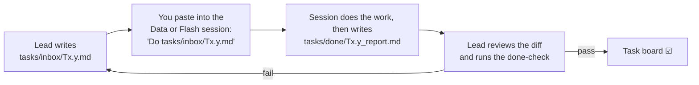

# Delegation Plan

> **Bottom line:** three sessions build the product. The **Lead** session owns the whole repo and does the strategic, judgement-heavy work. The **Data** session generates and loads simulator data. The **Flash** session does well-defined grunt work. The Lead writes a task card for every Data and Flash task, and reviews and tests the result before anything is accepted. Work follows [demoflow.md](demoflow.md), one step at a time, in the order of §A4.
>
> - **Part A** (this section): who does what, how tasks are handed over, and the task board.
> - **Part B** (below, unchanged): the Gemini prompts that generated the simulated knowledge corpus.

---

## Part A: Build Delegation (Lead · Data · Flash)

### A1. Roles

| Session | Model | Does | Never does |
|---|---|---|---|
| **Lead** (sole owner of the repo) | Largest model | Decisions and design. Data meaning. Model, trust and gate maths. Thresholds and calibration. API/data contracts. Agent prompts and guardrails. Choosing demo runs. Writes every task card. Reviews and tests every result. Keeps the docs and this task board current. Asks you before any commit | Hand off a task that has no clear done-check |
| **Data** | Any | Runs the simulator batches (`sim_octave/run_random_batch.sh`). Monitors progress and failures. Loads finished runs to BigQuery (`sim_octave/load_to_bq.py`). Deletes local CSVs only *after* the Lead confirms they are in BigQuery. Reports row counts | Change simulator code (`scenario.m`, `run_sim.m`, `model/`) without a Lead task card; edit any other folder |
| **Flash** | Flash | Tasks where input, output and done-check are fully specified: scaffolding and stubs, boilerplate, doc fixes from a given old → new table, unit tests from a given spec, API endpoints from `cockpit/API_CONTRACT.md`, UI pages from a given layout, extraction scripts, lint/format fixes | Make design choices; delete files; run mutating `gcloud`/`bq` commands; `git commit`/`push`; touch files outside its task card |
| **You (user)** | — | Run the three sessions. Paste task cards into the Data/Flash session. Approve each step and every commit | — |

### A2. How Tasks Move Between Sessions



1. **Task cards live in `tasks/inbox/`.** Each is one file named by task ID (e.g. `tasks/inbox/T0.2.md`) and uses the template in §A3.
2. **Reports go in `tasks/done/`.** When finished, the session writes `tasks/done/<id>_report.md`: the files changed, the commands run, the done-check output, and anything unclear.
3. **The Lead reviews** the diff and runs the done-check, then marks the task ☑ here. If it fails, it gets one retry with a corrected card; after that the Lead fixes it.
4. **One task per session at a time.** Data and Flash tasks may run in parallel only when their file lists don't overlap.
5. **Safety stays with the Lead:** BigQuery/GCS schema changes, deleting anything other than loaded CSVs, simulator code changes, and git commits (only when you say).
6. **Source of truth, in order:** `demoflow.md` (what we show) → `features.md` (what we build) → `SDD.md` (how) → `BDD.md` (acceptance) → `build.md` (order) → `checklist.md` (progress).

### A3. Task Card Template

```text
TASK <id> → <Data | Flash> session
GOAL: <one line>
WHY: <demo scene / feature ID>
READ FIRST: delegation.md §A1–A2, plus: <files/specs>
FILES YOU MAY CREATE/EDIT: <explicit list; nothing else>
INPUTS / EXACT VALUES: <values to use; never invent values>
STEPS: <numbered, concrete>
DONE-CHECK: <command + expected result>
REPORT: write tasks/done/<id>_report.md (files changed, commands run, done-check output, open questions)
DO NOT: delete files, run gcloud/bq writes (unless the card says so), git commit, edit files outside the list
```

### A4. Task Board (live)

Status: ☐ to do · ▶ in progress · ☑ done. Detailed per-step checks are in [checklist.md](checklist.md) and the build order is in [build.md](build.md). This board tracks **who** is doing **what** right now.

| # | Task | Owner (model) | Done-check | Status |
|---|---|---|---|---|
| 0.1 | Canonical facts register `DECISIONS.md` | Lead | Reviewed | ☑ |
| 0.2 | git init, root `.gitignore`, `README.md`, `Makefile` | Flash | No ignored paths in `git status`; `make help` | ☑ |
| 0.3 | Implementation audit mapped to feature IDs | Research agent | Report | ☑ |
| 0.5a | `features.md` aligned (4 dashboards, statuses, counts) | Large | Greps empty; counts match | ☑ |
| 0.5b | `build.md` + `checklist.md` rewritten in demo order | Large | Greps empty | ☑ |
| 0.5c | SDD/BDD/BCC/demoflow/problem/solution synced to DECISIONS | Flash | Greps empty | ☑ |
| C1 | Backend fixes: train on labs, HOLD on infeasible move, committee weights, overview per property, knowledge clock, process noise, fallback chain, steady-state filter | Large | API tests pass; retrain summary | ☑ (149 pass; retrain 108 s) |
| C2 | Knowledge dashboard (F24), Open in Knowledge, Accept toast, 30× replay, controller-mode strip | Large | tsc + vitest (50) + build pass | ☑ |
| C3 | HOLD status in web + knowledge sim_run fields in API | Flash | tsc + vitest + pytest | ☑ (vitest 55, pytest 165) |
| C4 | What-If Explorer UI (`F7` `/technical/whatif` + sliders + PDFs) | Flash | `tsc --noEmit` | ☑ (`WhatIfView.tsx`, 0 TS errors) |
| C5 | Labs & Data Quality (`F10/E2` `/api/labs` + `LabsView`, `F11` `/api/dq` + `DataQualityView`) | Pro | `pytest` + `tsc` | ☑ (`test_labs_dq.py` 4 pass, 0 TS errors) |
| C6 | MVP & Demo+ UI Polish (`F6` 7-signal hover, `H5` similar events, `F9` W90/bias history, `F25` wall mode) | Flash | `vitest` + `tsc` | ☑ (55/55 vitest, 0 TS errors) |
| 5.0 | Copilot golden set (Scenes 5–6) + eval harness + guardrail fixes | Large | `make copilot-eval` report | ☑ (16/16 golden PASS, pytest 178) |
| 7.0 | Demo-window selector (M1–M3), extract_scenarios fix, knowledge tools for real-run events | Large | pytest + dry-run output | ☑ (pytest 178, check_corpus PASS) |
| 1.0 | Monitor `full_v1` (54 runs) every 3 h; load finished runs to BigQuery | Lead (cron) | Rows per run; BQ row count | ▶ 03:25Z (Oct 1): 54/54 alive (45 @ 600–660/1600 min healed to contiguous rows + `min 360` lab restored; 9 relaunched with hardened `run_sim.m`), 7.6 GB free, cron active — see [tasks/done/T1.0_report.md](tasks/done/T1.0_report.md) |
| 1.4 | Regenerate knowledge events and SHIFT logs from real held-out runs (s140+), 2026-09-01 clock, `sim_batch` field; `check_corpus.py` validates sim fields | Flash + Lead review | Validator PASS | ◐ Pre-verified on 660-min `random_s141` (`360` lab + `607` crude switch); final run after `full_v1` hits 1600m |
| 2.1 | A6 lag identification (prewhitened CCF) and lagged features | Large | Notebook + tests | ☑ Pre-verified on 34 `full_v1` 600-min train runs (`n=18,947` min; `T_tray13→LCO` CCF 0.51, `T_tray06→HN` CCF 0.59, `Tr_riser→LCO` lag 60m) |
| 3.1 | Retrain on `full_v1`; calibrate trust/W90 on held-out runs | Lead | Calibration report | ☐ (after `full_v1` hits 1600m) |
| 5.1 | E5 ADK packaging of the Copilot (Demo+) | Large | Golden set passes | ☑ (root_agent + 13 tests, pytest 191) |
| 6.1 | Gemini Live probe in us-central1 | Lead | Probe succeeds | ☑ gemini-live-2.5-flash-native-audio OK (0.7 s); other 3 Live fallbacks 404 → demo fallback = text Copilot + recorded clip |
| 7.1 | Demo-run selection (M1–M3), cache, fallbacks, screenshots | Lead + Flash | `config.yaml` demo block | ☐ (after `full_v1` hits 1600m) |
| 7.2 | End-to-end rehearsal against `demoflow.md` | Lead + you | Pre-demo checklist | ☐ |

---

## Part B: Simulated Knowledge Corpus, Generated by Gemini

> **Bottom line:** This file splits the document generation into **7 work packages (WP1–WP7)**. Each one is a ready-to-paste Gemini prompt. Together they produce **46 simulated documents** for the citations that Gemini and the decision cards show:
> - SOPs, operating windows and lab methods;
> - past work orders, incident reports and change (MOC) records;
> - shift logs tied to real simulator runs;
> - a references file.
>
> Paste the **Shared Context (§2)** plus one **WP prompt (§4)** into Gemini. Save the output into `knowledge/corpus/`, then run the validator (§5). Every document is marked **SIMULATED**, uses the simulator's tags and events, and contains **no financial content**.

---

## 1. How to Run It

| Step | Action |
|---|---|
| 1 | Open Gemini in AI Studio, Vertex AI Studio or the Gemini app. Use the model in the WP table (§3). Set temperature 0.4 (0.2 for WP7). |
| 2 | Start a **new chat for each WP**. Paste **§2 Shared Context** first, then the **WP prompt**. |
| 3 | Save the reply. For multi-file replies, run `python3 knowledge/tools/split_files.py reply.txt knowledge/corpus`. |
| 4 | Run `python3 knowledge/tools/check_corpus.py knowledge/corpus`. Paste any failures back into the same chat and ask Gemini to fix only those. |
| 5 | Order: **WP1 → WP2** (the documents others cite), then **WP3, WP4, WP6** in parallel. **WP5** needs the `full_v1` simulator runs to be finished. **WP7** runs last. |

Output layout:

```
knowledge/
  corpus/
    sop/  iow/  lab/  work_orders/  shift_logs/  incidents/  moc/  references/
    manifest.json          # written by check_corpus.py on PASS
  inputs/                  # event tables for WP5 (from extract_events.py)
  tools/  check_corpus.py  extract_events.py  split_files.py
```

---

## 2. Shared Context (paste at the start of every WP chat)

````text
You are a senior refinery process engineer and technical writer. You are writing SIMULATED
documents for a technical demo of an AI soft-sensor cockpit on a fluid catalytic cracking (FCC)
unit. The documents will be indexed for retrieval, and an AI copilot will cite them by section.
Accuracy, internal consistency and exact formatting matter more than length.

== PLANT (fictional) ==
Site: "Demo Refinery". Unit: FCC-21 (FCC reactor/regenerator + main fractionator), modelled by a
dynamic simulator (Octave port of an open FCC-fractionator model). Products: LPG, light naphtha
(LN), heavy naphtha (HN), light cycle oil (LCO), slurry. Units: °F, psia, lb/s. Distillation
endpoints are reported as T98 (°F).

== SIMULATOR TAGS (use these exact names when naming a tag) ==
LCO_T98_F (LCO 98% point, nominal 755.3 °F)      HN_T98_F (HN 98% point, nominal 530.3 °F)
SP_LCO_T98, SP_HN_T98 (cut-point set points)       T_tray13_F (LCO draw tray, nominal 476.4 °F)
T_tray06_F (HN draw tray, nominal 363.4 °F)        P5_frac_psia (fractionator pressure, 24.9)
Tr_riser_F / SP_T_riser_ROT_F (riser outlet temp, nominal 969 °F)
feed_flow_lb_s (fresh feed, nominal 165 lb/s)      dist_feed_API (feed API gravity, nominal 25)
dist_T_feed_in_F (feed temperature, nominal 460.9 °F)
dist_condenser_eff (overhead condenser efficiency, nominal 0.90; fouling case 0.855)
MV_PA1..MV_PA4 (pumparound duties), MV_reflux_ratio, MV_cw_flow (cooling water)
Treg_F (regenerator temp, nominal 1250 °F), fluegas_O2_pct, conversion_pct (~94%)
valve_V8..valve_V11, power_CAB (main air blower), power_WGC (wet gas compressor)
lab_sample (1 = lab draw), crude_id, event_code, cutpoint_auto (1 = cut-point controller in auto)

== SIMULATOR EVENTS (event_code) ==
1 Crude change (feed API steps to a new value between 20 and 29, 60-min ramp; crude_id +1)
2 Feed rate change (±5% of 165 lb/s, 30-min ramp)
3 ROT set-point change (969 ±5 °F, 10-min ramp)
4 Feed temperature change (−20 to +10 °F, 30-min ramp)
5 LCO T98 set-point change (755.3 ±10 °F, 20-min ramp)
6 HN T98 set-point change (530.3 ±5 °F, 20-min ramp)
Lab draws at 06:00, 14:00 and 22:00. The result arrives ~60 min later; the cut-point controller
is then in auto for 60 min to trim back to set point, otherwise in manual.
Moves are spaced at least 30 min apart.

== SPECS AND LIMITS (demo placeholders, state them as such) ==
LCO T98 ≤ 765 °F; HN T98 ≤ 540 °F. D86 reproducibility R = 7 °F (placeholder).
Soft-sensor "spread gate": if the 90% interval width W90 of the model mixture exceeds 14 °F, or
the models disagree (bimodal mixture), the cockpit WITHHOLDS any recommendation and shows
"Distribution spread too wide — no recommendation issued". Suggested action: request a lab sample.
Trust levels: GREEN / AMBER / RED. The cockpit is ADVISORY ONLY: "Accept" records a human
decision; there is no write path to the DCS/MPC. Set-point changes are made by the board operator
under the SOPs.

== PEOPLE (fictional; use only these) ==
Operations superintendent: Nadia Khan. Process engineer (fractionation): Dr. Leila Haddad.
APC / soft-sensor engineer: Marco Silva. Lab supervisor: Grace Mwangi. Maintenance planner:
Victor Petrov. Reliability engineer: Owen Hartley. Instrument technician: Ravi Menon.
Crews (Supervisor / Board operator):
A: Priya Nair / Tom Adeyemi   B: Karan Bhatt / Elena Rossi
C: Samuel Osei / Mei Lin      D: Hannah Clarke / Arjun Rao
Shifts: Day 06-14, Evening 14-22, Night 22-06.

== DOCUMENT REGISTER (fixed IDs, revisions and dates; cite only these) ==
SOP-FRAC-001 r3 2025-09-15 Fractionator normal operation and monitoring
SOP-FRAC-002 r5 2025-06-02 Crude changeover on the FCC and fractionator (event 1)
SOP-FRAC-003 r4 2026-02-10 LCO cut-point (T98) adjustment (event 5)
SOP-FRAC-004 r2 2025-11-20 Heavy naphtha cut-point (T98) adjustment (event 6)
SOP-FCC-005  r3 2025-03-18 Riser outlet temperature and feed-rate changes (events 2, 3)
SOP-FCC-006  r2 2024-12-05 Feed preheat temperature upsets (event 4)
SOP-APC-007  r1 2026-05-04 Using soft-sensor estimates and cockpit recommendations
SOP-LAB-008  r3 2025-08-11 Sampling LCO and HN for distillation testing
IOW-FRAC-01  r2 2025-10-01 Fractionator integrity operating windows
IOW-FCC-02   r2 2025-07-14 Reactor and regenerator operating windows
IOW-HX-03    r1 2025-01-22 Overhead condenser and pumparound heat-transfer windows
LAB-D86-01   r2 2025-05-09 LCO/HN distillation test method (D86-based)
LAB-QC-02    r1 2025-05-09 Lab result validation and reconciliation
LAB-SMP-03   r1 2024-11-04 Sample point register and chain of custody
WO-24031 2024-03-12 Overhead condenser fouling: bundle cleaning
WO-24058 2024-05-27 Tray-13 thermocouple drift: replacement
WO-24102 2024-08-19 Pumparound PA2 pump mechanical seal leak
WO-24133 2024-10-30 Main air blower (CAB) inlet valve passing
WO-25007 2025-01-14 Reactor-to-fractionator differential pressure increase: investigation
WO-25041 2025-03-03 Feed/effluent heat exchanger fouling (UA decrease): cleaning
WO-25066 2025-04-22 Fresh-feed flow meter drift: recalibration
WO-25090 2025-06-16 LCO sample point: line flushing and sample cooler repair
WO-25118 2025-08-05 Fractionator pressure transmitter (P5) calibration
WO-25152 2025-10-27 Lab distillation analyser maintenance (8 h lab outage)
WO-26012 2026-01-19 Condenser cooling-water valve positioner replacement
WO-26049 2026-04-08 Pumparound PA3 control valve sticking
INC-0419 r1 2025-04-09 LCO T98 off-spec after heavy-crude changeover
INC-0507 r1 2025-07-02 HN endpoint excursion during ROT increase
INC-0612 r1 2025-10-28 Delayed lab result led to a conservative cut-point hold
INC-0733 r1 2026-03-17 Tray-13 thermocouple drift masked LCO cut-point drift
MOC-0112 r1 2024-09-09 Pumparound PA2 duty range change for LCO cut control
MOC-0118 r1 2026-04-20 Introduce soft-sensor estimates as advisory (cockpit)
MOC-0124 r1 2025-11-10 Lab sampling frequency from 12 h to 8 h
MOC-0131 r1 2026-05-04 Spread-gate limit W90 = 14 °F for advisory recommendations
SHIFT-S100 … SHIFT-S109  2026-06-01 … 2026-07-16  Shift logs for simulator runs random_s100…s109
REF-STD-01   r1 2026-06-01 Bibliography of public standards and literature
REF-SIM-02   r1 2026-06-01 Simulator and dataset description (provenance)
(WO, SHIFT, INC and MOC documents are revision 1 unless stated.)

== FIXED SECTION TEMPLATES (other documents may cite these section numbers) ==
SOP: 1 Purpose · 2 Scope · 3 Safety and prerequisites · 4 Procedure (4.1–4.6 at least) ·
     5 Verification and lab confirmation · 6 Abnormal conditions and escalation ·
     7 References · 8 Revision history
IOW: 1 Scope · 2 Definitions · 3 Operating windows (3.1–3.5 at least; table: tag, critical low,
     standard low, target, standard high, critical high, response time, action) ·
     4 Response to exceedance · 5 References · 6 Revision history
LAB: 1 Scope · 2 Method summary · 3 Sampling and handling · 4 Procedure · 5 Precision
     (repeatability r, reproducibility R) · 6 Result validation · 7 References · 8 Revision history
WO:  1 Request · 2 Symptoms and detection (tags, trend description) · 3 Diagnosis ·
     4 Work performed · 5 Return to service and verification · 6 Lessons and follow-ups
INC: 1 Summary · 2 Timeline · 3 Process data (tags, values) · 4 Root cause (5-Whys) ·
     5 Contributing factors · 6 Corrective and preventive actions · 7 References
MOC: 1 Description of change · 2 Technical basis · 3 Hazard review · 4 Procedures and
     training affected · 5 Approval and implementation · 6 Post-implementation review
SHIFT: 1 Shift summary · 2 Unit status at handover · 3 Events and actions (timeline) ·
     4 Lab results · 5 Equipment and work orders · 6 Handover notes
REF: 1 Purpose · 2 Entries (2.1, 2.2, … one per entry) · 3 Notes

== OUTPUT FORMAT (mandatory, the validator checks all of it) ==
Each document is one Markdown file:
---
doc_id: <ID exactly as in the register>
title: <title>
doc_type: <SOP|IOW|LAB|WO|SHIFT|INC|MOC|REF>
revision: <integer>
effective_date: <YYYY-MM-DD from the register>
owner_role: <role>
unit: FCC-21
status: SIMULATED
related_tags: [<simulator tags from the list above>]
related_events: [<event codes, may be empty>]
related_docs: [<register IDs only>]
summary: <one sentence, ≤ 30 words>
---
> **SIMULATED DOCUMENT** — generated for a technical demo. Not an approved procedure or record.

Then numbered headings exactly like "## 4 Procedure" and "### 4.2 Raise the set point", and
numbered steps "4.2.1", "4.2.2" … inside procedures.
Cite other documents inline as [DOC-ID rN §x.y], e.g. [SOP-FRAC-003 r4 §4.2]. Use the revision
from the register and a section that exists in the fixed template.
When a reply contains several documents, put a line
=== FILE: <folder>/<DOC-ID>.md ===
before each one. Folders: sop, iow, lab, work_orders, shift_logs, incidents, moc, references.

== HARD RULES ==
1. No money: no currency, prices, costs, budgets, savings, NPV, ROI or payback. Describe
   impact technically (°F margin to spec, yield %, off-spec hours, H2 scf/bbl, run length).
2. No real companies, vendors, licensors, products or real people. Use only the people above.
3. Standards: cite only by number and title (e.g. "ASTM D86"). Do not reproduce their text or
   invent clause numbers. REF-STD-01 holds the list.
4. Numbers must be consistent with the nominal values, ranges, specs and events above.
5. The cockpit is advisory; nothing writes to the DCS. Always respect the spread-gate rule.
6. Write plainly: short sentences, active voice, operator-usable steps.
````

---

## 3. Work Packages

| WP | Documents | Count | Model | Replies | Depends on |
|---|---|---|---|---|---|
| **WP1** | SOPs | 8 | `gemini-2.5-pro` | 1 document per reply (8 replies in one chat) | — |
| **WP2** | IOWs + lab methods | 6 | `gemini-2.5-pro` | 2 documents per reply | — |
| **WP3** | Work orders | 12 | `gemini-2.5-flash` | 4 per reply | WP1, WP2 (for citations) |
| **WP4** | Incidents + MOCs | 8 | `gemini-2.5-pro` | 2 per reply | WP1, WP2, WP3 register |
| **WP5** | Shift logs | 10 | `gemini-2.5-flash` | 1 per reply, with its event table | `full_v1` runs s100–s109 finished |
| **WP6** | References + simulator provenance | 2 | `gemini-2.5-flash` **with Grounding (Google Search)** | 1 per reply | — |
| **WP7** | QA and cross-reference review | all | `gemini-2.5-pro` (long context) | 1 report + fixes | WP1–WP6 |

Total: **46 documents**.

---

## 4. WP Prompts (paste after §2)

### WP1: SOPs (8)

```text
TASK WP1. Write the SOP documents from the register, ONE PER REPLY, in this order:
SOP-FRAC-001, SOP-FRAC-002, SOP-FRAC-003, SOP-FRAC-004, SOP-FCC-005, SOP-FCC-006,
SOP-APC-007, SOP-LAB-008. After each reply I will say "next".

Requirements per SOP:
- Follow the SOP section template exactly. §4 has at least 6 subsections with numbered steps.
  Each step names the tag to watch and the expected response, with a number and time
  (e.g. "T_tray13_F rises 3–6 °F within 20 min").
- §3 lists prerequisites, including the IOW windows [IOW-FRAC-01 r2 §3.x] and trust level.
- §5 says when to request a lab sample (SOP-LAB-008) and how to compare the lab result with the
  soft-sensor estimate using R = 7 °F.
- §6 covers at least: RED trust, spread gate WITHHELD, lab disagreement > R, controller in
  manual, and a crude change in progress.
- SOP-FRAC-003 must define: move size limits (≤ 5 °F per step on SP_LCO_T98; wait ≥ 30 min
  between steps); the rule "no move while the spread gate is WITHHELD"; and how to use a cockpit
  recommendation (Accept = record only, then the operator makes the move per §4).
- SOP-APC-007 must explain the trust levels, the P5–P95 band, W90, the 14 °F spread limit, the
  bimodal "models disagree" case, the exact withheld message, the Accept/Decline recording, and
  that the copilot's answers carry citations. Reference MOC-0118 and MOC-0131.
- SOP-FRAC-002 must describe the 60-min API ramp and the expected T98 disturbance, and hold
  cut-point moves until the first post-change lab result or a GREEN trust level.
- Length: 900–1500 words each.
```

### WP2: IOWs and lab methods (6)

```text
TASK WP2. Write IOW-FRAC-01 and IOW-FCC-02 (reply 1), IOW-HX-03 and LAB-D86-01 (reply 2),
LAB-QC-02 and LAB-SMP-03 (reply 3). Use === FILE === markers.

Requirements:
- IOW §3 tables cover the tags relevant to each document, with numeric limits consistent with
  the nominal values (e.g. LCO_T98_F standard high 760, critical high 765; HN_T98_F 535/540).
  Label all limits "demo placeholder".
- IOW-HX-03 includes dist_condenser_eff (standard low 0.87, critical low 0.85) and the PA duties.
- LAB-D86-01: D86-based method summary (do not copy ASTM text), r = 3.5 °F and R = 7 °F
  (placeholders), a turnaround of about 60 min, and the draw times 06:00, 14:00 and 22:00.
- LAB-QC-02: outlier screening (a Grubbs/Ashman-style check and a comparison with the
  soft-sensor P5–P95), statuses ACCEPT / HOLD / REJECT with criteria, and a re-test rule.
  Reference SQC control charts generically (ASTM D6299 by number only).
- LAB-SMP-03: sample points SP-LCO-01 and SP-HN-01, the cooler, flush volumes and chain of custody.
- Length: 600–1100 words each.
```

### WP3: Work orders (12)

```text
TASK WP3. Write the 12 WO documents from the register, 4 per reply, in register order.
Use === FILE === markers.

Requirements:
- Follow the WO template. owner_role is "Maintenance planner", or the discipline lead.
- §2 describes how the problem showed up in the tags, with plausible numbers and trend shapes.
  Examples: dist_condenser_eff falling 0.90 → 0.855 over days with rising P5_frac_psia; a
  T_tray13_F thermocouple reading 4 °F high versus the redundant calculation; a flow meter
  drifting 2%.
- §3 gives the diagnosis. §4 lists the work steps, crew and duration in hours (no costs).
  §5 gives the verification numbers after return to service. §6 names the follow-ups.
- Link to the relevant SOP/IOW/LAB by citation, e.g. [IOW-HX-03 r1 §3.2].
- WO-24058, WO-25090 and WO-25152 must describe their effect on soft-sensor or lab reliability
  (trust AMBER/RED, lab outage).
- WO-26049 must mention that the cockpit is advisory and that no automated action was taken.
- Length: 350–650 words each.
```

### WP4: Incidents and MOCs (8)

```text
TASK WP4. Write INC-0419 + INC-0507 (reply 1), INC-0612 + INC-0733 (reply 2),
MOC-0112 + MOC-0118 (reply 3), MOC-0124 + MOC-0131 (reply 4). Use === FILE === markers.

Requirements:
- INC §2: a minute-level timeline with timestamps on the register date. §3: a table of tag
  values at the key times. §4: a 5-Whys analysis. §6: actions with owners from the people list
  and due dates. Impact is technical only (off-spec hours, °F above spec, tank re-blend volume
  in bbl, yield shift %).
- INC-0419: a heavy crude (API 25 → 21) caused LCO_T98_F to peak at 771 °F for about 3.5 h;
  lab-only detection with an 8–12 h delay. It references SOP-FRAC-002 and led to MOC-0124 and,
  later, MOC-0118.
- INC-0612: WO-25152 lab outage; operators held the LCO cut 8 °F conservative for 14 h
  (distillate yield shift −0.6%).
- INC-0733: the WO-24058-type thermocouple drift recurred and hid a slow LCO T98 rise; it
  motivated the trust score's sensor-health signal.
- MOC-0118: the soft-sensor cockpit is advisory only, has no DCS write, and humans remain in the
  loop; it covers training and the SOP-APC-007 creation.
- MOC-0131: justifies W90 = 14 °F (= 2R) and the bimodality rule; a post-implementation review
  plan based on held-out simulated runs.
- Length: 600–1100 words each.
```

### WP5: Shift logs (10), grounded in simulator runs

First generate the event tables (only after the `full_v1` runs have finished):

```bash
mkdir -p knowledge/inputs
for s in $(seq 100 109); do
  python3 knowledge/tools/extract_events.py sim_octave/data/full_v1/random_s$s.csv > knowledge/inputs/events_s$s.md
done
```

Then, for each run, paste the prompt followed by the contents of `events_sNNN.md`:

```text
TASK WP5. Write the shift log SHIFT-S<NNN> (doc_type SHIFT, folder shift_logs) for the shift
window given in the event table below. The effective_date is the date of the shift start.
Crew rule: crew = ["A","B","C","D"][(day_index*3 + shift_index) % 4], where day_index = days
since 2026-06-01 and shift_index is Day 0, Evening 1, Night 2.

Requirements:
- §3 timeline: include EVERY event with "In shift = yes", at its exact timestamp and values
  (from → to). Add operator actions consistent with the SOPs (with citations), plus plausible
  cockpit states (trust level, whether the spread gate withheld during and after the crude
  change). Do not invent events that are not in the table.
- §4 lab results: use the exact LCO_T98_F / HN_T98_F values at the in-shift lab times. Compare
  them with the spec and with the soft-sensor estimate, which you may describe as within ±R.
- §5: mention a related open work order from the register if one is plausible.
- §6 handover: 3–6 bullets for the next crew.
- Add to the front matter: sim_run: random_s<NNN> and sim_window: [<t0>, <t1>] (time_min).
- Length: 400–700 words.

<paste events_sNNN.md here>
```

### WP6: References and provenance (2)

```text
TASK WP6. Enable Google Search grounding.
Reply 1: REF-STD-01, a bibliography of public standards and literature relevant to this demo.
Each entry in §2.x gives: number, exact title, publisher, latest edition year, URL, and one line
on why it is relevant. VERIFY every title and year with search; if unsure, write "(verify)".
Include: ASTM D86, ASTM D2887, ASTM D6299, API RP 584 (IOWs), ISA-18.2 (alarm management),
IEC 62443 (industrial cybersecurity), OSHA 29 CFR 1910.119 (PSM, for MOC), plus 3–5 peer-reviewed
papers on FCC/fractionator soft sensors, Gaussian process regression soft sensors and
physics-informed neural networks, with DOIs.
Reply 2: REF-SIM-02, the simulator and dataset provenance. I will paste sim_octave/VALIDATION.md
and the header comment of sim_octave/run_sim.m below. Use search to read the public ML-PSE FCCU
dataset README (github.com/ML-PSE/FCCU-Dataset, MIT licence; not stored locally). Summarise the model origin, the scenarios, the
tags, the event codes and the dataset (full_v1: 54 randomised runs × 1,600 min, random_s100–s153; train s100–s139, held-out s140–s153), and cite the
original dataset and the Santander et al. (2022) model paper exactly as given in those sources
(do not invent authors).
```

For Reply 2, paste `sim_octave/VALIDATION.md` and the header comment of `sim_octave/run_sim.m`. The ML-PSE dataset is not stored locally; Gemini reads its README through search grounding.

### WP7: QA and cross-reference review

```text
TASK WP7 (temperature 0.2). I am pasting the whole corpus (all files) and the validator output.
1. List every inconsistency: numbers that contradict the Shared Context or each other, wrong
   people or crews, dates that break the register, citations to non-existent sections, SOP steps
   that conflict with IOW limits, and any breach of the spread-gate or advisory rules.
2. List gaps: register links that should exist but don't (e.g. an INC that should cite a WO).
3. Return corrected files ONLY for documents that need changes, with === FILE === markers.
Do not rewrite documents that are already correct.
```

---

## 5. Acceptance (run after every WP)

```bash
python3 knowledge/tools/check_corpus.py knowledge/corpus
```

| Check | Rule |
|---|---|
| Front matter | All 12 keys present; `status: SIMULATED`; `doc_id` = filename; prefix matches folder |
| Banner | "SIMULATED DOCUMENT" at the top of the body |
| Structure | Numbered section headings (`## 4 …`, `### 4.2 …`) |
| Citations | Every `[DOC-ID rN §x.y]` resolves to an existing document, revision and section |
| Links | Every `related_docs` entry exists in the corpus |
| Dates | 2024-01-01 … 2026-09-30 |
| Content | No currency or financial terms; no real company or vendor names |
| Tags | `related_tags` come from the simulator tag list (unknown tags give a warning) |
| Output | `manifest.json` is written on PASS; the cockpit indexer reads it |

**Done when:**
- all 46 documents pass;
- the WP7 review has been applied;
- `manifest.json` lists 46 entries;
- a manual spot check of 5 citations opens the right paragraph.

---

## 6. How the Corpus Is Used (for context; not part of the prompts)

| Cockpit feature | Uses |
|---|---|
| Source preview (inside the floating Gemini panel) | A citation chip opens a compact preview of the cited section (doc ID, revision, section text, SIMULATED label); there is no separate document screen |
| Decision cards | The SOP step that applies (e.g. [SOP-FRAC-003 r4 §4.2]) and similar past WOs and INCs |
| Withheld cards | "Last time the spread was this wide" → INC and SHIFT citations |
| Time-Series Explorer | A job-record track with WO, SHIFT, INC and MOC markers on the time axis |
| Gemini Copilot (text + Live voice) | `search_documents`, `get_document` and `find_similar_events` return chunks with `doc_id · revision · section`; answers without a source above the relevance threshold are labelled "No cited source" |

Chunking: one chunk per `###` section (per `##` section if it has no subsections), keeping `doc_id`, `revision`, `section` and `title` as metadata. Citation display format: `[DOC-ID rN §x.y]`, the same as inside the corpus.
