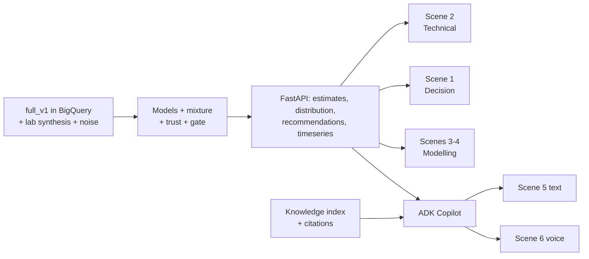

# Demo Flow: FCC Soft-Sensor Decision Cockpit

> **Companion documents:** [Features](features.md) · [Behaviour spec](BDD.md) · [SDD](SDD.md) · [Build guide](build.md) · [Checklist](checklist.md) · [Demo case](BCC.md)
>
> **Purpose:** the step-by-step script of the final demo: what is on screen, what the presenter says, and which data and code make each step work. **This is the top-level source of truth for scope.** If a feature is not needed for a step here, it is not on the demo critical path. Build order (build.md) is derived from this file.

---

## 1. The Story in One Line

**"Your LCO cut point is measured every 8 hours. Between samples, operators run blind and keep a safety margin. This cockpit estimates it every minute, tells you when you can trust the estimate, recommends a move when it's safe, and refuses to recommend one when it isn't."**

- **Decision shown:** D2 is where to set the LCO (and heavy naphtha) cut point. D3 is whether I can act on the estimate or must wait for the lab.
- **Not shown:** D1 (hydrotreater sulfur). The simulator has no sulfur, so this value is proven only on the refinery's own data (§6).
- **No financial figures.** All impact is technical: °F of margin to spec, P(on-spec), and LCO yield shift in % of feed.
- **Length:** 12 minutes plus Q&A. Seven scenes. Each scene works on its own, so the presenter can skip any of them.

## 2. Cast: What the Audience Sees

| Element | What it is |
|---|---|
| **Cockpit** | Next.js web app with four dashboards (**Decision · Technical · Modelling · Knowledge**) and a floating **Gemini panel** on every screen. Citations open a quick preview in the panel, and "Open in Knowledge" jumps to the full document at the cited section |
| **Gemini Copilot** | Text and voice (Gemini Live) ADK agent. It is read-only, cites simulated documents, and never invents a recommendation |
| **Data** | `full_v1`: 54 runs × ~27 h of the peer-reviewed FCC-Fractionator simulator (Santander et al., 2022), BigQuery `fcc-soft-sensor.fcc_soft_sensor.fcc_sim_minute` |
| **Provenance chip** | Always visible: `Simulated data · full_v1 · random_sNNN · hh:mm` |

## 3. Demo Data Requirements (drives run selection)

The demo run is picked from the **hold-out runs** (never used for training) after `full_v1` lands. It must contain all three moments below. If no single run has them all, scenes may use two runs.

| Moment | Needed in the data | Selection query (on `fcc_sim_minute`) |
|---|---|---|
| **M1: Blind drift** | A crude switch (`event_code = 1`) while the cut point is in manual (`cutpoint_auto = 0`). The true `LCO_T98_F` drifts ≥ 5 °F before the next lab | max \|ΔLCO_T98_F\| between consecutive `lab_sample` rows |
| **M2: Safe recommendation** | A steady period (no event for ≥ 2 h) with `LCO_T98_F` ≥ 6 °F below spec and trust GREEN | margin to spec and `event_code = 0` window |
| **M3: Withhold** | Inputs outside the training envelope, e.g. API < 21 or a feed + ROT move together, where the models disagree (W90 > limit or bimodal) | hold-out runs with `dist_feed_API` at the edge of the range |

> [!IMPORTANT]
> **Hold-out split (proposed):** random_s140-s153 (14 runs) are held out for testing and the demo. random_s100-s139 (40 runs) are for training and validation. M3 is more likely if the hold-out includes at least one run with API < 21.

---

## 4. The Script

### Scene 0: Hook and Honesty (1 min)
- **Screen:** Decision Overview. The provenance chip is highlighted.
- **Say:** *"This is a refinery FCC fractionator. The data is from a peer-reviewed physics simulator, the kind used in operator-training simulators. We use it to show behaviour, not to claim accuracy on your unit. We checked our version of the simulator against the published results: 41 of 46 signals match within 0.2%."*
- **Must be true:** the chip shows the batch, run and time. Every truth overlay is labelled "simulator truth".
- **Features:** F20, F22 · **Evidence:** `sim_octave/VALIDATION.md`

### Scene 1: Decision Overview, "Can I trust it, and what should I do?" (2 min)
- **Screen:** KPI tiles (RMSE vs lab, 90% coverage, trust mix, availability, accepted, withheld). Below them, a 12-hour LCO T98 fan chart (P5–P95) with lab dots, the spec line (765 °F) and the trust strip. On the right, **Decisions needed**.
- **Say:** *"The blue band is the soft sensor's estimate with its uncertainty. The dots are lab results, one every 8 hours. Between dots the operator normally has nothing."*
- **Click:** the recommendation card, e.g. **"Raise LCO T98 set point +4 °F · P(on-spec) 97% · margin 8.3 → 4.3 °F · LCO yield +0.3% of feed · trust GREEN · [SOP-FRAC-003 r4 §4.2]"**.
- **Click:** the citation chip. The source preview opens *inside the Gemini panel*.
- **Click:** **Accept**. A toast says *"Recorded. The cockpit never writes to the DCS."*
- **Data moment:** M2 · **Features:** F1, F2, F3, F6, D5, H3, H4 · **Backend:** `/api/overview`, `/api/recommendations`, `/api/knowledge/docs/{id}`

### Scene 2: Replay the Crude Switch, "Why a soft sensor?" (2 min)
- **Screen:** Technical → Time-Series Explorer. Linked panels:
  1. Feed API and event markers.
  2. Draw-tray temperatures.
  3. `LCO_T98_F`: simulator truth vs the soft-sensor band vs lab dots.
  4. Controller mode strip (manual / trim).
- **Click:** replay from 1 h before the crude switch at 30× speed.
- **Say:** *"A heavier crude arrives. Tray temperatures move within minutes, and the true cut point drifts. The last lab was 5 hours ago and the next is 3 hours away, so the operator doesn't see it. The soft sensor follows it within minutes. When the lab arrives, the operator trims back: this is the sawtooth your unit lives with today."*
- **Data moment:** M1 · **Features:** F8, F12 · **Backend:** `/api/runs/{id}/timeseries` (LTTB-downsampled), `/api/estimates`

### Scene 3: The Withhold, "It knows when not to be trusted" (2 min)
- **Screen:** Decision → an amber **Withheld** card: *"HN T98: Distribution spread too wide. W90 = 18.4 °F exceeds the 14.0 °F limit. No recommendation issued."*
- **Click:** **Why? → Modelling**. This deep link opens Model Confidence at the same minute: overlaid distributions (Hybrid delta, GPR, PINN ensemble, Bayesian ridge, mixture), a W90 gauge, a bimodality index and the banner.
- **Say:** *"Two models say 528 °F, one says 541 °F. The inputs are outside anything the models were trained on. Instead of averaging and guessing, the system withholds and asks for a lab sample. This is what makes it safe to put in front of an operator."*
- **Data moment:** M3 · **Features:** C7, F4, F5, B10 · **Backend:** `/api/distribution`

### Scene 4: Model Depth, for the Engineers in the Room (1.5 min)
- **Screen:** Modelling → Model Comparison. It shows a per-model table (status, weight, RMSE, 90% coverage, CRPS), a parity plot, residuals over time, error by regime, GPR length-scales and the hybrid physics-vs-Δ split.
- **Say:** *"Every model has to beat a plain regression to get weight. We test on held-out runs and hold out one crude family at a time. These are simulated numbers, so they show method, not your accuracy."*
- **Features:** F21, F9, B1, B4, B5, B6, B9 · **Backend:** `/api/models`, `/api/calibration`

### Scene 5: Gemini Copilot, Text (1.5 min)
- **Screen:** the Gemini panel, over any dashboard.
- **Ask:** *"Why was the HN recommendation withheld at 08:42?"* The answer streams, with tool calls visible (distribution, trust breakdown) and a citation chip.
- **Ask:** *"Has this happened before?"* The answer lists similar past events (a WO, an INC, a shift log) with `[DOC-ID rN §x.y]` citations.
- **Click:** a citation chip, then **Open in Knowledge**. The Knowledge dashboard opens the full document at the cited section, next to the related records for this run (work orders, shift logs, MOCs).
- **Must be true:** every citation resolves. Below the relevance threshold the answer says "No cited source".
- **Features:** E5, F13, H2, H3, H5 · **Backend:** `/api/copilot/chat` (SSE), ADK agent, knowledge index

### Scene 6: Voice with Gemini Live, and the Guardrail (1 min)
- **Click:** the microphone in the Gemini panel (push-to-talk).
- **Say to it:** *"Where is the LCO cut point right now, and can I trust it?"* It gives a spoken answer with the trust level.
- **Say to it:** *"Just give me a heavy naphtha set point anyway."* It refuses, reading the gate message verbatim: no set point while WITHHELD.
- **Features:** F23, E5 · **Backend:** `/api/live` WebSocket, `gemini-live-2.5-flash-native-audio` (us-central1)

### Scene 7: Close, "What's real, and the ask" (1 min)
- **Say:**
  - Simulated in this demo: the plant data and the documents.
  - Real: the method, the gating and the architecture on Google Cloud (BigQuery, Vertex AI, Gemini, ADK, Cloud Run).
- **The ask:** *"Give us 6 weeks of historian and LIMS data from one FCC. We backtest offline, with no connection to your control system, and report accuracy per crude and the margin we could safely recover. The hydrotreater sulfur case (D1) is proven on your data in the same exercise."*

---

## 5. Build Critical Path (derived from the scenes)

| Order | Build | Unlocks |
|---|---|---|
| 1 | Load `full_v1` · lab synthesis (8-hourly, ASTM reproducibility noise) · process-measurement noise | Every scene |
| 2 | FastAPI: runs, tags, timeseries · Technical Time-Series Explorer page | Scene 2 (truth + labs only) |
| 3 | Bayesian ridge → GPR → Hybrid delta → PINN · mixture · Kalman bias | Scenes 1–4 bands |
| 4 | Trust score · spread gate · recommendation engine | Scenes 1, 3 |
| 5 | Decision and Modelling pages | Scenes 1, 3, 4 |
| 6 | Knowledge index + ADK Copilot (text) | Scene 5 |
| 7 | Gemini Live proxy | Scene 6 |
| 8 | Demo-run selection · rehearsal · fallbacks | All |

## 6. Fallbacks (the demo must never stall)

| If this fails | Do this |
|---|---|
| BigQuery or API slow | The API serves a cached parquet snapshot of the demo run (`artifacts/demo_cache/`) |
| Gemini Live unavailable | Use the same question in the text Copilot (Scene 5) |
| Copilot slow (> 3 s to first token) | Pre-recorded answer chips for the two scripted questions, labelled "cached" |
| Withhold moment not in the chosen run | Switch the run picker to the backup run that contains M3 |
| Network down | Local API + cached data + screen recording of Scenes 5–6 |

## 7. Things We Never Say
- "The model is X °F accurate." Say "on simulated data the method achieves…, and your accuracy comes from the backtest."
- Any dollar or margin value. Use technical impact only.
- "The AI controls the unit." Say "it advises; a human accepts; nothing writes to the DCS."

## 8. Pre-Demo Checklist
- [ ] Demo run and backup run chosen from the hold-out; minutes for M1, M2 and M3 noted in `config.yaml` (`demo:` block)
- [ ] Cache warmed; the cockpit loads in ≤ 2 s
- [ ] Both Copilot scripted questions return cited answers; voice probe passes
- [ ] Theme set (dark for the room, light for projectors if needed)
- [ ] Provenance chip visible in every screenshot
