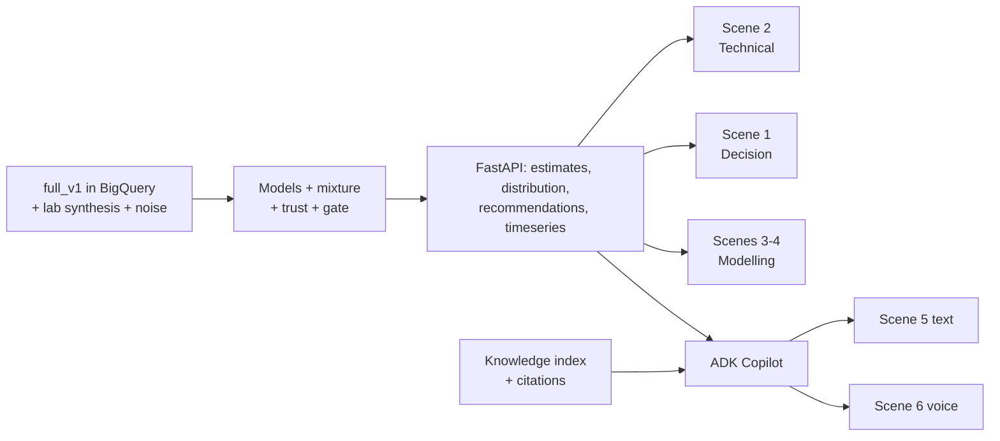

# Demo Flow: FCC Soft-Sensor Decision Cockpit

> **Companion documents:** [Features](features.md) · [Behaviour spec](BDD.md) · [SDD](SDD.md) · [Build guide](build.md) · [Checklist](checklist.md) · [Demo case](BCC.md)
>
> **Purpose:** the step-by-step script of the final demo: what is on screen, what the presenter says, and which data and code make each step work. **This is the top-level source of truth for scope.** If a feature is not needed for a step here, it is not on the demo critical path. Build order (build.md) is derived from this file.

---

## 2026-10-06 story-first pitch — the story of a refinery, then follow the oil (6 Oct; supersedes the scene order below)

Owner, 6 Oct 2026: 04:32 *"they gave us the value figures. It's them not ours, so we can keep them, otherwise they may feel we are not listening or we are not focussing on the high value use cases"*; 05:52 *"going use case by use case is not the most optimal … I am still missing … the story of a refinery … should I not read the story of the refinery first and then go? then … how we are helping in taking those decisions … the first decision is what should be the temp of furnace, which first and foremost is decided based on the input crude"*; 05:55 "sure" (restructure); 06:03 "update the relevant files that define the build". Context: [use_cases/important_context.ipynb](use_cases/important_context.ipynb).

**Full click-by-click script, lines to say, close, Q&A and pre-flight: [use_cases/PRESENTER_PACK.md](use_cases/PRESENTER_PACK.md).** Facts: [DECISIONS.md](DECISIONS.md) §0A.

> **Front Overview page (proposed, 6 Oct 06:53 — SDD §14.6E):** once built, `/platform` opens on **the refinery** (what happens, crude in → products out), with IOCL's use cases pinned where they fit and what we built shown as status dots; the FCC is highlighted and opens `/twin`. Below it, an expandable **Decisions the platform enables** section answers "how does it actually work?" for each of the nine decisions. Until it is deployed, use the slide / `use_cases/INDEX.md`.

| Act | Screen | Run · minute | What happens | IOCL rows |
|---|---|---|---|---|
| 1 Story of a refinery (90 s) | none / one picture | — | Crude → CDU/VDU → heavy gas oil → **FCC** → petrol, diesel, LPG → treating & blending. Six FCC units in one breath. Three gaps: quality (lab every 8 h), crude (changes every 12–48 h), time lag (2–3 h across consoles) | — |
| 2 What you asked (60 s) | slide / `use_cases/refinery_optimisation_use_cases.md` | — | IOCL's list **with IOCL's figures, attributed**, laid out along the oil's path, our status per row | all |
| 3 One data foundation (90 s) | **Overview** `/platform` | — | Six layers; "your DCS handles the seconds, nobody has the hours"; person in the loop; MeitY | — |
| Map | **FCC Complex** `/twin` | `random_s107` 10:00 | What went wrong; pins Decide ×4, Watch ×1 | #6 |
| Stop 1 Feed arrives | U4 step ② (crude block) | s107 10:00 | D4 which feed, is the switch done (scripted) | Feed |
| Stop 2 Furnace | U1 | s107 10:00 | D6 preheat +1.5 °F (gain measured, chance scripted) | #5, #10 |
| Stop 3 Riser | U2 | s107 10:00 | D8 watch: conversion +0.5 % | #8, #9 |
| Stop 4 Regenerator | U3 | s107 10:00 | D5 air −0.03 lb/s (scripted) | #4 |
| Stop 5 Fractionator | U4 step ③ | s107 10:00 | **D1 live**: HN −1.0 °F, 91 → 95 %, Accept | **#1, #11** |
| Stop 6 Gas plant & stabiliser | U5 (+ U6) | s107 10:00 | D7 overhead +1.5 °F (scripted); fouling signal | #2, #3, #7 |
| Stop 7 Whole FCC | FCC Complex | s107 10:00 | One crude switch, six units, consequences in the next unit | #6 |
| Stress test 1 | U4 | `random_s144` 10:00 | Held-out run: LCO +2.5 °F | #1 |
| Stress test 2 | U4 | s144 **12:00** | **"Not yet"** (spread 17.3 > 14 °F), Pull sample, Ask Gemini | #11 |
| Stress test 3 | **Decision record** `/audit` | — | Accepts + withheld rows | all |
| Close | slide / `/platform` | — | Back to IOCL's list: real · scripted · not built; pilot ask | all |

Why: the room (and our own team) needs the refinery before the FCC and the FCC before a decision card; following the oil shows the systems effect (the furnace move at stop 2 lands at stops 4 and 6) instead of arguing it; the live proof (fractionator, then "Not yet") becomes the climax. Never go past 12:20 on `random_s107`.

---

## 2026-10-03 pitch spine — new Scene 0 "Overview" (3 Oct)

Owner, Voice Note 12 (3 Oct, 03:24 UTC): tying the platform back to IOCL's use cases is **the single most critical task**. Full analysis in [verbatim.md](verbatim.md) Part 10. The UI is a façade; the brain is modular: one lakehouse → data processing → models (ML / PINN) → detection, checks and optimiser shared across use cases (6 Oct: not one agent per use case) → decisions with a person in the loop → the whole refinery optimised. No agents act on the plant. MeitY: Category A stays on site; de-identified data becomes Category B.

**Scene 0 — Overview (`/platform`, ~60 s).** `/` now redirects here.
1. Point left to right along the six layers. **Line for the room:** *"What you see is one screen. Behind it: AI and physics — a crude classifier, a four-model soft sensor including a physics-informed neural network, anomaly detection on every unit and an optimiser — sharing one source of truth across your use cases. They advise; your operators decide."*
2. Run a finger down the use-case cards: "Each of the use cases you gave us has an owner agent and a decision on screen. Green is live on real models; amber is a scripted outcome on real inputs; the grey card is what we have not claimed."
3. Person-in-the-loop band: "Today it only advises. Nothing is written to your control system."
4. MeitY band: "Category A stays in the refinery; an edge gateway de-identifies; only Category B leaves, to India regions. Designed for MeitY — this demo uses simulated data only."
5. Click **Open the refinery** → Scene A (refinery top view).

Never say: "agents act", "MeitY-certified", "real IOCL data", "modular services in production" (say *"modular by design; deployed as one service for this demo"*).

### 2026-10-03 05:00 — "How do we know?" — talk track for the probing questions

Owner, 04:24: *"no flow of how will we actually know if a particular parameter will actually maximise the yield? … they will ask probing questions. Is our system answering those questions?"* Answer: partly — predict and decide were built; measure-and-learn was not shown, and the crude classifier in the demo is scripted. Owner, 04:58: "yes add".

- **Scene 0 (Overview):** end on the band "How do we know a move works?": *"We don't ask you to trust the first prediction. Every move goes predict, decide, measure, learn. On your plant a short pilot proves each lever first."*
- **Fractionator step ②:** point at the crude walkthrough: new crude 06:25, behaviour shifts until 07:25, named at 07:37 after a 15-minute hold. It's labelled scripted. Say *"the name follows your lab assay; the unit's behaviour confirms it."* Don't volunteer the 8-of-15 classifier figure; use `PROBING_QUESTIONS.md` B2 only if pressed.
- **Furnace step ④:** scroll to the proof loop: Predict (scripted gain), Decide (built), Measure (shown), Learn (pilot). Then the evidence: recipe fed back through the simulator.
- Keep `PROBING_QUESTIONS.md` open on a second screen.

## 2026-10-02 agreement (supersedes earlier UI sections where they conflict)

> **Source:** owner 09:48–11:34 UTC 2 Oct + Voice Note 11 ([verbatim.md](verbatim.md) Part 9.5). This walk-through **replaces §1 "Screens", §2 Cast and §4 Scenes 0–7 where they conflict** (L0 Refinery Twin / L1 Unit Workbench / Audit log → Home / Unit page / Decision record). §3 data requirements, §6 fallbacks, §7 things we never say and §8 checklist still apply.
>
> **Checked against the running API on 2 Oct 17:32, after the valid-range retrain** (`GET /api/decisions`):
> - `random_s107` t 600 (10:00): 5 open (D6 preheat +1.5 °F, D1 lower heavy-naphtha cut point −1.0 °F 530.3 → 529.3, D5 regenerator air −0.03 lb/s, D7 overhead temperature +1.5 °F, D9 extra LCO + HN samples, spread 19.2 °F), D2 LCO "Not yet", D3 recipe withheld (spread above the limit), 1 watch (D8).
> - `random_s144` t 600 (10:00): D1 raise LCO cut point +2.5 °F (752.8 → 755.2) and HN +2.5 °F, D5, D7, D9 and the D3 recipe (scripted: riser outlet +3.5 °F, LCO T98 −1.0 °F, HN T98 +1.0 °F) open; 1 watch.
> - `random_s144` t 720 (12:00): D2 "Not yet" for LCO and HN, D3 withheld, D9 extra samples (spread 17.3 °F).
>
> So the **recipe and lever scenes (D–G) use `random_s144` at 10:00** and the **honesty scene (H) uses `random_s144` at 12:00**. s107 no longer shows a recipe at 10:00.

**Story in one line:** *"Every screen starts with the decision; the data that backs it is one step below. When the models cannot back a decision, the cockpit says 'Not yet' and why."* No value figures. No role views. Accept / Hold / Decline writes the record only.

| # | Screen · run · minute | What the audience sees | Say | Backend |
|:-:|:---|:---|:---|:---|
| A | **Home** `/twin` · `random_s107` · t 600 | Top view of the six units (Feed furnace → Riser reactor → Regenerator → Main fractionator → Gas plant → Stabiliser), no left bar. | *"This is the FCC as one system. Nothing to read yet except where it hurts."* | `GET /api/twin` |
| B | Home | **What went wrong**, one line (crude switched to R4 Light at 07:37, fractionator HN off plan, riser conversion +0.5 %); the fractionator glows; pins on units: "Decide" on furnace, regenerator, fractionator, gas plant; "Watch" on the riser; "Not yet" on the LCO cut point. | *"The crude switched; the plant tells us before the lab does. Each unit gets its own move — and the riser is only watched, because nothing needs moving there yet."* | `GET /api/decisions` |
| C | Home | The D1 decision: *Lower heavy-naphtha cut point −1.0 °F (530.3 → 529.3)* with Accept / Hold 30 min, one quiet line *IOCL use case · FCC product-quality inferential*. Under the drawing the flow ①–④: anomaly detection → soft-sensor committee + crude model → trust checks → set-point search → Gemini. Use-case band at the bottom. | *"Decision first. Underneath: which agent saw it, which models estimated it, which checks passed, how the move was found — and which of your use cases it is."* | `GET /api/decisions`, `GET /api/decisions-coverage` |
| D | **Unit page** `/twin/unit/unit_4_fractionator` · **`random_s144`** (hold-out) · t 600 | **① Data in / out:** the column drawing with live tray temperatures, pumparounds `MV_PA1..4` and the two levers `SP_HN_T98`, `SP_LCO_T98`; how fresh each reading is (sensor every minute, lab every 8 h). | *"A run the models never saw. These are the numbers the decision stands on, and how old each one is."* | `GET /api/unit/unit_4_fractionator/workbench` |
| E | Unit page | **② What we observe:** live vs expected band; the four models' bell curves against plan and spec with P(on-spec); the crude block. | *"Four different models, one answer, and the spread is inside 14 °F — so we are allowed to advise."* | workbench + `GET /api/distribution` |
| F | Unit page | **③ Decision and lever:** D1 *Raise LCO cut point +2.5 °F (752.8 → 755.2)* (half move, amber) with the lever `SP_LCO_T98`, what-if slider, lever ranges, Accept / Hold / Decline; D9 "pull an extra sample"; D3 recipe for the new crude (riser outlet +3.5 °F, LCO T98 −1.0 °F, HN T98 +1.0 °F; tagged *scripted outcome*). Click **Accept** → toast: recorded in the decision record only. | *"A person decides. Nothing is written to the control system."* | `POST /api/decisions/{id}/act` |
| G | Unit page | **④ How the move is found:** agent → crude model → response model → trust checks → set-point search → Gemini; every check with value, limit, pass / fail; what sets the size of the move (goal vs SOP step vs room). Footer: this shift on the unit, IOCL use cases, actions taken. | *"It moves the cut to its target, never below 95 % chance on spec, inside the SOP step — and you can see which limit set it."* | `GET /api/decisions/{id}` |
| H | Unit page · **`random_s144`** · **t 720 (12:00)** | D2 *"Not yet — hold the LCO cut point; the estimate is too uncertain (spread W90 above the 14 °F limit)"*, the same for heavy naphtha; D3 *"No coordinated recipe yet"*; D9 asks for samples instead. | *"Two hours later the models disagree, so the cockpit asks for a lab instead of averaging four guesses."* | `GET /api/decisions` |
| I | Furnace · Regenerator · Gas plant (`random_s107`, t 600) | D6 feed preheat +1.5 °F (sets catalyst-to-oil and regenerator temperature for the new crude), D5 regenerator air −0.03 lb/s (excess O₂ / afterburn), D7 overhead temperature target +1.5 °F to keep the fouled condenser inside its cooling duty (cooling water stays at fixed duty) — each with the same four steps; all tagged *scripted outcome*. Each lever row says it is one of the main settings operators adjust on that unit; the line under it lists what the cockpit never recommends (cooling-water flow, feed rate, catalyst addition). | *"Same pattern on every unit: what we saw, the move, why that size, and what it does downstream. And we only ever recommend settings your operators actually move."* | `GET /api/decisions` |
| J | **Decision record** `/audit` | The Accept from F, plus every time the trust checks held advice back. Return to `/twin`. **Before the demo the record must be empty of test clicks** (see §8). | *"Who decided what, when, on which unit — and every time the AI held back."* | audit log |

**Gemini** (any screen): "Explain this decision and what happens if I hold" — in English, Hinglish or Hindi (unchanged from Scene 6).

**Scripted outcomes (owner decision, 2 Oct 13:56):** 1.5 months of simulated data cannot honestly train the crude classifier and per-unit response models, so the classifier (93 %, detected 12 min after the switch ends) and the D3 / D5–D7 moves are scripted to show what the verbatim expects. Inputs are the real simulator data. The top-bar pill reads *scripted outcomes* and each scripted move carries a tag. Stay before **12:20** on the Scenario control (simulator LCO data is corrupt after that in s107).

> [!WARNING]
> Never say on stage: dollar or rupee figures; "reformer", "LPG splitter", "CDU" (not in this build); cat-to-oil or excess-O₂ *as set points* (they are effects of preheat and regenerator air, not levers in the simulator); cooling-water flow, feed rate or catalyst addition as recommendations; ROT targets above 985 °F (outside the allowed range).

---

## 1. The Story in One Line

**"The refinery changes crude every day or two, and every unit runs on yesterday's settings for hours. This twin detects the new crude from the plant's own response, resets its lab bias, tells each unit what to move — with the consequence in plant units — and refuses when the models disagree."**

- **Decision shown:** per unit, the coordinated multi-set-point **recipe** after a crude switch (U4 cut points first; U1/U3/U5/U6 the same way), and whether it may be acted on (spread gate) or must wait for a lab.
- **Not shown:** D1 (hydrotreater sulfur) — the simulator has no sulfur; proven on the refinery's own data (§6).
- **No financial figures.** All impact is technical: °F to spec, P(on-spec), yield shift in % of feed, fuel / power / coke deltas.
- **Length:** 12 minutes plus Q&A. Scene 0 plus seven scenes. Each scene stands alone, so the presenter can skip any of them.
- **Screens:** two levels only — **L0 Refinery Twin** (`/twin`) and **L1 Unit Workbench** (`/twin/unit/{unit_id}`) — plus the Audit log. The former Decision / Technical / Modelling / Knowledge dashboards are retired from navigation (SDD-L1-05, D3); their routes still resolve for citations.

## 2. Cast: What the Audience Sees

| Element | What it is |
|---|---|
| **L0 Refinery Twin** | Six live units on the flow sheet (status pill, KPI vs plan), crude-slate banner (declared API vs detected regime, transition %, novelty), plant strip, **Needs attention** rail (one consequence line per open event, in flow order) and the 12-hour shift timeline. No charts by design. |
| **L1 Unit Workbench** | One screen per unit: header + I/O strip → five panels on **one cursor** (measured vs expected with 5–95 % band, residual ±3σ + CUSUM, MVs, disturbances, yields as % feed) → event ribbon → trilingual analysis strip; right rail = Regime & adaptation · Model evidence + spread gate · Optimisation (what-if sliders + P(on-spec)/Δ-yield curve) · Decision (Accept / Decline) · Ask Gemini. "More panels ▾" holds the second quality pair, tray profile (U4) and combustion (U1). |
| **Gemini Copilot** | Text and voice (Gemini Live, `hi-IN` for Hindi / Hinglish) ADK agent scoped to the open screen (plant on L0, unit on L1) but able to reach the whole refinery. Read-only, cites simulated documents, quotes WITHHELD verbatim, never invents a set point. |
| **Data** | `full_v1`: 54 runs × ~27 h of the peer-reviewed FCC simulator (Santander et al., 2022), 50 labelled crude switches; BigQuery `fcc-soft-sensor.fcc_soft_sensor.fcc_sim_minute`. **Demo run `random_s107`** (train split, R3 → R4 switch at 07:25; since the 2 Oct valid-range retrain its recipe is withheld at 10:00); **hold-out run `random_s144`** (recipe shown at 10:00, D2 "Not yet" + D3 withheld at 12:00). |
| **Provenance chip** | Always visible: `Simulated data · full_v1 · random_sNNN · t NNN min (hh:mm)` |

## 3. Demo Data Requirements (drives run selection)

The demo run is picked from the **hold-out runs** (never used for training) after `full_v1` lands. It must contain all three moments below. If no single run has them all, scenes may use two runs.

| Moment | Needed in the data | Selection query (on `fcc_sim_minute`) |
|---|---|---|
| **M1: Blind drift** | A crude switch (`event_code = 1`) while the cut point is in manual (`cutpoint_auto = 0`). The true `LCO_T98_F` drifts ≥ 5 °F before the next lab | max \|ΔLCO_T98_F\| between consecutive `lab_sample` rows |
| **M2: Safe recommendation** | A steady period (no event for ≥ 2 h) with `LCO_T98_F` ≥ 6 °F below spec and trust GREEN | margin to spec and `event_code = 0` window |
| **M3: Withhold** | Inputs outside the training envelope, e.g. API < 21 or a feed + ROT move together, where the models disagree (W90 > limit or bimodal) | hold-out runs with `dist_feed_API` at the edge of the range |

> [!IMPORTANT]
> **Hold-out split (proposed):** random_s140-s153 (14 runs) are held out for testing and the demo. random_s100-s139 (40 runs) are for training and validation. M3 is more likely if the hold-out includes at least one run with API < 21.

---

## 4. The Script

> The in-app **Demo & UI Guide** (top bar) mirrors this script scene by scene; each "Go to" pins the run and minute below. Clock: `t` minutes from run start; `hh:mm` = t / 60.

### Scene 0: Hook and Honesty (1 min) — `/twin` · random_s107 · t 600 (10:00)
- **Screen:** Refinery Twin home. Provenance chip highlighted.
- **Say:** *"A refinery changes crude every day or two. Every model and every operator setting lags that change by hours. This cockpit watches all six FCC units at once, detects the new crude from the plant's own response, resets its lab bias and tells each unit what to move — and when not to. The data is a peer-reviewed physics simulator: 54 runs, 50 labelled crude switches. We use it to show behaviour, not to claim accuracy on your unit."*
- **Must be true:** the chip shows batch, run and minute; `plotly:0` on this screen.
- **Backend:** `GET /api/twin`

### Scene 1: The crude switch arrives — L0, "Where will it hit first?" (2 min) — `/twin` · random_s107 · t 445 → 600
- **Screen:** crude banner (declared API 27.2 → detected regime), unit blocks turning WATCH in flow order, **Needs attention** lines with consequences (*"LCO heavier than spec: PA3 saturates in ~180 min if the cut point is not pulled back"*).
- **Click:** drag the shift timeline from 07:25 to 10:00 (or ▶). The banner flips to **R4 · match** at 07:39 (+14 min after the ramp). Switch the language toggle to Hinglish.
- **Say:** *"The declared crude says light Bonny; the plant's response says the same fourteen minutes after the ramp. The twin shows where the change lands first and what breaks downstream if nobody acts — before the next lab result, which is still hours away."*
- **Data moment:** crude switch R3 → R4 · **Backend:** `GET /api/twin?time_min=` (`crude_slate`, `needs_attention`, `timeline`) · **BDD-28** banner, timeline

### Scene 2: Drill into the fractionator — L1, "How do we know it is off?" (2 min) — `/twin/unit/unit_4_fractionator?tag=LCO_T98_F` · t 600
- **Click:** the **LCO T98** attention line on L0 → lands on U4 with the measured-vs-expected panel highlighted.
- **Screen:** header + I/O strip; five panels on one cursor; event ribbon (regime change 07:39, change-points 09:14 / 09:42, recipe_ready); analysis strip in the chosen language.
- **Click:** hover any panel — the dotted guide moves in all of them; click the 09:42 chip to jump the cursor; open **More panels ▾** for the HN pair and the tray temperature profile.
- **Say:** *"Measured against what the committee expects for this crude: the residual walks out, the CUSUM trips at 09:42, and the analysis strip says so in one sentence — in English, Hinglish or Hindi. One cursor, every panel, no tab-hopping."*
- **Backend:** `GET /api/unit/unit_4_fractionator/workbench` · **BDD-28** one cursor, `?uc=` / `?tag=` entry

### Scene 3: Regime & models — "The models adapted, here is the evidence" (1.5 min) — U4 rail · t 600
- **Screen:** **Crude family & bias reset** (R1–R4 bars, declared vs detected, detected at, novelty, bias reset time and offset, "model weights from held-out accuracy · not set by the crude"); **Model evidence** (member weights: ridge reference only, hybrid / PINN / GP blended, physics checks: mass closure, tray monotonic, reactor balance; **Spread gate PASS · W90 13.7 / 14**).
- **Say:** *"No retraining in the loop. The three blended models are weighted by their accuracy on recent labs, the lab bias resets after the switch, and the gate only passes when the models agree within fourteen degrees."*
- **Backend:** `regime`, `models` blocks of the workbench payload (SDD-REG, SDD-ADP)

### Scene 4: Optimisation & decision — "What to move, by how much, and the consequence" (2 min) — U4 · **random_s144** · t 600
> **2 Oct 17:32:** this scene now runs on `random_s144` at 10:00 (D1 raise LCO cut point +2.5 °F; scripted D3 recipe riser outlet +3.5 °F, LCO T98 −1.0 °F, HN T98 +1.0 °F). The numbers in the bullets below are from the earlier build.
- **Screen:** **Optimisation** — three sliders (SP_LCO_T98 755.3 → 745.3, SP_HN_T98 530.3 → 525.6, SP_T_riser_ROT 969 → 974) with the P(on-spec) / Δ-yield curve and effects (yield shift +0.72 % feed, fuel, power, coke). **Decision GREEN**: *LOWER SP_LCO_T98 −2.0 °F* with rationale, systems ripple, `[SOP-frac-014 r3 §4.2] [LAB-001 r3 §2.1]`.
- **Click:** drag the LCO slider (curve and effects update live) → click a citation chip → **Accept** → toast confirms the audit entry; nothing is written to the DCS.
- **Say:** *"The recipe is a coordinated multi-set-point move with its yield and energy consequence in plant units, not money. A human accepts it; the audit log keeps the record."*
- **Backend:** `recipe`, `POST /api/unit/{id}/whatif`, `POST /api/twin/decision` (SDD-RCP)

### Scene 5: The withhold — "It knows when not to be trusted" (1.5 min) — U4 · **random_s144** · t 720 (12:00)
- **Click:** move the clock to 12:00 on `random_s144` (or the guide's "Go to").
- **Screen:** D2 *"Not yet — hold the LCO cut point; the estimate is too uncertain (spread W90 above the 14 °F limit)"*, the same for heavy naphtha, and D3 *"No coordinated recipe yet"*; D9 asks for extra samples — hold set points, request a lab.
- **Ask Gemini:** *"Why is the recipe withheld right now? Quote the gate message."* — it quotes verbatim and refuses a set point.
- **Say:** *"When the committee disagrees, the system withholds and asks for a lab instead of averaging four guesses. This refusal is what makes it safe in front of an operator."*
- **Data moment:** M3 · **Backend:** `gate.committee_gate` (SDD-GATE), `get_recipe` tool

### Scene 6: Gemini on the open screen — text, Hindi-first, voice (1.5 min) — U4 · random_s107 · t 600
- **Screen:** **Ask Gemini** card with screen-scoped suggestions; drawer shows the screen chip (*Fractionator · t 600*). Toggle **हिंदी**: briefing and suggested prompts switch to Hindi.
- **Click:** a Hindi chip (*"क्या यह पहले हुआ है?"*) → answer with tool calls and `[DOC-ID rN §x.y]` citations. Press the mic (Gemini Live, `hi-IN`): *"LCO cut point abhi kahan hai, aur bharosa kar sakte hain?"* Then the guardrail: *"Just give me a set point anyway."*
- **Say:** *"Gemini answers about the screen you are on first — this unit, this minute — but can reach the whole refinery when asked. In the control room that conversation happens in Hindi, hands-free."*
- **Backend:** `POST /api/copilot/chat` (SSE, `context.screen`), `WS /api/live` (SDD-GEM-01..04)

### Scene 7: Close — what is real, and the ask (1 min) — `/audit`
- **Screen:** the accepted decision from Scene 4 in the audit log (actor, time, recipe id). Return to `/twin`.
- **Say:** *"Simulated here: the plant data and the documents. Real: the regime detection, the committee and gate, the recipe engine and the Google Cloud architecture — BigQuery, Vertex AI, Gemini, ADK. The ask: six weeks of historian and LIMS data from one FCC. We backtest offline, no connection to your control system, and report per-crude accuracy and the margin that could be safely recovered."*

---

## 5. Build Critical Path (derived from the scenes)

| Order | Build | Unlocks |
|---|---|---|
| 1 | Load `full_v1` · lab synthesis (8-hourly, ASTM reproducibility noise) · process-measurement noise | Every scene |
| 2 | FastAPI: runs, tags, timeseries · Technical Time-Series Explorer page | Scene 2 (truth + labs only) |
| 3 | Bayesian ridge → GPR → Hybrid delta → PINN · mixture · Kalman bias | Scenes 1–4 bands |
| 4 | Trust score · spread gate · recommendation engine | Scenes 1, 3 |
| 5 | Decision and Modelling pages | Scenes 1, 3, 4 |
| 6 | Knowledge index + ADK Copilot (text) | Scene 5 |
| 7 | Gemini Live proxy | Scene 6 |
| 8 | Demo-run selection · rehearsal · fallbacks | All |

## 6. Fallbacks (the demo must never stall)

| If this fails | Do this |
|---|---|
| BigQuery or API slow | The API serves a cached parquet snapshot of the demo run (`artifacts/demo_cache/`) |
| Gemini Live unavailable | Use the same question in the text Copilot (Scene 5) |
| Copilot slow (> 3 s to first token) | Pre-recorded answer chips for the two scripted questions, labelled "cached" |
| Withhold moment not in the chosen run | Switch the run picker to the backup run that contains M3 |
| Network down | Local API + cached data + screen recording of Scenes 5–6 |

## 7. Things We Never Say
- "The model is X °F accurate." Say "on simulated data the method achieves…, and your accuracy comes from the backtest."
- Any dollar or margin value. Use technical impact only.
- "The AI controls the unit." Say "it advises; a human accepts; nothing writes to the DCS."

## 8. Pre-Demo Checklist
- [ ] Demo run and backup run chosen from the hold-out; minutes for M1, M2 and M3 noted in `config.yaml` (`demo:` block)
- [ ] Cache warmed; the cockpit loads in ≤ 2 s
- [ ] Both Copilot scripted questions return cited answers; voice probe passes
- [ ] Theme set (dark for the room, light for projectors if needed)
- [ ] Provenance chip visible in every screenshot
- [ ] Decision record cleaned of test clicks: from `cockpit/api` run `.venv/bin/python scripts/reset_decision_record.py` (archives `artifacts/audit.db` to `artifacts/audit_archive/` first; keeps the system's trust-check entries). Last run 3 Oct 03:26 — 0 human clicks, 139 "withheld by checks"
- [ ] Home page source line reads **BigQuery** (not "Local copy"); if a lake load ran while the API started, restart the API once

---

## 9. v2 Expansion Scenes: Systems-Thinking Digital Twin ("The Whole Elephant") & 11-Use-Case Catalogue

> [!NOTE]
> **Superseded (2026-10-01).** The "Systems Twin" mode and the 11-pill catalogue described below were the Phase-13 screens; they are now folded into **L0** (Scene 1 — the connected six-unit flow sheet with loops and ripple) and **L1** (Scenes 2–5 — every use case opens its owning unit via `?uc=UC-NN`, e.g. `/twin/unit/unit_1_furnace?uc=UC-05` lands on the combustion panel). Kept for the talk-track wording only.

> **Why These Two Scenes Complete the Plant Head Pitch:**
> Scenes 0–7 prove deep statistical rigour on cut points (`LCO_T98_F` and `HN_T98_F`). Scenes 8 and 9 show that **the exact same 112-column simulator, PINN/ML committee, safety gate, and RAG corpus operate as a holistic Refinery Digital Twin** that solves **all 11 core requirements** in [`refinery_optimisation.md`](refinery_optimisation.md) without siloed sub-optimisation.

### Scene 8: Systems-Thinking Digital Twin — "The Whole Elephant" (2.5 min)
- **Screen:** Decision Overview (`🌐 Systems Twin` mode) showing the **Interactive 6-Unit Connected Refinery Digital Twin Schematic**:
  `[Unit 1: Preheat Furnace] ──► [Unit 2: Riser Reactor] ◄──► [Unit 3: Regenerator & Main Air Blower] ──► [Unit 4: 20-Tray Main Fractionator & PA1–4] ──► [Unit 5: Overhead Condenser & WGC] ──► [Unit 6: Stabiliser & Light-Ends Gas Plant]`
- **Say:** *"Your requirement list has 11 use cases across Yield, Regeneration, Energy, and Reliability. If you build 11 separate point models, they fight each other—because in a real refinery, Energy is dictated by the optimal Yield targets chosen by the Plan, and both are bounded by Regenerator coke burn, Condenser UA fouling, and Compressor headroom. Here is the whole elephant on one connected first-principles + PINN Digital Twin."*
- **Click:** **Unit 6 (Stabiliser & Light-Ends)** or **Unit 4 (Main Fractionator)** at a steady minute (`t = 125`), then inspect the **4-Domain Systems Ripple Matrix** on the Recommendation Card:
  1. **Yield & Cutpoint Impact (`#1, #2, #3, #11`):** Shows `LCO_T98_F` margin to spec, `HN_T98_F` split, and **Stabiliser $C_5$ recovery (`eff_C5 / (eff_C4 + eff_C5)`)**.
  2. **Plan-Coupled Energy & Fouling Impact (`#5, #6, #7`):** Shows how the reflux/cutpoint move changes **Pumparound heat recovery (`MV_PA1..4`)**, **Preheat Furnace firing (`F5_fuel`, `fluegas_O2_pct`, `fluegas_CO_ppm`)**, and **Overhead Condenser duty (`dist_condenser_eff`)**.
  3. **Catalyst & Regeneration Impact (`#4`):** Shows **Spent/Regen carbon (`C_spent_cat`, `C_regen_cat`)**, **Coke burn (`F_coke`)**, and **Cyclone Afterburn margin (`dT_cyc_reg_F = Tcyc_F - Treg_F < 12 °F` IOW)**.
  4. **Rotating Equipment, Valves & Sensor Integrity (`#8, #9, #10`):** Shows **Main Air Blower (`power_CAB`)**, **Wet Gas Compressor (`power_WGC`)**, **Hydraulic $\Delta P$ (`dP_reactor_frac`)**, **Valve positions (`valve_V8..11`)**, and **Dual-Sensor Drift (`|T - T_dup|`)**.
- **Features:** I1, I2, I3 · **Backend:** `GET /api/twin`

### Scene 9: Use-Case-by-Use-Case Catalogue Explorer — "All 11 Requirements Live" (2.5 min)
- **Screen:** Click the **`📋 Use-Case Catalogue (#1–#11)`** mode/tab (or use the 11-pill selector bar).
- **Say:** *"Under the hood, the exact same data and PINN/Agentic engine powers every single item on your requirement list. Let's step through them use-case by use-case."*
- **Click through the 4 Value Pillars (all technical units, zero currency):**
  1. **Use Case #2 (Stabiliser Overhead $C_5$ Recovery):** Show `c5_recovery_pct` (`eff_C5` vs `eff_C4`), the 3-Zone Operating Envelope (`Excess Reflux Energy Loss` ↔ `Optimal C5 Recovery Window` ↔ `C5 Slippage to LPG`), and the gated `SP_T_overhead` / `MV_reflux_ratio` recommendation citing `[SOP-FRAC-002]`.
  2. **Use Case #4 (Reactor Regeneration & Cyclone Afterburn):** Show `dT_cyc_reg_F`, `C_spent_cat`, `C_regen_cat`, and `F_coke` against `[IOW-FCC-02]` and `[SOP-FCC-005]`.
  3. **Use Case #5 & #7 (Fired Heater $CO/O_2$ Combustion & Condenser UA Fouling):** Show `fluegas_O2_pct`, `fluegas_CO_ppm`, `T3_furnace_F`, and `dist_condenser_eff` degradation citing `[SOP-FCC-006]`, `[IOW-HX-03]`, and Bundle Cleaning Work Order `[WO-24031]`.
  4. **Use Case #8 & #9 (Hydraulic $\Delta P / F^2$, Compressors `CAB`/`WGC`, Valve Stiction & Sensor Drift):** Show the Dual-Sensor Drift Matrix (`|T2 - T2_dup|`, `|Tr - Tr_dup|`, `|Treg - Treg_dup|`, `|P5 - P5_dup|`), compressor loads (`power_CAB`, `power_WGC`), and valve stiction surveillance citing `[WO-24133]`, `[WO-26049]`, `[WO-24058]`, and `[INC-0733]`.
- **Ask Gemini Live / Copilot:** *"Give me a systems-thinking summary across all 6 units and tell me if any exchanger fouling, afterburn, or sensor drift is constraining our yield plan right now."*
- **Features:** I4–I12, E5, F23 · **Backend:** `GET /api/twin`, `POST /api/copilot/chat`, `WS /api/live`
