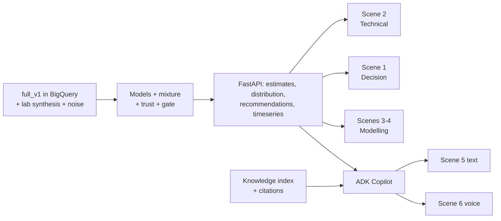

# Demo Flow: FCC Soft-Sensor Decision Cockpit

> **Companion documents:** [Features](features.md) · [Behaviour spec](BDD.md) · [SDD](SDD.md) · [Build guide](build.md) · [Checklist](checklist.md) · [Demo case](BCC.md)
>
> **Purpose:** the step-by-step script of the final demo: what is on screen, what the presenter says, and which data and code make each step work. **This is the top-level source of truth for scope.** If a feature is not needed for a step here, it is not on the demo critical path. Build order (build.md) is derived from this file.

---

## 1. The Story in One Line

**"The refinery changes crude every day or two, and every unit runs on yesterday's settings for hours. This twin detects the new crude from the plant's own response, re-weights its models, tells each unit what to move — with the consequence in plant units — and refuses when the models disagree."**

- **Decision shown:** per unit, the coordinated multi-set-point **recipe** after a crude switch (U4 cut points first; U1/U3/U5/U6 the same way), and whether it may be acted on (spread gate) or must wait for a lab.
- **Not shown:** D1 (hydrotreater sulfur) — the simulator has no sulfur; proven on the refinery's own data (§6).
- **No financial figures.** All impact is technical: °F to spec, P(on-spec), yield shift in % of feed, fuel / power / coke deltas.
- **Length:** 12 minutes plus Q&A. Scene 0 plus seven scenes. Each scene stands alone, so the presenter can skip any of them.
- **Screens:** two levels only — **L0 Refinery Twin** (`/twin`) and **L1 Unit Workbench** (`/twin/unit/{unit_id}`) — plus the Audit log. The former Decision / Technical / Modelling / Knowledge dashboards are retired from navigation (SDD-L1-05, D3); their routes still resolve for citations.

## 2. Cast: What the Audience Sees

| Element | What it is |
|---|---|
| **L0 Refinery Twin** | Six live units on the flow sheet (status pill, KPI vs plan), crude-slate banner (declared API vs detected regime, transition %, novelty), plant strip, **Needs attention** rail (one consequence line per open event, in flow order) and the 12-hour shift timeline. No charts by design. |
| **L1 Unit Workbench** | One screen per unit: header + I/O strip → five panels on **one cursor** (measured vs expected with 5–95 % band, residual ±3σ + CUSUM, MVs, disturbances, yields as % feed) → event ribbon → trilingual analysis strip; right rail = Regime & adaptation · Model evidence + spread gate · Optimisation (what-if sliders + P(on-spec)/Δ-yield curve) · Decision (Accept / Decline) · Ask Gemini. "More panels ▾" holds the second quality pair, tray profile (U4) and combustion (U1). |
| **Gemini Copilot** | Text and voice (Gemini Live, `hi-IN` for Hindi / Hinglish) ADK agent scoped to the open screen (plant on L0, unit on L1) but able to reach the whole refinery. Read-only, cites simulated documents, quotes WITHHELD verbatim, never invents a set point. |
| **Data** | `full_v1`: 54 runs × ~27 h of the peer-reviewed FCC simulator (Santander et al., 2022), 50 labelled crude switches; BigQuery `fcc-soft-sensor.fcc_soft_sensor.fcc_sim_minute`. **Demo run `random_s107`** (train split, R3 → R4 switch at 07:25, recipe ISSUED at 10:00); **withhold run `random_s144`** (hold-out, gate WITHHELD at 10:00). |
| **Provenance chip** | Always visible: `Simulated data · full_v1 · random_sNNN · t NNN min (hh:mm)` |

## 3. Demo Data Requirements (drives run selection)

The demo run is picked from the **hold-out runs** (never used for training) after `full_v1` lands. It must contain all three moments below. If no single run has them all, scenes may use two runs.

| Moment | Needed in the data | Selection query (on `fcc_sim_minute`) |
|---|---|---|
| **M1: Blind drift** | A crude switch (`event_code = 1`) while the cut point is in manual (`cutpoint_auto = 0`). The true `LCO_T98_F` drifts ≥ 5 °F before the next lab | max \|ΔLCO_T98_F\| between consecutive `lab_sample` rows |
| **M2: Safe recommendation** | A steady period (no event for ≥ 2 h) with `LCO_T98_F` ≥ 6 °F below spec and trust GREEN | margin to spec and `event_code = 0` window |
| **M3: Withhold** | Inputs outside the training envelope, e.g. API < 21 or a feed + ROT move together, where the models disagree (W90 > limit or bimodal) | hold-out runs with `dist_feed_API` at the edge of the range |

> [!IMPORTANT]
> **Hold-out split (proposed):** random_s140-s153 (14 runs) are held out for testing and the demo. random_s100-s139 (40 runs) are for training and validation. M3 is more likely if the hold-out includes at least one run with API < 21.

---

## 4. The Script

> The in-app **Demo & UI Guide** (top bar) mirrors this script scene by scene; each "Go to" pins the run and minute below. Clock: `t` minutes from run start; `hh:mm` = t / 60.

### Scene 0: Hook and Honesty (1 min) — `/twin` · random_s107 · t 600 (10:00)
- **Screen:** Refinery Twin home. Provenance chip highlighted.
- **Say:** *"A refinery changes crude every day or two. Every model and every operator setting lags that change by hours. This cockpit watches all six FCC units at once, detects the new crude from the plant's own response, re-weights its models and tells each unit what to move — and when not to. The data is a peer-reviewed physics simulator: 54 runs, 50 labelled crude switches. We use it to show behaviour, not to claim accuracy on your unit."*
- **Must be true:** the chip shows batch, run and minute; `plotly:0` on this screen.
- **Backend:** `GET /api/twin`

### Scene 1: The crude switch arrives — L0, "Where will it hit first?" (2 min) — `/twin` · random_s107 · t 445 → 600
- **Screen:** crude banner (declared API 27.2 → detected regime), unit blocks turning WATCH in flow order, **Needs attention** lines with consequences (*"LCO heavier than spec: PA3 saturates in ~180 min; LCO yield −0.4 % feed if the cut point is not pulled back"*).
- **Click:** drag the shift timeline from 07:25 to 10:00 (or ▶). The banner flips to **R4 · match** at 07:39 (+14 min after the ramp). Switch the language toggle to Hinglish.
- **Say:** *"The declared crude says light Bonny; the plant's response says the same fourteen minutes after the ramp. The twin shows where the change lands first and what breaks downstream if nobody acts — before the next lab result, which is still hours away."*
- **Data moment:** crude switch R3 → R4 · **Backend:** `GET /api/twin?time_min=` (`crude_slate`, `needs_attention`, `timeline`) · **BDD-28** banner, timeline

### Scene 2: Drill into the fractionator — L1, "How do we know it is off?" (2 min) — `/twin/unit/unit_4_fractionator?tag=LCO_T98_F` · t 600
- **Click:** the **LCO T98** attention line on L0 → lands on U4 with the measured-vs-expected panel highlighted.
- **Screen:** header + I/O strip; five panels on one cursor; event ribbon (regime change 07:39, change-points 09:14 / 09:42, recipe_ready); analysis strip in the chosen language.
- **Click:** hover any panel — the dotted guide moves in all of them; click the 09:42 chip to jump the cursor; open **More panels ▾** for the HN pair and the tray temperature profile.
- **Say:** *"Measured against what the committee expects for this crude: the residual walks out, the CUSUM trips at 09:42, and the analysis strip says so in one sentence — in English, Hinglish or Hindi. One cursor, every panel, no tab-hopping."*
- **Backend:** `GET /api/unit/unit_4_fractionator/workbench` · **BDD-28** one cursor, `?uc=` / `?tag=` entry

### Scene 3: Regime & models — "The models adapted, here is the evidence" (1.5 min) — U4 rail · t 600
- **Screen:** **Regime & adaptation** (R1–R4 bars, declared vs detected, detected at 07:39, novelty 0.15, physics weight 0.68, bias reset 07:25); **Model evidence** (member weights and w(R4), physics checks: mass closure, tray monotonic, reactor balance; **Spread gate PASS · W90 13.7 / 14**).
- **Say:** *"No retraining in the loop. The committee re-weights by crude regime from a fitted table, physics-anchored members take over while the data members catch up, and the gate only passes when the models agree within fourteen degrees."*
- **Backend:** `regime`, `models` blocks of the workbench payload (SDD-REG, SDD-ADP)

### Scene 4: Optimisation & decision — "What to move, by how much, and the consequence" (2 min) — U4 rail · t 600
- **Screen:** **Optimisation** — three sliders (SP_LCO_T98 755.3 → 745.3, SP_HN_T98 530.3 → 525.6, SP_T_riser_ROT 969 → 974) with the P(on-spec) / Δ-yield curve and effects (yield shift +0.72 % feed, fuel, power, coke). **Decision GREEN**: *LOWER SP_LCO_T98 −2.0 °F* with rationale, systems ripple, `[SOP-frac-014 r3 §4.2] [LAB-001 r3 §2.1]`.
- **Click:** drag the LCO slider (curve and effects update live) → click a citation chip → **Accept** → toast confirms the audit entry; nothing is written to the DCS.
- **Say:** *"The recipe is a coordinated multi-set-point move with its yield and energy consequence in plant units, not money. A human accepts it; the audit log keeps the record."*
- **Backend:** `recipe`, `POST /api/unit/{id}/whatif`, `POST /api/twin/decision` (SDD-RCP)

### Scene 5: The withhold — "It knows when not to be trusted" (1.5 min) — U4 · **random_s144** · t 600
- **Click:** run picker → `random_s144` (or the guide's "Go to").
- **Screen:** **Model evidence** shows the gate **WITHHELD** with the W90 that exceeded 14 °F; **Optimisation** reads "exploration only"; **Decision** has no move — hold set points, request a lab.
- **Ask Gemini:** *"Why is the recipe withheld right now? Quote the gate message."* — it quotes verbatim and refuses a set point.
- **Say:** *"When the committee disagrees, the system withholds and asks for a lab instead of averaging four guesses. This refusal is what makes it safe in front of an operator."*
- **Data moment:** M3 · **Backend:** `gate.committee_gate` (SDD-GATE), `get_recipe` tool

### Scene 6: Gemini on the open screen — text, Hindi-first, voice (1.5 min) — U4 · random_s107 · t 600
- **Screen:** **Ask Gemini** card with screen-scoped suggestions; drawer shows the screen chip (*Fractionator · t 600*). Toggle **हिंदी**: briefing and suggested prompts switch to Hindi.
- **Click:** a Hindi chip (*"क्या यह पहले हुआ है?"*) → answer with tool calls and `[DOC-ID rN §x.y]` citations. Press the mic (Gemini Live, `hi-IN`): *"LCO cut point abhi kahan hai, aur bharosa kar sakte hain?"* Then the guardrail: *"Just give me a set point anyway."*
- **Say:** *"Gemini answers about the screen you are on first — this unit, this minute — but can reach the whole refinery when asked. In the control room that conversation happens in Hindi, hands-free."*
- **Backend:** `POST /api/copilot/chat` (SSE, `context.screen`), `WS /api/live` (SDD-GEM-01..04)

### Scene 7: Close — what is real, and the ask (1 min) — `/audit`
- **Screen:** the accepted decision from Scene 4 in the audit log (actor, time, recipe id). Return to `/twin`.
- **Say:** *"Simulated here: the plant data and the documents. Real: the regime detection, the committee and gate, the recipe engine and the Google Cloud architecture — BigQuery, Vertex AI, Gemini, ADK. The ask: six weeks of historian and LIMS data from one FCC. We backtest offline, no connection to your control system, and report per-crude accuracy and the margin that could be safely recovered."*

---

## 5. Build Critical Path (derived from the scenes)

| Order | Build | Unlocks |
|---|---|---|
| 1 | Load `full_v1` · lab synthesis (8-hourly, ASTM reproducibility noise) · process-measurement noise | Every scene |
| 2 | FastAPI: runs, tags, timeseries · Technical Time-Series Explorer page | Scene 2 (truth + labs only) |
| 3 | Bayesian ridge → GPR → Hybrid delta → PINN · mixture · Kalman bias | Scenes 1–4 bands |
| 4 | Trust score · spread gate · recommendation engine | Scenes 1, 3 |
| 5 | Decision and Modelling pages | Scenes 1, 3, 4 |
| 6 | Knowledge index + ADK Copilot (text) | Scene 5 |
| 7 | Gemini Live proxy | Scene 6 |
| 8 | Demo-run selection · rehearsal · fallbacks | All |

## 6. Fallbacks (the demo must never stall)

| If this fails | Do this |
|---|---|
| BigQuery or API slow | The API serves a cached parquet snapshot of the demo run (`artifacts/demo_cache/`) |
| Gemini Live unavailable | Use the same question in the text Copilot (Scene 5) |
| Copilot slow (> 3 s to first token) | Pre-recorded answer chips for the two scripted questions, labelled "cached" |
| Withhold moment not in the chosen run | Switch the run picker to the backup run that contains M3 |
| Network down | Local API + cached data + screen recording of Scenes 5–6 |

## 7. Things We Never Say
- "The model is X °F accurate." Say "on simulated data the method achieves…, and your accuracy comes from the backtest."
- Any dollar or margin value. Use technical impact only.
- "The AI controls the unit." Say "it advises; a human accepts; nothing writes to the DCS."

## 8. Pre-Demo Checklist
- [ ] Demo run and backup run chosen from the hold-out; minutes for M1, M2 and M3 noted in `config.yaml` (`demo:` block)
- [ ] Cache warmed; the cockpit loads in ≤ 2 s
- [ ] Both Copilot scripted questions return cited answers; voice probe passes
- [ ] Theme set (dark for the room, light for projectors if needed)
- [ ] Provenance chip visible in every screenshot

---

## 9. v2 Expansion Scenes: Systems-Thinking Digital Twin ("The Whole Elephant") & 11-Use-Case Catalogue

> [!NOTE]
> **Superseded (2026-10-01).** The "Systems Twin" mode and the 11-pill catalogue described below were the Phase-13 screens; they are now folded into **L0** (Scene 1 — the connected six-unit flow sheet with loops and ripple) and **L1** (Scenes 2–5 — every use case opens its owning unit via `?uc=UC-NN`, e.g. `/twin/unit/unit_1_furnace?uc=UC-05` lands on the combustion panel). Kept for the talk-track wording only.

> **Why These Two Scenes Complete the Plant Head Pitch:**
> Scenes 0–7 prove deep statistical rigour on cut points (`LCO_T98_F` and `HN_T98_F`). Scenes 8 and 9 show that **the exact same 112-column simulator, PINN/ML committee, safety gate, and RAG corpus operate as a holistic Refinery Digital Twin** that solves **all 11 core requirements** in [`refinery_optimisation.md`](refinery_optimisation.md) without siloed sub-optimisation.

### Scene 8: Systems-Thinking Digital Twin — "The Whole Elephant" (2.5 min)
- **Screen:** Decision Overview (`🌐 Systems Twin` mode) showing the **Interactive 6-Unit Connected Refinery Digital Twin Schematic**:
  `[Unit 1: Preheat Furnace] ──► [Unit 2: Riser Reactor] ◄──► [Unit 3: Regenerator & Main Air Blower] ──► [Unit 4: 20-Tray Main Fractionator & PA1–4] ──► [Unit 5: Overhead Condenser & WGC] ──► [Unit 6: Stabiliser & Light-Ends Gas Plant]`
- **Say:** *"Your requirement list has 11 use cases across Yield, Regeneration, Energy, and Reliability. If you build 11 separate point models, they fight each other—because in a real refinery, Energy is dictated by the optimal Yield targets chosen by the Plan, and both are bounded by Regenerator coke burn, Condenser UA fouling, and Compressor headroom. Here is the whole elephant on one connected first-principles + PINN Digital Twin."*
- **Click:** **Unit 6 (Stabiliser & Light-Ends)** or **Unit 4 (Main Fractionator)** at a steady minute (`t = 125`), then inspect the **4-Domain Systems Ripple Matrix** on the Recommendation Card:
  1. **Yield & Cutpoint Impact (`#1, #2, #3, #11`):** Shows `LCO_T98_F` margin to spec, `HN_T98_F` split, and **Stabiliser $C_5$ recovery (`eff_C5 / (eff_C4 + eff_C5)`)**.
  2. **Plan-Coupled Energy & Fouling Impact (`#5, #6, #7`):** Shows how the reflux/cutpoint move changes **Pumparound heat recovery (`MV_PA1..4`)**, **Preheat Furnace firing (`F5_fuel`, `fluegas_O2_pct`, `fluegas_CO_ppm`)**, and **Overhead Condenser duty (`dist_condenser_eff`)**.
  3. **Catalyst & Regeneration Impact (`#4`):** Shows **Spent/Regen carbon (`C_spent_cat`, `C_regen_cat`)**, **Coke burn (`F_coke`)**, and **Cyclone Afterburn margin (`dT_cyc_reg_F = Tcyc_F - Treg_F < 12 °F` IOW)**.
  4. **Rotating Equipment, Valves & Sensor Integrity (`#8, #9, #10`):** Shows **Main Air Blower (`power_CAB`)**, **Wet Gas Compressor (`power_WGC`)**, **Hydraulic $\Delta P$ (`dP_reactor_frac`)**, **Valve positions (`valve_V8..11`)**, and **Dual-Sensor Drift (`|T - T_dup|`)**.
- **Features:** I1, I2, I3 · **Backend:** `GET /api/twin`

### Scene 9: Use-Case-by-Use-Case Catalogue Explorer — "All 11 Requirements Live" (2.5 min)
- **Screen:** Click the **`📋 Use-Case Catalogue (#1–#11)`** mode/tab (or use the 11-pill selector bar).
- **Say:** *"Under the hood, the exact same data and PINN/Agentic engine powers every single item on your requirement list. Let's step through them use-case by use-case."*
- **Click through the 4 Value Pillars (all technical units, zero currency):**
  1. **Use Case #2 (Stabiliser Overhead $C_5$ Recovery):** Show `c5_recovery_pct` (`eff_C5` vs `eff_C4`), the 3-Zone Operating Envelope (`Excess Reflux Energy Loss` ↔ `Optimal C5 Recovery Window` ↔ `C5 Slippage to LPG`), and the gated `SP_T_overhead` / `MV_reflux_ratio` recommendation citing `[SOP-FRAC-002]`.
  2. **Use Case #4 (Reactor Regeneration & Cyclone Afterburn):** Show `dT_cyc_reg_F`, `C_spent_cat`, `C_regen_cat`, and `F_coke` against `[IOW-FCC-02]` and `[SOP-FCC-005]`.
  3. **Use Case #5 & #7 (Fired Heater $CO/O_2$ Combustion & Condenser UA Fouling):** Show `fluegas_O2_pct`, `fluegas_CO_ppm`, `T3_furnace_F`, and `dist_condenser_eff` degradation citing `[SOP-FCC-006]`, `[IOW-HX-03]`, and Bundle Cleaning Work Order `[WO-24031]`.
  4. **Use Case #8 & #9 (Hydraulic $\Delta P / F^2$, Compressors `CAB`/`WGC`, Valve Stiction & Sensor Drift):** Show the Dual-Sensor Drift Matrix (`|T2 - T2_dup|`, `|Tr - Tr_dup|`, `|Treg - Treg_dup|`, `|P5 - P5_dup|`), compressor loads (`power_CAB`, `power_WGC`), and valve stiction surveillance citing `[WO-24133]`, `[WO-26049]`, `[WO-24058]`, and `[INC-0733]`.
- **Ask Gemini Live / Copilot:** *"Give me a systems-thinking summary across all 6 units and tell me if any exchanger fouling, afterburn, or sensor drift is constraining our yield plan right now."*
- **Features:** I4–I12, E5, F23 · **Backend:** `GET /api/twin`, `POST /api/copilot/chat`, `WS /api/live`
