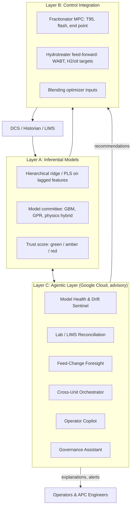
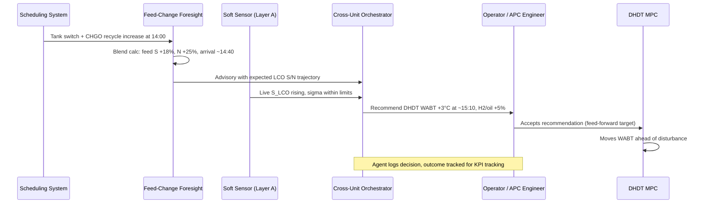
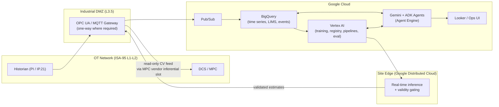

# Solution: Agent-Managed Inferential Quality Sensing & Cross-Unit Optimization for FCC, RFCC, and INDMAX

> **Companion document:** The problem definition and technical impact metrics are in [fcc_soft_sensor_problem_statement.md](fcc_soft_sensor_problem_statement.md).

---

## Executive Summary

**Recommendation: Deploy a three-layer solution:**
- **(A)** Physics-grounded inferential models for FCC product quality.
- **(B)** Closed-loop integration into the fractionator MPC *and* feed-forward into downstream hydrotreaters.
- **(C)** An **agentic layer** on Google Cloud that keeps the models accurate, reconciles lab data, anticipates feed changes, and turns FCC quality predictions into cross-unit decisions.

**Why this matters:**
- **Layers A and B** are proven APC practice. On their own they are commoditized, and they degrade without expert care.
- **Layer C** addresses the main reason inferentials fail in the field: lifecycle neglect. It also delivers the improvements that siloed inferentials leave behind, in hydrotreater H₂, naphtha octane, and blending.

**Guiding principles (modeling philosophy detailed in §2):**
1. **Start from the decision.** The system answers: *"How hard do I need to treat what's coming, where should cut points sit, and can I trust the estimate enough to act before the lab confirms?"*
2. **Respect the data reality.** There are about a million rows of plant data but only about 1,500 lab labels. So start with **regularized linear regression on lagged inputs** (OLS made stable), after proper time-series groundwork. Escalate to GPR, physics-hybrid, or LSTM models only when the simpler step demonstrably fails.
3. **Survive changing crudes by design.** Describe the feed by its *properties* (especially assay sulfur by boiling range), use **hierarchical regime-aware models**, and **detect and flag** what the data cannot explain.
4. **Earn trust transparently.** A **committee of models** with a calibrated **trust score** (green/amber/red), plus full per-model detail for engineers.
5. **Advisory agent, certified control.** The agent recommends and manages. The MPC/DCS actuates. No AI component writes directly to Level 2.
6. **Impact is realized downstream.** Sulfur and nitrogen predictions feed hydrotreater severity. Cut-point predictions feed the fractionator MPC.

---

## 1. Data Architecture

### 1.1 Process Inputs

| Subsystem | Variable | Source / method | Typical resolution | Role |
|---|---|---|---|---|
| **Reactor** | Riser outlet temperature (ROT) | Thermocouples | 1 s–1 min | Main severity driver; conversion and product distribution |
| | Catalyst circulation rate ($W_c$) | Inferred from heat balance / slide valve ΔP | 1 min | Catalyst availability; heat balance |
| | Catalyst-to-oil ratio (C/O) | Calculated $W_c / F_{\text{feed}}$ | 1 min | Severity index (≈ 4–8 FCC, 6–10 RFCC, 12–20 INDMAX) |
| | Riser / reactor pressures | Pressure transmitters | 1 s–1 min | Hydrocarbon partial pressure, residence time |
| | Feed atomization & lift steam | Flow transmitters | 1 min | Vaporization; coke and dry gas selectivity |
| | Equilibrium catalyst (E-cat) activity (MAT), metals (Ni, V) | Lab | Daily–weekly | Catalyst activity baseline |
| | Delta coke | Heat-balance calculation | 1–10 min | Coke selectivity / feed quality indicator |
| **Feed** | Feed density | Online densitometer / Coriolis (lab ref. ASTM D4052) | 1 min | Surrogate for aromaticity / H-content |
| | Feed preheat temperature, mass flow | Transmitters / Coriolis | 1 s–1 min | Enthalpy, throughput, mass balance |
| | Feed NIR (if installed) | Online NIR | 1–15 min | Hydrocarbon type (saturates / aromatics) |
| | Feed sulfur, nitrogen, CCR, metals | Lab / crude assay blend calc | Shift–daily | Sulfur/N load; coke make |
| | Recycle streams (CHGO, ATB, HCO) | Flow transmitters | 1 min | Refractory S/N injection |
| | Crude slate & tank schedule | Planning / scheduling system | Event-driven | **Feed-forward** of upcoming feed quality |
| | **Crude assay sulfur / nitrogen by boiling range** (blended by recipe) | Assay library + blend calculation | Event-driven | **Key regime-transfer feature**: sulfur in the ≈ 220–350 °C cut is the strongest prior for LCO sulfur (§2.4B) |
| | **Regime labels** (crude family, operating mode, catalyst campaign) | Scheduling system / operating logs | Event-driven | Enables regime-aware (hierarchical) modeling and per-regime validation |
| **Fractionator** | Naphtha / LCO draw and top temperatures | Thermocouples | 1 min | Cut-point / T95 correlation |
| | Pumparound duties, top reflux | Flow & temperature | 1 min | Internal reflux / separation |
| | Side-stripper steam | Flow transmitters | 1 min | LCO flash point / initial boiling point |
| | Column ΔP profile, overhead pressure | ΔP cells / pressure transmitters | 1 min | Hydraulics; flooding/weeping detection |
| | HCO / CLO draw rates, bottoms temperature | Flow / temperature | 1 min | Heavy-end cut and bottoms management |
| **Regenerator** | Dense / dilute bed temperatures | Thermocouples | 1 min | Heat balance; afterburn |
| | Flue gas O₂ / CO / CO₂ | Online analyzers | 1 min | Combustion mode (full / partial burn) |
| | Main air blower flow | Flow transmitter | 1 min | Coke burn; INDMAX constraint |
| **Gas plant** | Wet gas compressor load, H₂S in treated gas | DCS / analyzers | 1 min | Sulfur balance closure; INDMAX constraint |
| **Downstream** | DHDT / naphtha HDS WABT, H₂/oil, LHSV, product S analyzer | DCS / online XRF-UVF | 1 min | Closes the feed-forward loop; validation |

### 1.2 Target Outputs (Prioritized)

| Priority | Output | Unit | Primary consumer |
|---|---|---|---|
| **P1** | LCO sulfur $\hat{S}_{\text{LCO}}$ | wt% | DHDT severity feed-forward |
| **P1** | FCC naphtha sulfur $\hat{S}_{\text{nap}}$ | wt ppm | Selective naphtha HDS severity (octane preservation) |
| **P1** | LCO T95 / flash point | °C | Fractionator MPC (cut-point giveaway) |
| **P1** | Naphtha end point / T90 | °C | Fractionator MPC |
| P2 | LCO nitrogen $\hat{N}_{\text{LCO}}$ | wt ppm | DHDT severity (HDS inhibition) |
| P2 | Naphtha olefins / RON | vol% / RON | Octane management, blending |
| P2 | CLO ash / BS&W | wt% | Fuel oil / bunker blending quality |
| P3 | LPG C5+ content, propylene purity | vol% | Gas plant / INDMAX olefin recovery |
| All | Predictive uncertainty $\sigma^2(t)$ and validity flag | — | Gating logic, agent layer |

### 1.3 Dynamic Alignment

The inputs and outputs have very different time constants:

| Process element | Time scale |
|---|---|
| Riser residence | 2–4 s |
| Heat exchanger / preheat thermal inertia | 3–5 min |
| Fractionator tray / liquid holdup dynamics | 10–30 min |
| Lab sample → result | 4–12 h |

Inputs are aligned with finite impulse response (FIR) dynamic filters, or with first-order-plus-dead-time (FOPDT) transfer functions identified from step-test or historian data:

$$x^{\text{aligned}}_m(t) = \sum_{k=0}^{M} h_m(k)\, x_m(t - k\Delta t)$$

where $h_m(k)$ is the impulse response for input $m$.

### 1.4 Preprocessing
- **Causal filtering only.** Use exponentially weighted moving average (EWMA) or one-sided Savitzky-Golay filters. Standard centered filters use future data and cannot run in real time.
- **Data reconciliation.** Close mass and sulfur balances before training, using measured flows plus H₂S from the gas plant.
- **Lab sample time-stamping.** Align every lab result to the **actual sample-draw time**, not the LIMS entry time. This is the most common source of bias-update error.
- **Outlier and bad-lab screening.** Flag lab results that differ from the model by more than lab reproducibility for review before using them to update the bias.

---

## 2. Modeling Philosophy & Approach

> **In one sentence:** Start from the decision. Treat this as a multi-input transfer-function problem with very few labels. Do the time-series groundwork first. Make the model regime-aware so it survives crude changes. Show users a committee consensus with an honest trust score. Add complexity only when the simpler step demonstrably fails.

### 2.1 Start From the Decision

The model exists to support three decisions. Each one sets the output, horizon, and accuracy needed:

| Decision | Who / how often | Output needed | Horizon | What "good enough" means |
|---|---|---|---|---|
| **D1. How hard to hydrotreat the next few hours of FCC product** (bed temperature/WABT, H₂/oil) | DHDT / naphtha HDS operator or MPC, hourly | $\hat{S}_{\text{LCO}}$, $\hat{N}_{\text{LCO}}$, $\hat{S}_{\text{nap}}$ | Now + 1–3 h forecast | Error small enough that the hydrotreater product-sulfur target can move closer to spec |
| **D2. Where to set fractionator cut points** | Fractionator MPC, every 1–5 min | $\widehat{T95}_{\text{LCO}}$, flash point, naphtha end point | Now | Variance reduction lets the setpoint approach the spec limit |
| **D3. Can I act on this number, or wait for the lab?** | Operator / APC engineer, continuously | Trust score (green / amber / red) | Now | Red and amber flags match real errors (calibrated) |

**D1 has the largest process impact.** D3 decides whether D1 and D2 get used at all.

### 2.2 What Kind of Problem This Is

In time-series terms, this is a **multi-input single-output (MISO) transfer-function / distributed-lag regression with sparse, irregular, delayed labels**:

$$y(t_s) = \beta_0 + \sum_{m=1}^{d}\sum_{k=0}^{K_m} \beta_{m,k}\, x_m(t_s - \tau_m - k\Delta t) + b(t_s) + \varepsilon(t_s)$$

where:
- $t_s$ are the lab sample-draw times.
- $\tau_m$ is the transport/holdup delay of input $m$.
- $b$ is a slowly drifting bias.

**The data reality drives every design choice:**

| | Process inputs $x$ | Lab target $y$ |
|---|---|---|
| Frequency | Every minute | 1–3 per day |
| Two years of history | ~1,000,000 rows × ~50 tags | **~1,000–2,000 labeled rows** |

What follows from this:
1. **Only rows with a lab result can train the prediction.** The real training set is about 1,500 rows, so the **parameter budget is small**.
2. **The model is not autoregressive on $y$.** $y$ is unobserved between lab samples, so $y(t-1)$ is not available as an input.
3. **The time-series structure lives in the inputs.** Delays are known physically (10–30 min fractionator holdup), so they are handled by **explicit lag features** rather than learned by a sequence model.
4. **Consecutive samples are autocorrelated,** so the effective sample size is smaller than the row count. **Validation must be time-blocked.**

### 2.3 Time-Series Groundwork (Mandatory Before Any Model)

| Step | Method | Purpose / failure it prevents |
|---|---|---|
| 1. Data quality | Frozen/flat-line, spike, range, and instrument-calibration-event detection | Training on broken sensors |
| 2. Lab alignment | Match each lab result to its **sample-draw time**, not its LIMS entry time | The most common cause of garbage models and bias updates |
| 3. Steady-state selection | Steady-state detection (e.g., R-statistic, rolling variance tests) | Mis-aligned labels during transients |
| 4. Lag identification | Cross-correlation with **prewhitening**, step-test data, FOPDT fits | Wrong delays make relationships look weak or spurious |
| 5. Collinearity | VIF, condition number, correlation clustering; PCA/PLS | Unstable, sign-flipping coefficients (tray temperatures move together) |
| 6. Stationarity & structural breaks | ADF/KPSS (with caution), **Chow test, CUSUM, change-point detection** | Finds where the *relationship itself* changes (catalyst change-out, crude family switch, operating mode) |
| 7. Regime labeling | Join the scheduling data: crude family, operating mode (max-gasoline / max-distillate / max-olefins), catalyst campaign | Makes regimes explicit for §2.4 |
| 8. Residual diagnostics | Ljung-Box, Durbin-Watson, residual vs. regime plots | Autocorrelated or regime-dependent residuals point to missing dynamics or a missing regime effect |

> **Note on differencing:** Standard TSA often differences non-stationary series. Here the *level* of the inputs carries the physics (e.g., feed sulfur level), so differencing is generally not appropriate. Non-stationarity is handled through regime effects and bias updating instead.

### 2.4 Regime-Aware Modeling: Surviving Changing Crudes

**Principle: a model can only learn patterns that exist in the data.** The solution survives changing inputs by (a) choosing inputs that make a new crude look like a *known* pattern, (b) explicitly modeling where the pattern differs by regime, and (c) detecting and correcting when neither holds.

#### A. Three kinds of change, three different defences

| Kind of change | Example | What handles it |
|---|---|---|
| Inputs move **within** the historical range | Normal ROT, throughput, and feed-quality swings | Any adequately specified model |
| The **relationship drifts** slowly | Catalyst deactivation, fouling, tray damage | **Bias update** from each lab result (§3.1) + scheduled retraining. No model "knows" this in advance. |
| A **new regime** arrives | Crude never processed before; new recycle stream | Feed-property inputs (B) + hierarchical model (D) make it predictable where physics allows; the trust score (§2.6) flags it where it doesn't |

#### B. Describe the crude by its properties, not its name

The physics that holds across crudes: **product sulfur is driven by feed sulfur, conversion severity, and cut points.** What differs between crudes is the **slope**, because the *type* of sulfur compounds varies (sulfides and thiols vs. thiophenes and dibenzothiophenes). So feed properties are used as inputs:

- Feed sulfur, nitrogen, density, CCR, and NIR-derived aromatics.
- **The strongest single feature:** the **crude-assay sulfur in the LCO boiling range** (≈ 220–350 °C), blended according to the actual feed recipe:
$$S^{\text{LCO-cut}}_{\text{feed}}(t) = \sum_{c \in \text{crudes}} w_c(t)\, S_c^{220\text{–}350^\circ\text{C}}$$
  where $w_c(t)$ is the blend fraction of crude $c$. This is supplied by the Feed-Change Foresight agent (§4) *before* the crude reaches the riser.

With these inputs, a new crude with a known assay becomes **a new point on a surface the model has already learned**.

#### C. Test whether slopes actually differ

**Exploratory check:** plot lab $S_{\text{LCO}}$ against $S_{\text{feed}}$ (and against $S^{\text{LCO-cut}}_{\text{feed}}$), coloured by crude family and by catalyst campaign:
- **Parallel lines** → one global model plus regime offsets.
- **Different slopes** → interaction terms (e.g., $S_{\text{feed}} \times \text{ROT}$, $S_{\text{feed}} \times \text{regime}$) or regime-specific slopes.
- **Confirm formally** with Chow tests or likelihood-ratio tests.

#### D. Hierarchical (mixed-effects) model: the practical way to train it

Each regime $r$ (crude family, operating mode) gets its own intercept and slopes. These are **partially pooled** toward the global values, so regimes with little data borrow strength from the others:

$$y_i = (\beta_0 + u_{0,r[i]}) + \sum_m (\beta_m + u_{m,r[i]})\, \tilde{x}_{m,i} + b(t_i) + \varepsilon_i, \qquad \mathbf{u}_r \sim \mathcal{N}(\mathbf{0}, \boldsymbol{\Sigma}_u)$$

- **Data-rich regime:** its coefficients follow its own data.
- **Data-poor regime:** its coefficients shrink toward the global average instead of overfitting.
- **Brand-new regime:** starts at the global average ($\mathbf{u}_r = \mathbf{0}$) with wide uncertainty. Its $\mathbf{u}_r$ is **updated in a Bayesian way as each lab result arrives**, so the model "learns the new crude" within a few samples rather than waiting for a retrain.

#### E. The honest limit

If what makes a crude different is **not reflected in any input** (e.g., unusual sulfur speciation with no assay available), no model can predict it. The design then relies on **detection** (novelty and committee-disagreement signals in the trust score) and **fast correction** (lab bias update and regime-effect update). This limit is stated explicitly to users rather than hidden.

### 2.5 The Escalation Ladder: Add Complexity Only When It Pays

> [!NOTE]
> This section describes the site roadmap. The demo (demoflow.md) runs Bayesian ridge, GPR, Hybrid delta and a PINN ensemble side by side on ~120 synthetic lab labels, and targets LCO/HN T98 in °F from the simulator.

Each step must **beat the previous one on time-blocked and leave-one-regime-out validation** (§6.1) before it is adopted.

| Step | Model | When to use | Why |
|---|---|---|---|
| **1** | **Ridge / PLS regression on lagged, engineered features** (incl. assay features and interactions), in hierarchical form (§2.4D) | **Always first** | Essentially OLS made stable under collinearity; interpretable; fits the ~1,500-row budget; often sufficient for cut points |
| **2** | **+ Kalman bias update** (§3.1) | Always | Absorbs slow drift between retrains |
| **3** | **Non-linear, data-efficient models:** gradient-boosted trees; **Gaussian Process Regression (GPR)** | Only if residuals from steps 1–2 show structure (non-linearity vs. severity, feed, etc.) | GPR works with small data *and* gives a predictive variance that rises in unfamiliar states |
| **4** | **Physics-anchored models:** hybrid delta; physics-regularized neural network | When extrapolation to unseen feeds or severities matters (e.g., INDMAX high severity, new crude families) | Physics limits how wrong the model can be outside the data |
| **5** | **Sequence models: LSTM / GRU / TCN** | **Only if** (a) dense labels exist (an online analyzer gives ~1-min labels, i.e., hundreds of thousands of rows) **or** (b) a multi-step **forecast** is needed for D1 | Otherwise they overfit: a modest LSTM (64 units, 50 inputs) has ~30,000 parameters against ~1,500 labels |

**Key formulas for steps 3–4:**

- **GPR** (ARD Matérn 5/2 kernel, sparse approximation for speed):
$$\mu^* = \mathbf{k}_*^T(\mathbf{K} + \sigma_n^2\mathbf{I})^{-1}\mathbf{y}, \qquad \sigma^{*2} = k(\mathbf{x}^*, \mathbf{x}^*) - \mathbf{k}_*^T(\mathbf{K} + \sigma_n^2\mathbf{I})^{-1}\mathbf{k}_*$$

- **Hybrid delta:**
$$\hat{y} = y_{\text{physics}}(\mathbf{x}; \boldsymbol{\beta}) + \hat{\Delta}_{\text{ML}}(\mathbf{x}; \boldsymbol{\phi}) + b(t)$$
  - $y_{\text{physics}}$ is a reduced-order model: cut-point correlations, or sulfur-partitioning by boiling range using $S^{\text{LCO-cut}}_{\text{feed}}$.
  - $\hat{\Delta}_{\text{ML}}$ is trained on the residual $y_{\text{lab}} - y_{\text{physics}}$.

- **Physics-regularized NN: how it is trained.** Two kinds of data are used:
  - **Labeled rows** (~1,500, at lab times) → data loss $\mathcal{L}_{\text{data}} = \frac{1}{N}\sum_i (y_{\text{lab},i} - \hat{y}_i)^2$.
  - **All unlabeled minutes** (~1,000,000) → physics penalties, which don't need lab values:
    - **Sulfur balance:** $\dot{m}_{\text{feed}}S_{\text{feed}} - \tfrac{32.06}{34.08}\dot{m}_{\text{H}_2\text{S}} - \dot{m}_{\text{coke}}S_{\text{coke}} - \sum_p \dot{m}_p\hat{S}_p \approx 0$
    - **Monotonicity:** e.g., $\partial\hat{S}_{\text{LCO}}/\partial S_{\text{feed}} > 0$, $\partial\widehat{T95}/\partial T_{\text{draw}} > 0$.
    - **Bounds:** e.g., $\hat{S} \ge 0$, $\widehat{T95}_{\text{nap}} < \widehat{T95}_{\text{LCO}}$.

  Being able to learn from unlabeled data is its *only* real advantage at this data size. With ~1,500 labels it remains a **later-phase option**, not the core.

### 2.6 Model Committee & Trust Score: How Users Gain Confidence

#### A. The committee
Several structurally different models run in parallel, e.g., hierarchical ridge/PLS, gradient-boosted trees, GPR, and the hybrid model (once available). The **consensus estimate** weights each model by its recent accuracy against the lab:

$$\hat{y}_{\text{cons}}(t) = \sum_j w_j\, \hat{y}_j(t), \qquad w_j \propto \frac{1}{\text{MSE}_j^{\text{recent}}}$$

where $\text{MSE}_j^{\text{recent}}$ is model $j$'s error over the last $n$ lab samples.

#### B. Agreement is necessary but not sufficient
Models trained on the *same* data share the *same blind spots*. With a genuinely new crude, all of them can agree and all be wrong. The trust score therefore combines **independent** signals:

| Signal | What it detects | Example metric |
|---|---|---|
| Committee spread | Models extrapolating differently | Std. dev. across $\hat{y}_j$ relative to lab reproducibility |
| Input novelty | Plant state not seen in training | Hotelling $T^2$ / SPE vs. training envelope; GPR $\sigma^*$ |
| Physics consistency | Estimates that violate conservation | Sulfur-balance closure error |
| Recent track record | Model has been wrong lately | Rolling error vs. the last $n$ lab results |
| Sensor health | Bad inputs | Frozen, out-of-range, or redundancy-mismatch flags on key tags |
| Regime familiarity | New crude family / mode | Number of lab samples in the current regime |

**Trust levels:**
- 🟢 **Green:** all signals within limits → estimate used in closed loop (MPC CV / hydrotreater feed-forward).
- 🟡 **Amber:** one signal outside limits → estimate shown with a wider band; closed loop continues with conservative move limits; an extra lab sample is requested.
- 🔴 **Red:** multiple signals, or a severe novelty/sensor failure → closed loop drops to the fallback (§3.5); operator and APC engineer alerted with the reason.

The thresholds are **calibrated** on historical data, so red and amber rates match observed error rates.

#### C. What each user sees
| User | View |
|---|---|
| **Operator** | One number + uncertainty band + green/amber/red + one-line reason ("new crude family, 2 lab samples so far") |
| **APC / process engineer** | Every committee member's estimate, residual history per model and per regime, trust-signal breakdown, feature contributions |
| **Management** | Closed-loop uptime, trust-level distribution, technical KPIs vs. baseline |

#### D. Probabilistic Output & the Distribution Spread Gate (added)
> Full specification: [SDD.md §5](SDD.md) (SDD-DIST, SDD-GATE-01…07, SDD-REC). Behaviour: [BDD.md](BDD.md) BDD-15. Features: [features.md](features.md) B10, C7, D5.

- **Three independent model families, each giving a full distribution rather than a point value:** **Hybrid delta** (physics base + residual learner), **GPR** (native predictive σ), and **PINN** (a deep ensemble with physics-residual loss). The hierarchical ridge/PLS model stays as the baseline and admission yardstick. A model whose RMSE or 90% coverage fails the admission rule is shown in "shadow" mode with weight 0.
- **Combined view:** the members are combined into a **Gaussian mixture** (weights from the committee rule in §2.6A), shifted by the Kalman bias (§3.1). The cockpit reports the mean, P5/P50/P95 and the **90% width W90**.
- **Spread gate:** if **W90 > `w90_max`** (default 2 × ASTM reproducibility ≈ 14 °F for T98, calibrated on held-out simulated runs), **or** the mixture is bimodal (Ashman's D > 2, both weights ≥ 0.2), the system **issues no recommendation**. It shows: *"Distribution spread too wide — … No recommendation issued"*, with the likely cause and the suggested action (request a lab sample, check a sensor, hold the current set point). There is hysteresis (back to PASS only below 0.9 × limit for 10 minutes), so the gate does not flicker.
- **Trust score gains a 7th signal (S7: distribution spread)**, next to the six signals in §2.6B. The gate is stricter than amber: the estimate is still shown, but as advisory only.

### 2.7 Symbolic Distillation: DCS-Resident Fallback
Once a production model is validated, **symbolic regression** (including symbolic Kolmogorov-Arnold Network variants) can distill it into a compact closed-form equation. That equation can be audited by engineers and placed in a DCS calculation block. It serves as the fallback if the edge platform or network is unavailable. Coefficients must come from site data; inputs should be normalized deviations from reference values.

### 2.8 Summary: When to Use What

| Approach | Data needed | Extrapolation | Interpretability | Role in this solution |
|---|---|---|---|---|
| **Hierarchical ridge / PLS** | Low | Linear, regime-aware | High | **Step 1 core model**; committee member |
| **Gradient-boosted trees** | Low–moderate | Poor (flat outside data) | Moderate (feature attribution) | Committee member; non-linearity check |
| **GPR (sparse)** | Low–moderate | Reverts to prior, with rising σ | Moderate | Committee member; **novelty signal** |
| **Hybrid delta** | Low–moderate | Best (physics-anchored) | High (decomposed) | Target model for P1 sulfur outputs (Phase 3) |
| **Physics-regularized NN** | Moderate + unlabeled | Better than pure NN within constraints | Low | Optional; only if it beats the hybrid |
| **LSTM / GRU / TCN** | High (dense labels) | Poor | Low | Only with analyzer-grade labels or for multi-step forecasts |
| **Symbolic distillate** | — (distilled) | Inherits from parent | Highest | DCS fallback / audit |

---

## 3. Closed-Loop Integration

### 3.1 Kalman Bias Updating
The bias is treated as a random walk. When a lab result $y_{\text{lab}}$ arrives, it is compared with the model prediction **at the sample-draw time** $t_s$:

$$P^-_t = P_{t-1} + Q, \qquad K_t = \frac{P^-_t}{P^-_t + R}$$

$$b(t) = b(t-1) + K_t\left[y_{\text{lab}}(t_s) - \left(\hat{y}_{\text{model}}(t_s) + b(t-1)\right)\right], \qquad P_t = (1 - K_t)P^-_t$$

where:
- $Q$ is the bias drift variance.
- $R$ is the lab measurement variance, derived from ASTM repeatability/reproducibility.
- Bias moves are rate-limited so the controller never sees a step change.

The agentic layer (§4) decides whether each lab result is **accepted, held for review, or rejected** before it reaches this update.

### 3.2 Use Case A: Fractionator MPC (Cut-Point Control)
- **Controlled variables (CVs):** $\widehat{T95}_{\text{LCO}}$, LCO flash point, naphtha end point.
- **Manipulated variables (MVs):** draw rates, pumparound duties, top reflux, side-stripper steam.
- **Benefit:** Lower variance lets the MPC push cut points toward their specification limits, recovering distillate from CLO and naphtha.

### 3.3 Use Case B: Downstream Hydrotreater Feed-Forward (Sulfur/Nitrogen)
This is where most of the H₂ and octane impact sits.
- $\hat{S}_{\text{LCO}}$, $\hat{N}_{\text{LCO}}$, and their trends become **feed-forward disturbance variables** for the DHDT MPC.
- $\hat{S}_{\text{nap}}$ becomes a feed-forward disturbance variable for the selective naphtha HDS MPC.
- The hydrotreater controller adjusts WABT and H₂/oil ratio *before* the higher-sulfur feed arrives. This lets it run closer to the product sulfur target.
- **Illustrative (diesel spec 10 wt ppm):** With lab-only feedback, a DHDT might target about 6–7 ppm product sulfur to cover invisible feed swings. With feed-forward and lower variance, the target can move to about 8–8.5 ppm. The WABT reduction that follows cuts H₂ use and slows catalyst deactivation. *Exact targets come from the site's variance analysis.*
- **Closing the loop:** The hydrotreater product sulfur analyzer, or its own inferential, closes the loop and validates the feed-forward.

### 3.4 Use Case C: INDMAX Constraint Operation
Trustworthy real-time quality estimates, combined with constraint monitoring (wet gas compressor, main air blower, regenerator temperature, fractionator ΔP), let the MPC/RTO run **closer to limits**. This captures more propylene throughput without quality excursions. The soft sensor *enables* higher yield. It does not *create* it; catalyst and severity do.

### 3.5 Validity Gating and Fallback
Before an estimate reaches any controller, it must carry a **trust level** (§2.6B), based on committee spread, input novelty, physics consistency, recent track record, sensor health, and regime familiarity:

| Trust level | Control action |
|---|---|
| 🟢 Green | Consensus estimate used as MPC CV / hydrotreater feed-forward |
| 🟡 Amber | Used with wider uncertainty and conservative MPC move limits; extra lab sample requested |
| 🔴 Red | Drop to fallback; operator and APC engineer alerted with reason |

Where an online analyzer exists, it acts as an additional independent check. Whichever source (analyzer or model) disagrees with the lab gets flagged.

**Fallback hierarchy:** committee consensus → best single validated model → symbolic DCS-resident model → last validated value with ramping bias → **MPC CV set to "bad", with the operator notified**. Every step of the fallback is logged, and the agent layer tracks it.

---

## 4. Agentic Layer: The Differentiator

Soft-sensor models are a solved technical problem. **Keeping them accurate and turning their predictions into cross-unit action** is not. The agentic layer is a set of specialized agents built on **Gemini** with the **Agent Development Kit (ADK)**. The agents run on Google Cloud, use tools over plant data, and operate **advisory-only, with humans in the loop**.

### 4.1 Agent Roster

| Agent | Responsibilities | Tools / data | Outputs |
|---|---|---|---|
| **Model Health & Drift Sentinel** | Computes and explains the trust score (§2.6); tracks residuals vs. lab per model and per regime, committee spread, σ trends, $T^2$/SPE, and bias drift rate; runs structural-break tests; proposes retraining and runs challenger-vs-champion evaluation on the escalation ladder | BigQuery (historian, LIMS), Vertex AI Model Registry, evaluation pipelines | Trust-score breakdown, health dashboard, retrain proposals, promotion recommendations |
| **Lab / LIMS Reconciliation** | Aligns results to sample-draw time; screens outliers against ASTM reproducibility; checks lab vs. analyzer vs. model agreement; approves or holds bias updates | LIMS API, historian, analyzer data | Accept/hold/reject decision per sample, with rationale |
| **Feed-Change Foresight** | Reads the crude schedule, tank switches, recycle plans, and assays; computes blended assay features (e.g., $S^{\text{LCO-cut}}_{\text{feed}}$) and assigns the regime label (§2.4); predicts feed S/N/density shifts and their arrival time at the riser; flags crude families with little or no training history; pre-alerts the downstream units | Scheduling system, assay library, blend calculations | Model features, regime labels, and "feed sulfur +X% expected in ~Y h" advisories |
| **Cross-Unit Orchestrator** | Turns FCC quality forecasts into recommended hydrotreater targets and blending adjustments; checks recommendations against constraints | Soft-sensor outputs, hydrotreater models, blending optimizer | Recommended DHDT/naphtha HDS targets for operator/MPC acceptance |
| **Operator Copilot** | Explains *why* an estimate moved (feature attribution in process language), answers what-if questions, drafts shift handover notes | All of the above + operating procedures (RAG over manuals) | Natural-language explanations; handover summaries |
| **Governance Assistant** | Drafts management-of-change (MOC) packages, model validation reports, and version audit trails; enforces the approval workflow for model promotion | Model registry, document store | MOC drafts, validation reports, audit logs |

### 4.2 Autonomy Levels

| Level | Agent may… | Example |
|---|---|---|
| **L0: Observe** | Read data, compute diagnostics | Drift metrics |
| **L1: Advise** | Alert, explain, recommend | "Retrain LCO-S model; residual bias +0.15 wt% over 5 days" |
| **L2: Act on IT artifacts** | Launch retraining jobs, draft MOC, hold a suspect lab sample *pending review* | Challenger model trained and evaluated automatically |
| **L3: Act on OT** | **Not permitted.** Model promotion to production and any change to controller targets require human approval through the MPC/DCS | — |

### 4.3 Example Workflow: Feed Switch with Refractory Recycle

### 4.4 Decision Cockpit (Front End) with Live Gemini Copilot (added)
> Full specification: [SDD.md §7](SDD.md). Features: [features.md](features.md) Epic F (F1–F25), E5 and Epic H (Knowledge & Records). Behaviour: [BDD.md](BDD.md) BDD-12, BDD-16, BDD-17, BDD-18. API contract: [cockpit/API_CONTRACT.md](cockpit/API_CONTRACT.md). It is built in increments in every step of [build.md](build.md) and checked in [checklist.md](checklist.md).

The front end is **part of the product, not an add-on**. It is a clean, board-level cockpit that turns the models and agents into decisions. It is a **technical demo**: it shows technical and efficiency metrics only, with no financial figures. It has **four dashboards** that share one context (unit, time window, selected output):

| Aspect | Decision |
|---|---|
| Stack | Next.js (App Router) + TypeScript + React in `cockpit/web`, with **Plotly.js** charts (same engine as Dash, better layout control); CSS design tokens + CSS Modules; FastAPI back end in `cockpit/api` with Server-Sent Events for live updates and a WebSocket proxy for voice |
| **Decision dashboard** | Overview (technical KPIs: margin to spec, closed-loop uptime, estimate availability, trust mix, decisions needed; 24 h time-series strip) · Decisions (recommendation cards in technical units, or withheld cards with the gate message) · Quality (fan charts vs. spec over time) |
| **Technical dashboard** | **Time-Series Explorer** (every simulated minute: raw tags, estimates with P5–P95 bands, lab points, regime and gate-state bands; zoom, brush, overlay, LTTB down-sampling) · Scenario Replay · Data Quality · Labs · What-if |
| **Modelling dashboard** | **Model Comparison** (Hybrid delta / GPR / PINN / ridge: RMSE, bias, 90% coverage, W90, weight, admission state, key parameters) · **Model Confidence** (distributions overlaid on the mixture, W90 vs. limit, bimodality, spread over time) · Calibration (parity, residuals, reliability diagram, GPR relevance, hybrid decomposition, PINN spread) |
| **Knowledge dashboard** | (F24) shows the document library, the full document at the cited section and related records per run |
| Shared | Audit · Settings · alert centre · Demo Report export · role switcher · wall mode · **dark/light theme toggle** (default dark, persisted, no flash, charts re-theme live) |
| Copilot | An **"Ask Gemini" floating launcher** bottom-right on every page opens an overlay panel (text chat and Live voice microphone in one panel; no page reflow; conversation kept across pages; a visible minimise button on every screen and `Esc` collapse it; keyboard shortcut opens). Live **Gemini** agent (ADK; `gemini-2.5-flash` for chat, `gemini-2.5-pro` for reports) with read-only tools over estimates, distributions, gate state, labs, audit log and the knowledge corpus. It explains *why*, answers what-ifs, drafts handovers and cites documents from a SIMULATED, Gemini-generated corpus (46 SOPs, operating windows, lab methods, work orders, shift logs, incidents, MOCs) as `[DOC-ID rN §x.y]` chips that open a compact source preview in the panel ("No cited source" below the relevance threshold; the Knowledge dashboard (F24) shows the document library, the full document at the cited section and related records per run; the Gemini panel shows a compact preview with an Open in Knowledge link). Withheld cards show similar past events. **It relays the spread-gate message verbatim and never proposes a set point while the gate is WITHHELD** |
| Voice (Gemini Live) | Voice Copilot through the **Gemini Live API** (`gemini-live-2.5-flash-native-audio` on Vertex AI, project `fcc-soft-sensor`, `us-central1`), proxied by FastAPI so credentials stay server-side; barge-in interruption; the same tools and guardrails as text |
| Safety | "Accept" records a human decision only. There is no write path to the DCS/MPC from the cockpit (§4.2 L3) |
| Data | Driven only by simulator output (`sim_octave`) during the demo; no mock data |

Mockups (v2, high fidelity; numbers in the mockups are illustrative): [Decision: Overview](docs/ui/v2/decision_overview_dark.jpg) · [Technical: Time-Series Explorer](docs/ui/v2/technical_timeseries_dark.jpg) · [Modelling: Model Comparison](docs/ui/v2/modelling_models_dark.jpg) · [Light-theme example](docs/ui/v2/light_theme_example_models.jpg) · [Modelling: Model Confidence](docs/ui/v2/modelling_confidence_dark.jpg).

---

## 5. Google Cloud Reference Architecture

> [!NOTE]
> This section describes the site roadmap. The demo (demoflow.md) runs Bayesian ridge, GPR, Hybrid delta and a PINN ensemble side by side on ~120 synthetic lab labels, and targets LCO/HN T98 in °F from the simulator.

| Concern | Design choice |
|---|---|
| **Latency** | Real-time inference and gating run **at the edge** (or inside the MPC vendor's inferential slot), so predictions don't depend on the cloud round-trip |
| **Data platform** | Historian + LIMS + scheduling data in **BigQuery** for training, drift analytics, and technical KPI tracking |
| **MLOps** | **Vertex AI Pipelines** for retraining, **Model Registry** for versioning, champion/challenger evaluation |
| **Agents** | **Gemini + ADK** on Agent Engine, with scoped tool permissions (read-only to plant data; write access only to IT artifacts) |
| **Knowledge & voice (demo)** | Vertex AI embeddings (`text-embedding-005`) over the simulated knowledge corpus, with a BM25 fallback; **Gemini Live API** for voice in `us-central1` (US-only), proxied by the FastAPI back end; project `fcc-soft-sensor` |
| **Security** | IEC 62443 zones and conduits; industrial DMZ; data diode where site policy requires; no inbound cloud-to-Level-2 path except validated estimates through the controlled gateway |
| **Governance** | Every model version, bias update, and agent recommendation is logged with rationale for audit and MOC |

---

## 6. Validation & KPIs

### 6.1 Model Acceptance
- **Accuracy bound:** Lab test error sets a floor on achievable accuracy. Acceptance target: **RMSE <= 1.5R (time-blocked) and <= 2.0R (leave-one-regime-out) on simulated data; 1-1.5x R on site** (ASTM limits bound achievable accuracy).
- **Time-blocked validation:** Held-out, time-blocked data (no random splits, which leak temporal information). The test set must include at least one feed-slate change and one catalyst-activity shift.
- **Leave-one-regime-out validation:** Train with one crude family (or operating mode, or catalyst campaign) held out, then test on it. This is the honest measure of how the model will behave with a *new* crude, and it also calibrates the trust-score thresholds (§2.6).
- **Escalation gate:** Each step on the escalation ladder (§2.5) must beat the previous step on both validations above before it is promoted. The hierarchical ridge/PLS model is the reference every other model must beat.
- **Per-regime reporting:** Accuracy is reported per regime, not only as an overall average, so weak regimes stay visible.
- **Trust-score calibration:** The share of green estimates that are actually within tolerance must meet a target (e.g., ≥ 95%). Red flags must catch most large errors.

### 6.2 Operational KPIs

| KPI | Baseline source | Target |
|---|---|---|
| Estimate availability (validated) | New | ≥ 95% |
| Inferential in closed loop (% time) | Current APC logs | ≥ 90% |
| Quality variance on CVs | 3–6 months pre-project lab data | −30% to −50% |
| DHDT / naphtha HDS product-sulfur target vs. spec | Current operating targets | Closer to spec, per variance analysis |
| H₂ consumption per bbl hydrotreated | Utility accounting | Reduction vs. technical baseline |
| Octane loss across naphtha HDS | Lab RON in/out | Reduction vs. technical baseline |
| Off-spec events / quarter | Quality records | Trend toward zero |
| Mean time to detect model drift | Currently weeks (manual) | < 48 h (agent) |

---

## 7. Deployment Roadmap

| Phase | Duration (indicative) | Scope | Exit criteria |
|---|---|---|---|
| **0: Data audit & technical baseline** | 4–6 weeks | Historian/LIMS extraction to BigQuery; sample-timestamp audit; site technical impact metrics (problem statement §5) | Agreed technical baseline; data quality report |
| **1: Offline models, open-loop advisory** | ~3 months | Time-series groundwork (§2.3); regime labeling; hierarchical ridge/PLS + committee for P1 outputs; trust score; edge deployment in advisory mode; Operator Copilot pilot | Acceptance criteria in §6.1 met on live data |
| **2: Agent-supervised lifecycle** | ~3 months | Drift Sentinel, Lab Reconciliation, Governance agents; fractionator MPC CV integration (Use Case A) | ≥ 90% closed-loop uptime; drift detected < 48 h |
| **3: Cross-unit feed-forward** | ~3–6 months | Hybrid models; hydrotreater feed-forward (Use Case B); Feed-Change Foresight + Orchestrator | Measured H₂/octane improvement vs. technical baseline |
| **4: Scale-out** | Ongoing | P2/P3 outputs; INDMAX constraint use case; replicate to other units/sites | Technical KPI tracking across units |

---

## 8. Expected Technical Improvements (Indicative, Must Be Validated)

| Improvement | Mechanism | Indicative magnitude* |
|---|---|---|
| Quality variance reduction | Real-time estimates + MPC | 30–50% on controlled properties |
| Hydrotreater H₂ savings | Feed-forward lets severity track actual feed instead of worst case | A few % of hydrotreater H₂ use |
| Octane preservation | Naphtha HDS severity matched to actual naphtha sulfur | ≈ 0.3–1 RON on FCC naphtha |
| Distillate recovery | Tighter LCO T95 / naphtha end point | ≈ 0.2–1% yield shift |
| Off-spec reduction | Early detection + feed-forward | Large reduction in event frequency |
| Catalyst cycle extension | Lower average WABT | Site-specific |
| Sustained performance | Agent-managed lifecycle stops the usual decay | Closed-loop uptime maintained ≥ 90% |

\* *Indicative ranges from typical APC/inferential literature. Final figures come from the site technical baseline and post-implementation KPI tracking.*

---

## 9. Competitive Landscape & Differentiation

| Incumbent category | Examples | What they do well | Gap this solution fills |
|---|---|---|---|
| APC suites with inferentials | AspenTech (Aspen IQ, DMC3), Honeywell (Profit Suite), Yokogawa, AVEVA, Emerson | Proven MPC + inferential tooling, vendor support | Lifecycle maintenance still manual; limited cross-unit feed-forward; limited natural-language explainability |
| Process simulators | Aspen HYSYS/Petro-SIM (KBC), UniSim | Rigorous kinetic/VLE models | Not real-time; used offline — **complements** hybrid models |
| Generic industrial AI platforms | Various | Flexible ML | Lack process-domain constraints and control integration |

**Positioning:** This solution **complements** the incumbent MPC. It feeds validated estimates into the existing controller and adds a Google Cloud agentic layer for lifecycle management, cross-unit orchestration, and operator trust.

---

## 10. Risks & Mitigations

| Risk | Impact | Mitigation |
|---|---|---|
| Poor lab data / timestamps | Corrupted bias updates, loss of trust | Phase 0 timestamp audit; Lab Reconciliation agent; ASTM-based screening |
| Instrument failure / drift | Wrong estimates in the loop | Validity gating (§3.5); redundancy checks; fallback hierarchy |
| Operator distrust | Inferential disabled | Copilot explanations; open-loop advisory phase; transparent performance dashboards |
| Extrapolation to new feeds | Large errors | GPR σ + $T^2$/SPE gating; hybrid physics core; Feed-Change Foresight pre-alerts |
| OT cybersecurity | Safety / regulatory exposure | IEC 62443 architecture; no cloud-to-L2 write path; advisory-only agents |
| MPC vendor integration friction | Delayed deployment | Use vendor inferential slots / OPC UA; engage vendor early |
| Over-claiming results | Credibility loss | Agreed technical baseline; before/after KPI tracking |

---

## 11. Open Questions for Site Engagement

1. Which downstream hydrotreaters and blending systems take FCC naphtha, LCO, and CLO, and do they already have MPC?
2. Which online analyzers exist (FCC products, hydrotreater products), and what is their availability?
3. Which lab methods, sampling frequency, and timestamp practices does the LIMS use?
4. Does the APC suite already run inferentials, and what is their closed-loop uptime today?
5. Is crude schedule / assay data available electronically for feed-forward?
6. What are the site OT security policy constraints (data diode, cloud connectivity)?
