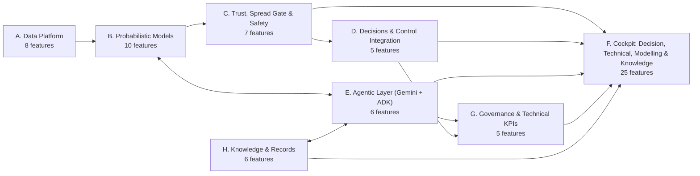
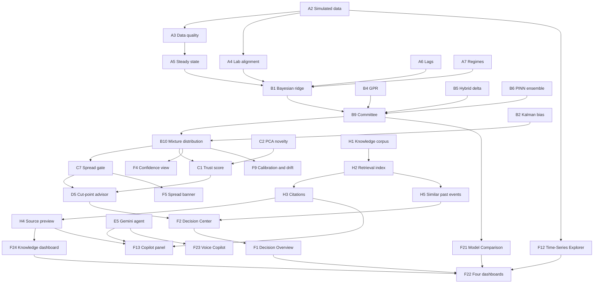

# Product Features: Agent-Managed FCC Soft Sensors & Decision Cockpit

> **Companion documents:** [Canonical decisions](DECISIONS.md) · [Demo flow](demoflow.md) · [Demo case](BCC.md) · [Behaviour spec](BDD.md) · [SDD](SDD.md) · [Build guide](build.md) · [Checklist](checklist.md) · [Problem statement](fcc_soft_sensor_problem_statement.md) · [Solution design](fcc_ai_driven_soft_sensor_solutions.md)
>
> **Legend (2 Oct):** OD1 hydrotreater · OD2 cut points · OD3 trust (old decision numbering; D1–D9 now means the decision inventory).
>
> **Purpose:** the single catalogue of product features. Each entry gives its priority, delivery phase, current build status, the technical outcome it serves, and the BDD feature that defines "done". **Feature IDs defined here are used in every other document.**
>
> **Scope is driven by [demoflow.md](demoflow.md); facts by [DECISIONS.md](DECISIONS.md).**

---

## 2026-10-06 story-first pitch (6 Oct) — Epic L

Owner, 6 Oct 2026: 04:32 *"they gave us the value figures. It's them not ours, so we can keep them, otherwise they may feel we are not listening or we are not focussing on the high value use cases"*; 05:52 *"going use case by use case is not the most optimal … I am still missing … the story of a refinery … should I not read the story of the refinery first and then go? then … how we are helping in taking those decisions … the first decision is what should be the temp of furnace, which first and foremost is decided based on the input crude"*; 05:55 "sure" (restructure); 06:03 "update the relevant files that define the build". Context: [use_cases/important_context.ipynb](use_cases/important_context.ipynb). Facts: [DECISIONS.md](DECISIONS.md) §0A. Script: [use_cases/PRESENTER_PACK.md](use_cases/PRESENTER_PACK.md).

**F-STORY "The story of a refinery" (L1, proposed).** First band on `/platform`: crude → crude unit → heavy gas oil → FCC → products → treating & blending; the six FCC units in flow order with one-line roles; the three gaps (quality, crude, time lag). No value figures. Spec SDD-STORY-01..04 · BDD-35.
**F-TOUR "Follow the oil" (L2, proposed).** Guided stops 1–7 (D4 → D6 → D8 → D5 → D1/D2/D9 → D7 → whole FCC) on `random_s107` 10:00, then the stress test on `random_s144` (10:00, 12:00) and the decision record; each stop opens its unit at the right step with the scenario set, and shows the question, IOCL rows and status chip. Read-only. Spec SDD-TOUR-01..06 · BDD-36.
**F-FRONT Front Overview page (FP-1, FP-2; proposed — docs agreed 6 Oct 06:53, not built).** Owner, 6 Oct 2026: 06:47 *"there should be an overview of refinery … the refinery view is critical, and then we go to FCC"*; 06:51 *"make a front overview page. That will have details about the refinery, what happens on the top level with sufficient details, and then mention where their use cases fit and then, on that, which we have built. Then subsequently in the bottom part as an expandable screen the decisions being made. Then the individual sections as they are today on tabs will remain"*; 06:53 *"let's keep them for now"* (existing Overview sections); 06:39 *"I want to see the coloured dots"*; 06:43 *"they don't want to have a black box"*. `/platform` opens with **FP-1 the refinery** (what happens, crude in → products out; IOCL use cases pinned where they fit; what we built as status dots; FCC highlighted, opens `/twin`), then **FP-2 decisions** (expandable; nine decisions, each card: pain point · how we solve it · how it works). Existing Overview sections stay below; unit tabs unchanged. Spec SDD-FP-01..10 · BDD-37..38.
**F-UCMAP Use-case map and presenter pack (L3, done).** `use_cases/`: [PRESENTER_PACK.md](use_cases/PRESENTER_PACK.md), [INDEX.md](use_cases/INDEX.md), one `UC-*.md` per IOCL row (built · remaining · how it solves the row · demo steps · pilot).
**F-IOCLFIG IOCL figures, attributed (L4, done — docs only).** IOCL's benefit figures kept in `use_cases/refinery_optimisation_use_cases.md` and the pitch table, labelled as IOCL's; never on cockpit screens (U3).

---

## 2026-10-03 pitch spine (3 Oct)

Owner, Voice Note 12 (3 Oct, 03:24 UTC): tying the platform back to IOCL's use cases is **the single most critical task**. Full analysis in [verbatim.md](verbatim.md) Part 10. The UI is a façade; the brain is modular: one lakehouse → data processing → models (ML / PINN) → agents, one per use case → decisions with a person in the loop → the whole refinery optimised. No agents act on the plant. MeitY: Category A stays on site; de-identified data becomes Category B.

**F-OV Opening page (`/platform`, nav "Overview").** First screen. Shows (1) the six layers left to right with what each is in this build; (2) one card per IOCL use case (rows #1–#11 + feedstock evaluation) with its agent, its decision and a status chip — Live / Scripted / Partly / Watch — plus a "Not claimed" card (coker, alkylation, gas turbines, flare, pipelines); each card opens its unit page; (3) a person-in-the-loop band: Advise (this build) → Assist (only if IOCL asks) → Act within an envelope (never in this pitch); (4) a MeitY band: Category A stays on site, the edge gateway de-identifies, Category B in India cloud regions — marked "designed for", not certified; (5) "Open the refinery". No value figures.

### 2026-10-03 05:00 — "How do we know?"

Owner, 04:24: *"no flow of how will we actually know if a particular parameter will actually maximise the yield? … they will ask probing questions. Is our system answering those questions?"* Answer: partly — predict and decide were built; measure-and-learn was not shown, and the crude classifier in the demo is scripted. Owner, 04:58: "yes add".

**F-PROOF Proof loop (unit step ④).** For each decision with a move or a sample (not "Not yet" / watch): four stages Predict → Decide → Measure → Learn with an honesty chip each; a line that the replay does not apply accepted moves; evidence so far from `lib/proofEvidence.ts`; the pilot line.
**F-CRUDE Crude-switch walkthrough (unit step ②).** Shown when the run has had a crude switch by the current minute; five timed steps from the run's own segments; labelled *scripted walkthrough*; a note when the crude name follows the lab assay.
**F-OV+ Overview "How do we know a move works?" band** with the pilot line.

## 2026-10-02 agreement (supersedes earlier UI sections where they conflict)

> **Source:** owner 09:48–11:34 UTC 2 Oct (crashed session, recovered) and Voice Note 11 — see [verbatim.md](verbatim.md) Part 9.5 for the lever table checked against the code. Features for this agreement are catalogued as **Epic K** (§10). Where Epic F (Decision / Technical / Modelling dashboards), Epic I (I13 workspaces) or Epic J (J6 L0, J7 L1 four zones) describe a different screen layout, **Epic K wins**; their engines and APIs remain.

> [!IMPORTANT]
> **Old decision numbering renamed to OD1–OD3 on 2 Oct.** In this section and Epic K, **D1–D9 are the decision inventory** (below). In the §3 catalogue the "Decision" column now uses `OD1` hydrotreater severity · `OD2` cut points · `OD3` trust (formerly D1–D3). Epic D feature IDs (D1–D5) are unchanged. `DECISIONS.md` also uses D-numbers for canonical data facts. Read IDs in context.

**What the product is now:** the screen enables a decision; data backs it up (09:48). No role views (09:53). No value figures on screens (10:16). No left bar (10:41). Accept / Hold / Decline goes to the audit log only.

| Screen | What it does |
|---|---|
| **Home `/twin`** | Top view of the six FCC units (Feed furnace → Riser reactor → Regenerator → Main fractionator → Gas plant → Stabiliser) → what went wrong (one line, the unit glows) → decisions pinned to units (Accept / Hold) → four-step flow ①–④ (how agents, ML, checks, optimiser, Gemini enable it) → IOCL use-case band |
| **Unit page `/twin/unit/{id}`** | ① Data in / out · ② What we observe · ③ Decision and lever · ④ How the move is found · footer (use cases for this unit) |
| **Decision record `/audit`** | Every decision and the action taken |

| Decision | Lever (real tag) | Problem | IOCL use case | Status |
|:---|:---|:-:|:---|:---|
| D1 Cut point: move now or wait for the lab | `SP_LCO_T98`, `SP_HN_T98` | P1 | UC-01, UC-11 | **Live** |
| D2 Can the estimate be trusted now? | — | P4 | UC-11, UC-01 | **Live** |
| D9 Pull an extra lab sample | sampling schedule | P1, P4 | UC-11 | **Live** |
| D4 Which crude is in the unit | — | P2 | Feedstock evaluation | **Live** |
| D8 What first; what breaks downstream | — | P3 | UC-06, UC-08, UC-09 | **Live** (watch items) |
| D3 Coordinated recipe for the new crude | `SP_T_riser_ROT_F`, `MV_PA1..4`, cut points | P2, P3 | UC-01, UC-06 | **Not yet** (plausibility check withholds it; PA moves not in training data) |
| D5 Regenerator air vs severity | `Fair` (via `SP_T_reg_F`), `SP_T_riser_ROT_F` | P3 | UC-04 | **Not yet** (air never moved in training data) |
| D6 Furnace preheat / excess O₂ | `SP_T_preheat_F` | P2, P3 | UC-05, UC-10 | **Not yet** (preheat never moved; no excess-O₂ set point in the simulator) |
| D7 Gas plant / stabiliser | `MV_reflux_ratio`, `MV_cw_flow`, `SP_T_overhead` | P3 | UC-02, UC-03, UC-07 | **Not yet** (never moved in training data) |

**Problems:** P1 quality known only every 8 h · P2 crude changes every 12–48 h · P3 a move in one unit shows up hours later in another · P4 an AI that always answers is dangerous.

**Done:** decision API, home, four-step unit page for all six units, decision record (`994380a`, `beee022`, `112aa48`, `11876cc`); lever-batch code (`1edeb3e`). **Running:** `lever_v1` (12 runs, seeds 200–211), launched 12:15 UTC 2 Oct. **Open:** surrogate refit on `lever_v1` and one closed-loop simulator check (makes D3, D5–D7 Live); ② estimate over time with lab points; ③ earlier decisions on this unit; ④ binding limits and, for "Not yet", the exact missing data; ① full tag list; footer action history.

---

## 1. Summary

**The product has 72 features in 8 epics; 52 are Must-haves. This is a technical demo: success is measured with technical metrics only (accuracy, calibration, gate precision, latency, availability, citation correctness). No financial figures are used anywhere. The front end (the "Cockpit", Epic F) is part of the core product and has four dashboards: Decision, Technical, Modelling and Knowledge, plus a floating Gemini panel on every screen.** Today 21 features are built and 16 are partial (see Status at a Glance); the rest are design only.

- **What changed in this revision:**
  - **Hybrid delta, PINN and GPR are now Must-haves.** They run side by side, and each produces a full **probability distribution**, not just a single number.
  - **Distribution Spread Gate (C7).** When the combined distribution becomes too wide, the system **withholds the recommendation** and says so: *"Distribution spread too wide — no recommendation issued."*
  - **Epic F has 25 features in four dashboards.** A clean **Decision** dashboard for decisions, a **Technical** dashboard with a full **Time-Series Explorer** (F12) over every simulated minute, a **Modelling** dashboard (F21) for a deep dive into each model's numbers, parameters and confidence, and a **Knowledge** dashboard (F24) with the document library, the full document opened at the cited section and the related records for the selected run. Cited sources first open as a compact preview inside the floating Gemini panel (H4), with an "Open in Knowledge" link to F24. Plotly charts and a **live Gemini Copilot agent** throughout. It is built step by step alongside the models (build.md), not at the end.
  - **Stack:** Next.js (App Router, TypeScript) + React + Plotly.js in `cockpit/web`, FastAPI in `cockpit/api`, which also hosts the soft-sensor pipeline (`cockpit/api/app/`: models, mixture, gate, trust, recommendations, Copilot, knowledge index); the binding API contract is [cockpit/API_CONTRACT.md](cockpit/API_CONTRACT.md). Vertex AI in `us-central1`: `gemini-2.5-flash` (Copilot), `gemini-live-2.5-flash-native-audio` (voice), `gemini-embedding-001` embeddings with `text-embedding-005` fallback and BM25 as a last resort (H2). The Copilot (E5) provides an ADK `root_agent` definition with tool bindings in `cockpit/api/app/copilot/adk_agent.py` alongside the streaming `google-genai` function calling engine in `chat.py`.
  - **Dark/light theme toggle is a Must (F19):** default dark, persisted, no flash on load, every Plotly chart re-themes live. Wall mode moves to F25 (Demo+).
  - **Voice Copilot via the Gemini Live API (F23, Must):** `gemini-live-2.5-flash-native-audio` on Vertex AI (project `fcc-soft-sensor`, `us-central1`), with the same read-only tools and guardrails as the text Copilot.
  - **New Epic H: Knowledge & Records.** A Gemini-generated, SIMULATED knowledge corpus of 46 documents ([delegation.md](delegation.md)), a retrieval index, a citation contract (`[DOC-ID rN §x.y]`, "No cited source" below the relevance threshold), a source preview in the Gemini panel, similar past events on decision cards and a job-record track on the Time-Series Explorer.
  - **No financial content.** The former value/benefit features (value waterfall, value model, benefit M&V) are replaced by technical KPI features.
- **Demo MVP:** 40 features (§4.1). It runs entirely on the **simulated data** from `sim_octave/`.
- **Still deliberately deferred:** sequence models (B8), because there are too few labels for them.

### Status at a Glance

| Status | Count | Features |
|---|---|---|
| ✅ Built | 22 | A2, B2, B4, B5, B10, C1, C2, C7, E5, F2, F3, F4, F5, F12, F13, F19, F20, F21, F23, H1, H2, H4 |
| 🟡 Partial | 15 | A1, A3, A4, A7, B1, B6, B9, D5, F1, F6, F8, F9, F22, H3, H5 (gaps in each Status cell below) |
| ⚪ Design only | 35 | A5, A6, A8, B3, B7, B8, C3, C4, C5, C6, D1–D4, E1, E2, E3, E4, E6, F7, F10, F11, F14–F18, F24, F25, G1–G5, H6 |

### Priority at a Glance (MoSCoW)

| Priority | Count | Meaning |
|---|---|---|
| **Must** | 52 | Without it, the product is unsafe, untrustworthy, unusable for decisions, or cannot demonstrate the technical capability |
| **Should** | 16 | Material capability or differentiation; can slip one phase |
| **Could** | 3 | Upside |
| **Won't (initial)** | 1 | Explicitly out of the initial scope |

---

## 2. Epics

| Epic | Purpose | Main technical outcome (BCC §3) |
|---|---|---|
| **A. Data Platform** | Clean, aligned, regime-labelled simulated (later: site) data | Label alignment error; data-quality coverage |
| **B. Probabilistic Models** | Real-time quality estimates **with predictive distributions** from several model types | RMSE vs. reproducibility; 90% coverage; CRPS |
| **C. Trust, Spread Gate & Safety** | Know when to trust an estimate; **withhold advice when the distribution is too wide**; never act unsafely | Gate precision/recall; GREEN-within-R rate; zero unsafe writes |
| **D. Decisions & Control Integration** | Turn estimates into recommendations and MPC/hydrotreater inputs | P(on-spec) after move; margin to spec (°F) |
| **E. Agentic Layer** | Keep models healthy; live Gemini Copilot; cross-unit decisions | Drift detected < 48 h; lab screening rates; Copilot golden-set pass rate |
| **F. Cockpit (Decision / Technical / Modelling / Knowledge)** | Clean web app: decisions for managers and operators, time-series and model deep dives for engineers and data scientists, a knowledge library for everyone; a floating text and voice Copilot with cited source previews | Time to decision; every number traceable to a simulated run |
| **G. Governance & Technical KPIs** | Audit, MOC, technical KPI tracking | Audit completeness; KPI trend vs. baseline |
| **H. Knowledge & Records** | Simulated SOPs, operating windows, lab methods, work orders, shift logs, incidents and MOCs, retrievable and cited by section | Citation correctness (100% resolve); retrieval relevance; Copilot golden-set pass rate |

---

## 3. Feature Catalogue

**Legend:** Status ✅ Built · 🟡 Partial · ⚪ Design only. Phase = first delivery phase (BCC §8; "Demo" = simulator-only MVP). Decision = OD1 hydrotreater severity · OD2 cut points · OD3 trust. BDD = the acceptance feature in [BDD.md](BDD.md); `BDD-n` means Feature n there, which avoids a clash with the Epic F IDs F1–F25. Every Demo-phase feature is built and tested **on the simulated data** (`sim_octave/data/full_v1/`, BigQuery `fcc_sim_minute`; sample table `fcc_sim_minute_sample`).

### Epic A: Data Platform

| ID | Feature | Description | Priority | Phase | Decision | Status | BDD |
|---|---|---|---|---|---|---|---|
| A1 | **Plant / simulator data ingestion to BigQuery** | Simulator CSVs (demo) and historian/LIMS/scheduling (site) land in BigQuery, clustered by run and time | Must | Demo+ | OD1 OD2 OD3 | 🟡 `sim_octave/load_to_bq.py` loads CSVs to BigQuery; API reads local CSVs | BDD-2 |
| A2 | **Simulator data generator** | Octave port of Santander et al. (2022) FCC-Fractionator. Scripted scenarios plus seeded `random` / `random_test` campaigns with lab-draw flags, crude IDs and event codes | Should | Demo | OD2 | ✅ `sim_octave/` | — |
| A3 | **Data-quality checks** | Frozen, spike and out-of-range detection per tag; flagged periods excluded from training | Must | Demo | OD1 OD2 OD3 | 🟡 `cockpit/api/app/data/health.py`: range/spike only; flags not excluded from training | BDD-2 |
| A4 | **Lab sample-draw alignment** | Lab results joined at the *sample-draw* time minus transport delay, never at LIMS entry time. In the demo, lab results are synthesised from `lab_sample` flags | Must | Demo | OD1 OD2 | 🟡 `cockpit/api/app/pipeline.py`: draw-time join; delay being set to 60 min | BDD-2 |
| A5 | **Steady-state detection** | Rolling-variance test plus `event_code`; transient labels excluded | Must | Demo | OD1 OD2 | ⚪ | BDD-2 |
| A6 | **Lag identification & dynamic alignment** | Prewhitened cross-correlation and FOPDT/FIR fits give per-input delays and aligned features | Must | Demo | OD1 OD2 | ⚪ | BDD-3 |
| A7 | **Regime labelling** | Crude family (from feed API) × operating mode × catalyst campaign on every row | Must | Demo | OD1 OD3 | 🟡 `cockpit/api/app/data/catalog.py`: feed-API bands only | BDD-4, BDD-9 |
| A8 | **Blended assay features** | Recipe-weighted crude-assay S/N by boiling range (220–350 °C cut for LCO sulfur) | Must | 3 | OD1 | ⚪ | BDD-10 |

### Epic B: Probabilistic Models

Every model returns a **predictive distribution** (mean + σ, or quantiles), not only a point value.

| ID | Feature | Description | Priority | Phase | Decision | Status | BDD |
|---|---|---|---|---|---|---|---|
| B1 | **Hierarchical Bayesian ridge / PLS (reference)** | Regularized regression on lagged features with partial pooling by regime. Bayesian ridge gives σ. Every other model must beat it to get weight | Must | Demo | OD1 OD2 | 🟡 `cockpit/api/app/models/classic.py`: regime one-hot, no PLS | BDD-3, BDD-9 |
| B2 | **Kalman bias update** | Random-walk bias corrected by each *accepted* lab; rate-limited; its variance is added to every distribution | Must | Demo | OD1 OD2 | ✅ `cockpit/api/app/pipeline.py` | BDD-6 |
| B3 | **Gradient-boosted trees (quantile)** | Quantile GBM (P5/P50/P95); non-linearity check; shadow member by default | Should | 1 | OD1 OD2 | ⚪ | BDD-9 |
| B4 | **Gaussian Process Regression** | ARD Matérn 5/2 kernel; predictive σ rises in unfamiliar states and feeds the novelty signal | Must | Demo | OD1 OD2 OD3 | ✅ `cockpit/api/app/models/classic.py` | BDD-9, BDD-15 |
| B5 | **Hybrid delta model** | `ŷ = y_physics + Δ_ML`. Demo physics: pressure-corrected draw-tray temperature correlation for T98. Residual Δ modelled by a GPR, so it gives σ. Site phase: sulfur partitioning by boiling range | Must | Demo | OD1 OD2 | ✅ `cockpit/api/app/models/hybrid_pinn.py` | BDD-9, BDD-15 |
| B6 | **Physics-informed NN (PINN), deep ensemble** | 5-member ensemble with Gaussian heads (mean + variance). Loss = NLL on labels + bounds and monotonicity penalties on all unlabelled minutes. The ensemble spread gives the epistemic σ | Must | Demo | OD1 OD2 | 🟡 `cockpit/api/app/models/hybrid_pinn.py`: no bounds penalty | BDD-9, BDD-15 |
| B7 | **Symbolic distillation** | Closed-form equation distilled from the validated model, for a DCS-resident fallback and audit | Should | 2 | OD3 | ⚪ | BDD-5 |
| B8 | **Sequence models (LSTM / GRU / TCN)** | Only with dense analyzer labels or a multi-step forecast requirement | Won't (initial) | — | OD1 | ⚪ | — |
| B9 | **Committee weighting & admission** | Weights ∝ 1 / recent MSE. A model gets weight only if it passes the escalation gate **and** distribution calibration. Otherwise it is shown as **shadow** (visible, weight 0) | Must | Demo | OD1 OD2 | 🟡 `cockpit/api/app/pipeline.py`: weights static (recent_n never reached) | BDD-3, BDD-9 |
| B10 | **Mixture predictive distribution** | Combined distribution = weighted Gaussian mixture of admitted members, with bias variance added. Publishes P5/P10/P50/P90/P95, W90, P(on-spec) and a bimodality index | Must | Demo | OD1 OD2 OD3 | ✅ `cockpit/api/app/dist.py` | BDD-3, BDD-15 |

### Epic C: Trust, Spread Gate & Safety

| ID | Feature | Description | Priority | Phase | Decision | Status | BDD |
|---|---|---|---|---|---|---|---|
| C1 | **Trust score (🟢 / 🟡 / 🔴)** | Combines **7** signals: committee spread, input novelty, physics consistency, track record, sensor health, regime familiarity, **distribution spread** | Must | Demo | OD3 | ✅ `cockpit/api/app/pipeline.py` | BDD-4 |
| C2 | **Input novelty & sensor health (PCA T² / SPE)** | Multivariate envelope check against the training data, fitted on simulated normal-operation minutes (`full_v1` training runs, s100–s139); detects sensor drift and unseen states. PCA method validated against the public ML-PSE FCCU dataset (github.com/ML-PSE/FCCU-Dataset, MIT); not stored locally — re-clone if needed | Must | Demo | OD3 | ✅ `cockpit/api/app/data/health.py` | BDD-4 |
| C3 | **Edge validity gating** | Only estimates carrying a trust level and gate status leave the estimator | Must | 1 | OD3 | ⚪ | BDD-1, BDD-5 |
| C4 | **Fallback hierarchy** | Consensus → best single → symbolic → hold last → BAD | Must | Demo | OD3 | ⚪ | BDD-5 |
| C5 | **Agent permission layer** | Read-only plant data; IT-artifact writes only; any Level 2 write is rejected and logged | Must | Demo+ | — | ⚪ | BDD-1 |
| C6 | **Trust & distribution calibration** | Thresholds set on held-out simulated runs: ≥ 95% of GREEN within tolerance; 90% intervals cover 85–95% of truth | Must | Demo+ | OD3 | ⚪ | BDD-4, BDD-15 |
| C7 | **Distribution Spread Gate** | If W90 of the mixture > the spread limit, **or** the mixture is bimodal (models disagree), then **no recommendation is issued**. The cockpit and Copilot show *"Distribution spread too wide — no recommendation issued"* with the reason and the next action | Must | Demo | OD1 OD2 OD3 | ✅ `cockpit/api/app/gate.py` | BDD-15 |

### Epic D: Decisions & Control Integration

| ID | Feature | Description | Priority | Phase | Decision | Status | BDD |
|---|---|---|---|---|---|---|---|
| D1 | **Fractionator MPC CV feed** | LCO T95/flash and naphtha end point supplied as MPC controlled variables | Must | 2 | OD2 | ⚪ | BDD-3, BDD-5 |
| D2 | **Hydrotreater feed-forward** | LCO S/N and naphtha S supplied as disturbance variables to DHDT / naphtha HDS MPCs | Must | 3 | OD1 | ⚪ | BDD-11 |
| D3 | **Blending optimizer inputs** | Quality estimates passed to the blending optimizer | Could | 4 | OD1 | ⚪ | — |
| D4 | **INDMAX constraint support** | Trusted estimates plus constraint monitoring for closer-to-limit operation | Could | 4 | OD2 OD3 | ⚪ | — |
| D5 | **Cut-point recommendation engine (advisory)** | Proposes a set-point move toward spec using the mixture distribution: GREEN full move (cap 5 °F), AMBER half move, blocked by C7, RED or WITHHELD; requires P(on-spec after move) ≥ 95%, otherwise HOLD. Shows margin to spec before → after (°F) and LCO yield shift (% of feed, from the simulator). Human accept/decline only | Must | Demo | OD2 | 🟡 `cockpit/api/app/recommend.py`: infeasible-move bug being fixed | BDD-15, BDD-16 |

### Epic E: Agentic Layer (Gemini + ADK)

| ID | Feature | Description | Priority | Phase | Decision | Status | BDD |
|---|---|---|---|---|---|---|---|
| E1 | **Model Health & Drift Sentinel** | Residual, spread, σ, T²/SPE and bias-drift monitoring; CUSUM; retrain proposals; drift detected in < 48 h | Must | Demo+ | OD3 | ⚪ | BDD-8 |
| E2 | **Lab / LIMS Reconciliation** | Accept / hold / reject each lab result against reproducibility, with rationale | Must | Demo+ | OD1 OD2 OD3 | ⚪ | BDD-7 |
| E3 | **Feed-Change Foresight** | Crude schedule and assays → predicted feed S/N shifts and arrival time; regime labels | Should | 3 | OD1 | ⚪ | BDD-10 |
| E4 | **Cross-Unit Orchestrator** | FCC quality forecasts → recommended hydrotreater targets, subject to constraints and human acceptance | Must | 3 | OD1 | ⚪ | BDD-11 |
| E5 | **Gemini Copilot agent (live)** | Gemini agent with ADK packaging (`app/copilot/adk_agent.py`: `root_agent` + canonical tools + fallback layer) streamed into the cockpit as text (F13, `chat.py`) and voice (F23, Gemini Live). Explains estimates and distributions, answers what-if questions via model tools, queries simulated data in BigQuery/DuckDB (read-only), searches and cites the knowledge corpus (Epic H), drafts handovers and demo reports. **Relays spread-gate withholds and never invents a recommendation** | Must | Demo | OD3 | ✅ `cockpit/api/app/copilot/`: ADK agent + `google-genai` streaming | BDD-12, BDD-16, BDD-18 |
| E6 | **Governance Assistant** | Drafts MOC packages and validation reports; enforces the promotion approval workflow | Should | 2 | — | ⚪ | BDD-13 |

### Epic F: Cockpit (Front End): Decision, Technical, Modelling and Knowledge Dashboards

**Design direction:** clean and decision-first on top, with full technical depth one click away. Four dashboards share one shell, one provenance chip, one theme and one floating Copilot panel (SDD §7.3):

| Dashboard | For | Question it answers | Features |
|---|---|---|---|
| **Decision** | Managers, shift leads, operators | What should we do now, and can we trust it? | F1, F2, F3, F5, F6 |
| **Technical** | Process / APC engineers | What is the plant doing over time, and why did the estimate move? | F12 (Time-Series Explorer), F8, F10, F11, F7 |
| **Modelling** | Data scientists, model owners | How good is each model, what are its parameters, and how confident is it? | F21 (Model Comparison & Parameters), F4, F9 |
| **Knowledge** | Everyone | What do our procedures and past records say? | F24 (Knowledge Dashboard), H4, H5, H6 |

Next.js (App Router, TypeScript) + React + Plotly.js front end in `cockpit/web` (CSS design tokens + CSS Modules), FastAPI back end in `cockpit/api`, which also hosts the soft-sensor pipeline (`cockpit/api/app/`: models, mixture, gate, trust, recommendations, Copilot, knowledge index), live Gemini agent by text and voice (SDD §7; implemented with `google-genai` function calling today, ADK packaging is Demo+). Embeddings: `gemini-embedding-001` with `text-embedding-005` fallback, BM25 as a last resort (H2). The binding API contract is [cockpit/API_CONTRACT.md](cockpit/API_CONTRACT.md). Visual reference: `docs/ui/` mockups (layout only; their text and numbers are illustrative).

| ID | Feature | Description | Priority | Phase | Status | BDD |
|---|---|---|---|---|---|---|
| F1 | **Decision Overview** | KPI tiles (technical only): accuracy vs. lab (RMSE °F vs. target), 90% interval coverage, trust mix, validated-estimate availability, recommendations accepted, withheld-for-spread count. Plus a "Decisions needed now" list, a 12-hour fan-chart time series and a one-paragraph Gemini summary | Must | Demo | 🟡 `cockpit/web/src/components/views/OverviewView.tsx`: KPIs ignore property | BDD-16 |
| F2 | **Decision Center** | Recommendation cards: action, P(on-spec), margin to spec before → after (°F), confidence, rationale, Accept / Decline (recorded only). Withheld cards show the spread-gate message | Must | Demo | ✅ `cockpit/web/src/components/views/DecisionsView.tsx` | BDD-15, BDD-16 |
| F3 | **Live Quality Console** | One card per property: consensus, P5–P95 fan chart over time, spec line, lab dots, trust badge, reason, "simulator truth" overlay toggle | Must | Demo | ✅ `cockpit/web/src/components/views/QualityView.tsx` | BDD-4, BDD-16 |
| F4 | **Model Confidence & Distributions** | Overlaid PDFs of Hybrid delta, PINN, GPR and Bayesian ridge plus the mixture; weights; spread gauge vs. limit; model-agreement table; shadow members greyed | Must | Demo | ✅ `cockpit/web/src/components/views/ConfidenceView.tsx` | BDD-15, BDD-16 |
| F5 | **Spread-gate banner & messaging** | Global banner and card state whenever C7 triggers: W90 vs. limit, cause (disagreement / novelty), suggested action | Must | Demo | ✅ `cockpit/web/src/components/ui/primitives.tsx` | BDD-15 |
| F6 | **Trust badge & reason component** | Colour **plus icon plus text** (colour-blind safe), with a hover breakdown of the 7 signals | Must | Demo | 🟡 `cockpit/web/src/components/ui/primitives.tsx`: no 7-signal hover | BDD-4 |
| F7 | **What-If Explorer** | Sliders (ROT, feed API, feed rate, LCO SP) → re-predicted distributions from all models, P(on-spec) and margin-to-spec impact; compared against the nearest simulated scenario | Should | Demo+ | ⚪ | BDD-16 |
| F8 | **Simulation Replay & Timeline** | Pick a batch and run from the simulated data; play, pause and speed up to 60×; event markers (`event_code`), lab draws, crude changes | Must | Demo | 🟡 `cockpit/web/src/components/views/ReplayView.tsx`: no 30×, no markers | BDD-16 |
| F9 | **Model Health, Calibration & Drift (Modelling)** | Residual time series per model, CUSUM, bias history, per-regime accuracy, calibration (PIT histogram, reliability diagram, coverage over time), W90 over time, champion vs. challenger | Must | Demo | 🟡 `cockpit/web/src/components/views/CalibrationView.tsx`: no bias history / champion-challenger | BDD-8, BDD-16 |
| F10 | **Lab Reconciliation** | Lab table with accept / hold / reject, agent rationale, injected-error ground truth (simulator only) | Should | Demo+ | ⚪ | BDD-7 |
| F11 | **Data Quality & Sensor Health** | Tag-health heatmap; T² / SPE charts with limits | Should | Demo+ | ⚪ | BDD-2, BDD-4 |
| F12 | **Time-Series Explorer (Technical)** | Multi-panel, x-synchronised 1-minute time series for any simulator tag (inputs, MVs, draw-tray temperatures, targets), every model's estimate with its P5–P95 band, the mixture, simulator truth, lab draws/arrivals, and W90 / gate / trust strips. Event markers (`event_code`, crude changes), range slider, zoom/pan, hover crosshair across panels, compare two runs, CSV/PNG export. WebGL rendering for 1,600-minute runs | Must | Demo | ✅ `cockpit/web/src/components/views/TimeseriesView.tsx` | BDD-16 |
| F13 | **Gemini Copilot panel** | Floating "Ask Gemini" launcher fixed bottom-right on every page, opening an overlay panel that does not reflow the page; the conversation persists across pages; a visible minimise button on every screen (and `Esc`) collapses it back to the launcher, and a keyboard shortcut opens it. Streamed answers (thoughts vs. final answer), suggestion chips, multi-turn, charts in replies, citations to tool data and to knowledge documents as `[DOC-ID rN §x.y]` chips (H3) that open a compact source preview in the panel (H4); the same panel hosts the microphone for voice (F23) | Must | Demo | ✅ `cockpit/web/src/components/copilot/` | BDD-12, BDD-16, BDD-17 |
| F14 | **Demo Report export** | One-click PDF of Decision Overview, Decisions (including withheld), Confidence, Model Comparison and technical KPIs, with a Gemini-drafted narrative for the period | Should | Demo+ | ⚪ | BDD-16 |
| F15 | **Alerts & notifications** | In-app alert centre: RED trust, spread withholds, drift, held labs | Should | 2 | ⚪ | BDD-16 |
| F16 | **Audit & Governance explorer** | Search decisions, approvals, lab statuses and source switches | Should | 2 | ⚪ | BDD-13 |
| F17 | **Role-based views & auth** | Manager, Operator, Process/APC engineer, Data scientist, Admin (each lands on its default dashboard); Google IAP sign-in | Should | 1 | ⚪ | BDD-16 |
| F18 | **Settings & thresholds (view / propose)** | Read-only thresholds; changes proposed through the approval workflow | Could | 2 | ⚪ | BDD-1 |
| F19 | **Dark / light theme toggle** | Every screen is dark by default; one top-bar toggle switches the whole app to light; the choice is persisted and applied before first paint (no flash); every Plotly chart re-themes live from the CSS design tokens without reloading data | Must | Demo | ✅ `cockpit/web/src/lib/theme.ts` | BDD-16 |
| F20 | **Data provenance indicator** | Always-visible chip: "Simulated data · batch · run · timestamp"; truth overlays labelled "simulator truth" | Must | Demo | ✅ `cockpit/web/src/components/shell/AppShell.tsx` | BDD-16 |
| F21 | **Model Comparison & Parameters (Modelling)** | One table per property with every model family: status (admitted / shadow), weight, RMSE, MAE, bias, 90% coverage, CRPS, mean σ, per-regime RMSE. Key parameters per model: ridge α and coefficients; GPR kernel hyperparameters and ARD length-scales; hybrid physics coefficients (a, b, c) and physics-vs-Δ share; PINN architecture, λ_phys, aleatoric vs. epistemic σ split. Charts: parity (predicted vs. simulator truth), residuals over time, error by regime, GPR relevance, hybrid decomposition over time, PINN member spread. Filter by run, regime and time window | Must | Demo | ✅ `cockpit/web/src/components/views/ModelsView.tsx` | BDD-9, BDD-16 |
| F22 | **Four-dashboard navigation** | Top-level switch between Decision, Technical, Modelling and Knowledge dashboards; shared time cursor, run picker, provenance chip, theme and Copilot; deep links (e.g. a withheld card → Modelling view at the same minute) | Must | Demo | 🟡 `cockpit/web/src/lib/nav.ts`: 3 of 4 dashboards | BDD-16 |
| F23 | **Voice Copilot (Gemini Live)** | Push-to-talk voice conversation from the microphone button inside the floating Gemini panel (F13) through the Gemini Live API (`gemini-live-2.5-flash-native-audio` on Vertex AI, project `fcc-soft-sensor`, location `us-central1`; the Live API is US-only) via a FastAPI WebSocket proxy (`/api/live`). Live transcript, barge-in interruption, credentials server-side only. Same read-only tools and guardrails as the text Copilot: gate message verbatim, no set point while WITHHELD, citations | Must | Demo | ✅ `cockpit/api/app/copilot/live.py`, `cockpit/web/src/components/copilot/useLiveVoice.ts` | BDD-18 |
| F24 | **Knowledge Dashboard** | Document library by type (SOP / IOW / LAB / WO / SHIFT / INC / MOC / REF); full document viewer that opens at the cited section; related records for the selected run (SHIFT / WO / INC / MOC, matched via `sim_batch` + `sim_run`); search box using the knowledge search API. Opened from citation chips via "Open in Knowledge" in the Gemini panel source preview (H4) | Must | Demo | ⚪ | BDD-16, BDD-17 |
| F25 | **Accessibility & wall mode** | WCAG AA, keyboard navigation, large-screen control-room mode | Should | Demo+ | ⚪ | BDD-16 |

"Demo+" = built on the simulated data right after the Demo MVP, before Phase 1 on site.

### Epic G: Governance & Technical KPIs

| ID | Feature | Description | Priority | Phase | Decision | Status | BDD |
|---|---|---|---|---|---|---|---|
| G1 | **Immutable audit log** | Every model version, bias update, lab decision, recommendation, accept/decline and gate event logged in BigQuery | Must | 2 | — | ⚪ | BDD-13 |
| G2 | **Champion / challenger pipeline** | Vertex AI Pipelines + Model Registry; time-blocked and leave-one-regime-out evaluation | Must | 2 | OD1 OD2 | ⚪ | BDD-8, BDD-9 |
| G3 | **MOC package generation** | Validation per regime, risk assessment, rollback plan | Should | 2 | — | ⚪ | BDD-13 |
| G4 | **Technical KPI tracking** | Accuracy, coverage, gate precision, validated-estimate availability, closed-loop uptime and drift-detection time, tracked against the agreed technical baseline | Must | 2 | — | ⚪ | BDD-14 |
| G5 | **Site data audit & technical baseline** | Tag inventory, lab-timestamp audit and baseline lab-vs-spec variance, agreed before any model goes live | Must | 0 | — | ⚪ | — |

### Epic H: Knowledge & Records

Every document is **SIMULATED** (generated by Gemini for the demo) and carries no financial content. The API is specified in [cockpit/API_CONTRACT.md](cockpit/API_CONTRACT.md) §6 and SDD §7.9.

| ID | Feature | Description | Priority | Phase | Decision | Status | BDD |
|---|---|---|---|---|---|---|---|
| H1 | **Simulated knowledge corpus** | 46 SIMULATED documents (SOP, IOW, LAB, WO, SHIFT, INC, MOC, REF) generated by Gemini in 7 work packages ([delegation.md](delegation.md)), with fixed register IDs, revisions and section templates. Shift logs are grounded in `full_v1` simulator runs. Validated by `knowledge/tools/check_corpus.py`, which writes `knowledge/corpus/manifest.json` | Must | Demo | OD2 OD3 | ✅ `knowledge/corpus/` | BDD-17 |
| H2 | **Retrieval index** | One chunk per `###` section (per `##` section if it has no subsections) with `doc_id`, `revision`, `section` and `title` metadata. Vertex AI embeddings (`gemini-embedding-001`, with `text-embedding-005` as fallback), and BM25 as a last resort when embeddings are unavailable | Must | Demo | OD2 OD3 | ✅ `cockpit/api/app/knowledge/index.py` | BDD-17 |
| H3 | **Citations contract** | Document-based statements cite `[DOC-ID rN §x.y]`. Only chunks at or above the relevance threshold (0.35) may be cited; otherwise the answer is labelled "No cited source". Every citation resolves to a manifest document, revision and section | Must | Demo | OD3 | 🟡 `cockpit/api/app/knowledge/index.py`: resolves doc only | BDD-17 |
| H4 | **Source preview in the Gemini panel** | Citation chips in the Gemini panel and on decision and withheld cards open a compact preview of the cited section inside the floating Gemini panel: doc ID, revision, section number and title, section text and the SIMULATED label, plus an "Open in Knowledge" link that opens the full document at the cited section in the Knowledge dashboard (F24) | Must | Demo | OD2 OD3 | ✅ `cockpit/web/src/components/copilot/SourcePreview.tsx` | BDD-17 |
| H5 | **Similar past events** | Decision and withheld cards show the closest past WO, INC and SHIFT records ("Last time the spread was this wide") with citations, via the `find_similar_events` tool | Should | Demo | OD2 OD3 | 🟡 `cockpit/api/app/copilot/tools.py`: INC/SHIFT only; not on cards | BDD-17 |
| H6 | **Job-record track** | A Time-Series Explorer track with WO, SHIFT, INC and MOC markers; SHIFT logs are placed at the start of their `sim_window` on the matching `sim_run`; records without a simulator minute are listed by date, never placed at an invented minute | Should | Demo+ | OD3 | ⚪ | BDD-17 |

---

## 4. Releases

### 4.1 Demo MVP: 40 features, simulated data only

**Goal:** a clean cockpit where three model families disagree or agree visibly, over time and as distributions, and the system withholds advice when it should. Engineers can drill into every time series and every model parameter. Every procedure-based answer cites a simulated document section, by text or by voice.

| Group | Features |
|---|---|
| Data (6) | A2, A3, A4, A5, A6, A7 |
| Models (7) | B1, B2, B4, B5, B6, B9, B10 |
| Trust & gate (4) | C1, C2, C4, C7 |
| Decisions (1) | D5 |
| Agent (1) | E5 |
| Cockpit (16) | F1, F2, F3, F4, F5, F6, F8, F9, F12, F13, F19, F20, F21, F22, F23, F24 |
| Knowledge (5) | H1, H2, H3, H4, H5 |

**Demo+ (next, still on simulated data):** A1 (BigQuery path), C5, C6, E1, E2, F7, F10, F11, F14, F25, H6.

> [!NOTE]
> The simulator models cut points, not sulfur. The demo covers **OD2 and OD3**; **OD1 is site only** (DECISIONS.md S1). OD1 sulfur features (A8, D2, E3, E4, and the sulfur form of B5) need site data or a sulfur surrogate.

### 4.2 Release Plan by Phase

| Phase | Features delivered | Exit criterion (BCC §8) |
|---|---|---|
| **Demo** (simulated data) | Demo MVP (§4.1) plus Demo+ | checklist.md fully ticked |
| **0** Data audit | G5; site version of A1, A3, A4 | Data quality OK; technical baseline agreed |
| **1** Advisory on site | B3, C3, F17; site retrain of all Demo models | RMSE ≤ 1–1.5× ASTM on live data |
| **2** Agent lifecycle + MPC | B7, D1, E6, F15, F16, F18, G1–G4 | ≥ 90% closed-loop uptime; drift detected < 48 h |
| **3** Cross-unit feed-forward | A8, D2, E3, E4; sulfur hybrid | Measured reduction in quality variance and H₂ use per bbl vs. baseline |
| **4** Scale-out | D3, D4 | Technical KPI tracking across units |

---

## 5. Dependencies

**Critical path:** A2 → A4 → B1 → B9 → B10 → C7 → D5 → F2 → F1. Lab alignment (A4) and distribution calibration (C6) are the highest-risk links.

---

## 6. Non-Functional Requirements

| Category | Requirement | Target |
|---|---|---|
| Latency | Estimator step (4 models + mixture + gate) | ≤ 1 s per minute |
| Latency | Cockpit: first meaningful paint / live update | ≤ 2 s / ≤ 1 s after the estimate |
| Latency | Copilot: first streamed token | ≤ 3 s |
| Latency | Time-Series Explorer: pan/zoom on a 1,600-minute run with 12 series | ≤ 150 ms per interaction (WebGL) |
| Latency | Voice Copilot: first audio after the user stops speaking | ≤ 1.5 s at p50 |
| Latency | Knowledge search | ≤ 500 ms at p95 |
| Citation correctness | Every citation shown by the Copilot, cards or source preview | 100% resolve to a manifest document, revision and section retrieved in the same turn; "No cited source" below the threshold |
| Theme | Dark/light switch | No flash of the wrong theme on load; all charts re-themed ≤ 300 ms |
| Availability | Validated estimate available | ≥ 95% of operating time |
| Accuracy | RMSE vs. lab / truth | RMSE ≤ 1.5R time-blocked, ≤ 2.0R leave-one-regime-out (simulated); 1–1.5× reproducibility on site (Phase 1) |
| Calibration | 90% interval coverage on held-out simulated runs | 85–95% |
| Security | Zoning | IEC 62443; no cloud-to-L2 write path; the cockpit's Accept button records a decision and never writes to control |
| Accessibility | Cockpit | WCAG 2.1 AA; trust shown by colour, icon and text |
| Explainability | Every estimate | Trust colour, reason, distribution; spread-gate message when withheld |
| Provenance | Every screen | Data source chip; simulator truth clearly labelled |

---

## 7. Out of Scope

- Replacing certified online analyzers used for product certification.
- Any autonomous write to the DCS or MPC by an AI component or the cockpit (autonomy level L3 is prohibited).
- Rigorous kinetic simulation in real time.
- Sequence models (B8) until dense labels or a forecast requirement exist.

---

## 8. Epic I (v2 Expansion): Systems-Thinking Refinery Digital Twin & 11-Use-Case Catalogue

> **Purpose of Epic I:** Unlocks the remaining **94 columns** of our 112-column coupled simulation dataset (`sim_octave/data/full_v1/`) and connects all **46 knowledge documents** so the Cockpit simultaneously delivers:
> 1. **A Holistic Systems-Thinking Refinery Digital Twin ("The Whole Elephant")** across all **6 sequential physical units** (`Unit 1: Preheat Furnace`, `Unit 2: Riser Reactor`, `Unit 3: Regenerator & Main Air Blower`, `Unit 4: 20-Tray Main Fractionator & Pumparounds`, `Unit 5: Overhead Condenser & Wet Gas Compressor`, `Unit 6: Stabiliser & Light-Ends Gas Plant`).
> 2. **100% Explicit Expressibility of All 11 Core Requirements & 23 Downstream Case Examples** from [`refinery_optimisation.md`](refinery_optimisation.md), powered by **one unified backend engine** (`cockpit/api/app/twin.py`) and reported strictly in **technical engineering units** (zero financial/currency figures per `SDD-NFR-11`).

| ID | Feature | Description | Priority | Phase | Decision | Status | BDD |
|---|---|---|---|---|---|---|---|
| **I1** | **Interactive 6-Unit Connected Refinery Digital Twin Canvas** | Interactive 2D ISA-101 Process Flow Diagram (`RefineryTwinSchematic.tsx`) showing all 6 sequential physical units, live hydrocarbon/catalyst/pumparound heat-recovery loops, real-time tag badges, 3-zone health halos, and click-to-inspect drill-downs | Must | Demo v2 | OD1 OD2 OD3 | ☐ | BDD-19 |
| **I2** | **Systems-Thinking 4-Domain Ripple Matrix (`systems_ripple`)** | Computes and displays how any setpoint move (`MV_T17_sp`, `MV_reflux_ratio`, `SP_T_overhead`, `MV_HN_draw`, `F_air_x29`) propagates across all 4 coupled system domains: **(1) Yield Split**, **(2) Plan-Coupled Energy & PA Heat Recovery**, **(3) Regenerator Coke & Afterburn**, and **(4) Rotating Equipment, Hydraulic $\Delta P$ & Sensor Headroom** | Must | Demo v2 | OD2 OD3 | ☐ | BDD-19 |
| **I3** | **PINN Conservation Laws & Equipment Residual Engine (`pinn_residuals`)** | Evaluates and displays live Physics-Informed Neural Network (`PINN`) conservation checks every minute: **(a) Mass Balance Closure** (`mass_balance_err_pct`), **(b) First-Law Enthalpy Balance** (`Furnace + Regen Coke Heat` vs `Pumparound Recovery + Condenser Duty`), **(c) Tray Boiling Monotonicity** (`T_tray01 > ... > T_tray20`), and **(d) Clean-Twin vs Measured Degradation Residuals** ($\Delta \eta_{\text{cond}}$, $\Delta T_{\text{tube-coking}}$, $R_{\Delta P}$) | Must | Demo v2 | OD2 OD3 | ☐ | BDD-20 |
| **I4** | **Explicit Use-Case-by-Use-Case Catalogue Explorer (`#1–#11` & 23 Cases)** | Dedicated mode/view (`UseCaseCatalogueView.tsx`) and 11-pill selector bar allowing Plant Heads to step through all **11 Core Requirements** and **23 Downstream Case Examples** from `refinery_optimisation.md` one by one, showing each requirement's live 3-Zone Operating Envelope, soft sensor / residual chart, systems coupling, and cited `SOP`/`IOW`/`WO` action | Must | Demo v2 | OD1 OD2 OD3 | ☐ | BDD-21 |
| **I5** | **Use Case #2: Stabiliser-Tower Overhead $C_5$ Recovery Optimisation** | Live inferential and 3-Zone Operating Envelope for Stabiliser Overhead $C_5$ recovery (`c5_recovery_pct = 100 * eff_C5 / (eff_C4 + eff_C5)`, `eff_C5`, `eff_C4`, `SP_T_overhead`, `MV_reflux_ratio`, `prod_LPG`, `prod_LN`), recommending bounded `SP_T_overhead` and `MV_reflux_ratio` trims cited to `[SOP-FRAC-002]` and `[SOP-APC-007]` | Must | Demo v2 | OD2 | ☐ | BDD-21 |
| **I6** | **Use Cases #3 & #11: LPG / LSR Naphtha Split Balance & Multi-Stream Soft Sensors** | Live $C_1–C_5$ light-ends yield balance (`eff_C1..C5`, `prod_LPG`, `prod_LN`, `prod_HN`, `prod_LCO`, `prod_slurry`) paired with continuous 1-minute soft sensors for both `LCO_T98_F` and `HN_T98_F` vs 8-hourly `lab_LCO_T98` / `lab_HN_T98` samples, cited to `[SOP-FRAC-003]`, `[SOP-FRAC-004]`, and `[LAB-D86-01]` | Must | Demo v2 | OD2 | ☐ | BDD-21 |
| **I7** | **Use Case #4: Reactor Regeneration Cycle, Coke Burn & Cyclone Afterburn Surveillance** | Live tracking of Regenerator bed temperature (`Treg_F`), cyclone temperature (`Tcyc_F`), **Cyclone Afterburn $\Delta T$ (`dT_cyc_reg_F = Tcyc_F - Treg_F`)**, spent catalyst carbon (`C_spent_cat`), regenerated catalyst carbon (`C_regen_cat`), coke burn rate (`F_coke`), and standpipe inventory (`standpipe_level`), gated against `[IOW-FCC-02]` and `[SOP-FCC-005]` | Must | Demo v2 | OD2 OD3 | ☐ | BDD-21 |
| **I8** | **Use Cases #5 & #10: Fired Heater Combustion ($CO/O_2$) & Tube Coking Surveillance** | Live monitoring of Preheat Furnace flue-gas excess oxygen (`fluegas_O2_pct`), carbon monoxide breakthrough (`fluegas_CO_ppm`), fuel gas firing (`F5_fuel`), combustion air (`F_air_x29`), and **Tube Coking Thermal Skin Delta (`T3_furnace_F - T2_preheat_F`)**, cited to `[SOP-FCC-006]` and `[IOW-FCC-02]` | Must | Demo v2 | OD2 OD3 | ☐ | BDD-21 |
| **I9** | **Use Case #6: Plan-Coupled Complex Energy & Pumparound Heat Recovery Dashboard** | Evaluates complex-wide specific energy intensity (`F5_fuel` furnace firing + `power_CAB` + `power_WGC` electric load minus `MV_PA1..MV_PA4` pumparound heat recovery) dynamically against the Plan's active cutpoint targets (`SP_LCO_T98`, `SP_HN_T98`), proving that optimal energy is a function of the Plan's yield targets | Must | Demo v2 | OD2 OD3 | ☐ | BDD-19, BDD-21 |
| **I10** | **Use Case #7: Overhead Condenser & Exchanger UA Fouling Health & Cleaning Trigger** | Tracks overhead condenser heat-transfer efficiency (`dist_condenser_eff` vs clean twin `0.900`), cooling water flow (`MV_cw_flow`), and pumparound duties (`MV_PA1..4`). Automatically detects fouling degradation (`0.900 → 0.855`), recommends pumparound duty reallocation, and cites `[IOW-HX-03]`, Bundle Cleaning `[WO-24031]`, and `[WO-25041]` | Must | Demo v2 | OD2 OD3 | ☐ | BDD-20, BDD-21 |
| **I11** | **Use Case #8: Hydraulic & Filter/Coalescer $\Delta P / F^2$ Breakthrough Prediction** | Computes normalized hydraulic resistance (`dP_reactor_frac` normalized by `feed_flow_lb_s²` and `P4_reactor_psia - P5_frac_psia`) to flag pressure-drop buildup and breakthrough risk ahead of flooding, cited to `[WO-25007]` and `[IOW-FRAC-01]` | Must | Demo v2 | OD3 | ☐ | BDD-21 |
| **I12** | **Use Case #9: Rotating Equipment (`CAB`/`WGC`), Control Valve Stiction & Dual-Sensor Drift Matrix** | Live surveillance of Main Air Blower power (`power_CAB`, `[WO-24133]`), Wet Gas Compressor power (`power_WGC`), Pumparound pump seal health (`[WO-24102]`), Control Valve Stiction (`valve_V8..V11`, `[WO-26049]`), and the **5-Channel Dual-Sensor Drift Matrix** (`|T2 - T2_dup|`, `|Tr - Tr_dup|`, `|Treg - Treg_dup|`, `|P5 - P5_dup|`, `|P6 - P6_dup|`, `[WO-24058]`, `[INC-0733]`, `[SOP-APC-008]`) | Must | Demo v2 | OD3 | ☑ | BDD-20, BDD-21 |
| **I13** | **Full Per-Unit & Per-Use-Case Data Workspaces, SVG PFD & Actionable Decisions (`POST /api/twin/decision`)** | Clicking any of the **6 Units** on the engineered 2D SVG Process Flowsheet or any of the **11 Use Cases** dynamically opens its **complete operational workspace**: (1) 2–3 live multi-trace Plotly time-series charts (`chart_panels`) over the shift window, (2) complete unit/use-case tag table (`tag_table` with `role`, `current`, `min`, `mean`, `max`, `limit_or_sp`), and (3) actionable `Accept` / `Decline` decision cards (`decisions_needed`) backed by `POST /api/twin/decision` and the SQLite audit log | Must | Demo v2 | OD1 OD2 OD3 | ☐ | BDD-23 |
| **I14** | **Proactive Multi-Agent Sentinel Fleet & Multilingual Gemini Live (`English` / `Hinglish` / `Hindi`)** | Hierarchical **7-Agent Fleet** (1 Shift Supervisor Orchestrator + 6 Unit/Domain Sentinel Agents) continuously monitoring all 6 units and 11 use cases to issue **proactive early-warning alerts and real-time decision briefings** in **English (`en`)**, **Hinglish (`hinglish`)**, and **Hindi (`hi`)**, with 1-click voice readout and Gemini Live / Copilot language switching | Must | Demo v2 | OD1 OD2 OD3 | ☐ | BDD-23 |

## 9. Epic J (v3): Crude-Adaptive, Unit-by-Unit Optimisation Twin

> **Purpose of Epic J:** Re-anchor the product on the problem in [`refinery_optimisation.md`](refinery_optimisation.md) — crude slate changes every 12–48 h, models fitted on history plus lagging labs leave units sub-optimal — and deliver the two-level UX (L0 plant twin, L1 unit workbench) with real engines behind every number. Governing plan: [`BUILD_PLAN_v3.md`](BUILD_PLAN_v3.md); specification: SDD §1A and §14. Epic I backend engines are re-used; Epic I card/catalogue screens are retired from navigation when J6/J7 ship.

| ID | Feature | Description | Priority | Phase | Decision | Status | BDD |
|---|---|---|---|---|---|---|---|
| **J1** | **Regime data & staging** | `cockpit/api/app/regimes.py` (4 API-band regimes R1–R4 with illustrative family labels), `sim_octave/stage_regimes.py` → `_staged/regimes.csv` + `_staged/lab_results.csv`; optional `crude_campaign` scenario in `scenario.m` | Must | v3 P1 | D8 | ☐ | BDD-24 |
| **J2** | **E1 Regime engine** | Response-fingerprint classifier (coke/feed, riser ΔT, fuel/feed, `Treg`, conversion, tray ΔT) → `regime_id`, `p_regime`, `novelty`, `transition_pct`, `declared_vs_detected`; `GET /api/regime`; `crude_slate` in `/api/twin` | Must | v3 P2 | — | ☐ | BDD-24 |
| **J3** | **E2 Regime-aware adaptation** | Per-regime committee weights, physics weight rising with novelty, bias reset at detected switch; `GET /api/adaptation` | Must | v3 P3 | — | ☐ | BDD-25 |
| **J4** | **E3 Detection & event store** | Per-unit residual ±3σ, CUSUM change-point, MV contribution root cause; SQLite `agent_events`; `GET /api/agents/events`, SSE `GET /api/agents/stream`; trilingual briefings | Must | v3 P2/P4 | — | ☐ | BDD-26 |
| **J5** | **E4 Multi-set-point recipe** | Yield / fuel / power / coke surrogates per regime, constrained search (P(on-spec) ≥ 95 %, IOW, step limits), `GET /api/recipe`, replay harness | Must | v3 P3 | — | ☐ | BDD-27 |
| **J6** | **L0 Refinery Twin (home)** | `/twin`: flat PFD, crude-slate banner, per-unit KPI vs plan, status, counts, "Needs attention" with systemic consequences, shift timeline; no charts | Must | v3 P5 | — | ☐ | BDD-28 |
| **J7** | **L1 Unit Workbench (section contract)** | `/twin/unit/[unit_id]`: when a section is clicked it shows **everything relevant to that section and nothing else** in four labelled zones — Data (I/O strip, aligned chart stack on one cursor: measured vs expected, residual with breach marker, MVs, disturbances, yield; tag table), Analysis (how we know it is off: ±3σ, CUSUM, root cause, event ribbon), Models (ML committee, regime-adapted weights, PINN checks, surrogate, gate), Decisions (multi-SP recipe, what-if, Accept/Decline, citations, scoped Gemini); U4 first, then U1, U3, U6, U5, U2; `?uc=` entry | Must | v3 P5 | — | ☐ | BDD-28 |
| **J8** | **Screen-scoped Gemini, Hindi-first & director script** | Gemini always knows which screen is open: `context.screen` (L0 / L1 + unit) → server-side scope snapshot in the system instruction (plant snapshot on L0, unit snapshot on L1); may still answer about any unit or the whole refinery; tools `get_scope_snapshot`, `get_regime`, `get_recipe` in `ALL_TOOLS`; screen-specific Hindi-first suggestions; voice `hi-IN`; 7-scene crude-switch demo script | Must | v3 P6 | — | ☐ | BDD-28 |
| **J9** | **Unit workbench aggregate API** | `GET /api/unit/{unit_id}/workbench` serves one section's four zones — **Data** (I/O, aligned series, tag table) · **Analysis** (residual, ±3σ, CUSUM, root cause, events) · **Models** (committee + regime weights, surrogate card, PINN checks, gate) · **Decisions** (recipe, what-if, Accept/Decline, citations) — per API_CONTRACT_v3 §5 | Must | v3 P2–P3 | — | ☐ | BDD-28 |

> [!NOTE]
> **2026-10-02:** J6 (L0 layout) and J7 (L1 four zones Data · Analysis · Models · Decisions) are **superseded** by Epic K (K2, K3). J1–J5, J8, J9 engines and APIs stand and feed Epic K.

## 10. Epic K (2026-10-02): Decision-First Cockpit

> **Purpose:** the agreed screens (owner 09:48–11:34, 2 Oct; Voice Note 11). Decision IDs D1–D9 = decision inventory (see the 2026-10-02 section at the top). Acceptance: BDD-31..34.

| ID | Feature | Description | Priority | Phase | Decision | Status | BDD |
|---|---|---|---|---|---|---|---|
| **K1** | **Decision API** | `engines/decisions.py`: Decision objects D1–D9 with problem P1–P4 and IOCL use case, status open / watch / withheld / accepted / held / declined; `GET /api/decisions`, `GET /api/decisions/{id}`, `POST /api/decisions/{id}/act` (audit only), `GET /api/decisions-coverage` | Must | v4 | D1–D9 | ✅ `994380a` | BDD-31, BDD-33 |
| **K2** | **Home: top view of the refinery** | Six units, no left bar; what went wrong (one line, unit glows); decisions pinned to units with Accept / Hold; flow ①–④ under the drawing; IOCL use-case band | Must | v4 | D1–D9 | ✅ `994380a`, `beee022` | BDD-31 |
| **K3** | **Unit page: four steps** | ① Data in / out (drawing, live values, reading freshness) · ② What we observe (live vs expected, four models' bell curves, crude switch) · ③ Decision and lever (all decisions on the unit, lever, what-if, Accept / Hold / Decline) · ④ How the move is found (goal, checks) · footer use cases; all six units drawn | Must | v4 | D1–D9 | ✅ `beee022`, `112aa48`, `11876cc` | BDD-32 |
| **K4** | **Decision record** | `/audit` lists every decision and the action taken | Must | v4 | — | ✅ `112aa48` | BDD-33 |
| **K5** | **Honest "Not yet"** | Withheld decisions shown with the plain reason; D3 withheld by the plausibility check; LCO-yield ripple hidden (simulator sign opposite to plant practice) | Must | v4 | D2, D3, D5–D7 | ✅ (reason is one sentence; exact missing data is K9) | BDD-34 |
| **K6** | **② Estimate over time with lab points** | Soft-sensor estimate trend with the lab results marked | Must | v4 | D1, D2 | ⚪ being built | BDD-32 |
| **K7** | **③ Earlier decisions on this unit** | Accepted / held / declined history from the record | Must | v4 | all | ⚪ being built | BDD-32 |
| **K8** | **④ Binding limits** | Which limits actually constrain the proposed move | Must | v4 | D1, D3 | ⚪ being built | BDD-32 |
| **K9** | **④ "Not yet": exact missing data** | Names the lever(s) without designed moves and what would make the decision Live | Must | v4 | D3, D5–D7 | ⚪ being built | BDD-34 |
| **K10** | **① Full tag list + footer action history** | Collapsible tag list for the unit; actions taken on this unit in the footer | Should | v4 | — | ⚪ being built | BDD-32 |
| **K11** | **Lever batch and refit** | `lever_v1` (12 runs, seeds 200–211) → surrogate refit → one recipe run back through the simulator to confirm the gain → D3, D5–D7 Live | Must | v4 | D3, D5–D7 | 🟡 code `1edeb3e`; batch running since 12:15 UTC 2 Oct; refit needs the fit to include `lever_v1` | BDD-27, BDD-34 |

---

## v6 Features: Story-First Pitch & Follow the Oil (Epic L, 2026-10-06)

| ID | Feature | What it does | Priority | Phase | Decisions | Status | BDD |
|---|---|---|---|---|---|---|---|
| **L1** | **"The story of a refinery" band** (`/platform`, first section) | Crude → CDU/VDU → heavy gas oil → FCC → products → treating & blending; six FCC units with roles; three gaps. Links to `/twin`. No value figures | Must | v6 | D4, D6 | ↪ superseded by FP-1 (6 Oct) | BDD-35 |
| **L2** | **"Follow the oil" guided stops** | `lib/journey.ts` stops 1–7 + stress tests T1–T3; "Follow the oil →" entry on `/platform` and in the Demo & UI Guide; stop strip "Stop n of 7 · ← · Next stop →" sets the scenario and scrolls to the step | Should | v6 | D1–D9 | ⚪ proposed — awaiting owner go-ahead | BDD-36 |
| **FP-1** | **The refinery — what happens, where IOCL's use cases fit, what we built** (`/platform`, top) | Refinery flow with one line per step (crude & tankage, crude unit CDU/VDU, reformer, hydrotreaters, FCC, coker, LPG & alkylation, utilities & flare, blending & dispatch); IOCL use cases pinned where IOCL named them, each with a status dot and, for *FCC equivalent*, the FCC unit that shows it; FCC highlighted "where we built" → `/twin`; legend; summary "2 live · 5 scripted outcome · 3 partly · 2 watch only · rest not claimed". No value figures. Supersedes L1 | Must | v6 | all | ⚪ proposed — docs agreed | BDD-37 |
| **FP-2** | **Decisions the platform enables** (expandable, below FP-1) | Collapsed header "Decisions the platform enables (9)"; open → rows D4 → D6 → D8 → D5 → D1 → D2 → D9 → D3 → D7 (question · unit · status dot); open a row → card: pain point · how we solve it · how it works (1 Data in · 2 Algorithms, in order · 3 Checks before advising · 4 What the operator gets · 5 On your plant · 6 What we need from you) · IOCL use cases · "See it running on U# →"; footer "what we need from your plant" | Must | v6 | D1–D9 | ⚪ proposed — docs agreed | BDD-38 |
| **L3** | **Presenter pack + use-case docs** | `use_cases/PRESENTER_PACK.md`, `INDEX.md`, `UC-*.md` | Must | v6 | all | ✅ done (docs) | — |
| **L4** | **IOCL figures attributed** | IOCL's figures in the use-case list and pitch table, separate column, "IOCL's figures, not ours" | Must | v6 | — | ✅ done (docs only; not on screens) | — |
