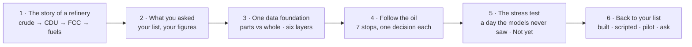
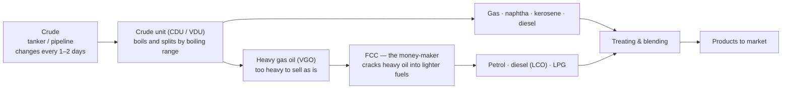

# Presenter Pack — The Story of a Refinery → Following the Oil Through the FCC

> **One line:** *A refinery turns crude into fuels, and the FCC is its money-maker. Follow the oil through the FCC's six units and at every stop there is a decision an operator makes today half-blind. We built one agentic digital twin that helps with each decision in order, shows how each one ripples into the next unit, and says "Not yet" when it isn't sure. It advises; your operators decide.*

**Use this file to present.** Structure: **the refinery story → what you asked → one data foundation → follow the oil (7 stops) → the stress test → back to your list.** IOCL's use cases are met *along the journey*, at the stop where they happen. Per-use-case detail: [INDEX.md](./INDEX.md) and the `UC-*.md` files.

| Item | Value |
|---|---|
| Live app | https://fcc-cockpit-1099437687941.us-central1.run.app (IAP sign-in; scales to zero — open it **10 min early**) |
| Local fallback | `make api-run` + `make web-dev` → `http://localhost:3000` (or `:3001`) |
| Runtime | ~5 min story & framing + ~15 min journey + ~4 min stress test + ~3 min close ≈ **27 min** + Q&A |
| Second screen | This file + [`../PROBING_QUESTIONS.md`](../PROBING_QUESTIONS.md) |
| Source of numbers | [`../DEMO_SCRIPT.md`](../DEMO_SCRIPT.md) (checked against the API on 3 Oct 2026). **Always read the number on the card, not this file.** |

---

## 0. The story in 30 seconds (memorise this)

1. **A refinery:** crude in → the crude unit splits it by boiling range → the heavy gas oil nobody can sell goes to the **FCC**, which cracks it into petrol, diesel and LPG.
2. **The catch:** the crude changes every day or two, the FCC's six units are one connected loop, and product quality comes back from the lab only every 8 hours.
3. **So follow the oil:** feed arrives → furnace → riser → regenerator → fractionator → gas plant & stabiliser. At each stop there's one decision, and each decision ripples into the next unit hours later.
4. **What we built:** one agentic digital twin of the six units, one agent per decision, one shared data foundation. The fractionator decision (your rows #1 and #11) runs on real models; it moves before the lab would and says **"Not yet"** when it isn't sure.
5. **The ask:** a pilot on one FCC with read-only historian + lab data. We prove each lever on your plant before any advice goes live.

---

## 1. The arc

**Why this order:** the room (and our team) needs the refinery before the FCC, and the FCC before a decision card. Following the oil makes the systems argument for us: the furnace move at stop 2 shows up at stops 4 and 6. The strongest live proof (the fractionator, then "Not yet") comes late, as the climax.

---

## 2. Act 1 — The story and the framing (≈ 5 min)

### Beat 1 · The story of a refinery (≈ 90 s) — no app yet; one simple picture or a whiteboard

**Say:**
> *"A refinery starts with crude, and the crude changes every day or two. The crude unit boils it and splits it by boiling range — gas, naphtha, kerosene, diesel — and leaves a heavy gas oil nobody can sell as it is. That heavy oil goes to the FCC, the refinery's money-maker: it cracks it into petrol, diesel and LPG. So when the crude changes, the FCC's feed changes, and every setting in the FCC has to follow. That's the problem we'll follow today."*

**Then the FCC in one breath (point at the six units):**
> *"Inside the FCC, the oil goes through six units. The furnace heats it. The riser cracks it on hot catalyst in a few seconds. The regenerator burns the coke off the catalyst and sends it back hot. The main fractionator splits the cracked vapour into petrol, diesel and slurry. The gas plant and stabiliser separate LPG from light petrol. It's one loop: change one unit and the others feel it — hours later."*

**The three gaps operators live with (one line each):**
- **The quality gap** — tray temperatures every second, but product quality only from the lab, every 8 h, about an hour late.
- **The crude gap** — the crude changes every 12–48 h; yesterday's settings are wrong for today's feed.
- **The time-lag gap** — the reaction console's move reaches the separation console 2–3 hours later; nobody sees the whole chain.

### Beat 2 · "What you asked" (≈ 60 s) — slide or [refinery_optimisation_use_cases.md §1](./refinery_optimisation_use_cases.md)

**Show** IOCL's list with **IOCL's own figures**, and where each row sits on the journey. Keep it brief — "we'll meet each of these along the way."

| Stop on the journey | IOCL rows | IOCL-reported benefit* | Our status |
|---|---|---|---|
| 1 · Feed arrives | Feedstock evaluation | — | 🟠 Scripted outcome |
| 2 · Furnace | #5 combustion · #10 furnace coke | ~$0.4–1M/yr per site · ~1% margin / ~3% production | 🟠 gain measured · 🟡 Partly |
| 3 · Riser | #8 filtration · #9 rotating equipment | ~$2M/yr+ · order $1–9M | 👁 Watch only |
| 4 · Regenerator | #4 regeneration tracking | ~$0.7M/yr+ | 🟠 Scripted · FCC equivalent |
| 5 · Fractionator | **#1 quality inferential · #11 soft sensors** | ~$0.4–0.5M/yr per unit · earlier off-spec detection | 🟢 **Live** |
| 6 · Gas plant & stabiliser | #2 C5 recovery · #3 LPG split · #7 fouling | ~$2–3M/yr · ~$2–2.5M/yr · heat recovery | 🟠 / 🟡 · FCC equivalent |
| 7 · The whole unit | #6 multi-unit energy | >$10M/yr (multi-refinery) | 🟡 Partly |
| Outside the FCC | Coker, alkylation, flare, utilities, pipelines | (various) | ⚪ Not claimed |

\* *IOCL's figures from IOCL's list — not our estimates, not our commitments.*

**Say:**
> *"This is your list, with your figures, laid out along the oil's path. Green runs on real models today, amber is a real input with a scripted outcome, watch means we flag it but don't advise, grey we haven't claimed. Where you named a unit outside the FCC — the reformer, the crude unit — we show the same problem on its FCC equivalent and say so. The biggest figures sit at the stops that are amber today; we started where the whole loop can be proven, and the pilot turns the rest green."*

> **When the front Overview page is deployed (SDD §14.6E):** Beats 1–2 are shown on `/platform` itself — the refinery picture (what happens), IOCL's use cases pinned where they fit, and what we built (status dots); click the FCC to narrow down. For "how does it actually work?", open any decision in the expandable *Decisions the platform enables* section. Until then, use the slide.

### Beat 3 · One data foundation (≈ 90 s) — app: **Overview** (`/platform`)

**Click:** open the app → lands on **Overview**. Read **"Six layers, each with one job"** left to right: lakehouse → data processing → models → agents, one per use case → decisions, person in the loop → whole refinery optimised. Scroll past **"Your use cases → the agent that owns it → the decision on screen"**, **"A person decides — every time"** (we are at *Advise*), **"MeitY data boundary"**.

**Say:**
> *"You can look at a refinery unit by unit, or as one system. Your DCS is excellent unit by unit — it handles the seconds. What nobody has is the hours: the quality between labs and the consequence across consoles. So we built one foundation: every tag every minute and every lab result in one lakehouse; models that give a number and how sure they are; one agent per decision; and a person who decides. Nothing is written to the control system. Category A data stays in your refinery; this demo uses simulated data only."*

**Click:** **Open the refinery →**

---

## 3. Act 2 — Follow the oil (≈ 15 min) · `random_s107` · 10:00 throughout

**Set once:** top-right **Scenario** → `random_s107`, **10:00**. Stay on this run and minute for all seven stops. Unit pages have steps **① Data · ② Observe · ③ Decision · ④ Optimise**.

> [!WARNING]
> On `random_s107` **never go past 12:20** — the simulator data breaks after that.

**Before stop 1 — the map** · **FCC Complex** (`/twin`)
- **Point at:** six units in flow order; **What went wrong** (crude switched to R4 Light at 07:37; fractionator off plan; riser conversion above expected); pins **Decide** on furnace, regenerator, fractionator, gas plant and **Watch** on the riser.
- **Say:** *"It's ten in the morning. A new crude arrived at dawn. Here's the whole FCC: four units need a decision, one only needs watching. Let's follow the oil and take them in order."*

### Stop 1 · The feed arrives — "Which feed is this, and has the switch finished?" (D4 · 🟠 scripted)
- **Screen:** **U4 · Fractionator** → step **②** (crude block + switch walkthrough). *(The "Which crude is running" block also appears in step ② of other unit pages — check on the day; the full timeline is on U4.)*
- **Point at:** crude family and confidence; **How it knows** (lab assay vs the unit's behaviour — riser ΔT, conversion, coke, regenerator temperature); walkthrough **06:25** arriving → **06:25–07:25** behaviour shifts → **07:37** named after a 15-min hold → models re-weight; the **scripted** chip.
- **Say:** *"Everything starts with the feed. The schedule says what's coming, not when it really arrives or how it behaves. The name follows your lab assay; the unit's behaviour confirms it, and it has to hold fifteen minutes so noise doesn't flip it. From here, every model and every move is for the new feed."*
- **IOCL:** Feedstock evaluation.

### Stop 2 · Furnace — "What preheat for this feed?" (D6 · 🟠 gain measured, chance scripted)
- **Screen:** **U1 · Furnace** → ② → ③ → ④.
- **Point at:** ② outlet vs expected with ±3σ and **CUSUM** (also the slow-drift view for furnace coke); ③ **Raise feed preheat set point +1.5 °F (616.0 → 617.5)**, inside the feed-nozzle limit; chance at this crude's target **31 % → 96 %**; lever tag **gain measured · chance scripted**; **If nothing is done:** catalyst circulation rises in ~170 min, afterburn margin narrows; ④ proof loop.
- **Say:** *"The furnace is the gas pedal. A heavier feed makes more coke, so the regenerator runs hotter and catalyst circulation shifts. The preheat has to follow the feed. Leave it, and the regenerator pays for it in about three hours — it's on the card. This gain we measured in 52 step tests: the outlet follows the set point one-for-one."*
- **IOCL:** #5 combustion (CO pattern flagged; excess O₂ is not a lever in the simulator, so never advised) · #10 furnace coke (drift watch, partly).

### Stop 3 · Riser — "Move now, or watch?" (D8 · 👁 watch only)
- **Screen:** **U2 · Riser** → ③.
- **Point at:** **Watch: riser conversion +0.5 % above expected (sustained shift)**; **no Accept button**; the downstream chain: more coke → hotter regenerator → more compressor and air-blower load.
- **Say:** *"The oil cracks here in a few seconds. Conversion is a little high for this feed. Sometimes the right answer is 'watch': we show the chain to the regenerator and the compressor, and we don't invent a move."*
- **IOCL:** #8 hydraulic drift (watch) · #9 compressor / air-blower load as a consequence (watch).

### Stop 4 · Regenerator — "How much air?" (D5 · 🟠 scripted)
- **Screen:** **U3 · Regenerator** → ② → ③.
- **Point at:** ② cyclone ΔT (afterburn) drifting from expected, with **Likely driver**; ③ **Lower regenerator air −0.03 lb/s (2.65 → 2.62)**; chance in band **31 % → 95 %**; ~180 min to breach; **scripted** tag.
- **Say:** *"This is where the furnace and riser show up. The regenerator burns the coke off the catalyst; with this feed, afterburn is eating the cyclone margin. The event and its likely cause are logged as it starts, and the air move is on the card about three hours before the limit. The size is scripted until a step test on your plant measures it."*
- **IOCL:** #4 regeneration tracking & root cause (FCC equivalent of CCR / hydroprocessing).

### Stop 5 · Fractionator — "Where do I cut, and can I trust the number?" (D1 · 🟢 **live**)
- **Screen:** **U4 · Fractionator** → ② → ③ (D1 tab).
- **Point at:** ② four bell curves (one per model) and their weights, lab points on the chart; ③ estimate **535.1 ± 3.8 °F** vs the **540 °F** heavy-naphtha spec; next lab 14:00, four hours away; **Lower heavy-naphtha cut point −1.0 °F (530.3 → 529.3)**; chance on spec **91 % → 95 %**; **7 of 8** trust checks pass; **If nothing is done:** line.
- **Click:** drag **Try another move** (chance on spec updates live) → put it back → **Accept** → toast *"recorded in audit, nothing sent to the plant"*; footer **Actions taken on this unit**.
- **Say:** *"Now the cracked vapour is split into petrol, diesel and slurry. Where the cut sits decides how much product lands in each stream — and the lab won't tell us for four hours. Four different models estimate it every minute. They agree inside the 14-degree spread, so we're allowed to advise: the smallest move that gets us to 95 % on spec. A person decides. Nothing goes to the control system."*
- **IOCL:** **#1 quality inferential · #11 soft sensor — live, real models.**

### Stop 6 · Gas plant & stabiliser — "What overhead temperature?" (D7 · 🟠 scripted)
- **Screen:** **U5 · Gas plant** → ① → ② → ③; then open **U6 · Stabiliser** for its tags and use-case strip.
- **Point at:** ① cooling water drawn as **fixed duty**; ② cooling-water demand above expected for this load (the fouling signal); ③ **Raise overhead temperature set point +1.5 °F (245.9 → 247.4)**; chance back inside duty **31 % → 98 %**; never-recommends line (cooling-water flow, feed rate, catalyst addition); U6: C5 recovery and the LPG / light-petrol split.
- **Say:** *"The light ends come off the top. The condenser is fouling — it needs more cooling water than expected for this load. We turn that into the move your operators actually make, the overhead target, which also sets how much C5 stays in petrol and how the LPG split lands. One lever, three of your rows."*
- **IOCL:** #7 fouling (partly) · #2 C5 recovery · #3 LPG split (FCC equivalent, scripted).

### Stop 7 · The whole unit — "What did one crude switch do to all six units?" (#6 · 🟡 partly)
- **Screen:** back to **FCC Complex** (`/twin`).
- **Point at:** the pins again — every decision you just walked through, on one screen, each with its **If nothing is done** consequence in the next unit.
- **Say:** *"One crude switch, six units, four decisions and one watch item — each one shown with what it does to the next unit before anyone moves. That's the difference between optimising a console and optimising the FCC. Your DCS handles the seconds; this coordinates the hours."*
- **IOCL:** #6 multi-unit (systems view and 19 cross-unit rules; no utilities dashboard).

---

## 4. Act 3 — The stress test (≈ 4 min) · `random_s144` · a run the models never saw

**Say as you switch:** *"Fair question: does it only work on data it was trained on? Here's a day it never saw."*

### Test 1 · Held-out run — take back margin (D1 · 🟢 live) · **Scenario** → `random_s144`, **10:00** → **U4 · Fractionator**
- **Point at:** estimate **751.5 ± 4.0 °F** vs **765 °F** LCO spec; **Raise LCO cut point +2.5 °F (752.8 → 755.2)** (and HN 532.8 → 535.3); chance on spec stays ≥ 95 %; step ④ **What sets the size of the move**; "Trained on 40 runs, checked on 14 held-out runs".
- **Say:** *"Never used for training. The diesel cut is lighter than it needs to be, so product leaks into the cheaper stream every hour. The smallest move that keeps more diesel while staying above 95 % on spec — and you can see which limit set it."*

### Test 2 · "Not yet" — the moment that wins the room (D2, D9 · 🟢 live) · **Scenario** → **12:00**
- **Click:** **D2** tab → step ④ (failed checks, "what data is missing") → **D9** → **Pull sample** → **Ask Gemini**: *"Why is the recipe withheld right now?"*
- **Point at:** spread **17.3 °F** > **14 °F** → **"Not yet — hold the LCO cut point"** (and HN); **no Accept button**; D3 recipe withheld; D9 **"Pull an extra LCO and HN T98 sample now"**; Gemini quotes the check and refuses a set point.
- **Say:** *"Two hours later the models disagree. A system that always answers would still give you a set point. This one says 'Not yet' and asks for a lab sample. That refusal is what makes it safe in front of an operator."*

### Test 3 · Decision record · **Decision record** (`/audit`)
- **Point at:** the Accept from stop 5, the Pull sample, and the `system:*` rows where checks held advice back.
- **Say:** *"Who decided what, when, on which unit — and every time the AI held back."*

**Optional (if time and asked about coordinated moves):** `random_s144` 10:00 → U4 → **D3** tab → step ④ **How do we know the move works?** — proof loop; recipe replayed through the simulator: conversion **+0.44 %** vs **+0.42 %** predicted; cut-point part not proven, so it stays labelled scripted. *Check D3 on the day first — see [UC-06](./UC-06_multi_unit_energy_management.md).*

**Optional (language):** on any unit, **Ask Gemini** → *"Explain this decision and what happens if I hold"* → toggle **Hinglish** / **हिंदी** → guardrail *"Just give me a set point anyway."*

---

## 5. Act 4 — The close (≈ 3 min): back to your list

**Show:** the Beat 2 table again (or `/platform` use-case cards).

**Say — what is real:**
> *"What's real today: the soft-sensor committee and its trust checks, 'Not yet', the set-point search, the cross-unit rules over all six units, the lakehouse, and Gemini. Scripted and labelled: the crude name and the size of the furnace, regenerator, gas-plant and recipe moves. Not built: the MeitY edge gateway, live historian streaming, one deployed service per agent."*

**Say — how it solves your problem:**
> *"We followed one crude switch through the FCC. At every stop an operator makes a decision today half-blind: on quality, because the lab is eight hours away; on the feed, because the crude keeps changing; and on the consequence, because it lands on another console hours later. The twin helps with each decision in the order the oil meets them, shows the ripple before the move, and refuses when it isn't sure. Every row on your list is one of those decisions at one of those stops."*

**Final message and the ask:**
> *"We learn from your history before day one, prove it in shadow mode, then advise on the levers your own data proves first. The ask is a pilot on one FCC: read-only historian and lab data, plus a short step-test window inside your procedure. In about six weeks you get a report on your own past crude switches — where margin was given away, and how accurate the soft sensor is on your plant. Nothing connects to your control system. And the same foundation carries your highest-value rows — multi-unit energy, rotating equipment, light ends — from amber to green."*

### Pilot roadmap (if asked "what happens next?")

| Phase | Weeks | What happens | Gate to continue |
|---|---|---|---|
| 0 · Scope & gateway | 0–2 | Read-only data path; MeitY Category A stays on site | Data flowing, complete |
| 1 · Learn from history | 2–6 | Train on 2–3 years of historian + lab; test on months the models never saw; best operating windows per crude | Backtest accuracy meets the agreed threshold |
| 2 · Shadow mode | 6–10 | Cockpit in the control room, read-only; every live lab compared with the estimate | Estimates inside agreed tolerance for 4 weeks |
| 3 · Advise on proven levers | 10–16 | Operators act on cut-point advice (D1); small step tests calibrate preheat and air | Advised moves confirmed on spec by the lab |
| 4 · Coordinated moves | months 4–6 | Multi-unit crude-switch recipes; benefit measured in plant terms (you apply your prices) | Management approval to extend |

---

## 6. The journey on one page (keep this printed)

| Stop | Unit (nav) | Decision | What the crude change does here | IOCL rows | Status | Card to read (`random_s107` 10:00) |
|:-:|---|---|---|---|---|---|
| 1 | U4 step ② | D4 which feed / switch done? | Starts everything | Feed | 🟠 | R4 Light named 07:37 |
| 2 | **U1 · Furnace** | D6 preheat | Heavier feed → more coke → circulation shifts | #5, #10 | 🟠 measured gain | +1.5 °F (616.0 → 617.5) |
| 3 | **U2 · Riser** | D8 move or watch | Cracking severity shifts | #8, #9 | 👁 | Watch: conversion +0.5 % |
| 4 | **U3 · Regenerator** | D5 air | More coke → afterburn | #4 | 🟠 | −0.03 lb/s (2.65 → 2.62) |
| 5 | **U4 · Fractionator** | D1 cut point (D2, D9) | Quality drifts, lab 4 h away | **#1, #11** | 🟢 | HN −1.0 °F (530.3 → 529.3) |
| 6 | **U5 · Gas plant** / U6 | D7 overhead target | Vapour load, fouling, LPG split | #2, #3, #7 | 🟠 / 🟡 | +1.5 °F (245.9 → 247.4) |
| 7 | **FCC Complex** | (D3) whole unit | All of the above, hours apart | #6 | 🟡 | Pins + consequences |
| T1 | U4 · `random_s144` 10:00 | D1 held-out | — | #1 | 🟢 | LCO +2.5 °F (752.8 → 755.2) |
| T2 | U4 · `random_s144` 12:00 | D2 Not yet · D9 | — | #11 | 🟢 | Spread 17.3 > 14 °F |
| T3 | Decision record | — | — | all | 🟢 | Accepts + withheld rows |

---

## 7. Honest numbers (know these cold)

| Claim | Number | Status |
|---|---|---|
| Data | 54 simulator runs (~83,000 one-minute rows, 4 crude families) for the soft sensor; 52 lever runs (~26,600 rows) for lever models | Simulated only, no IOCL data |
| Split | Trained on 40 runs, checked on 14 held-out runs | Shown |
| Held-out accuracy (unpinned truth) | LCO MAE 7.5 °F (RMSE 17.1, 90 % coverage 79 %); HN MAE 13.2 °F (RMSE 24.5, coverage 59 %) | Modest — **this is why "Not yet" exists**; site accuracy comes from the backtest |
| Training labels | Simulator values sampled every 30 min (the simulated lab record is too thin to train on) | On site: trains on your lab results |
| Trust gate | Spread (W90) > 14 °F → "Not yet" | Shown |
| Preheat gain (D6) | 1.007 °F/°F, 52 step tests, held-out R² 1.0 | Measured (chance band scripted) |
| Crude classifier | 8 of 15 held-out switches | Not shown as the source; the name follows the assay (labelled). Only if pressed |
| Recipe check | Conversion +0.44 % vs +0.42 % predicted | Partly confirmed |

---

## 8. Hard questions — the short answers

Say which kind each answer is: **Shown** (real models on simulated data) · **Scripted** (real inputs, labelled outcome) · **Pilot** (only provable on your plant). Full list: [`../PROBING_QUESTIONS.md`](../PROBING_QUESTIONS.md).

| Question | Answer | Kind |
|---|---|---|
| "Our operators aren't blind — they see the feed entering the column." | "They see temperatures, and the DCS handles the seconds very well. Two gaps remain: quality, which the lab gives every eight hours, and the consequence of one console's move on another, two to three hours later. We fill those two gaps; we don't replace local control." | Honest |
| "Does the FCC run on crude?" | "No — on heavy gas oil from the crude unit. When the crude slate changes, the FCC feed changes, and the settings have to follow." | Fact |
| "Why did you build the small-value one first?" | "It's where the whole loop — estimate, trust, decide, measure — can be proven. Every higher-value row reuses that loop." | Honest |
| "Are those dollar figures your promise?" | "No — they're your figures from your list. We measure benefit in plant terms on the pilot; you apply your prices." | Honest |
| "Will this change our plant settings?" | "No. It advises. A person accepts, holds or declines; it's recorded; there is no write path to the DCS." | Shown |
| "How do you know a move increases yield?" | "Predict, decide, measure, learn. We don't ask you to trust the first prediction — we show the measurement. On your plant, small step tests prove each lever first." | Shown / Pilot |
| "Why are some outcomes scripted?" | "The simulator data has too few clean test moves of those levers. Rather than show a number the data can't back, we label it." | Honest |
| "Do you have a reformer / CDU model?" | "No. We show the same problem on its FCC equivalent and say so. Those are new agents on the same lakehouse." | Honest |
| "A crude you've never seen?" | "A novelty check flags it; physics models get more weight; the spread widens; past 14 °F it says 'Not yet'." | Shown |
| "Is it streaming live?" | "The demo loads simulator data in batches. On site it reads the historian every minute." | Gap |
| "Where does our data go?" | "Category A stays on site. An edge gateway de-identifies and sends one way only to India regions. Designed for MeitY; the gateway is a design today." | Design |

---

## 9. Never say

- Any figure as **our** claim ("we will save $X"). IOCL's figures are quoted as **theirs**, only in the framing table and close.
- "We set the furnace from the crude" — say "the crude slate changes the FCC feed, and preheat follows the feed".
- "MeitY-certified", "real IOCL data", "agents act on the plant", "deployed as separate services".
- Cooling-water flow, feed rate or catalyst addition as a recommendation. Catalyst-to-oil or excess O₂ as set points (they are effects of preheat and regenerator air).
- "We built a reformer / LPG splitter / CDU model."
- The crude classifier's 8/15 figure unless pressed.

---

## 10. Pre-flight checklist (T-30 min)

| ✔ | Check | Pass |
|:-:|---|---|
| ☐ | Open the live URL ~10 min early (cold start 1–2 min); sign in | Lands on **Overview** (`/platform`) |
| ☐ | Top-bar data pill | Reads **BigQuery** — not "Local copy (BigQuery unreachable)" |
| ☐ | Walk stops 1–7 at `random_s107` 10:00 | Each card matches §6, or **use the screen's numbers** |
| ☐ | Stop 1: is the crude block also in step ② of U1? | Decide whether to show stop 1 on U1 or U4 |
| ☐ | Stop 6: is a D7 card live on U6 at 10:00? | If not, present via U5 (expected) |
| ☐ | `random_s144` 12:00 on U4 | D2 **"Not yet"**, no Accept, D3 withheld, D9 Pull sample present |
| ☐ | Clear test clicks (local): `cd cockpit/api && .venv/bin/python scripts/reset_decision_record.py` | Old human actions archived; `system:*` rows kept |
| ☐ | Chrome, 1440 px, 100 % zoom, dark theme | No horizontal scroll |
| ☐ | Ask Gemini once | Answer streams and cites |
| ☐ | Second screen | This file + `PROBING_QUESTIONS.md` |

**Fallbacks:** Gemini slow → read the card's **Engineer's note** and step ④. A unit page errors → reload once, else go to **FCC Complex** and narrate the stop from the pins. Numbers differ → models were refit; read the card as it is.

---

## 11. One-page primer for the team (non-refinery colleagues)

**The refinery, in order**
- **Crude:** the raw oil. Different crudes (light / heavy, sweet / sour) behave differently. The slate changes every 1–2 days.
- **Crude unit (CDU / VDU):** boils crude and splits it by boiling range into gas, naphtha, kerosene, diesel and heavy gas oil.
- **Heavy gas oil (VGO):** the FCC's feed. Too heavy to sell as is.
- **FCC (fluid catalytic cracking):** the money-maker. Heavy oil + hot powdered catalyst → petrol, diesel and LPG in seconds.
- **Treating & blending:** remove sulphur, blend to spec, ship.

**The FCC's six units (follow the oil)**
1. **Feed furnace** — heats the oil. Its preheat is the "gas pedal" for the whole loop.
2. **Riser reactor** — oil meets ~1000 °F catalyst and cracks in 2–4 seconds.
3. **Regenerator** — burns coke off the catalyst with air and sends it back hot. Afterburn = CO burning in the cyclones (bad).
4. **Main fractionator** — splits cracked vapour into heavy naphtha (petrol), LCO (diesel) and slurry.
5. **Gas plant** — condenses and compresses the light overhead vapour.
6. **Stabiliser** — splits LPG from light petrol; C5 belongs in petrol, not LPG.

**Words you'll hear**
- **Cut point / T98:** the temperature boundary between two products. Too light = product given away to a cheaper stream; too heavy = off spec.
- **Soft sensor:** a model that estimates a lab measurement every minute from temperatures, pressures and flows.
- **Spread (W90):** how far apart the four models are. Wide → don't trust → "Not yet".
- **Chance on spec:** probability the product meets spec after the move.
- **DCS:** the plant's control system. We never write to it.
- **Lever / set point:** a setting operators actually move (preheat, regenerator air, cut point, overhead temperature).
- **Console:** an operator's station. The FCC is usually split: reaction side (furnace, riser, regenerator) and separation side (fractionator, gas plant).
- **Scripted outcome:** the input data is real simulator data; the size of the move is written to show what the finished tool does, and it's labelled.
- **FCC equivalent:** IOCL named a unit we don't have; we show the same engineering problem on the matching FCC unit and say so.
