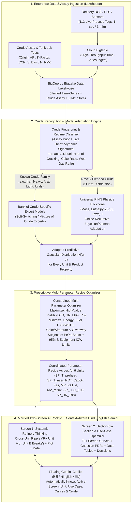

# Verbatim Voice Notes & Complete Engineering Analysis: Refinery Crude-Adaptive Multi-Parameter Optimization

> **Date:** 2026-10-01  
> **Directory:** `agent_ideas/FCC_RCC_Optimisation/`  
> **Companion Documents:** [`refinery_optimisation.md`](refinery_optimisation.md) · [`fcc_soft_sensor_problem_statement.md`](fcc_soft_sensor_problem_statement.md) · [`fcc_ai_driven_soft_sensor_solutions.md`](fcc_ai_driven_soft_sensor_solutions.md) · [`BCC.md`](BCC.md) · [`SDD.md`](SDD.md) · [`checklist.md`](checklist.md)

---

## Executive Summary (BLUF)

**We have built 100% of the *Passive Soft-Sensor & Safety Gate* foundation (~50% of the end-state vision), but to solve the real refinery problem you articulated, we must evolve the system from a *Passive Single-Knob Cut-Point Estimator* into an *Active Crude-Adaptive Multi-Parameter Refinery Optimizer*.**

* **So What:** When a refinery switches crudes every 12 to 48 hours (e.g., shifting to an Iranian Heavy cargo, an Arab Medium blend, or an opportunity crude), operators do not want an AI that simply widens its uncertainty band (`W90 > 14 °F`) and freezes with *"Distribution spread too wide — WITHHELD"*. They need an AI that:
  1. **Recognizes the incoming crude regime** (combining pre-run crude assay lab tests with real-time thermodynamic unit signatures from `Bigtable → BigQuery/BigLake Lakehouse`),
  2. **Adapts or switches the ML/Physics model** to match the new crude (`Mixture of Crude-Family Experts + PINN Conservation Backbone + Online Bayesian/Kalman Parameter Adaptation`), and
  3. **Prescribes the coordinated multi-parameter operating recipe across all units** (`Preheat Temp`, `Riser ROT`, `Cat/Oil Ratio`, `Regen Air`, `Pumparound Duties`, `Reflux Ratio`, and `Fractionator Cut Points`) to **maximize high-quality product yields** and **minimize energy consumption, coking, and quality giveaway** — presented across **two married toggle screens** (*Systemic Refinery View* vs. *Section-by-Section / Use-Case View*) with **zero grey curves**, **Gaussian distributions (`N(μ, σ)`) for every target**, and a **window-aware, Hindi-first (`हिंदी`) Gemini Copilot**.

---

## Part 1: Exact Word-for-Word Verbatim Transcripts of Your Voice Notes

### Voice Note 1 — Cockpit Review, Systemic vs. Section-by-Section Vision, Data Lakehouse Flow & Hindi Gemini Context
> "...verbatim of this.
>
> So, I will say this looks much better, more in line with, you know, what I was expecting — so right data, dashboard, numbers, right? In terms of the dashboard, I think it is much, much, much better.
>
> So, but let me give you the vision as well. I think vision-wise it's also good.
>
> Just see if it is aligned with the overall refinery and the... what was the document called? Basically the high-value use cases by value area. So see if it is aligned with that sheet; if something is to be added, add it.
>
> And I would say that somehow the dark gives [the] feel of that it is AI, that something new is happening, and I would put a toggle.
>
> And when it comes to curves, right, I think we can have different colors of different curves. Even though there is, but again, there are some that are just grey, so it is difficult to make a difference of grey.
>
> And your decision support, I think, is better now than before. So all the relevant sections should be there, all the relevant curves should be there as well.
>
> See if there is value of Gaussian distributions — for example, there was a theory that, okay, it should be a certain value, and how the machine learning models are coming into picture, what is the flow looking like.
>
> Okay, let me give you an idea of what I was thinking. I was thinking that the overall data is coming in, let's say, from the entire refinery into, let's say, from Bigtable to BigQuery, yeah? We can discuss the actual thingy. So from there, let's say a data warehouse — not a data lake, not a warehouse, sorry, a data lakehouse — the data is getting fetched up. So data is getting fetched up and models are getting built.
>
> So one is the systemic thinking of the entire refinery: if something goes off at one point, then it will be having an effect on something else. So systemic thinking of the entire refinery, and the agent should tell, 'Okay, fix this, otherwise there will be a consequence on something else.'
>
> Then there is kind of the current approach in which we are optimizing section by section.
>
> So how do we marry the two schools? So basically, systemic thinking in which there will be an agent looking at the entire refinery, showing us, 'Okay, something is off there,' showing us the plot there on one dashboard, and then you should be able to see the data, right?
>
> Then on the other toggle screen, all these different units, all these different use cases within that should be there. And then the relevant data, the relevant curves, the relevant decision support. So I think the relevant curves and data, it can be again a full-fledged screen in itself.
>
> And when I'm talking about Gemini on top of that, the Gemini, when it is opened, it will have the context of the window — for every window that is open. I think this is also very critical. And it should support native languages — for example, I would go with Hindi to start with, because if we can implement Hindi, English should be straightforward.
>
> Now with that in mind, what changes would you like to make? Now give me a verbatim of the entire thing."

### Voice Note 2 — Instruction on Verbatim Only
> "Also from you I just want verbatim, I don't want you to take any actions."

### Voice Note 3 — Revisiting the Core Problem Statement: Dynamic Crude Changes & Multi-Parameter Adaptation
> "Also, again give me the verbatim of this.
>
> So, the idea is: the problem statement was that crude changes, right? So crude changes. Now, if the machine learning is only trained on the data that has come in, so how is the machine learning models adapting to the change? Right, it can be a 12-hour change, it can be a 2-day change, that crude is coming from a different place.
>
> And now what they want to do is: they want to select different parameters in line with the new crude. So what is that model looking like? Do we have... can we kind of recognize the model depending on — again, there must be some tests that are run, right? Even if I tell you that, okay, this is the crude coming from Iran, there should be specific models for all these crudes, right? And the machine learning model should be able to assess, 'Okay, this is the new crude that has come in, so let's adapt these parameters.'
>
> So I think that is the kind of solution that they are looking for: if something changes in the background, what are the changes that you need to make in the parameters so that you can maximize the outputs — the high-quality outputs — and all the other things that need to be minimized. I think that is a case in point.
>
> The question is: are we solving the right problem? Are we even there yet? If not, then let's define the problem statement and how do we solve it. Let's revisit."

### Voice Note 4 — Saving to `verbatim.md`
> "Put all this in a verbatim.md file and give that file to me."

### Voice Note 5 — UI Regression Critique, Curves & Distributions, Median Deviation Flaw, Dark Mode & Decision Support
> "So give me the verbatim of this text.
>
> So basically what I asked you was that each of the separate, I would say, units should be clearly mentioned, right? Okay, it is clear, but it looks again like an ugly HTML file, very ugly map.
>
> Then I said that some of these curves, for example the Gaussian, would have different colors — that is completely gone for some reason.
>
> Third, initially for every curve there was a kind of a distribution of probability that was around the curve or basically around the value, current value. Now I see that you have taken a median for some reason and then the deviation is around the median — it looks stupid. We are looking [at] deviation around the value, right, of the curve. So the different boundaries, that is completely gone. So I'm not sure if we are progressing or if we are fucking taking 20 steps back and gotten a very lackluster kind of a user interface.
>
> And also this looks like a very stupid HTML, it is more like a fucking seriously like a presentation, like a PowerPoint. I want the experience of a very professional-grade user interface.
>
> And then all the bell curves are also gone for some reason. And I said, okay, there should be a... there should be a systemic thinking. I don't see any of that.
>
> And also there was supposed to be a toggle in which we can see black and then we can see white. There is just white for some reason. I asked let's make the standard to be black.
>
> And what happened to all the previous curves? Okay, I see different units, but what happened to the previous curves? What the heck? And where are the decisions?
>
> To be fair, I'm not even sure if you're doing the same thing, if you're on the same page. You're crying about data, but I don't see anything. Like seriously, is this the best dashboard? This is more like a PowerBI dashboard — PowerBI dashboards are better than this.
>
> I want an industry-grade user interface. Like seriously."

---

## Part 2: Deep Analysis — Are We Solving the Right Problem?

### 2.1 Honest Verdict: Where We Are vs. Where We Need to Be
We are **halfway there (~50%)**. What we have built so far solves the **Observability & Safety Problem** (*"What is the product cut point right now between 8-hour labs, and when should we withhold a move?"*), but it does **not yet** solve the **Crude-Adaptive Multi-Parameter Optimization Problem** (*"A new crude slate just entered the unit — how does the ML model recognize and adapt to this crude, and what exact combination of operating parameters across the unit should we change to maximize high-value yields and minimize energy/coking?"*).

### 2.2 Detailed Codebase Gap Analysis (What Exists vs. What Is Missing)

| Dimension | What Exists in the Codebase Today | Why It Falls Short of Your Vision | What Must Be Built / Changed |
| :--- | :--- | :--- | :--- |
| **1. Core Problem Formulation** | [`fcc_soft_sensor_problem_statement.md`](fcc_soft_sensor_problem_statement.md) frames the problem around **4–12h lab latency** for `LCO_T98_F` and `HN_T98_F` soft sensors (D2) and trust gating (D3). | Treats crude changes primarily as a **disturbance that causes model uncertainty (`WITHHELD`)**, rather than an optimization event requiring a **new multi-parameter operating recipe**. | Redefine the problem statement around **Dynamic Crude-Slate Recognition, Online Model Adaptation, and Prescriptive Multi-Parameter Recipe Optimization**. |
| **2. ML Model Adaptation to New Crudes** | [`cockpit/api/app/pipeline.py`](cockpit/api/app/pipeline.py) (`L58-L78`, `L185-L228`) trains a single global `FoldBundle` (Bayesian Ridge, GPR, Hybrid Delta, PINN) with a 3-bucket `dist_feed_API` one-hot (`heavy < 22`, `medium 22-26`, `light > 26`) and updates a scalar Kalman bias `b_state` only *after* an 8-hour LIMS lab arrives. | 1. No **Crude Assay Fingerprint** inputs (Origin, K-factor, CCR, Sulfur, Basic N, Ni/V).<br>2. No **Bank of Crude-Specific Models** (e.g., *Iranian Heavy*, *Arab Light*, *Urals*, *Bonny Light*, *Opportunity Blend*).<br>3. Between labs (first 6–8 hours of a crude switch), the model does not adapt its parameters online from thermodynamic observables. | Build a **2-Stage Crude Adaptation Engine**:<br>• **Stage A (Assay + Online Thermodynamic Classifier):** Recognizes the active crude blend from tank assay tests + real-time unit signatures ($\Delta T_{\text{furnace}}$, heat of cracking, coke yield ratio, wet-gas ratio).<br>• **Stage B (Mixture of Crude Experts + PINN Rapid Adaptation):** Switches to the matching crude-family model (if known) or uses **PINN physics priors + Online Recursive Bayesian parameter adaptation** (if novel/blended). |
| **3. Parameter Selection / Optimization (`recommend.py`)** | [`cockpit/api/app/recommend.py`](cockpit/api/app/recommend.py) (`L52-L65`, `search_move`) runs a 1-D grid search over a single knob (`SP_LCO_T98` or `SP_HN_T98`, $\pm 5^\circ\text{F}$) using a linear scalar gain `g = dT98/dSP`. | When crude changes, tweaking one fractionator draw temperature is not enough. Operators must adjust **coupled parameters across all 6 units** (`SP_T_preheat_F`, `SP_T_riser_ROT_F`, `Cat/Oil`, `Fair`, `MV_PA1..4`, `MV_reflux_ratio`, `SP_LCO_T98`, `SP_HN_T98`). | Build a **Multi-Parameter Constrained Recipe Optimizer** that solves for the joint parameter vector $\mathbf{u}^*$ that **maximizes** high-value yields (`LCO`, `HN`, `LPG`, `C5 recovery`) and **minimizes** fuel gas, blower/compressor power, afterburn, and giveaway for the active crude. |
| **4. Data Lakehouse Flow (`Bigtable → BigQuery/BigLake`)** | [`sim_octave/load_to_bq.py`](sim_octave/load_to_bq.py) loads CSVs to BigQuery, and the UI shows a small text Provenance chip (`Simulated data · full_v1`). | The cockpit does not visually show the **Enterprise Data Lakehouse Architecture** (`Refinery DCS/Historian → Cloud Bigtable Streaming Ingest → BigQuery / BigLake Lakehouse → Feature Store & Crude Assay Registry → Vertex AI Model Bank`). | Add an interactive **Lakehouse-to-ML Pipeline Flow Strip** on the cockpit showing live ingestion (`Bigtable`), lakehouse curation (`BigQuery / BigLake`), crude regime matching, and ML/PINN inference. |
| **5. Marrying Systemic vs. Section-by-Section Views** | [`OverviewView.tsx`](cockpit/web/src/components/views/OverviewView.tsx) (`L1190-L1205`) has a sub-button toggle (`🌐 Systems Digital Twin` vs `📋 Use-Case Catalogue`), while unit/use-case workspaces render inline inside cards. | 1. On the **Systemic Screen**, the agent needs to more prominently connect **Root-Cause Unit $\rightarrow$ Downstream Consequence Plot $\rightarrow$ Underlying Telemetry Data**.<br>2. On the **Section/Use-Case Screen**, selecting a unit or use case should feel like a **full-fledged dedicated screen** with all curves, Gaussian distributions, data tables, and decision support. | Upgrade the top-level view switcher and workspace layout so **School 1 (Systemic Entire-Refinery Consequence & Plot + Data)** and **School 2 (Full-Screen Unit & Use-Case Optimizer)** are seamlessly married. |
| **6. Alignment with `refinery_optimisation.md`** | [`cockpit/api/app/twin.py`](cockpit/api/app/twin.py) implements Table 1 (`UC-01`..`UC-11`, High-Value Use Cases) and Table 2 (`#12`..`#34`, Documented Downstream Examples). | Section 3 of [`refinery_optimisation.md`](refinery_optimisation.md) (`L60-L105`, the **7 Downstream Refinery Use-Case Catalogue domains**: *Separation, Reaction & conversion, Treating, Scheduling & planning, Workforce empowerment, Sustainability & compliance, Pipeline & product movement*) is not surfaced in [`UseCaseCatalogueView.tsx`](cockpit/web/src/components/views/UseCaseCatalogueView.tsx). | Add the **7-Domain Downstream Refinery Catalogue** to `twin.py` and `UseCaseCatalogueView.tsx` so 100% of `refinery_optimisation.md` is represented. |
| **7. Curve Colors (Grey Lines Issue)** | • [`theme.ts`](cockpit/web/src/lib/theme.ts) (`L82`): `bayes_ridge_v1` in light mode is `#64748b` (slate grey).<br>• [`EstimateCharts.tsx`](cockpit/web/src/components/charts/EstimateCharts.tsx) (`L141`) & [`ConfidenceView.tsx`](cockpit/web/src/components/views/ConfidenceView.tsx) (`L123`): `simulator truth` is `t.muted` (`#a1a1aa` / `#71717a` grey).<br>• [`ConfidenceView.tsx`](cockpit/web/src/components/views/ConfidenceView.tsx) (`L46-L49`, `L298`): shadow models use `var(--subtle)` grey.<br>• [`twin.py`](cockpit/api/app/twin.py): `SP_*` and `*_dup` traces use `#94a3b8` grey. | Multiple curves on the same chart render as indistinguishable shades of grey (`#64748b`, `#71717a`, `#94a3b8`, `#a1a1aa`). | Replace **every** grey curve color with a distinct, high-contrast chromatic color (Electric Cyan `#38bdf8`, Emerald `#10b981`, Amber `#f59e0b`, Vivid Purple `#a855f7`, Rose/Magenta `#f43f5e`, Bright Gold `#eab308`, Coral `#fb7185`). |
| **8. Gaussian Distributions (`N(μ, σ)`) & Target Theory** | [`ConfidenceView.tsx`](cockpit/web/src/components/views/ConfidenceView.tsx) (`DistributionOverlay`) only plots Gaussian bell curves for `LCO_T98_F` and `HN_T98_F`. | In the Section-by-Section / Use-Case workspaces (`UC-01`..`UC-11` and `Units 1–6`), operators see a 1-D bar (`ThreeZoneEnvelopeBar`) but **not** the **Gaussian distribution curves (`N(μ, σ)`) vs. theoretical target value & IOW/spec limit**. | Add a **Gaussian Distribution & Theoretical Target Curve (`N(μ, σ)`)** to every Unit and Use-Case workspace, showing how each ML model's probability density compares against the theoretical sweet spot and spec limit. |
| **9. Gemini Window Context & Native Hindi (`हिंदी`)** | • [`useCopilotChat.ts`](cockpit/web/src/components/copilot/useCopilotChat.ts) (`L11-L17`): `usePageContext()` only sends `{ page, run_id, property, time_min }`.<br>• [`CopilotLauncher.tsx`](cockpit/web/src/components/copilot/CopilotLauncher.tsx): No language toggle inside the Gemini drawer header. | 1. When viewing a specific Unit (`unit_1_furnace`..`unit_6_stabiliser`) or Use Case (`UC-01`..`UC-11`), Gemini does **not** receive which Unit/Use-Case window or curves are open!<br>2. Although `chat.py` (`L23-L35`) has a `lang` branch for `hi`/`hinglish`, the UI never passes `lang` in `usePageContext()`, and there is no Hindi toggle or Hindi starter set in the Gemini drawer. | 1. Expand `useCockpit` store & `usePageContext()` to include `view_mode`, `unit_id`, `use_case_id`, `crude_id`, `active_charts`, and `lang`.<br>2. Add an explicit **`हिंदी (Hindi)` · `Hinglish` · `English` toggle** in the Gemini drawer header (`CopilotLauncher.tsx`) and sync it with Gemini text & Gemini Live voice. |

---

## Part 3: Redefining the Problem Statement & Technical Solution for Crude Changes

### 3.1 Why Crude Changes Break Conventional Refinery ML Models
In a real refinery, crude slates change every **12 to 48 hours** as tankage switches between cargoes (e.g., *Iranian Heavy*, *Basrah Medium*, *Arab Light*, *Urals*, *Bonny Light*, *Mumbai High*, or opportunity blends).
1. **Standard Pure-ML Failure Mode:** A purely data-driven ML model trained on past months of operation learns correlations specific to the historical crude mix. When a new crude arrives (or an existing crude shifts in tank-bottom layering), the feed's **molecular fingerprint** changes:
   - **API Gravity & Distillation Curve (TBP):** Alters flash-zone vapor/liquid split in the main fractionator.
   - **UOP K-Factor / Aromaticity & Refractive Index:** Governs crackability in the riser; more aromatic feeds crack less in the riser and leave more refractory cycle oil (LCO/slurry).
   - **Conradson Carbon Residue (CCR) & Asphaltenes:** Directly drives delta-coke on catalyst, regenerator bed temperature (`Treg_F`), and air blower (`CAB`) load.
   - **Sulfur (especially 4,6-DMDBT) & Basic Nitrogen:** Poisons catalyst active sites in the riser (reducing conversion at the same ROT) and spikes downstream hydrotreater severity requirements.
   - **Metals (Ni, V, Fe):** Catalyzes dehydrogenation reactions, spiking hydrogen and dry gas (`C1/C2`) loading on the Wet Gas Compressor (`WGC`).
2. **Why "Even Crude from Iran" Varies:** Even if the scheduler declares *"Iranian Heavy is entering at 14:00"*, the actual feed hitting the FCC riser is a **time-varying blend** (tank heel mixing + CDU/VDU fractionation cut variations + coker/hydrocracker recycle streams). Therefore, relying *only* on a static label ("Iran Heavy") or waiting *8 hours* for product labs fails.

### 3.2 How Our Crude-Adaptive ML + Physics Architecture Solves This
To answer your question — *"How is the ML model adapting to the change? What is that model looking like? Can we recognize the model depending on tests that are run?"* — the solution is a **3-Stage Hybrid Recognition, Adaptation & Prescription Engine**:



#### Step 1: Dual Crude Recognition (Lab Assay Prior + Live Thermodynamic Fingerprint)
* **Pre-Run / Tank Assay Input (When available):** When a new crude cargo or tank blend is lined up, the lab assay test parameters (`Crude Origin/Name`, `API Gravity`, `UOP K-Factor`, `CCR wt%`, `Sulfur wt%`, `Basic Nitrogen ppm`, `Ni+V ppm`) provide the **Bayesian Prior** for which crude model family to load.
* **Real-Time Process Signature Recognition (Every Minute):** Because tank switches blend gradually over hours, an **Online Crude Fingerprint Classifier** continuously reads live observables from the BigQuery Lakehouse:
  1. **Preheat Specific Duty ($\Delta T_{\text{furnace}} / F_{\text{fuel}}$):** Measures feed specific heat and density shift in Unit 1 before the oil even reaches the riser.
  2. **Riser Heat of Cracking & Conversion Ratio:** Infers aromaticity / K-factor from the cat-to-oil temperature drop in Unit 2.
  3. **Regenerator Coke Make ($F_{\text{coke}} / F_{\text{feed}}$) & Air Demand:** Infers effective feed CCR and coking propensity in Unit 3.
  4. **Fractionator Tray Profile Ratios ($T_{\text{tray06}} / T_{\text{tray13}} / T_{\text{tray17}}$):** Infers the boiling-curve slope (TBP cut distribution) in Unit 4.
* **Result:** Within minutes of the new crude hitting the preheat furnace, the system computes a **Crude Similarity Vector** (e.g., *78% Iranian Heavy + 22% Arab Medium*, or *Novel Heavy Naphthenic Blend*) without waiting 8 hours for a product LIMS test.

#### Step 2: How the ML Model Adapts (`Mixture of Crude Experts` + `PINN Online Adaptation`)
* **Case A — Recognizable Crude Slate (Interpolation within the Crude Model Bank):**
  - The Lakehouse stores **Crude-Regime Specialist Models** trained on historical campaigns of each major crude family (*Light Paraffinic*, *Medium Mixed*, *Heavy Sour Aromatic / Iranian Heavy*, *High-Resid / Opportunity*).
  - As the classifier tracks the transition (12-hour or 2-day campaign), it dynamically shifts the **Mixture-of-Experts weights** from the outgoing crude's model to the incoming crude's model.
* **Case B — Unseen / Novel Crude Blend (Extrapolation via Physics + Rapid Online Learning):**
  - Pure black-box ML fails on unseen crudes, which is why our **Hybrid Physics-Delta** and **Physics-Informed Neural Network (PINN)** models are critical: **conservation of mass, First-Law enthalpy balance, and Antoine vapor-pressure thermodynamics never go out of distribution**, no matter where the crude came from.
  - When novelty is high, the committee automatically increases weight on the **PINN & Hybrid Physics backbone** while running **Online Recursive Bayesian / Kalman Parameter Adaptation** on the residual parameters ($\theta_t = \theta_{t-1} + K_t (y_t - \hat{y}_t)$) using fast secondary observables (tray temperatures, overhead vapor load, flue-gas $O_2/CO$) every minute, and then locks in exact calibration as soon as the first LIMS lab sample arrives.

#### Step 3: Prescriptive Multi-Parameter Selection (Maximizing Output & Minimizing Penalties)
Instead of only asking *"What is LCO T98?"*, the system solves the **Inverse Optimization Problem** for the newly recognized crude:
$$\mathbf{u}^*(\text{Crude}_t) = \arg\max_{\mathbf{u} \in \mathcal{U}_{\text{safe}}} \underbrace{\sum_{p \in \{\text{LCO, HN, LPG, } C_5\}} w_p \cdot \hat{Y}_p(\mathbf{u}, \text{Crude}_t)}_{\text{Maximize High-Value Outputs}} - \underbrace{\Big( \lambda_E \cdot \hat{E}_{\text{fuel+power}}(\mathbf{u}) + \lambda_C \cdot \hat{C}_{\text{coke/afterburn}}(\mathbf{u}) + \lambda_G \cdot \text{Giveaway}(\mathbf{u}) \Big)}_{\text{Minimize Energy, Coking & Quality Giveaway}}$$
subject to:
* **Product Quality Chance Constraints (Gaussian CDF):** $\mathbb{P}\big(T_{98,\text{LCO}}(\mathbf{u}) \le 765^\circ\text{F}\big) \ge 95\%$, $\mathbb{P}\big(T_{98,\text{HN}}(\mathbf{u}) \le 540^\circ\text{F}\big) \ge 95\%$
* **Equipment Integrity Operating Windows (IOWs):** Regenerator afterburn $\Delta T_{\text{cyc-reg}} \le 25^\circ\text{F}$, Furnace flue-gas $O_2 \in [1.8\%, 2.5\%]$, Fractionator $\Delta P_{\text{norm}} \le 1.08\times$, Control valves $V_1..V_{11} \in [15\%, 85\%]$.

**What the Operator Sees as the Output ("The Crude-Adapted Parameter Recipe"):**
When crude switches (e.g., from *Light Sweet 27.5° API* to *Iranian Heavy Sour 20.2° API*), the optimizer prescribes the complete coordinated parameter table:
1. **Unit 1 (Preheat Furnace):** Raise `SP_T_preheat_F` ($616.0 \rightarrow 624.5^\circ\text{F}$) and trim excess air to keep `fluegas_O2_pct` at $2.1\%$ (compensates for heavier feed enthalpy while preventing furnace coking).
2. **Unit 2 (Riser Reactor):** Adjust `SP_T_riser_ROT_F` ($969.0 \rightarrow 974.5^\circ\text{F}$) and `Cat/Oil ratio` to crack the more refractory aromatic rings without over-cracking into dry gas.
3. **Unit 3 (Regenerator):** Increase `Fair` main air blower rate ($+2.4\text{ klb/hr}$) and adjust `SP_T_reg_F` to burn the higher CCR delta-coke while keeping cyclone afterburn $\Delta T < 18^\circ\text{F}$.
4. **Unit 4 (Main Fractionator):** Shift `SP_LCO_T98` and `SP_HN_T98` cut points + rebalance `MV_PA2` / `MV_PA4` pumparound heat removal to handle the higher bottoms/LCO condensing load without tray flooding.
5. **Units 5 & 6 (Overhead & Stabiliser):** Adjust `MV_reflux_ratio` and `MV_cw_flow` to maximize $C_5$ recovery into naphtha and prevent $C_5$ slip into LPG.

---

## Part 4: Audit of Alignment with `refinery_optimisation.md`

We audited [`refinery_optimisation.md`](refinery_optimisation.md) line-by-line against [`cockpit/api/app/twin.py`](cockpit/api/app/twin.py) and [`UseCaseCatalogueView.tsx`](cockpit/web/src/components/views/UseCaseCatalogueView.tsx):

### 4.1 Table 1: High-Value Use Cases by Value Area (Lines 16–31 of `refinery_optimisation.md`)
All **11 core use cases** are already modeled in `twin.py` (`UC-01` through `UC-11`), but need **Gaussian distribution overlays** and **crude-adaptive multi-parameter recipes** added to their workspace views:

| # in `refinery_optimisation.md` | Unit / Process | Analytics Use Case | Value Area | Mapped ID in Cockpit (`twin.py`) | Current Status & Needed Enhancement |
| :---: | :--- | :--- | :--- | :---: | :--- |
| **1** | FCC / RFCC / INDMAX | Product-quality inferential (LCO / HN T98 & HGO sulfur soft sensor) to run closer to plan and avoid over-/under-treating | Yield & quality | **`UC-01`** (Unit 4 Fractionator) | ✅ Live workspace + charts + tags. **Add:** Crude-adapted multi-knob recipe & inline Gaussian PDF. |
| **2** | Catalytic reformer / Stabiliser | Stabiliser-tower overhead optimisation to maximise $C_5$ recovery | Yield & quality | **`UC-02`** (Unit 6 Stabiliser) | ✅ Live workspace + `c5_recovery_pct` charts. **Add:** Gaussian PDF vs. theoretical target ($\ge 36\%$). |
| **3** | LPG / LSR naphtha system | LPG balance and distillation-split optimisation ($C_4/C_5$ & HN split); improved forecasting | Yield & quality | **`UC-03`** (Unit 6 / Unit 4) | ✅ Live workspace + split charts. **Add:** Gaussian PDF & crude-shift yield split forecast. |
| **4** | Reactor regeneration (CCR / FCC / hydroprocessing) | Regeneration-cycle tracking, coke burn optimisation and event-based root-cause analysis | Yield & quality | **`UC-04`** (Unit 3 Regenerator) | ✅ Live workspace + `Treg_F`/`Tcyc_F`/`C_spent_cat`. **Add:** Gaussian PDF on afterburn $\Delta T$ & CCR adaptation. |
| **5** | Fired heaters / furnaces | $\text{CO}$ and $\text{O}_2$ combustion modelling; automatic flagging of poor-combustion episodes | Energy | **`UC-05`** (Unit 1 Preheat Furnace) | ✅ Live workspace + `fluegas_O2_pct`/`CO_ppm`. **Add:** Gaussian PDF around theoretical $2.0\%\text{ O}_2$ sweet spot. |
| **6** | Multi-unit / multi-refinery utilities | Energy-management dashboards (boilers, furnaces, steam/pumparound balance, $\text{O}_2$ control) | Energy | **`UC-06`** (Complex-Wide Energy) | ✅ Live workspace + net energy intensity. **Add:** Gaussian PDF & crude-coupled energy target. |
| **7** | Crude preheat trains / heat exchangers | UA-based fouling health signal with degradation tracking and cleaning/shutdown optimisation | Energy & reliability | **`UC-07`** (Unit 5 Condenser & PA Exchangers) | ✅ Live workspace + `dist_condenser_eff` UA tracking. **Add:** Gaussian PDF of UA degradation vs. cleaning threshold. |
| **8** | Filtration & hydraulic systems | Filter/coalescer & tray hydraulic $\Delta P / F^2$ breakthrough/flooding prediction | Reliability | **`UC-08`** (Unit 2/4 Hydraulics) | ✅ Live workspace + `dP_reactor_frac`. **Add:** Gaussian PDF vs. flooding limit ($1.08\times$). |
| **9** | Rotating equipment across sites (compressors, pumps) | Asset-health monitoring (`CAB`, `WGC`, control valves, redundant sensors) | Reliability | **`UC-09`** (Unit 3 CAB & Unit 5 WGC) | ✅ Live workspace + valve/sensor matrices. **Add:** Gaussian PDF on compressor surge/load margin. |
| **10** | Crude-unit / feed furnaces | Coke-buildup and hydraulic-constraint prediction; anomaly detection; turnaround vs mid-run planning | Reliability | **`UC-10`** (Unit 1 Furnace Coking) | ✅ Live workspace + tube-metal $\Delta T$ residual. **Add:** Gaussian PDF on tube-coking residual. |
| **11** | Product soft sensors | Online property prediction between lab samples (LCO T98, HN T98, slurry/effluent properties) | Yield & quality | **`UC-11`** (Multi-Stream Soft Sensors) | ✅ Live workspace + committee tracking. **Add:** Overlaid multi-stream Gaussian PDFs. |

### 4.2 Table 2: Documented Downstream Case Examples (Lines 32–59 of `refinery_optimisation.md`)
All **23 documented downstream case examples** (Coker outage readiness, Coker heater de-coke, Delayed-coker TMT spalling, Furnace creep-life, Coker recycle $\rightarrow$ FCC yield, Overhead cooler shutdown avoidance, CDU exchanger U-value, Fractionator flooding, Gasoline RON, LPG recovery, Mogas blending, Alkylation coalescer, Alkylation filter breakthrough, Gas-turbine wash, GT air filter, Excess-$O_2$ combustion, Excess-$O_2$ soft sensor, Cooling-tower pump, $N_2$/fuel-gas usage, Real-time flare monitoring, Flare compliance, LP/HP flare tracking, Flare root-cause analysis) are present in `twin.py` (`downstream_cases_summary`, `#12`–`#34`).

### 4.3 Section 3: Downstream Refinery Use-Case Catalogue by Process Domain (Lines 60–105 of `refinery_optimisation.md`)
* **Missing in UI Today:** Lines 60–105 of [`refinery_optimisation.md`](refinery_optimisation.md) define **7 Process Domains** with **29 catalogue items**:
  1. **Separation** (Salt-deposition monitoring, Vapour-cut/product-cut optimisation, Heat-exchanger maintenance prediction, Furnace de-coke monitoring)
  2. **Reaction and conversion** (Hydrogen & fuel-gas balances, Fixed-bed catalyst life prediction, Asset-based conversion calculations, Compressor health monitoring)
  3. **Treating** (Predict product quality from upstream conditions, Filter/drier cycle optimisation, Amine DEA monitoring, Chemical-additive optimisation)
  4. **Scheduling and planning** (Blend-giveaway optimisation, Inventory monitoring & prediction, Material-balance monitoring, Feedstock/crude evaluation)
  5. **Workforce empowerment** (Process-engineering/morning shift reporting, Start-up procedure monitoring, Loss tracking & categorisation, Control-loop performance monitoring)
  6. **Sustainability and compliance** (Automated regulatory reporting, Flare & release calculations, Furnace $\text{NO}_x$ emissions prediction, Emissions calculations during analyser exceedances)
  7. **Pipeline and product movement** (Leak detection, Pigging-schedule prediction, DRA optimisation, Pump & valve performance, Custody/meter monitoring, Line-pressure optimisation)
* **Action Required:** Add this 7-Domain Catalogue to `twin.py` and render it as an interactive matrix in `UseCaseCatalogueView.tsx` so 100% of `refinery_optimisation.md` is live in the app.

---

## Part 5: Blueprint of Cockpit & Code Changes (For Discussion Before Execution)

### 1. Marrying the Two Schools via Two Top-Level Operational Screens (`OverviewView.tsx`, `RefineryTwinSchematic.tsx`, `UseCaseCatalogueView.tsx`)
* **Screen A — `🌐 Systemic Refinery Thinking (Entire Refinery & Lakehouse-to-ML Flow)`:**
  - **Top Architecture Strip:** Visualizes `Refinery Historian/DCS → Cloud Bigtable → BigQuery / BigLake Data Lakehouse → Crude Fingerprint Classifier → 4-Family ML/PINN Committee → Multi-Parameter Optimizer`.
  - **Crude Slate & Assay Adaptation Panel:** Shows the active crude (e.g., *Arab Light* $\rightarrow$ *Iranian Heavy* switch), assay parameters (`API`, `K-Factor`, `CCR`, `Sulfur`, `Basic N`), how the ML model weights adapted, and the **Coordinated Multi-Unit Parameter Recipe** (`Current → Target` across Units 1–6).
  - **Systemic Cause-and-Effect Alert + Plot + Data:** The Refinery Systems Agent highlights the primary anomaly (*"Unit 1 Preheat / Unit 2 Riser crude shift detected — adjust Preheat $+8.5^\circ\text{F}$, ROT $+5.5^\circ\text{F}$, and LCO Cut Point $-3.0^\circ\text{F}$ now, otherwise Unit 4 LCO goes off-spec and Unit 3 Regenerator hits afterburn"*), displaying the **cause-and-effect multi-unit plot** and **live telemetry data table** right on the screen.
* **Screen B — `📋 Section-by-Section & Use-Case Optimizer (Full-Screen Workspaces)`:**
  - Lets the user browse by **Physical Unit (`Units 1–6`)**, by **Core High-Value Use Case (`UC-01`..`UC-11`)**, by **23 Documented Downstream Cases**, or by the **7 Refinery Catalogue Domains**.
  - Selecting any item opens a **Full-Fledged Dedicated Screen** containing:
    1. **All Relevant Multi-Trace Time-Series Curves** (in high-contrast non-grey colors),
    2. **Gaussian Predictive Distribution (`N(μ, σ)`) vs. Theoretical Target / Sweet Spot & Spec Limit**,
    3. **Complete Subscribed Tag Data Table** (`Current`, `12h Min`, `12h Mean`, `12h Max`, `Setpoint/IOW Limit`, `Status`), and
    4. **Actionable Decision Support Card** (`Accept / Decline` recorded to SQLite audit log).

### 2. Eliminating All Grey Curves & Adding Explicit Dark/Light AI Toggle (`theme.ts`, `EstimateCharts.tsx`, `ConfidenceView.tsx`, `twin.py`, `AppShell.tsx`)
* **Zero Grey Curves:**
  - `hybrid_delta_v1`: Electric Cyan/Blue (`#38bdf8` dark / `#2563eb` light)
  - `pinn_ens_v1`: Emerald Green (`#10b981` dark / `#059669` light)
  - `gpr_v1`: Vibrant Amber/Orange (`#f59e0b` dark / `#ea580c` light)
  - `bayes_ridge_v1`: Vivid Purple/Violet (`#a855f7` dark / `#7c3aed` light — replacing `#64748b` slate grey)
  - `Simulator Truth`: High-contrast Rose/Magenta (`#f43f5e` dotted — replacing `t.muted` grey)
  - `Setpoints (SP_*) & Duplicate Sensors (*_dup)`: Bright Gold (`#eab308`) and Coral Pink (`#fb7185` — replacing `#94a3b8` grey).
* **Explicit AI Theme Toggle (`AppShell.tsx`):**
  - Keep **Dark Mode (`🌙 AI Dark`)** as the default AI control-room theme and replace the single icon button with a clear segmented toggle: **`🌙 AI Dark` | `☀️ Light`**.

### 3. Window-Aware Context & Native Hindi (`हिंदी`) Support in Gemini Copilot (`store.ts`, `useCopilotChat.ts`, `CopilotLauncher.tsx`, `chat.py`, `live.py`, `ui_guide.py`)
* **Full Active-Window Context Injection:**
  - Upgrade `useCockpit` store and `usePageContext()` so that whenever Gemini is opened on *any* window, it automatically receives and displays in its context bar:
    - `page` + `view_mode` (`Systemic Twin` vs. `Section/Use-Case Workspace`)
    - `active_unit_id` & `active_unit_name` (e.g., `unit_3_regenerator`)
    - `active_use_case_id` & `title` (e.g., `UC-04 · Reactor Regeneration & Cyclone Afterburn`)
    - `active_crude_regime` & `visible_chart_tags`
* **Native Hindi (`हिंदी`) First-Class Support:**
  - Add a **`हिंदी` | `Hinglish` | `EN`** language selector pill directly inside the **Gemini Copilot Drawer Header** (`CopilotLauncher.tsx`).
  - Provide native Hindi (`हिंदी`) starter prompts when `हिंदी` is selected (e.g., *"इस स्क्रीन के सभी ग्राफ़, कर्व्स और डेटा को समझाएं"*, *"नए क्रूड (Crude) के अनुसार कौन से पैरामीटर बदलने चाहिए?"*, *"क्या अभी सॉफ्टセンサー पर भरोसा किया जा सकता है?"*).
  - Pass `lang` to both `POST /api/copilot/chat` and `WS /api/live` (Gemini Live native audio) so Gemini answers fluently in Hindi (Devanagari script + spoken Hindi voice) while keeping tag IDs, numbers, °F/psia units, and `[DOC-ID rN §x.y]` citations exact.

---

## Part 6: Codebase Completeness & Integrity Audit (Quantified Analysis)

### 6.1 Executive Completeness Scorecard

| Architectural Layer | Completeness | Production Ready? | Primary Gaps & Incomplete Modules | Key Files Involved |
| :--- | :---: | :---: | :--- | :--- |
| **1. Simulation & Batch Data** | **70%** | ◐ In Progress | Simulator ODE engine is 100% verified. Batch `full_v1` is running in background (54/54 runs, ~50–78% progress). BigQuery & GCS export pending batch completion (`make load-full`). | [`sim_octave/run_sim.m`](sim_octave/run_sim.m)<br>[`sim_octave/load_to_bq.py`](sim_octave/load_to_bq.py) |
| **2. Soft-Sensor & Safety Engine (Unit 4)** | **75%** | ◐ Partial | 4 model families (`bayes_ridge`, `gpr`, `hybrid_delta`, `pinn_ens`), 7 trust gates (S1–S7), and Kalman bias correction are code-complete. However, trained on preliminary batch; lacks crude assay fingerprinting and crude model switching. | [`cockpit/api/app/pipeline.py`](cockpit/api/app/pipeline.py)<br>[`cockpit/api/app/train.py`](cockpit/api/app/train.py) |
| **3. Digital Twin & Sentinels (Units 1–6)** | **60%** | ⚠️ Flawed | All 6 units and 34 use cases modeled. **Flaw:** [`surrogates.py:L452`](cockpit/api/app/engines/surrogates.py#L452) centers uncertainty bands around a 240-min rolling median rather than wrapping the live process trajectory! Units 1–3, 5, 6 use linear surrogates only. | [`cockpit/api/app/twin.py`](cockpit/api/app/twin.py)<br>[`cockpit/api/app/engines/surrogates.py`](cockpit/api/app/engines/surrogates.py)<br>[`cockpit/api/app/engines/detect.py`](cockpit/api/app/engines/detect.py) |
| **4. Prescriptive Multi-Parameter Optimizer** | **20%** | ❌ Incomplete | [`recommend.py`](cockpit/api/app/recommend.py) only does a 1-D grid search over `SP_LCO_T98` or `SP_HN_T98` ($\pm 5^\circ\text{F}$). Completely missing multi-parameter optimization across preheat, ROT, cat/oil, air, and pumparounds for crude transitions. | [`cockpit/api/app/recommend.py`](cockpit/api/app/recommend.py)<br>[`cockpit/api/app/engines/recipe.py`](cockpit/api/app/engines/recipe.py) |
| **5. Frontend Cockpit & Industrial UI** | **35% (UX)<br>85% (Code)** | ❌ Regressed | Rich Plotly views (`OverviewView.tsx`, `ConfidenceView.tsx`) exist in the codebase but were bypassed by redirecting `/` to `/twin` (`L0Home.tsx`), which strips all charts and forces light theme. Gaussian bell curves and decision cards were buried. | [`cockpit/web/src/app/page.tsx`](cockpit/web/src/app/page.tsx)<br>[`cockpit/web/src/app/layout.tsx`](cockpit/web/src/app/layout.tsx)<br>[`cockpit/web/src/components/twin/l0/L0Home.tsx`](cockpit/web/src/components/twin/l0/L0Home.tsx)<br>[`cockpit/web/src/components/views/OverviewView.tsx`](cockpit/web/src/components/views/OverviewView.tsx) |
| **6. Gemini Copilot & Native Hindi (`हिंदी`)** | **45%** | ◐ Partial | Backend supports Hindi/Hinglish prompts, but frontend lacks a language toggle in `CopilotLauncher.tsx`. Window context is minimal (does not inject active unit, active use case, crude regime, or visible curves). | [`cockpit/web/src/components/copilot/CopilotLauncher.tsx`](cockpit/web/src/components/copilot/CopilotLauncher.tsx)<br>[`cockpit/web/src/components/copilot/useCopilotChat.ts`](cockpit/web/src/components/copilot/useCopilotChat.ts)<br>[`cockpit/api/app/copilot/chat.py`](cockpit/api/app/copilot/chat.py) |
| **OVERALL SYSTEM READINESS** | **~48%** | ◐ Working Prototype | **Foundation is solid (tests pass, models predict, simulator runs), but user-facing UI regressed to an unstyled shell and optimizer is single-knob.** | Full Codebase |

---

### 6.2 Root Causes of Recent Regressions & Code Gaps

#### 1. Why the UI Looks Like an "Ugly HTML / PowerPoint Dashboard"
* **The Route Redirect:** [`cockpit/web/src/app/page.tsx:L4`](cockpit/web/src/app/page.tsx#L4) redirects directly to `/twin`.
* **The Strip-Down in L0:** [`cockpit/web/src/components/twin/l0/L0Home.tsx:L6`](cockpit/web/src/components/twin/l0/L0Home.tsx#L6) explicitly documents:
  `* No Plotly chart and no model internals on this screen; every number comes from GET /api/twin.`
  This stripped out all rich Plotly time-series charts, replacing them with a flat SVG block diagram ([`RefineryPFD.tsx`](cockpit/web/src/components/twin/l0/RefineryPFD.tsx)) with basic colored boxes and static HTML tables.
* **The Solution:** Restore the unified industrial cockpit view that leads with high-density Plotly fan charts, Gaussian distributions, live telemetry curves, and actionable decision cards on the front page.

#### 2. The "Deviation Around the Median" Bug
* In [`cockpit/api/app/engines/surrogates.py:L452`](cockpit/api/app/engines/surrogates.py#L452):
  ```python
  base_y = pd.Series(y).rolling(240, min_periods=30).median().shift(1).bfill().to_numpy()
  exp = base_y + dY
  out[f"band_lo:{tag}"] = (exp - 2 * sd).tolist()
  out[f"band_hi:{tag}"] = (exp + 2 * sd).tolist()
  ```
* **Why it looks wrong:** The baseline `base_y` was computed as a 240-minute rolling median of the tag. When plotted, the expected value and the $\pm 2\sigma$ uncertainty envelope do not follow the actual dynamic process trajectory — they lag behind as a flat, sluggish median!
* **The Solution:** Anchor uncertainty bands directly to the dynamic model prediction ($\hat{y}_t \pm 2\sigma_t$) and live process estimates, wrapping tightly around the actual curves.

#### 3. Why Dark Mode Disappeared
* [`cockpit/web/src/app/layout.tsx:L65`](cockpit/web/src/app/layout.tsx#L65) and `THEME_BOOT_SCRIPT` set `document.documentElement.dataset.theme = "light"` by default, and the header toggle was removed or replaced in the L0 shell.
* **The Solution:** Reinstate **Obsidian Dark Mode (`data-theme="dark"`)** as the standard default and provide an explicit segmented toggle (`🌙 AI Dark` | `☀️ Light`) in the main navigation.

#### 4. Where the Bell Curves (`DistributionOverlay`) Went
* While [`cockpit/web/src/components/views/ConfidenceView.tsx`](cockpit/web/src/components/views/ConfidenceView.tsx) contains a full Gaussian probability density chart component (`DistributionOverlay`), it was never imported into the new L0 or L1 twin workbench screens (`components/twin/l0/` and `components/twin/l1/`).
* **The Solution:** Embed Gaussian probability distribution curves (`N(\mu, \sigma)`) directly into the main view and every unit/use-case workbench.
